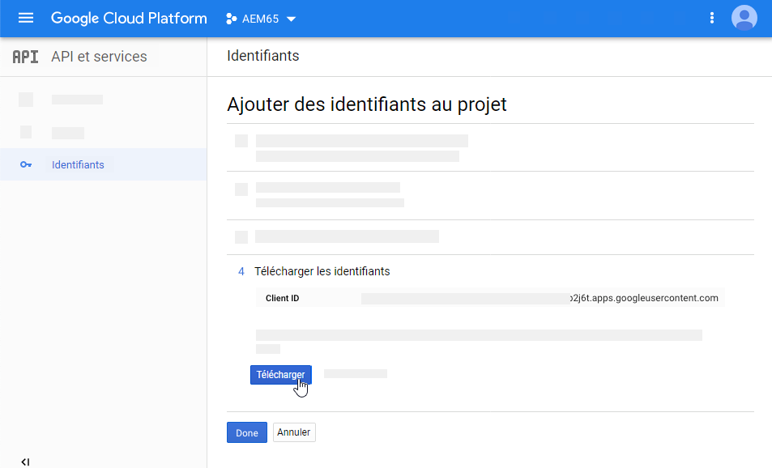
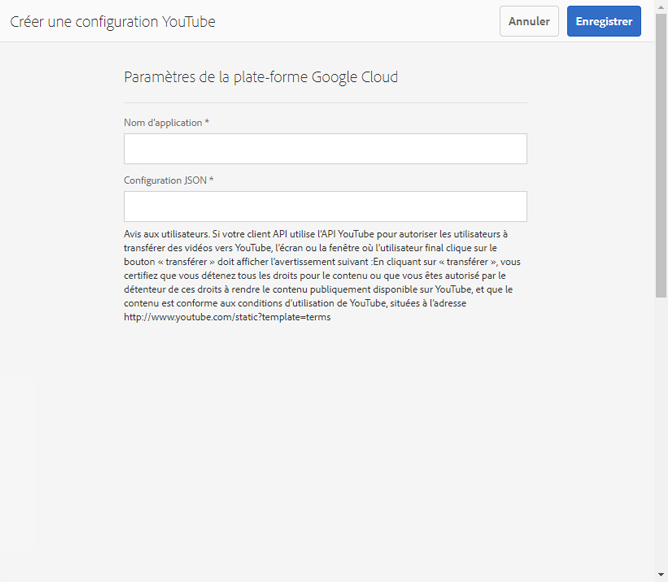
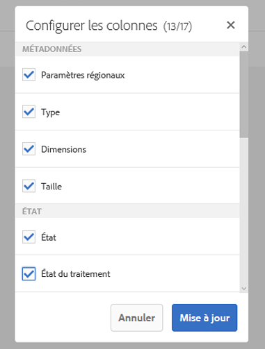
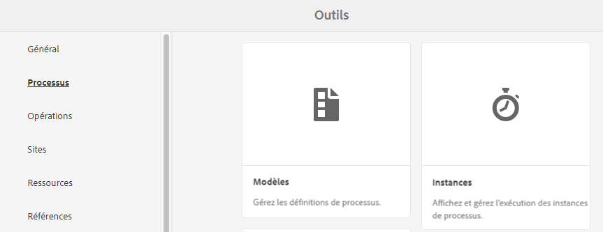
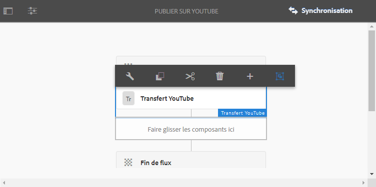

# Vidéo dans Dynamic Media {#video}

Cette section décrit l’utilisation de vidéos dans Dynamic Media.

## Démarrage rapide : vidéos  {#quick-start-videos}

Le processus détaillé décrit ci-après vise à vous aider à maîtriser rapidement les opérations liées aux visionneuses de vidéos adaptatives dans Dynamic Media. Après chaque étape, il existe des références croisées aux en-têtes de rubrique où vous trouverez plus d’informations.

>[!IMPORTANT]
>
>Avant d’utiliser la vidéo dans Dynamic Media, assurez-vous que votre administrateur Adobe Experience Manager a déjà activé et configuré les Cloud Services Dynamic Media en mode Dynamic Media - Scene7 ou Dynamic Media - Hybride .
>
>* Voir [Configuration des Cloud Services Dynamic Media](/help/assets/config-dms7.md#configuring-dynamic-media-cloud-services) dans Configuration de Dynamic Media - mode Scene7 et [Dépannage de Dynamic Media - mode Scene7](/help/assets/troubleshoot-dms7.md).
   >
   >
* Voir [Configuration des Cloud Services Dynamic Media](/help/assets/config-dynamic.md#configuring-dynamic-media-cloud-services) dans Configuration de Dynamic Media - mode hybride.
>
>
Problèmes de lecture vidéo actuellement connus dans Dynamic Media *sur Experience Manager 6.5.9.0 uniquement* :
>
>* 

   <!-- CQDOC-18116 -->You cannot play video renditions from the asset's Details page on Experience Manager - Dynamic Media running in hybrid mode.
>* 

   <!-- CQDOC-18116 -->You cannot stream videos on Experience Manager - Dynamic Media running in hybrid mode.
>


1. **Chargez les vidéos Dynamic Media** en procédant comme suit :

   * Créez votre propre profil de codage vidéo. Vous pouvez également utiliser le profil _Codage vidéo adaptatif_ prédéfini fourni avec Dynamic Media.

      * [Créez un profil](/help/assets/video-profiles.md#creating-a-video-encoding-profile-for-adaptive-streaming) de codage vidéo.
      * En savoir plus sur les [bonnes pratiques relatives au codage vidéo](#best-practices-for-encoding-videos).
   * Associez le profil de traitement vidéo à un ou plusieurs dossiers dans lequel vous allez charger les vidéos issues de sources originales.

      * [Application d’un profil vidéo à des dossiers](/help/assets/video-profiles.md#applying-a-video-profile-to-folders).
      * En savoir plus sur les [bonnes pratiques relatives à l’organisation des ressources numériques en vue de l’utilisation de profils de traitement](/help/assets/organize-assets.md).
      * En savoir plus sur [l’organisation des ressources numériques](/help/assets/organize-assets.md).
   * Chargez les vidéos issues de sources originales dans les dossiers. Vous pouvez charger des fichiers vidéo d’une taille de 15 Go chacun au maximum. Lorsque vous ajoutez des vidéos au dossier, elles sont codées selon le profil de traitement vidéo affecté au dossier.

      * [Chargement des vidéos](/help/assets/managing-video-assets.md#upload-and-preview-video-assets).
      * En savoir plus sur les [formats de fichiers d’entrée pris en charge](/help/assets/assets-formats.md#supported-multimedia-formats).
   * Contrôle la façon dont l’[encodage vidéo progresse](#monitoring-video-encoding-and-youtube-publishing-progress) du point de vue de la ressource ou du processus.


1. **Gérez les vidéos Dynamic Media** en effectuant les opérations suivantes :

   * Organisez, parcourez et recherchez des ressources vidéo

      * [Organisation des ](/help/assets/organize-assets.md)
ressources numériquesEn savoir plus sur les  [bonnes pratiques relatives à l’organisation de vos ressources numériques en vue de l’utilisation de profils de traitement](organize-assets.md)

      * [Recherche de ](search-assets.md#custompredicates) ressources vidéo ou  [recherche de ressources](/help/assets/search-assets.md)
   * Prévisualisez et publiez des ressources vidéo

      * Affichez la vidéo source et les rendus codés de la vidéo avec les miniatures associées :
         [Prévisualisation de ](managing-video-assets.md#upload-and-preview-video-assets) vidéos ou  [Prévisualisation de ressources](previewing-assets.md)
         [Affichage des rendus vidéo](video-renditions.md)
         [Gestion des rendus vidéo](manage-assets.md#managing-renditions)

      * [Gestion des paramètres prédéfinis de visionneuse](managing-viewer-presets.md)
      * [Publier des ressources](publishing-dynamicmedia-assets.md)
   * Utiliser des métadonnées vidéo

      * Affichez les propriétés d’un rendu vidéo codé, telles que la fréquence d’image, le débit audio et vidéo et le codec :
         [Affichage des propriétés de rendu vidéo](video-renditions.md)

      * Modifiez les propriétés de la vidéo telles que le titre, la description, les balises et les champs de métadonnées personnalisés :
         [Modification des propriétés vidéo](manage-assets.md#editing-properties)

      * [Gestion des métadonnées des ressources numériques](metadata.md)
      * [Schémas de métadonnées](metadata-schemas.md)
   * Examiner, approuver et annoter des vidéos et conserver le contrôle total des versions

      * [Annotation de ](managing-video-assets.md#annotate-video-assets) vidéos ou  [annotation de ressources](manage-assets.md#annotating)

      * [Créer une version](manage-assets.md#asset-versioning)
      * [Application de workflows à des ](assets-workflow.md) ressources ou voir  [Démarrage d’un workflow sur une ressource](manage-assets.md#starting-a-workflow-on-an-asset)

      * [Examiner les ressources des dossiers](bulk-approval.md)
      * [Projets](../sites-authoring/projects.md)


1. Pour **publier les vidéos Dynamic Media**, effectuez l’une des opérations suivantes :

   * Si vous utilisez Adobe Experience Manager comme système de gestion de contenu web, vous pouvez ajouter des vidéos directement à vos pages web.

      * [Ajout de vidéos à vos pages](adding-dynamic-media-assets-to-pages.md) web.
   * Si vous utilisez un système de gestion de contenu web tiers, vous pouvez lier ou incorporer des vidéos dans vos pages web.

      * Intégrez une vidéo à l’aide d’une URL :
         [Liaison d’URL à votre application web](linking-urls-to-yourwebapplication.md).

      * Intégrez une vidéo à l’aide du code intégré dans la page web :
         [Incorporez la visionneuse de vidéos dans une page](embed-code.md) web.
   * [Publication de vidéos sur YouTube](#publishing-videos-to-youtube).
   * [Génération de rapports vidéo](#viewing-video-reports).

   * [Ajout de sous-titres à une vidéo](#adding-captions-to-video).


## Utilisation de vidéos dans Dynamic Media {#working-with-video-in-dynamic-media}

La vidéo dans Dynamic Media est une solution de bout en bout qui facilite la publication de vidéos adaptatives de haute qualité pour la diffusion en continu sur plusieurs écrans, y compris les ordinateurs de bureau, iOS, Android™, BlackBerry® et les appareils mobiles Windows. Une visionneuse de vidéos adaptative regroupe les versions d’une même vidéo codées dans des débits et des formats différents, tels que 400 Kbit/s, 800 Kbit/s et 1 000 Kbit/s. L’ordinateur de bureau ou l’appareil mobile détecte la bande passante disponible.

Par exemple, sur un appareil mobile iOS, il détecte une bande passante telle que 3G, 4G ou une connexion Wi-Fi, puis sélectionne automatiquement la vidéo codée selon le débit correspondant parmi ceux disponibles dans la visionneuse de vidéos adaptative. La vidéo est diffusée en continu sur les postes de travail, les appareils mobiles ou les tablettes.

En outre, la qualité de la vidéo est automatiquement adaptée en temps réel selon les conditions réseau sur le poste de travail ou l’appareil mobile. De même, si un client passe en mode plein écran sur un bureau, la visionneuse de vidéos adaptative réagit en utilisant une meilleure résolution, améliorant l’expérience de visionnage du client. L’utilisation des visionneuses de vidéos adaptatives offre une lecture optimale aux clients qui lisent des vidéos Dynamic Media sur plusieurs écrans et appareils.

La logique appliquée par un lecteur vidéo pour déterminer quelles sont les vidéos encodées à lire ou à sélectionner au cours de la lecture repose sur l’algorithme suivant :

1. Le lecteur vidéo charge le fragment vidéo initial basé sur le débit le plus proche de la valeur définie pour le « débit initial » dans le lecteur lui-même.
1. Le lecteur vidéo est adapté en fonction des modifications de la vitesse de bande passante d’après les critères suivants :

   1. Le lecteur sélectionne le flux de bande passante le plus élevé qui est inférieur ou égal à la bande passante estimée.
   1. Le lecteur prend uniquement en compte 80 % de la bande passante disponible. Cependant, s’il change, il est préférable que ce taux soit seulement de 70 % pour éviter toute surestimation et que le lecteur ne repasse au taux précédent.

Pour obtenir des informations techniques détaillées sur l’algorithme, consultez la page [https://android.googlesource.com/platform/frameworks/av/+/master/media/libstagefright/httplive/LiveSession.cpp](https://android.googlesource.com/platform/frameworks/av/+/master/media/libstagefright/httplive/LiveSession.cpp)

Pour la gestion des visionneuses de vidéos adaptative et unique, les fonctions suivantes sont prises en charge :

* Téléchargement de vidéos en différents formats vidéo et audio pris en charge et codage vidéo au format MP4 H.264 pour la lecture sur plusieurs écrans. Vous pouvez utiliser les paramètres prédéfinis de vidéo adaptative ou de codage unique ou personnaliser le codage pour contrôler la qualité et la taille de la vidéo.

   * Lorsqu’une visionneuse de vidéos adaptative est générée, elle comprend des vidéos MP4.
   * **Remarque** : Les vidéos originales/sources ne sont pas ajoutées à la visionneuse de vidéos adaptative.

* Sous-titrage des vidéos dans toutes les visionneuses de vidéo HTML5.
* Organiser, parcourir et effectuer des recherches dans la vidéo avec une prise en charge complète des métadonnées pour une gestion efficace des ressources vidéo.
* Diffusez des visionneuses de vidéos adaptatives sur le web et sur les ordinateurs de bureau et les appareils mobiles, y compris l’iPhone, l’iPad, Android™, BlackBerry® et le téléphone Windows.

La diffusion de vidéo adaptative en continu est prise en charge sur différentes plateformes iOS. Voir [Guide de référence des visionneuses de médias dynamiques](https://experienceleague.adobe.com/docs/dynamic-media-developer-resources/library/viewers-aem-assets-dmc/video/c-html5-video-reference.html?lang=fr#vidéo).

Dynamic Media prend en charge la lecture vidéo pour mobiles au format vidéo MP4 H.264. Les appareils BlackBerry® qui prennent en charge ce format vidéo sont répertoriés dans la liste : [Formats vidéo pris en charge sur Blackberry®](https://support.blackberry.com/kb/articleDetail?ArticleNumber=000005482).

Vous trouverez les périphériques Windows qui prennent en charge ce format vidéo à l’adresse suivante : [Codecs multimédias pris en charge pour Windows Phone 8](https://docs.microsoft.com/en-us/previous-versions/windows/apps/ff462087(v=vs.105))

* Lecture de la vidéo à l’aide des paramètres prédéfinis de la visionneuse Dynamic Media Video, tels que :

   * des visionneuses de vidéos uniques ;
   * des visionneuses de médias mixtes combinant du contenu vidéo et des images.

* Configurer des lecteurs vidéo pour répondre à vos besoins de stratégie de marque.
* Intégrer la vidéo à votre site web, site mobile ou application mobile grâce à une simple URL ou à du code intégré.

<!-- See [Dynamic video playback](https://s7d9.scene7.com/s7/uvideo.jsp?asset=GeoRetail/Mop_AVS&config=GeoRetail/Universal_Video1&stageSize=640,480) sample. -->

Voir aussi [Visionneuses pour les ressources Experience Manager et Dynamic Media Classic](https://experienceleague.adobe.com/docs/dynamic-media-developer-resources/library/viewers-aem-assets-dmc/c-html5-s7-aem-asset-viewers.html?lang=fr#viewers-aem-assets-dmc) et [Visionneuses pour les ressources Experience Manager uniquement](https://experienceleague.adobe.com/docs/dynamic-media-developer-resources/library/viewers-for-aem-assets-only/c-html5-aem-asset-viewers.html?lang=fr#viewers-for-aem-assets-only).

## Bonne pratique : Utilisation de la visionneuse de vidéos HTML5 {#best-practice-using-the-html-video-viewer}

Les paramètres prédéfinis de la visionneuse de vidéos HTML5 Dynamic Media sont des lecteurs vidéo fiables. Vous pouvez les utiliser pour éviter de nombreux problèmes courants liés à la lecture vidéo HTML5. De plus, les problèmes liés aux appareils mobiles, tels que l’absence de diffusion en continu adaptative et la portée limitée du navigateur de bureau.

En ce qui concerne la conception du lecteur, vous pouvez concevoir les fonctionnalités du lecteur vidéo à l’aide d’outils de développement web standard. Vous pouvez, par exemple, concevoir les boutons, les commandes et les affiches personnalisées en arrière-plan au moyen du code HTML5 et CSS afin de mieux cibler les utilisateurs avec un aspect personnalisé.

En ce qui concerne la lecture, la visionneuse, détecte automatiquement les fonctionnalités vidéo du navigateur. Elle traite ensuite la vidéo en utilisant HLS (HTTP Live Streaming), également appelé diffusion en continu de vidéo adaptative. Si ces méthodes de distribution n’existent pas, la diffusion progressive HTML5 est utilisée à la place.

En combinant dans un seul lecteur les éléments suivants :

* Possibilité de concevoir des composants de lecture à l’aide de HTML5 et CSS
* disposer d’une lecture incorporée ;
* Utiliser la diffusion en continu adaptative et progressive selon les fonctionnalités du navigateur

Vous étendez la portée de votre contenu multimédia aux utilisateurs de bureau et mobiles et vous garantissez une expérience vidéo rationalisée.

Voir aussi [À propos des visionneuses HTML5](https://experienceleague.adobe.com/docs/dynamic-media-developer-resources/library/viewers-for-aem-assets-only/c-html5-aem-asset-viewers.html#viewers-for-aem-assets-only).

### Lecture vidéo sur les ordinateurs de bureau et les appareils mobiles à l’aide de la visionneuse de vidéos HTML5  {#playback-of-video-on-desktop-computers-and-mobile-devices-using-the-html-video-viewer}

Pour la diffusion en flux continu de la vidéo adaptative sur un poste de travail et un appareil mobile, les vidéos utilisées pour le changement de débit reposent sur toutes les vidéos MP4 dans la visionneuse de vidéos adaptative.

La lecture vidéo se produit à l’aide d’un téléchargement vidéo HLS ou progressif. Dans les versions antérieures d’Experience Manager, telles que 6.0, 6.1 et 6.2, les vidéos étaient diffusées via HTTP.

Toutefois, dans la version 6.3 et les versions ultérieures d’Experience Manager, les vidéos sont diffusées en continu via HTTPS (c’est-à-dire, HLS), car l’URL du service de la passerelle DM utilise toujours HTTPS également. Il n’y a aucun impact pour le client dans ce comportement par défaut. Autrement dit, la diffusion en continu de vidéo s’effectuera tout de même via HTTPS, à moins qu’elle ne soit pas prise en charge par le navigateur (voir le tableau ci-dessous). Par conséquent,

* Si vous avez un site web HTTPS avec une diffusion vidéo en continu via HTTPS, la diffusion en continu est de qualité.
* Si vous avez un site web HTTP avec une diffusion vidéo en flux continu via HTTPS, la diffusion en continu est de qualité et il n’y a aucun problème de contenu mixte du navigateur web.

HLS est une norme d’Apple pour la diffusion de vidéo adaptative en continu qui ajuste automatiquement la lecture en fonction de la capacité de bande passante du réseau. Elle permet aussi au client de « rechercher » n’importe quel point de la vidéo sans avoir à attendre que le reste de la vidéo soit téléchargé.

La vidéo progressive est fournie grâce au téléchargement et à l’enregistrement de la vidéo en local sur le système du poste de travail ou de l’appareil mobile de l’utilisateur.

Le tableau ci-dessous décrit l’appareil, le navigateur et la méthode de lecture des vidéos sur les ordinateurs de bureau et les appareils mobiles à l’aide de la visionneuse de vidéos Dynamic Media.

<table>
 <tbody>
  <tr>
   <td><strong>Appareil</strong></td>
   <td><strong>Navigateur</strong></td>
   <td><strong>Mode lecture vidéo</strong></td>
  </tr>
  <tr>
   <td>Poste de travail</td>
   <td>Internet Explorer 9 et 10</td>
   <td>Téléchargement progressif.</td>
  </tr>
  <tr>
   <td>Poste de travail</td>
   <td>Internet Explorer 11+</td>
   <td>Sous Windows 8 et Windows 10 – Forcer l’utilisation de HTTPS chaque fois que HLS est demandé. Limites connues : HTTP sur HLS ne fonctionne pas avec cette combinaison de navigateur/système d’exploitation<br /> <br /> Sous Windows 7 – Téléchargement progressif. Utilise la logique standard pour sélectionner le protocole HTTP ou HTTPS.</td>
  </tr>
  <tr>
   <td>Poste de travail</td>
   <td>Firefox 23 à 44</td>
   <td>Téléchargement progressif.</td>
  </tr>
  <tr>
   <td>Poste de travail</td>
   <td>Firefox 45 ou version ultérieure</td>
   <td>HLS</td>
  </tr>
  <tr>
   <td>Poste de travail</td>
   <td>Chrome</td>
   <td>HLS</td>
  </tr>
  <tr>
   <td>Poste de travail</td>
   <td>Safari (Mac)</td>
   <td>HLS</td>
  </tr>
  <tr>
   <td>Mobile</td>
   <td>Chrome (Android™ 6 ou version antérieure)</td>
   <td>Téléchargement progressif.</td>
  </tr>
  <tr>
   <td>Mobile</td>
   <td>Chrome (Android™ 7 ou version ultérieure)</td>
   <td>HLS</td>
  </tr>
  <tr>
   <td>Mobile</td>
   <td>Android™ (navigateur par défaut)</td>
   <td>Téléchargement progressif.</td>
  </tr>
  <tr>
   <td>Mobile</td>
   <td>Safari (iOS)</td>
   <td>HLS</td>
  </tr>
  <tr>
   <td>Mobile</td>
   <td>Chrome (iOS)</td>
   <td>HLS</td>
  </tr>
  <tr>
   <td>Mobile</td>
   <td>BlackBerry®</td>
   <td>HLS</td>
  </tr>
 </tbody>
</table>

## Architecture de la solution vidéo Dynamic Media  {#architecture-of-dynamic-media-video-solution}

Le graphique suivant montre le workflow global de création de vidéos qui sont chargées et codées par le biais de DMGateway (dans le mode Hybride Dynamic Media) et mises à disposition pour une consommation publique.


## Architecture de publication hybride des vidéos {#hybrid-publishing-architecture-for-videos}


## Bonnes pratiques en matière de codage de vidéos {#best-practices-for-encoding-videos}

Le processus **Vidéo d’encodage Dynamic Media** encode la vidéo si vous avez activé Dynamic Media et configuré les services cloud vidéo. Ce workflow capture l’historique de traitement des workflows et les informations d’échec. Voir [Surveillance du codage vidéo et de la progression de la publication dans YouTube](#monitoring-video-encoding-and-youtube-publishing-progress). Si vous avez activé Dynamic Media et configuré les services cloud vidéo, le workflow **[!UICONTROL Vidéo d’encodage Dynamic Media]** prend automatiquement effet lorsque vous chargez une vidéo. (Si vous n’utilisez pas Dynamic Media, le workflow **[!UICONTROL Ressource de mise à jour DAM]** prend effet.)

<!-- DEAD The following are best-practice tips for encoding source video files.

For advice about video encoding, see [Video Encoding Basics](https://www.adobe.com/go/learn_s7_encoding_en).

* [Streaming 101: The Basics — Codecs, Bandwidth, Data Rate, and Resolution](https://www.adobe.com/go/learn_s7_streaming101_en). -->

### Fichiers vidéo source {#source-video-files}

Lorsque vous codez un fichier vidéo, utilisez un fichier vidéo source ayant la plus haute qualité possible. Évitez d’utiliser des fichiers vidéo précédemment codés, car ces fichiers sont déjà compressés, et un codage supplémentaire crée une vidéo de qualité inférieure.

Le tableau ci-dessous décrit la taille recommandée, le format et le débit minimal requis pour vos fichiers vidéo sources au moment de leur codage :

| Taille | Format | Débit minimal |
|--- |--- |--- |
| 1024 x 768 | 4:3 | 4 500 Kbit/s pour la plupart des vidéos. |
| 1280 x 720 | 16:9 | 3 000 à 6 000 Kbit/s, selon la quantité de mouvement dans la vidéo. |
| 1 920 x 1 080 | 16:9 | 6 000 à 8 000 kbit/s en fonction de la quantité de mouvement sur la vidéo. |

### Obtention des métadonnées d’un fichier {#obtaining-a-file-s-metadata}

Vous pouvez obtenir les métadonnées d’un fichier en les affichant à l’aide d’un outil d’édition vidéo ou d’une application d’extraction de métadonnées. Voici les instructions d’utilisation de MediaInfo, une application tierce permettant d’extraire les métadonnées d’un fichier vidéo :

1. Visitez cette page web : [https://mediainfo.sourceforge.net/en/Download](https://mediainfo.sourceforge.net/en/Download).
1. Sélectionnez et téléchargez le programme d’installation pour la version avec interface graphique utilisateur, puis suivez les instructions d’installation.
1. Après l’installation, cliquez avec le bouton droit sur le fichier vidéo (Windows uniquement) et sélectionnez MediaInfo, ou bien ouvrez MediaInfo et faites glisser votre fichier vidéo dans l’application. Toutes les métadonnées de votre fichier vidéo, telles que sa largeur, sa hauteur et le nombre d’images par seconde, sont alors visibles à l’écran.

### Format {#aspect-ratio}

Lorsque vous choisissez ou créez un paramètre prédéfini de codage vidéo pour votre fichier vidéo issu de sources originales, assurez-vous que le paramètre prédéfini indique le même format que le fichier vidéo issu de sources originales. Le format fait référence au rapport largeur/hauteur de la vidéo.

Pour déterminer le format d’un fichier vidéo, récupérez les métadonnées de ce fichier et notez les valeurs de largeur et de hauteur (voir la section Obtention des métadonnées d’un fichier ci-dessus). Utilisez ensuite cette formule pour déterminer le format :

largeur/hauteur = format

Ce tableau décrit la façon dont les résultats de la formule se traduisent en choix de formats :

| Résultat de la formule | Format |
|--- |--- |
| 1.33 | 4:3 |
| 0,75 | 3:4 |
| 1,78 | 16:9 |
| 0.56 | 9:16 |

Par exemple, une vidéo qui a une largeur de 1440 pour une hauteur de 1080 a un format de 1440/1080, soit 1,33. Dans ce cas, vous choisissez un paramètre prédéfini de codage vidéo avec un format de 4:3 pour le codage du fichier vidéo.

### Débit binaire {#bitrate}

Le débit correspond à la quantité de données encodées pour produire une seule seconde de lecture vidéo. Le débit de données est mesuré en kilobits par seconde (kbit/s).

>[!NOTE]
>
>Du fait que tous les codecs utilisent la compression avec perte, le débit de données est le facteur le plus important de la qualité vidéo. Quand vous utilisez la compression avec perte, plus vous compressez la vidéo, plus la qualité de l’image se dégrade. Toutes les autres caractéristiques étant égales (résolution, taux de rafraîchissement et codec), plus le débit de données est faible, moins la qualité du fichier compressé est bonne.

Lorsque vous sélectionnez l’encodage du débit, vous avez le choix entre deux types :

* **[!UICONTROL Encodage à débit constant]** (CBR) : pendant l’encodage CBR, le débit ou le nombre de bits par seconde est conservé pendant tout le processus d’encodage. L’encodage CBR maintient le débit défini selon votre configuration sur l’intégralité de la vidéo. En outre, le codage CBR n’optimise pas la qualité des fichiers multimédias, mais économise de l’espace de stockage.
Utilisez le codage CBR si votre vidéo présente globalement un niveau de mouvement similaire. Le codage CBR est le plus souvent utilisé pour diffuser le contenu vidéo en continu. Voir aussi [Utilisation de paramètres de codage vidéo personnalisés ](/help/assets/video-profiles.md#using-custom-added-video-encoding-parameters).

* **[!UICONTROL Codage de débit variable]** (VBR) : le codage VBR ajuste le débit en le diminuant et selon la limite supérieure que vous avez définie, en fonction des données demandées par le compresseur. Cette fonctionnalité implique que lors d’un processus de codage VBR, le débit du fichier multimédia augmente ou diminue de manière dynamique en fonction des besoins du débit de fichiers multimédias.
Le VBR prend plus de temps au codage, mais garantit de meilleurs résultats, avec une qualité de fichier multimédia supérieure. Le codage VBR est couramment utilisé pour la diffusion http progressive de contenu vidéo.

Dans quels cas utilisez-vous le VBR ou le CBR ?
Lorsque vous devez choisir entre VBR et CBR, il est presque toujours recommandé d’utiliser le VBR pour vos fichiers multimédias. Le VBR vous garantit des fichiers de meilleure qualité à des débits compétitifs. Lorsque vous utilisez le VBR, assurez-vous d’utiliser le codage à deux passages, et définissez le débit maximal afin qu’il soit 1,5 fois supérieur au débit vidéo cible.

Lorsque vous choisissez un paramètre prédéfini de codage vidéo, pensez à la vitesse de connexion de l’utilisateur final cible. Choisissez un paramètre prédéfini avec un débit de données correspondant à 80 % de cette vitesse. Par exemple, si la vitesse de connexion de l’utilisateur final est de 1 000 kbit/s, le meilleur paramètre prédéfini est celui qui comprend un débit vidéo de 800 kbit/s.

Ce tableau décrit le débit de données associé à des vitesses de connexion courantes.

| Vitesse (kbit/s) | Type de connexion |
|--- |--- |
| 256 | Connexion d’accès à distance. |
| 800 | Connexion mobile standard. Pour cette connexion, visez un débit de données de 400 à 800 kbit/s pour les expériences 3G. |
| 2000 | Connexion haut débit standard de bureau. Pour cette connexion, visez un débit de données de 800 à 2 000 kbit/s, bien qu’un débit de 1 200 à 1 500 kbit/s convienne à la plupart des cibles. |
| 5 000 | Connexion haut débit standard. Il est déconseillé de coder dans cette plage supérieure, car la diffusion de la vidéo à cette vitesse n’est pas possible pour la plupart des consommateurs. |

### Résolution {#resolution}

La **résolution** décrit la hauteur et la largeur d’un fichier vidéo, exprimée en pixels. La plupart des vidéos sources sont stockées à une résolution élevée (par exemple, 1 920 x 1 080). À des fins de diffusion en flux continu, la vidéo source est compressée à une résolution inférieure (640 x 480, voire moins).

La résolution et le débit de données sont deux facteurs étroitement liés qui déterminent la qualité de la vidéo. Pour maintenir la même qualité vidéo, plus le nombre de pixels (c’est-à-dire la résolution) est élevé dans un fichier vidéo, plus le débit de données doit l’être également. Par exemple, considérez le nombre de pixels par image dans un fichier vidéo d’une résolution de 320 x 240 pixels et dans un fichier vidéo d’une résolution de 640 x 480 pixels :

| Résolution | Pixels par image |
|--- |--- |
| 320 x 240 | 76 800 |
| 640 x 480 | 307 200 |

Le fichier de 640 x 480 possède quatre fois plus de pixels par image. Pour atteindre le même débit de données avec ces deux résolutions, vous appliquez une compression de 4 au fichier d’une résolution de 640 x 480 pixels, ce qui peut réduire la qualité de la vidéo. Par conséquent, un débit de données vidéo de 250 kbit/s produit un affichage de haute qualité à une résolution de 320 x 240 pixels, mais pas à une résolution de 640 x 480 pixels.

En règle générale, plus le débit de données que vous utilisez est élevé, plus la vidéo a l’air beau et plus la résolution que vous utilisez est élevée, plus le débit de données que vous devez maintenir la qualité de visionnage (par rapport à des résolutions plus basses) est élevé.

Du fait que la résolution et le débit de données sont liés, vous avez le choix entre deux options lors du codage vidéo :

* Choisir un débit de données puis, en fonction de ce paramètre, coder à la résolution la plus haute pour obtenir une vidéo de bonne qualité.
* Choisir une résolution, puis coder au débit de données nécessaire pour que la qualité vidéo soit optimale à la résolution choisie.

Lorsque vous choisissez (ou créez) un paramètre prédéfini de codage vidéo pour votre fichier vidéo source original, utilisez ce tableau pour choisir la résolution cible appropriée :

| Résolution | Hauteur (pixels) | Taille d’écran |
|--- |--- |--- |
| 240p | 240 | Écran de très petite taille |
| 300p | 300 | Petit écran équipant généralement les appareils mobiles |
| 360p | 360 | Petit écran |
| 480p | 480 | Écran de taille moyenne |
| 720p | 720 | Grand écran |
| 1 080p | 1080 | Grand écran haute définition |

### Images par seconde  {#fps-frames-per-second}

Aux États-Unis et au Japon, la plupart des vidéos sont tournées à 29,97 ips (images par seconde) ; en Europe, la plupart des vidéos le sont à 25 ips. Un film est tourné à 24 ips.

Choisissez un paramètre prédéfini de codage vidéo correspondant au nombre d’images par seconde de votre vidéo issue de sources originales. Par exemple, si le débit est de 25 ips pour la vidéo issue de sources originales, choisissez un paramètre prédéfini de 25 ips pour le codage. Par défaut, tous les codages personnalisés utilisent le nombre d’images par seconde de la vidéo issue de sources originales. C’est pourquoi il est inutile d’indiquer le nombre d’images par seconde lorsque vous créez un paramètre prédéfini de codage vidéo.

### Dimensions du codage vidéo {#video-encoding-dimensions}

Pour obtenir des résultats optimaux, sélectionnez les dimensions de codage de façon à ce que la vidéo source corresponde à un multiple entier de toutes vos vidéos codées.

Pour ce faire, il suffit de diviser la largeur de la source par la largeur codée pour obtenir le rapport de largeur, puis de diviser la hauteur de la source par la hauteur codée pour obtenir le rapport de hauteur.

Si le résultat est un nombre entier, cela signifie que la mise à l’échelle de la vidéo est parfaite. Si le résultat n’est pas un nombre entier, la qualité vidéo s’en ressentira en raison de la présence d’artefacts vidéo (pixels résiduels). Cet effet est plus visible lorsque la vidéo contient du texte.

Supposons, par exemple, que la résolution de votre vidéo source soit équivalente à 1920 x 1080 pixels. Dans le tableau ci-après, les trois vidéos codées indiquent les paramètres de codage optimaux à appliquer.

| Type de vidéo | Largeur x hauteur | Rapport de largeur | Rapport de hauteur |
|--- |--- |--- |--- |
| Source | 1 920 x 1 080 | 1 | 1 |
| Codée | 960 x 540 | 2 | 2 |
| Codée | 640 x 360 | 3 | 1 |
| Codée | 480 x 270 | 4 | 4 |

### Format de fichier vidéo codé {#encoded-video-file-format}

Dynamic Media recommande d’utiliser les paramètres prédéfinis MP4 H.264 de codage vidéo. Comme les fichiers MP4 utilisent le codec vidéo H.264, la vidéo est de haute qualité mais dans un fichier au volume compressé.

## Publication de vidéos sur YouTube {#publishing-videos-to-youtube}

Vous pouvez publier des ressources vidéo de Experience Manager on-premise directement sur un canal YouTube que vous avez précédemment créé.

Pour publier des ressources vidéo dans YouTube, vous devez configurer des ressources Experience Manager avec des balises. Vous associez ces balises à une chaîne YouTube. Si la balise d’une ressource vidéo correspond à la balise d’une chaîne YouTube, la vidéo est publiée sur YouTube. La publication sur YouTube se produit avec une publication normale de la vidéo à condition qu’une balise associée soit utilisée.

YouTube procède à son propre codage. De ce fait, le fichier vidéo d’origine chargé dans Experience Manager est publié sur YouTube et non pas dans un rendu vidéo créé par le codage Dynamic Media. Même s’il n’est pas nécessaire de traiter les vidéos à l’aide de Dynamic Media, il est supposé qu’elles le sont si un paramètre prédéfini de visionneuse est nécessaire pour la lecture.

Lorsque vous ignorez le profil de traitement vidéo et que vous effectuez directement la publication sur YouTube, votre ressource vidéo ne dispose pas de miniature visible dans Experience Manager Assets. Cela signifie également que si vous exécutez en mode d’exécution `dynamicmedia` ou `dynamicmedia_scene7` , les vidéos qui ne sont pas codées ne fonctionnent avec aucun type de ressource Dynamic Media.

Pour garantir une authentification serveur à serveur sécurisée avec YouTube, la publication des vidéos sur les serveurs YouTube implique les tâches suivantes :

1. [Configuration des paramètres de Google Cloud](#configuring-google-cloud-settings)
1. [Création d’un canal YouTube](#creating-a-youtube-channel)
1. [Ajout de balises pour la publication](#adding-tags-for-publishing)
1. [Activation de l’agent de réplication de publication YouTube](#enabling-the-youtube-publish-replication-agent)
1. [Configuration de YouTube dans Experience Manager](#setting-up-youtube-in-aem)
1. [(Facultatif) Automatisez la définition des propriétés YouTube par défaut pour vos vidéos chargées.](#optional-automating-the-setting-of-default-youtube-properties-for-your-uploaded-videos)
1. [Publication de vidéos sur votre canal YouTube](#publishing-videos-to-your-youtube-channel)
1. [(Facultatif) Vérification de la vidéo publiée sur YouTube](/help/assets/video.md#optional-verifying-the-published-video-on-youtube)
1. [Liaison d’URL YouTube à une application web](#linking-youtube-urls-to-your-web-application)

Vous pouvez également [annuler la publication de vidéos pour les supprimer de YouTube](#unpublishing-videos-to-remove-them-from-youtube).

### Configuration des paramètres de Google Cloud {#configuring-google-cloud-settings}

Pour effectuer une publication sur YouTube, vous avez besoin d’un compte Google. Si vous disposez d’un compte GMAIL, alors vous disposez déjà d’un compte Google ; si vous ne disposez pas d’un compte Google, vous pouvez facilement en créer un. Un compte est nécessaire, car vous avez besoin des informations d’identification pour publier des ressources vidéo sur YouTube. Si vous avez déjà créé un compte, ignorez cette tâche et passez directement à [Création d’une chaîne YouTube](#creating-a-youtube-channel).

Il n’est pas nécessaire que le compte utilisé avec Google Cloud et le compte Google utilisé pour YouTube soient les mêmes.

Google modifie régulièrement son interface utilisateur. De ce fait, les étapes de publication des vidéos sur YouTube peuvent varier légèrement des étapes présentées ci-dessous. Cet avertissement s’applique également à YouTube lorsque vous tentez de vérifier si des vidéos y sont téléchargées.

>[!NOTE]
>
>Les étapes suivantes étaient exactes au moment de leur rédaction. Toutefois, Google met à jour régulièrement ses sites web sans préavis. Par conséquent, ces étapes peuvent être légèrement différentes.

Pour configurer les paramètres de Google Cloud, procédez comme suit :

1. Créez un compte Google.
   [https://accounts.google.com/SignUp?service=mail](https://accounts.google.com/SignUp?service=mail)

   Si vous disposez déjà d’un compte Google, passez à l’étape suivante.

1. Accédez à [https://cloud.google.com/](https://cloud.google.com/).
1. Dans la page Google Cloud, près du coin supérieur droit, cliquez sur **[!UICONTROL Console]**.

   Vous devrez peut-être vous **[!UICONTROL connecter]** à l’aide des informations d’identification de votre compte Google pour voir l’option **[!UICONTROL Console]**.

1. Sur la page Tableau de bord, à droite de **[!UICONTROL Google Cloud Platform]**, cliquez sur la liste déroulante Projet pour ouvrir la boîte de dialogue Sélectionner un projet.
1. Dans la boîte de dialogue Sélectionner un projet, appuyez sur **[!UICONTROL Nouveau projet]**.

   

1. Dans la boîte de dialogue Nouveau projet, saisissez le nom de votre nouveau projet dans le champ Nom du projet.

   Votre ID de projet est basé sur le nom du projet. Par conséquent, choisissez soigneusement le nom du projet ; il ne peut pas être modifié une fois créé. En outre, vous devez saisir à nouveau le même ID de projet lorsque vous configurez YouTube dans Experience Manager ultérieurement. envisagez de l&#39;écrire.

1. Cliquez sur **[!UICONTROL Créer]**.

1. Effectuez l’une des opérations suivantes :

   * Dans le tableau de bord de votre projet, dans la carte Prise en main, appuyez sur **[!UICONTROL Explorer et activer les API]**.
   * Dans le tableau de bord de votre projet, dans la carte API, appuyez sur **[!UICONTROL Accéder à l’aperçu des API]**.

   

1. En haut de la page API &amp; services, appuyez sur **[!UICONTROL Activer les API et les services]**.
1. Sur la page Bibliothèque d’API, dans la partie gauche, sous **[!UICONTROL Catégorie]**, appuyez sur **[!UICONTROL YouTube]**. Sur le côté droit de la page, appuyez sur **[!UICONTROL YouTube Data API]**.
1. Sur la page YouTube Data API v3, appuyez sur **[!UICONTROL Activer]**.

   

1. Pour utiliser l’API, vous avez besoin d’identifiants. Si besoin, cliquez sur **[!UICONTROL Créer des identifiants]**.

   

1. Sur la page **[!UICONTROL Ajouter des identifiants au projet]**, à l’étape 1, procédez comme suit :

   * Dans la liste déroulante **[!UICONTROL Quelle API utilisez-vous ?]**, sélectionnez **[!UICONTROL YouTube Data API v3]**.

   * Depuis la liste déroulante **[!UICONTROL Quelle plate-forme utilisez-vous pour appeler l’API ?]**, sélectionnez **[!UICONTROL Serveur web (exemple : node.js, Tomcat)]**

   * Dans la liste déroulante **[!UICONTROL À quelles données allez-vous accéder ?]**, appuyez sur **[!UICONTROL Données utilisateur]**.

   

1. Appuyez sur **[!UICONTROL De quels identifiants ai-je besoin ?]**
1. Sur la page **[!UICONTROL Ajouter des identifiants au projet]**, à l’étape 2, sous l’en-tête **[!UICONTROL Créer un ID client OAuth 2.0]**, dans le champ Nom, saisissez un nom unique si vous le souhaitez. Vous pouvez également utiliser le nom par défaut spécifié par Google.
1. Sous l’en-tête **[!UICONTROL Origines JavaScript autorisées]** , dans le champ de texte, saisissez le chemin suivant, en substituant vos propres domaine et numéro de port dans le chemin, puis appuyez sur **[!UICONTROL Entrée]** pour ajouter le chemin à la liste :

   `https://<servername.domain>:<port_number>`

   Par exemple, `https://1a2b3c.mycompany.com:4321`

   **Remarque** : L’exemple de chemin ci-dessus est destiné uniquement à des fins de démonstration.

   

1. Dans le champ de texte sous l’en-tête **[!UICONTROL URI de redirection autorisés]**, saisissez le chemin suivant, en substituant vos propres domaine et numéro de port dans le chemin, puis appuyez sur **[!UICONTROL Entrée]** pour ajouter le chemin à la liste :

   `https://<servername.domain>:<port_number>/etc/cloudservices/youtube.youtubecredentialcallback.json`

   Par exemple, `https://1a2b3c.mycompany.com:4321/etc/cloudservices/youtube.youtubecredentialcallback.json`

   **Remarque** : L’exemple de chemin ci-dessus est destiné uniquement à des fins de démonstration.

1. Cliquez sur **[!UICONTROL Créer un ID client OAuth]**.
1. Sur la page **[!UICONTROL Ajouter des identifiants au projet]**, à l’étape 3, sous l’en-tête **[!UICONTROL Configuration de l’écran d’autorisation OAuth 2.0]**, sélectionnez l’adresse e-mail Gmail que vous utilisez actuellement.

   

1. Sous l’en-tête **[!UICONTROL Nom du produit affiché à l’intention des utilisateurs]**, dans le champ de texte, entrez ce qui doit s’afficher sur l’écran d’autorisation.

   L’écran de consentement s’affiche pour l’administrateur du Experience Manager lorsqu’il s’authentifie auprès de YouTube. Le Experience Manager contacte YouTube pour obtenir l’autorisation.

1. Cliquez sur **[!UICONTROL Continuer]**.
1. Sur la page Ajouter des identifiants au projet, à l’étape 4, sous l’en-tête **[!UICONTROL Télécharger les identifiants]**, appuyez sur **[!UICONTROL Télécharger]**.

   

1. Enregistrez le fichier `client_id.json`.

   Vous en avez besoin lors de la configuration ultérieure de YouTube dans Adobe Experience Manager.

1. Cliquez sur **[!UICONTROL Terminé]**.

   Déconnectez-vous de votre compte Google. Créez maintenant une chaîne YouTube.

### Création d’un canal YouTube {#creating-a-youtube-channel}

Pour publier des vidéos sur YouTube, vous devez disposer d’une ou de plusieurs chaînes. Si vous avez déjà créé un canal YouTube, vous pouvez ignorer cette tâche et accéder à [Ajouter des balises pour la publication](/help/assets/video.md#adding-tags-for-publishing).

>[!WARNING]
>
>Assurez-vous que vous avez déjà configuré un ou plusieurs canaux dans YouTube *avant* d’ajouter des canaux sous Paramètres YouTube dans Experience Manager (voir [Configuration de YouTube en Experience Manager](#setting-up-youtube-in-aem) ci-dessous). Si vous ne parvenez pas à configurer un ou plusieurs canaux, vous n’êtes pas averti de l’absence de canaux. L’authentification Google a lieu lorsque vous ajoutez une chaîne, mais il n’existe pas d’option permettant de choisir la chaîne vers laquelle la vidéo est envoyée.

**Pour créer une chaîne YouTube :**

1. Accédez à [https://www.youtube.com](https://www.youtube.com/), puis connectez-vous à l’aide des informations d’identification de votre compte Google.
1. Dans le coin supérieur droit de la page YouTube, cliquez sur l’image de votre profil (peut également s’afficher sous la forme d’une lettre dans un cercle coloré plein), puis cliquez sur **[!UICONTROL Paramètres YouTube]** (icône d’engrenage rond).
1. Sur la page Présentation, sous l’en-tête Fonctionnalités supplémentaires, cliquez sur **[!UICONTROL Voir toutes mes chaînes ou créer une nouvelle chaîne]**.
1. Depuis la page Chaînes, cliquez sur **[!UICONTROL Créer une chaîne]**.
1. Sur la page Compte de marque, dans le champ nom du compte de marque, saisissez un nom d’entité professionnelle ou tout autre nom de chaîne de votre choix sous lequel vous souhaitez publier vos ressources vidéo, puis cliquez sur **[!UICONTROL Créer]**.

   N’oubliez pas le nom que vous saisissez ici, car vous devez le saisir à nouveau lorsque vous configurez YouTube en Experience Manager.

1. (Facultatif) Si nécessaire, ajoutez d’autres chaînes.

   Ajoutez maintenant des balises pour la publication.

### Ajout de balises pour la publication {#adding-tags-for-publishing}

Pour publier vos vidéos sur YouTube, Experience Manager associe des balises à une ou plusieurs chaînes YouTube. Pour ajouter des balises pour la publication, voir [Administration des balises](/help/sites-administering/tags.md).

Ou, si vous envisagez d’utiliser les balises par défaut dans Experience Manager, vous pouvez ignorer cette tâche et accéder à [Activation de l’agent de réplication de publication YouTube](#enabling-the-youtube-publish-replication-agent).

### Activation de l’agent de réplication de publication YouTube {#enabling-the-youtube-publish-replication-agent}

Après avoir activé l’agent de réplication de publication YouTube, si vous souhaitez tester la connexion au compte Google Cloud, appuyez sur **[!UICONTROL Tester la connexion]**. Un onglet de navigateur affiche les résultats de la connexion. Si vous avez ajouté des canaux YouTube, une liste d’entre eux s’affiche dans le cadre du test.

1. Dans le coin supérieur gauche de Experience Manager, cliquez sur le logo du Experience Manager, puis, dans le rail de gauche, cliquez sur **[!UICONTROL Outils]** > **[!UICONTROL Déploiement]** > **[!UICONTROL Réplication]** > **[!UICONTROL Agents sur l’auteur]**.
1. Sur la page Agents de l’auteur , cliquez sur **[!UICONTROL Publication YouTube]**.
1. Dans la barre d’outils, à droite de Paramètres, cliquez sur **[!UICONTROL Modifier]**.
1. Cochez la case **[!UICONTROL Activé]** pour activer l’agent de réplication.
1. Cliquez sur **[!UICONTROL OK]**.

   Configurez maintenant YouTube en Experience Manager.

### Configuration de YouTube dans Experience Manager {#setting-up-youtube-in-aem}

À partir d’Experience Manager 6.4, une nouvelle méthode d’interface utilisateur tactile a été ajoutée pour configurer la publication YouTube dans Experience Manager. Selon l’instance d’Experience Manager que vous utilisez, effectuez l’une des opérations suivantes :

* Pour configurer YouTube dans Experience Manager avant la version 6.4, voir [Configuration de YouTube dans Experience Manager avant la version 6.4](/help/assets/video.md#setting-up-youtube-in-aem-before).
* Pour configurer YouTube dans Experience Manager 6.4 ou version ultérieure, voir [Configuration de YouTube dans Experience Manager 6.4 et version ultérieure](#setting-up-youtube-in-aem-and-later).

#### Configuration de YouTube dans Experience Manager 6.4 et versions ultérieures {#setting-up-youtube-in-aem-and-later}

1. Veillez à vous connecter à votre instance Dynamic Media en tant qu’administrateur.
1. Dans le coin supérieur gauche, appuyez sur le logo du Experience Manager, puis, dans le rail de gauche, appuyez sur **[!UICONTROL Outils]** (icône en forme de marteau) > **[!UICONTROL Cloud Services]** > **[!UICONTROL Configuration de publication YouTube]**.
1. Appuyez sur **[!UICONTROL global]** (sans sélectionner cette option).

1. Dans le coin supérieur droit de la page Global, appuyez sur **[!UICONTROL Créer]**.
1. Sur la page Créer une configuration YouTube, sous Paramètres de plateforme Google Cloud, dans le champ **[!UICONTROL Nom de l’application]**, saisissez l’ID de projet Google.

   Vous avez spécifié l’ID de projet lorsque vous avez précédemment configuré les paramètres de Google Cloud.
Laissez la page Créer une configuration YouTube ouverte ; dans un instant, vous allez y revenir.

   

1. À l’aide d’un éditeur de texte brut, ouvrez le fichier JSON que vous avez téléchargé et enregistré plus tôt dans la tâche [Configurez les paramètres Google Cloud](/help/assets/video.md#configuring-google-cloud-settings).
1. Sélectionnez l’intégralité du texte JSON et copiez-le.
1. Revenez à la boîte de dialogue Paramètres du compte YouTube. Dans le champ **[!UICONTROL Configuration JSON]**, collez le texte JSON.
1. Dans le coin supérieur droit de la page, appuyez sur **[!UICONTROL Enregistrer]**.

   Configurez maintenant les canaux YouTube en Experience Manager.

1. Appuyez sur **[!UICONTROL Ajouter un canal]**.
1. Dans la boîte de dialogue Paramètres de chaîne, saisissez le nom de la chaîne que vous avez créée lors de la tâche **[!UICONTROL Ajout d’une ou plusieurs chaînes YouTube]** précédemment.

   Vous pouvez éventuellement ajouter une description.

1. Appuyez sur **[!UICONTROL Ajouter]**.
1. L’authentification YouTube/Google s’affiche. Si vous n’êtes pas déjà connecté à un compte Google Cloud, ignorez cette étape.

   * Saisissez le nom d’utilisateur Google et le mot de passe associés à l’ID de projet Google et au texte JSON ci-dessus.
   * Selon le nombre de chaînes associées à votre compte, deux éléments au moins sont affichés. Sélectionnez une chaîne. Ne sélectionnez pas l’adresse e-mail, car il ne s’agit pas d’une chaîne.
   * Dans la page suivante, appuyez sur **[!UICONTROL Accepter]** pour autoriser l’accès à cette chaîne.

1. Appuyez sur **[!UICONTROL Autoriser]**.

   Configurez maintenant des balises pour la publication.

1. **[!UICONTROL Configuration de balises pour la publication]** : sur la page Services cloud > YouTube, appuyez sur l’icône en forme de crayon pour modifier la liste des balises que vous souhaitez utiliser.
1. Appuyez sur l’icône de liste déroulante (signe d’insertion à l’envers) afin d’afficher la liste des balises disponibles dans Experience Manager.
1. Appuyez sur une ou plusieurs balises pour les ajouter.

   Pour supprimer une balise que vous avez ajoutée, sélectionnez-la et appuyez sur **[!UICONTROL X]**.

1. Lorsque vous avez terminé d’ajouter les balises souhaitées, appuyez sur **[!UICONTROL Enregistrer]**.

   Vous allez à présent publier des vidéos sur votre chaîne YouTube.

#### Configuration de YouTube dans Experience Manager avant la version 6.4 {#setting-up-youtube-in-aem-before}

1. Veillez à vous connecter à votre instance Dynamic Media en tant qu’administrateur.

1. Dans le coin supérieur gauche, appuyez sur le logo du Experience Manager, puis, dans le rail de gauche, appuyez sur **[!UICONTROL Outils]** (icône en forme de marteau) > **[!UICONTROL Déploiement]** > **[!UICONTROL Cloud Services]**.
1. Sous le titre Services tiers, appuyez sur **[!UICONTROL Configurer maintenant]** sous YouTube.
1. Dans la boîte de dialogue Créer une configuration, saisissez un titre (obligatoire) et un nom (facultatif) dans les champs correspondants.
1. Appuyez sur **[!UICONTROL Créer]**.
1. Dans la boîte de dialogue Paramètres du compte YouTube, dans le champ **[!UICONTROL Nom de l’application]**, saisissez l’ID de projet Google.

   Vous avez spécifié l’ID de projet lorsque vous avez précédemment [configuré les paramètres de Google Cloud](/help/assets/video.md#configuring-google-cloud-settings).
Laissez la boîte de dialogue Paramètres du compte YouTube ouverte. vous allez y revenir dans un instant.

1. À l’aide d’un éditeur de texte brut, ouvrez le fichier JSON que vous avez téléchargé et enregistré au cours de la tâche Configuration des paramètres de Google Cloud.
1. Sélectionnez l’intégralité du texte JSON et copiez-le.
1. Revenez à la boîte de dialogue Paramètres du compte YouTube. Dans le champ **[!UICONTROL Configuration JSON]**, collez le texte JSON.
1. Appuyez sur **[!UICONTROL OK]**.

   Configurez maintenant les canaux YouTube en Experience Manager.

1. À droite des **[!UICONTROL Canaux disponibles]**, appuyez sur **+** (icône représentant un signe plus).
1. Dans la boîte de dialogue Paramètres de chaîne YouTube, dans le champ Titre, saisissez le nom de la chaîne que vous avez créée lors de la tâche **[!UICONTROL Ajout d’une ou plusieurs chaînes YouTube]** précédemment.

   Vous pouvez éventuellement ajouter une description.

1. Appuyez sur **[!UICONTROL OK]**.
1. L’authentification YouTube/Google s’affiche. Si vous n’êtes pas déjà connecté à un compte Google Cloud, ignorez cette étape.

   * Saisissez le nom d’utilisateur Google et le mot de passe associés à l’ID de projet Google et au texte JSON ci-dessus.
   * Selon le nombre de chaînes associées à votre compte, deux éléments au moins sont affichés. Sélectionnez une chaîne. Ne sélectionnez pas l’adresse e-mail, car il ne s’agit pas d’une chaîne.
   * Dans la page suivante, appuyez sur **[!UICONTROL Accepter]** pour autoriser l’accès à cette chaîne.

1. Appuyez sur **[!UICONTROL Autoriser]**.

   Configurez maintenant des balises pour la publication.

1. **[!UICONTROL Configuration de balises pour la publication]** : sur la page Services cloud > YouTube, appuyez sur l’icône en forme de crayon pour modifier la liste des balises que vous souhaitez utiliser.
1. Appuyez sur l’icône de liste déroulante (signe d’insertion à l’envers) afin d’afficher la liste des balises disponibles dans Experience Manager.
1. Appuyez sur une ou plusieurs balises pour les ajouter.

   Pour supprimer une balise que vous avez ajoutée, sélectionnez-la et appuyez sur **X**.

1. Lorsque vous avez terminé d’ajouter les balises souhaitées, appuyez sur **[!UICONTROL OK]**.

   Vous allez à présent publier des vidéos sur votre chaîne YouTube.

### (Facultatif) Automatisez la définition des propriétés YouTube par défaut pour vos vidéos chargées. {#optional-automating-the-setting-of-default-youtube-properties-for-your-uploaded-videos}

Vous pouvez éventuellement automatiser la définition des propriétés YouTube lors du chargement de vos vidéos en créant un profil de traitement des métadonnées dans Experience Manager.

Pour créer le profil de traitement des métadonnées, vous allez d’abord copier les valeurs des champs **[!UICONTROL Étiquette de champ]**, **[!UICONTROL Associer à la propriété]** et **[!UICONTROL Choix]**, tous situés dans les schémas de métadonnées pour la vidéo. Ensuite, vous allez créer votre propre profil de traitement des métadonnées vidéo YouTube en y ajoutant ces valeurs.

Pour automatiser la définition des propriétés YouTube par défaut pour vos vidéos transférées :

1. Dans le coin supérieur gauche, appuyez sur le logo du Experience Manager, puis, dans le rail de gauche, cliquez sur **[!UICONTROL Outils]** (icône en forme de marteau) > **[!UICONTROL Ressources]** > **[!UICONTROL Schémas de métadonnées]**.
1. Cliquez sur l’option **[!UICONTROL Par défaut]**. (Ne cochez pas la case de sélection à gauche de l’option « Par défaut ».)
1. Sur la page **[!UICONTROL default]**, cochez la case à gauche de **[!UICONTROL video]**, puis appuyez sur **[!UICONTROL Modifier]**.
1. Sur la page Éditeur de schéma de métadonnées , appuyez sur l’onglet **[!UICONTROL Avancé]** .
1. Sous l’en-tête Publication YouTube, cliquez sur **[!UICONTROL Catégorie YouTube]**.
1. Dans la partie droite de la page, sous l’onglet **[!UICONTROL Paramètres]**, procédez comme suit :

   * Dans le champ de texte **[!UICONTROL Associer à la propriété]**, sélectionnez la valeur et copiez-la.
Collez la valeur copiée dans l’éditeur de texte ouvert. Par la suite, vous aurez besoin de cette valeur lorsque vous créez le profil de traitement des métadonnées. Laissez l’éditeur de texte ouvert.

   * Sous **[!UICONTROL Choix]**, sélectionnez la valeur par défaut à utiliser (comme « Personnes et blogs » ou « Science et technologie ») et copiez-la.
Collez la valeur copiée dans l’éditeur de texte ouvert. Par la suite, vous aurez besoin de cette valeur lorsque vous créez le profil de traitement des métadonnées. Laissez l’éditeur de texte ouvert.

1. Sous l’en-tête Publication YouTube, appuyez sur **[!UICONTROL Confidentialité YouTube]**.
1. Dans la partie droite de la page, sous l’onglet **[!UICONTROL Paramètres]**, procédez comme suit :

   * Dans le champ de texte **[!UICONTROL Associer à la propriété]**, sélectionnez la valeur et copiez-la.
Collez la valeur copiée dans l’éditeur de texte ouvert. Par la suite, vous aurez besoin de cette valeur lorsque vous créez le profil de traitement des métadonnées. Laissez l’éditeur de texte ouvert.

   * Sous **[!UICONTROL Choix]**, sélectionnez la valeur par défaut à utiliser et copiez-la. Notez que les choix sont regroupés par paires. Le champ inférieur de la paire correspond à la valeur par défaut que vous souhaitez copier, comme valeur publique, non répertoriée ou privée.
Collez la valeur copiée dans l’éditeur de texte ouvert. Par la suite, vous aurez besoin de cette valeur lorsque vous créez le profil de traitement des métadonnées. Laissez l’éditeur de texte ouvert.

1. Près du coin supérieur droit de la page Éditeur de schéma de métadonnées, cliquez sur **[!UICONTROL Annuler]**.
1. Dans le coin supérieur gauche d’Experience Manager, appuyez sur le logo Experience Manager, puis, dans le rail de gauche, cliquez sur **[!UICONTROL Outils]** (icône Marteau) > **[!UICONTROL Ressources]** > **[!UICONTROL Profils de métadonnées]**.

1. Sur la page Profils de métadonnées, près du coin supérieur droit de la page, cliquez sur **[!UICONTROL Créer]**.
1. Dans la boîte de dialogue Ajouter un profil de métadonnées, dans le champ de texte **[!UICONTROL Titre du profil]**, saisissez le nom `YouTube Video`, puis cliquez sur **[!UICONTROL Créer]**.
1. Sur la page Éditeur de profil de métadonnées, cliquez sur l’onglet **[!UICONTROL Avancé]**.
1. Ajoutez les valeurs de publication YouTube copiées au profil en procédant comme suit :

   * Dans la partie droite de la page, cliquez sur l’onglet **[!UICONTROL Créer le formulaire]**.
   * (Facultatif) Faites glisser le composant appelé **[!UICONTROL En-tête de section]** vers la gauche et déposez-le dans la zone de formulaire.
   * (Facultatif) Cliquez sur **[!UICONTROL Libellé du champ]** pour sélectionner le composant.
   * (Facultatif) Dans la partie droite de la page, sous l’onglet Paramètres, dans le champ de texte Libellé du champ, saisissez `YouTube Publishing`.
   * Cliquez sur l’onglet **[!UICONTROL Créer le formulaire]**, puis faites glisser le composant appelé **[!UICONTROL Texte à plusieurs valeurs]** et déposez-le sous l’en-tête **[!UICONTROL Publication YouTube]** que vous avez créé.

   * Cliquez sur **[!UICONTROL Libellé du champ]** pour sélectionner le composant.
   * Dans la partie droite de la page, sous l’onglet Paramètres, collez les valeurs de publication YouTube (valeur Libellé du champ et Associer à la propriété) copiées précédemment, dans les champs respectifs du formulaire. Collez la valeur Choix dans le champ Valeur par défaut.

1. Ajoutez les valeurs de confidentialité YouTube copiées au profil en procédant comme suit :

   * Dans la partie droite de la page, cliquez sur l’onglet **[!UICONTROL Créer le formulaire]**.
   * (Facultatif) Faites glisser le composant appelé **[!UICONTROL En-tête de section]** vers la gauche et déposez-le dans la zone de formulaire.
   * (Facultatif) Cliquez sur **[!UICONTROL Libellé du champ]** pour sélectionner le composant.
   * (Facultatif) Dans la partie droite de la page, sous l’onglet Paramètres, dans le champ de texte Libellé du champ, saisissez `YouTube Privacy`.
   * Cliquez sur l’onglet **[!UICONTROL Créer le formulaire]**, puis faites glisser le composant appelé **[!UICONTROL Texte à plusieurs valeurs]** et déposez-le sous l’en-tête **[!UICONTROL Confidentialité YouTube]** que vous avez créé.

   * Cliquez sur **[!UICONTROL Libellé du champ]** pour sélectionner le composant.
   * Dans la partie droite de la page, sous l’onglet Paramètres, collez les valeurs de publication YouTube (valeur Libellé du champ et Associer à la propriété) copiées précédemment, dans les champs respectifs du formulaire. Collez la valeur Choix dans le champ Valeur par défaut.

1. Près du coin supérieur droit de la page, cliquez sur **[!UICONTROL Enregistrer]**.
1. Appliquez le profil des métadonnées de publication YouTube aux dossiers dans lesquels vous allez transférer des vidéos. Vous devez avoir configuré le profil des métadonnées et le profil vidéo.

   Voir [Profils de métadonnées](/help/assets/metadata-config.md#metadata-profiles) et [Profils vidéo](/help/assets/video-profiles.md).

### Publication de vidéos sur votre canal YouTube {#publishing-videos-to-your-youtube-channel}

Vous devez maintenant associer les balises que vous avez précédemment ajoutées aux ressources vidéo. Ce processus permet à Experience Manager de déterminer les ressources à publier sur votre chaîne YouTube.

>[!NOTE]
>
>Lors de l’exécution en mode Dynamic Media - Scene7, la publication immédiate n’est pas automatiquement publiée dans YouTube. Lorsque le mode Scene7 de Dynamic Media est configuré, il existe deux options de publication parmi lesquelles choisir : **[!UICONTROL Immédiatement]** ou **[!UICONTROL Lors de l’activation]**.
>
>Dans le mode de publication **[!UICONTROL Immédiatement]**, la ressource téléchargée (une fois synchronisée avec IPS) est automatiquement publiée sur le système de diffusion. Cela vaut pour Dynamic Media, mais pas pour YouTube. Pour publier sur YouTube, vous devez publier par le biais d’Experience Manager Author.

>[!NOTE]
>
>Pour publier du contenu depuis YouTube, Experience Manager utilise le workflow **[!UICONTROL Publier sur YouTube]**, qui vous permet de surveiller la progression et de consulter toutes les informations d’échec.
>
>Voir [Surveillance du codage vidéo et de la progression de la publication dans YouTube](#monitoring-video-encoding-and-youtube-publishing-progress).
>
>Pour obtenir des informations de progression plus détaillées, vous pouvez surveiller le journal YouTube sous la réplication. Sachez toutefois que ce type de surveillance nécessite un accès administrateur.

**Pour publier des vidéos sur votre chaîne YouTube, procédez comme suit :**

1. Dans Experience Manager, accédez à la ressource vidéo que vous souhaitez publier sur votre chaîne YouTube.
1. Sélectionnez la ressource vidéo (visionneuse de vidéos adaptative).
1. Dans la barre d’outils, cliquez sur **[!UICONTROL Propriétés]**.
1. Dans l’onglet De base, sous l’en-tête Métadonnées, cliquez sur **[!UICONTROL Boîte de dialogue Ouvrir la sélection]** à droite du champ Balises.
1. Sur la page Sélectionner des balises, accédez aux balises que vous souhaitez utiliser, puis sélectionnez-en une ou plusieurs.

   N’oubliez pas que les balises doivent être associées à la chaîne YouTube.

1. Dans le coin supérieur droit de la page, cliquez sur **[!UICONTROL Sélectionner]**.
1. Dans le coin supérieur droit de la page des propriétés de la vidéo, cliquez sur **[!UICONTROL Enregistrer et fermer]**.
1. Dans la barre d’outils, cliquez sur **[!UICONTROL Publication rapide]**.

   Consultez également [Utilisation de la gestion de la publication avec Experience Manager Sites](https://experienceleague.adobe.com/docs/experience-manager-learn/sites/page-authoring/publication-management-feature-video-use.html).

   Vous avez la possibilité de vérifier la vidéo publiée sur votre chaîne YouTube.

### (Facultatif) Vérification de la vidéo publiée sur YouTube {#optional-verifying-the-published-video-on-youtube}

Vous pouvez si vous le souhaitez surveiller la progression de votre publication YouTube (ou de l’annulation de celle-ci).

Voir [Surveillance du codage vidéo et de la progression de la publication dans YouTube](#monitoring-video-encoding-and-youtube-publishing-progress).

Le délai de publication peut varier considérablement en fonction de nombreux facteurs, comme le format de la vidéo source originale, la taille du fichier et le trafic de chargement. La publication peut prendre de quelques minutes à plusieurs heures. En outre, les formats de haute résolution sont rendus beaucoup plus lentement. Par exemple, les vidéos en 720p et en 1 080p prennent plus de temps à s’afficher que les vidéos en 480p.

Au bout de huit heures, si un message d’état indiquant **[!UICONTROL Téléchargé (en cours de traitement, veuillez patienter)]** s’affiche toujours, essayez de supprimer la vidéo du site de l’Adobe et chargez-la à nouveau.

### Liaison d’URL YouTube à une application web {#linking-youtube-urls-to-your-web-application}

Une fois que vous avez publié la vidéo, une chaîne URL YouTube est générée par Dynamic Media. Lorsque vous copiez l’URL YouTube, elle est envoyée au Presse-Papiers dont vous pouvez coller le contenu, le cas échéant, sur les pages de votre site web ou de votre application.

>[!NOTE]
>
>L’URL YouTube ne peut pas être copiée tant que vous n’avez pas publié la ressource vidéo sur YouTube.

**Pour lier les URL YouTube à votre application web, procédez comme suit :**

1. Accédez à la ressource vidéo *publiée sur YouTube* dont vous souhaitez copier l’URL, puis sélectionnez-la.

   N’oubliez pas que les URL YouTube peuvent être copiées uniquement *après* la *publication* des ressources vidéo sur YouTube.

1. Dans la barre d’outils, cliquez sur **[!UICONTROL Propriétés]**.
1. Cliquez sur l’onglet **[!UICONTROL Avancé]**.
1. Sous l’en-tête Publication YouTube, dans la liste des URL YouTube, sélectionnez le texte de l’URL et copiez-le dans votre navigateur web pour prévisualiser la ressource ou l’ajouter à votre page de contenu web.

### Annulation de la publication de vidéos afin de les supprimer de YouTube {#unpublishing-videos-to-remove-them-from-youtube}

Lorsque vous annulez la publication d’une ressource vidéo dans Experience Manager, la vidéo est supprimée de YouTube.

>[!CAUTION]
>
>Si vous supprimez une vidéo directement sur YouTube, Experience Manager l’ignore et continue de se comporter comme si la vidéo était toujours publiée sur YouTube. Veillez toujours à annuler la publication d’une ressource vidéo sur YouTube via Experience Manager.

>[!NOTE]
>
>Pour supprimer du contenu depuis YouTube, Experience Manager utilise le processus **[!UICONTROL Annuler la publication sur YouTube]**, qui vous permet de surveiller la progression et de consulter toutes les informations d’échec.
>
>Voir [Surveillance du codage vidéo et de la progression de la publication dans YouTube](#monitoring-video-encoding-and-youtube-publishing-progress).

**Pour annuler la publication de vidéos afin de les supprimer de YouTube, procédez comme suit :**

1. Accédez à la ressource vidéo que vous souhaitez publier sur votre chaîne YouTube.
1. Dans un mode de sélection de ressource, sélectionnez une ou plusieurs ressources vidéo publiées.
1. Dans la barre d’outils, cliquez sur **[!UICONTROL Gérer la publication]**. Appuyez sur l’icône de trois points (. . .) dans la barre d’outils afin que **[!UICONTROL Gérer la publication]** s’ouvre.
1. Sur la page Gérer la publication, appuyez sur **[!UICONTROL Annuler la publication]**.
1. Dans le coin supérieur droit de la page, appuyez sur **[!UICONTROL Suivant]**.
1. Dans le coin supérieur droit de la page, appuyez sur **[!UICONTROL Annuler la publication]**.

## Surveiller le codage vidéo et la progression de la publication dans YouTube {#monitoring-video-encoding-and-youtube-publishing-progress}

Lorsque vous chargez une nouvelle vidéo dans un dossier auquel un codage vidéo est appliqué ou que vous publiez votre vidéo dans YouTube, vous pouvez surveiller l’avancement du codage vidéo/de la publication YouTube. La progression réelle de la publication YouTube n’est disponible que dans les journaux. Cependant, son échec ou son succès sont répertoriés de différentes manières décrites dans la procédure suivante. En outre, vous recevez des notifications par e-mail lorsqu’un processus de publication YouTube ou un codage vidéo est terminé ou interrompu.

### Suivi de la progression {#monitoring-progress}

1. Consultez la progression du codage vidéo dans votre dossier de ressources :

   * En mode Carte, la progression du codage vidéo s’affiche sur la ressource en pourcentage. Si une erreur se produit, ces informations s’affichent également sur cette ressource.

   

   * En mode Liste, la progression du codage vidéo s’affiche dans la colonne **[!UICONTROL État du traitement]**. Si une erreur se produit, le message suivant s’affiche dans la même colonne.

   

   Cette colonne ne s’affiche pas par défaut. Pour activer la colonne, sélectionnez l’option **[!UICONTROL Paramètres d’affichage]** dans le menu contextuel des affichages et ajoutez la colonne **[!UICONTROL État du traitement]** et appuyez ou cliquez sur **[!UICONTROL Mettre à jour]**.

   

1. Consultez la progression dans les détails de la ressource. Lorsque vous appuyez ou cliquez sur une ressource, ouvrez le menu contextuel et sélectionnez **[!UICONTROL Chronologie]**. Pour le réduire à des activités de processus comme le codage ou la publication YouTube, sélectionnez **[!UICONTROL Processus]**.

   

   Toutes les informations de workflow, telles que le codage, s’affichent dans la chronologie. Pour la publication YouTube, la chronologie du workflow comprend également le nom de la chaîne YouTube et l’URL de la vidéo YouTube. En outre, une fois la publication terminée, les notifications d’échec s’affichent dans la chronologie du workflow.

   >[!NOTE]
   >
   >L’enregistrement des messages d’erreur ou d’échec peut prendre un certain temps en raison des différentes configurations de workflows pour les **[!UICONTROL nouvelles tentatives]**, l’**[!UICONTROL intervalle entre deux tentatives]** et le **[!UICONTROL délai d’attente]** de [https://localhost:4502/system/console/configMgr](https://localhost:4502/system/console/configMgr), par exemple :
   >
   >    * Configuration de la file d’attente des tâches Apache Sling
   >    * Gestionnaire des tâches du processus externe de processus Adobe Granite
   >    * File d’attente des délais d’attente des processus Granite

   >
   >Vous pouvez ajuster les propriétés **[!UICONTROL reprises]**, **[!UICONTROL délai de reprise]** et **[!UICONTROL délai d’expiration]** dans ces configurations.

1. Pour les workflows en cours, consultez les instances de workflow disponibles sous **[!UICONTROL Outils]** > **[!UICONTROL Processus]** > **[!UICONTROL Instances]**.

   >[!NOTE]
   >
   >Vous aurez peut-être besoin de droits administratifs pour accéder au menu **[!UICONTROL Outils]**.

   

   Sélectionnez l’instance et appuyez sur **[!UICONTROL Ouvrir l’historique]**.

   

   Depuis la section instances de workflow, vous pouvez également suspendre, arrêter ou renommer les workflows. Voir [Administration des workflows](/help/sites-administering/workflows-administering.md) pour plus d’informations.

1. Pour les tâches qui ont échoué, consultez la section Échecs des processus disponible sous **[!UICONTROL Outils]** > **[!UICONTROL Processus]** > **[!UICONTROL Échecs]**. L’**[!UICONTROL échec du processus]** répertorie toutes les activités du processus ayant échoué.

   >[!NOTE]
   >
   >Vous aurez peut-être besoin de droits administratifs pour accéder au menu **[!UICONTROL Outils]**.

   

   >[!NOTE]
   >
   >L’enregistrement du message d’erreur peut prendre un certain temps en raison des différentes configurations de workflows pour les **[!UICONTROL nouvelles tentatives]**, l’**[!UICONTROL intervalle entre deux tentatives]** et le **[!UICONTROL délai d’attente]** de [https://localhost:4502/system/console/configMgr](https://localhost:4502/system/console/configMgr), par exemple :
   >
   >
   >
   >    * Configuration de la file d’attente des tâches Apache Sling
   >    * Gestionnaire des tâches du processus externe de processus Adobe Granite
   >    * File d’attente des délais d’attente des processus Granite

   >
   >
   >Vous pouvez ajuster les propriétés **[!UICONTROL reprises]**, **[!UICONTROL délai de reprise]** et **[!UICONTROL délai d’expiration]** dans ces configurations.

1. Pour les workflows terminés, consultez l’archive de workflow sous **[!UICONTROL Outils]** > **[!UICONTROL Processus]** > **[!UICONTROL Archive]**. La liste **[!UICONTROL Archive de workflow]** répertorie toutes les activités de workflow qui ont réussi.

   >[!NOTE]
   >
   >Vous aurez peut-être besoin de droits administratifs pour accéder au menu **[!UICONTROL Outils]**.

   

1. Vous recevez des notifications par courrier électronique sur les tâches de processus annulées ou qui ont échoué. Ces notifications peuvent être configurées par un administrateur. Voir [Configuration des notifications électroniques](#configuring-e-mail-notifications).

#### Configuration des notifications par e-mail {#configuring-e-mail-notifications}

>[!NOTE]
>
>Vous aurez peut-être besoin de droits administratifs pour accéder au menu **[!UICONTROL Outils]**.

La façon dont vous configurez les notifications varie si vous souhaitez recevoir des notifications pour les tâches de codage ou pour les tâches de publication YouTube :

* Pour les tâches de codage, vous pouvez accéder à la page de configuration de toutes les notifications par e-mail de workflow Experience Manager à l’adresse **[!UICONTROL Outils]** > **[!UICONTROL Opérations]** > **[!UICONTROL Console web]** et en recherchant **[!UICONTROL Service de notification par e-mail de workflow Day CQ]**. Voir [Configuration de la notification électronique en Experience Manager](/help/sites-administering/notification.md). Vous pouvez cocher ou décocher les cases correspondant à **[!UICONTROL Notifier sur Abandon]** ou **[!UICONTROL Notifier sur Terminé]** en conséquence.

* Pour les tâches de publication YouTube, procédez comme suit :

1. Dans Experience Manager, appuyez sur **[!UICONTROL Outils]** > **[!UICONTROL Processus]** > **[!UICONTROL Modèles]**.
1. Sur la page Modèles de processus, sélectionnez **[!UICONTROL Publier sur YouTube]**, puis appuyez sur **[!UICONTROL Modifier]** dans la barre d’outils.
1. Dans le coin supérieur droit du processus Publier vers YouTube, appuyez sur **[!UICONTROL Modifier]**.
1. Pointez sur le composant Transfert YouTube, puis appuyez une fois pour afficher la barre d’outils intégrée.

   

1. Sur la barre d’outils intégrée, appuyez sur l’icône Configuration (en forme de clé). Cliquez sur l’onglet **[!UICONTROL Arguments]** .

   

1. Dans la boîte de dialogue Processus de transfert sur YouTube – Propriétés des étapes, appuyez sur l’onglet **[!UICONTROL Arguments]**.

   

1. Vous pouvez cocher ou décocher les cases suivantes :

   * Début de la publication
   * Échec de la publication
   * Publication terminée – comprend des informations sur les chaînes et les URL

   Décocher une case signifie que vous ne recevez pas la notification électronique spécifiée du processus de publication YouTube.

   >[!NOTE]
   >
   >Ces courriers électroniques sont spécifiques à YouTube et sont un complément aux notifications électroniques génériques des processus. Par conséquent, vous pouvez recevoir deux ensembles de notifications par e-mail : la notification générique disponible dans le **[!UICONTROL service de notification par e-mail de workflow Day CQ]** et une notification spécifique à YouTube selon vos paramètres de configuration.

1. Une fois que vous avez terminé, en haut à droite de la boîte de dialogue, appuyez sur l’icône **[!UICONTROL Terminé]** (coche).
1. Sur la page du processus Publier sur YouTube, en haut à droite, appuyez sur **[!UICONTROL Synchroniser]**.

## Affichage des rapports vidéo {#viewing-video-reports}

>[!NOTE]
>
>Les rapports vidéo sont disponibles uniquement lorsque vous exécutez Dynamic Media en mode Hybride.

Les rapports vidéo affichent plusieurs mesures agrégées au cours d’une période spécifique afin de vous aider à vérifier que les vidéos individuelles et agrégées publiées sont performantes comme prévu. Les données des mesures principales suivantes sont agrégées pour toutes les vidéos publiées sur l&#39;ensemble de votre site web :

* Lancements de vidéo
* Taux d’achèvement
* Temps moyen sur la vidéo
* Durée totale sur la vidéo
* Vidéos par visite

Un tableau de toutes les vidéos *publiées* est également fourni pour vous permettre de suivre les vidéos les plus visionnées sur votre site web en fonction du total des lancements de vidéo.

Lorsque vous appuyez sur le nom d’une vidéo dans la liste, le rapport sur la rétention de l’audience (taux de déperdition) de la vidéo s’affiche sous la forme d’un graphique en courbes. Le graphique affiche le nombre de visionnages à tout moment de la lecture vidéo. Lorsque vous lisez la vidéo, la barre verticale effectue un suivi en synchronisation avec l’indicateur temporel du lecteur. Des baisses dans les données du graphique en courbes indiquent où le désintérêt de votre audience augmente.

Si la vidéo a été codée en dehors d’Adobe Experience Manager Dynamic Media, le graphique sur la rétention de l’audience (taux de déperdition) et les données de pourcentage de lecture du tableau ne sont pas disponibles.

Voir aussi [Configuration des Cloud Services Dynamic Media](/help/assets/config-dynamic.md).

>[!NOTE]
>
>Le suivi et les données de rapport reposent exclusivement sur l’utilisation du lecteur vidéo Dynamic Media et du paramètre de lecteur vidéo prédéfini associé. Vous ne pouvez donc pas effectuer le suivi et créer de rapports sur des vidéos qui sont lues par d’autres lecteurs vidéo.

Par défaut, la première fois que vous utilisez l’option Rapports vidéo, le rapport affiche des données vidéo du premier jour du mois en cours jusqu’à la date du mois en cours. Vous pouvez toutefois remplacer la période par défaut par la vôtre. La prochaine fois que vous utiliserez l’option Rapports vidéo, la période que vous avez spécifiée sera utilisée.

Pour que les rapports vidéo fonctionnent correctement, un identifiant de suite de rapports est automatiquement créé lors de la configuration des Cloud Services Dynamic Media. Dans le même temps, l’identifiant de suite de rapports est transmis au serveur de publication pour qu’il soit disponible pour la fonctionnalité de copie d’URL lors de la prévisualisation de ressources. Toutefois, cette fonctionnalité nécessite que le serveur de publication soit déjà configuré. Si le serveur de publication n’est pas configuré, vous pouvez tout de même lancer la publication pour afficher le rapport vidéo. Cependant, vous devez revenir à la configuration du cloud Dynamic Media et appuyer sur **[!UICONTROL OK]**.

**Pour afficher un rapport vidéo, procédez comme suit :**

1. Dans le coin supérieur gauche d’Experience Manager, appuyez sur le logo Experience Manager, puis, dans le rail de gauche, appuyez sur **[!UICONTROL Outils]** (icône Marteau) > **[!UICONTROL Ressources]** > **[!UICONTROL Rapports vidéo]**.
1. Dans la page Rapport vidéo, effectuez l’une des opérations suivantes :

   * Dans le coin supérieur droit, appuyez sur l’icône **Actualiser le rapport vidéo**.
Utilisez l’option Actualiser uniquement si la date de fin du rapport correspond à la date du jour. Vous affichez ainsi le suivi vidéo qui s’est produit depuis la dernière exécution du rapport.

   * Dans le coin supérieur droit, appuyez sur l’icône **Sélecteur de date**.
Indiquez la période de début et de fin pour laquelle vous souhaitez obtenir les données vidéo, puis appuyez sur **[!UICONTROL Exécuter le rapport]**.

   Le groupe Mesures principales identifie diverses mesures agrégées pour toutes les vidéos *publiées* sur votre site.

1. Dans le tableau qui répertorie les principales vidéos publiées, appuyez sur le nom d’une vidéo pour la lire et afficher également le rapport sur la rétention de l’audience (taux de déperdition) de celle-ci.

### Afficher des rapports vidéo à partir d’une visionneuse de vidéos que vous avez créée à l’aide du SDK de la visionneuse HTML5 Dynamic Media {#viewing-video-reports-based-on-a-video-viewer-that-you-created-using-the-scene-hmtl-viewer-sdk}

Si vous utilisez une visionneuse de vidéos prête à l’emploi fournie par Dynamic Media ou si vous avez créé un paramètre prédéfini de visionneuse personnalisé basé sur une visionneuse de vidéos prête à l’emploi, aucune autre étape n’est nécessaire pour afficher les rapports vidéo. Cependant, si vous avez créé votre propre visionneuse de vidéos à partir de l’API du kit de développement de visionneuses HTML5, procédez comme suit pour vous assurer que la visionneuse de vidéos envoie des événements de suivi aux rapports vidéo Dynamic Media.

Utilisez le [Guide de référence des visionneuses Dynamic Media Adobe](https://experienceleague.adobe.com/docs/dynamic-media-developer-resources.html?lang=fr) et l’[API du kit de développement de visionneuses HTML5](https://s7d1.scene7.com/s7sdk/3.10/docs/jsdoc/index.html) pour créer vos propres visionneuses de vidéos.

**Pour afficher des rapports vidéo basés sur une visionneuse de vidéos que vous avez créée à l’aide du SDK de la visionneuse HTML5 Dynamic Media :**

1. Accédez à une ressource vidéo publiée.
1. Près du coin supérieur gauche de la page du fichier, sélectionnez **[!UICONTROL Visionneuses]** dans la liste déroulante.
1. Sélectionnez un paramètre prédéfini de visionneuse de vidéos et copiez le code intégré.
1. Dans le code intégré, recherchez la ligne suivante :

   `videoViewer.setParam("config2", "<value>");`

   Le paramètre `config2` active le suivi dans les visionneuses HTML5. Il s’agit également d’un paramètre prédéfini spécifique à l’entreprise qui contient des informations de configuration pour les rapports vidéo et pour les configurations Adobe Analytics propres au client.

   La valeur correcte du paramètre config2 figure dans le **[!UICONTROL code intégré]** et la fonction Copier l’**[!UICONTROL URL]**. Dans l’URL provenant de la commande Copier l’**[!UICONTROL URL]**, le paramètre à rechercher est `&config2=<value>`. La valeur est pratiquement toujours `companypreset`, mais dans certains cas elle peut également être `companypreset-1`, `companypreset-2`, etc.

1. Dans le code de la visionneuse de vidéos personnalisée, ajoutez le fichier AppMeasurementBridge.jsp à la page de la visionneuse en procédant comme suit :

   * Tout d’abord, déterminez si vous avez besoin du paramètre `&preset`.


      Si le paramètre `config2` est `companypreset`, *et* n’ont pas besoin de `&preset=parameter`.

      Si le paramètre `config2` a une autre valeur, attribuez au paramètre preset la même valeur que le paramètre `config2`. Par exemple, si `config2=companypreset-2`, ajoutez `&param2=companypreset-2` à l’URL d’AppMeasurmentBridge.jsp.

   * Ajoutez ensuite le script AppMeasurementBridge.jsp :

      `<script language="javascript" type="text/javascript" src="https://s7d1.scene7.com/s7viewers/AppMeasurementBridge.jsp?company=robindallas&preset=companypreset-2"></script>`

1. Créez le composant TrackingManager en effectuant les opérations suivantes :

   * Après avoir appelé `s7sdk.Util.init();`, créez une instance TrackingManager pour effectuer le suivi des événements en ajoutant ce qui suit :

      `var trackingManager = new s7sdk.TrackingManager();`

   * Connectez les composants à TrackingManager en procédant comme suit :

      Dans le gestionnaire d’événements `s7sdk.Event.SDK_READY`, attachez le composant à suivre à TrackingManager.

      Par exemple, si le composant est `videoPlayer`, ajoutez

      `trackingManager.attach(videoPlayer);`

      pour joindre le composant à TrackingManager. Pour effectuer le suivi de plusieurs visionneuses sur une page, utilisez plusieurs composants du gestionnaire de suivi.

   * Créez l’objet AppMeasurementBridge en ajoutant ce qui suit :

      ```
      var appMeasurementBridge = new AppMeasurementBridge(); appMeasurementBridge.setVideoPlayer(videoPlayer);
      ```

   * Ajoutez la fonction de suivi en ajoutant le code suivant :

      ```
      trackingManager.setCallback(appMeasurementBridge.track, 
       appMeasurementBridge);
      ```
   L’objet appMeasurementBridge dispose d’une fonction de suivi intégrée. Vous pouvez toutefois fournir votre propre fonction pour prendre en charge plusieurs systèmes de suivi ou d’autres fonctionnalités.

<!--    For more information, see *Using the TrackingManager Component* in the *Scene7 HTML5 Viewer SDK User Guide* available for download from [Adobe Developer Connection](https://help.adobe.com/en_US/scene7/using/WSef8d5860223939e2-43dedf7012b792fc1d5-8000.html). -->

## Ajout de sous-titres à une vidéo {#adding-captions-to-video}

Vous pouvez étendre vos vidéos aux marchés mondiaux en ajoutant des sous-titres aux vidéos ou aux visionneuses de vidéos adaptatives. En ajoutant des sous-titres, vous évitez d’avoir à réenregistrer le son ou de recourir à des locuteurs natifs pour réenregistrer la partie audio dans les différentes langues. La vidéo est lue dans la langue dans laquelle elle a été enregistrée. Les sous-titres en langue étrangère s’affichent pour que les personnes parlant d’autres langues puissent néanmoins comprendre la partie audio.

Les sous-titres offrent également une meilleure accessibilité en utilisant des sous-titres pour les sourds ou les malentendants.

>[!NOTE]
>
>Le lecteur vidéo utilisé doit prendre en charge l’affichage des sous-titres.

Dynamic Media convertit les fichiers de sous-titres au format JSON (JavaScript Object Notation). Cette conversion signifie que vous pouvez intégrer le texte JSON dans une page web sous forme de transcription masquée complète de la vidéo. Les moteurs de recherche peuvent ensuite analyser et indexer le contenu pour permettre de trouver plus facilement les vidéos et fournir aux utilisateurs des informations supplémentaires sur le contenu des vidéos.

Pour plus d’informations sur l’utilisation de la fonction JSON dans une URL, reportez-vous à la section [Service de contenu statique (hors image)](https://experienceleague.adobe.com/docs/dynamic-media-developer-resources/image-serving-api/image-serving-api/c-serving-static-nonimage-contents.html?lang=fr#image-serving-api) dans l’ *Aide de l’API Dynamic Media Image Serving and Rendering* .

**Pour ajouter des sous-titres à une vidéo :**

1. Utilisez une application tierce ou un service de création de fichiers de sous-titres de vidéo.

   Assurez-vous que le fichier que vous créez est conforme à la norme WebVTT (Web Video Text Tracks). L’extension de fichier des fichiers de sous-titres est .vtt. D’autres informations sur la norme de sous-titrage WebVTT sont disponibles.

   Reportez-vous à la section [WebVTT : The web video text tracks format](https://w3c.github.io/webvtt/).

   Il existe des outils et des services gratuits et payants que vous pouvez utiliser pour créer les fichiers de sous-titres en dehors de Dynamic Media. Par exemple, pour créer un fichier de sous-titres vidéo simple sans style, vous pouvez utiliser l’outil de création et de modification de sous-titres en ligne gratuit suivant :

   [WebVTT Caption Maker](https://testdrive-archive.azurewebsites.net/Graphics/CaptionMaker/Default.html)

   Pour de meilleurs résultats, utilisez cet outil dans Internet Explorer 9 ou version ultérieure, dans Google Chrome ou Safari.

   Dans l’outil, dans le champ **[!UICONTROL Saisir l’URL du fichier vidéo]**, collez l’URL copiée de votre fichier vidéo, puis cliquez sur **[!UICONTROL Charger]**. Voir [Obtenez l’URL d’une ressource](/help/assets/linking-urls-to-yourwebapplication.md#obtaining-a-url-for-an-asset) pour obtenir l’URL du fichier vidéo que vous pouvez ensuite coller dans le **[!UICONTROL champ Saisir l’URL du fichier vidéo]**. Internet Explorer, Chrome ou Safari peuvent alors lire la vidéo en mode natif.

   À présent, suivez les instructions à l’écran du site pour créer et enregistrer votre fichier WebVTT. Une fois que vous avez terminé, copiez le contenu du fichier de sous-titres et collez-le dans un éditeur de texte brut, puis enregistrez-le avec une extension de nom de fichier `.vtt`.

   >[!NOTE]
   >
   >Pour la bonne prise en charge internationale des sous-titres vidéo dans différentes langues, la norme WebVTT implique de créer des fichiers .vtt distincts et des appels pour chaque langue à prendre en charge.

   En règle générale, vous attribuez au fichier de sous-titres VTT le même nom que le fichier vidéo, puis vous l’ajoutez avec les paramètres régionaux de langue, tels que -EN, -FR ou -DE. Ainsi, vous pouvez automatiser aisément la génération des URL de vidéo avec le système de gestion de contenu web existant.

1. Dans Experience Manager, chargez votre fichier de sous-titres WebVTT dans le DAM.
1. Accédez à la ressource vidéo *publiée* à associer au fichier de sous-titres que vous avez chargé.

   N’oubliez pas que les URL ne peuvent être copiées qu’*après* la *publication* des ressources.

   Voir [Publication de ressources](/help/assets/publishing-dynamicmedia-assets.md).

1. Utilisez l’une des méthodes suivantes :

   * Pour une expérience de visionneuse de vidéos pop-up, appuyez sur **[!UICONTROL URL]**. Dans la boîte de dialogue URL, sélectionnez l’URL et copiez-la dans le Presse-papiers, puis collez-la dans un éditeur de texte simple. Ajoutez l’URL copiée de la vidéo avec la syntaxe suivante :

      `&caption=<server_path>/is/content/<path_to_caption.vtt_file,1>`

      Notez le « `,1` » à la fin du chemin du fichier de sous-titres. Immédiatement après l’extension de nom de fichier `.vtt` dans le chemin d’accès, vous pouvez éventuellement activer ou désactiver le bouton de sous-titrage dans la barre de lecteur vidéo en définissant la valeur respectivement sur `,1` ou `,0`.

   * Pour une expérience de visionneuse de vidéos intégrée, appuyez sur **[!UICONTROL Code intégré]**. Dans la boîte de dialogue Code intégré, sélectionnez le code intégré et copiez-le dans le Presse-papiers, puis collez-le dans un simple éditeur de texte. Ajoutez le code intégré copié avec la syntaxe suivante :

      `videoViewer.setParam("caption","<path_to_caption.vtt_file,1>");`

      Notez le « `,1` » à la fin du chemin du fichier de sous-titres. Immédiatement après l’extension de nom de fichier `.vtt` dans le chemin d’accès, vous pouvez éventuellement activer ou désactiver le bouton de sous-titrage dans la barre de lecteur vidéo en définissant la valeur respectivement sur `,1` ou `,0`.

## Ajout de marqueurs de chapitre à la vidéo {#adding-chapter-markers-to-video}

Vous pouvez faciliter la lecture et le parcours de vos vidéos les plus longues en ajoutant des marqueurs de chapitre aux vidéos uniques ou aux visionneuses de vidéos adaptatives. Lorsqu’un utilisateur lit la vidéo, il peut cliquer sur les marqueurs de chapitre dans la chronologie de la vidéo (également appelée défilement vidéo) pour accéder facilement à son point ciblé. Ils peuvent également accéder immédiatement à de nouveaux contenus, à des démonstrations et à des tutoriels.

>[!NOTE]
>
>Le lecteur vidéo utilisé doit prendre en charge l’utilisation des marqueurs de chapitre. Les lecteurs vidéo Dynamic Media prennent en charge les marqueurs de chapitre, mais l’utilisation de lecteurs vidéo tiers ne le permet pas.

Si vous le souhaitez, vous pouvez créer votre propre visionneuse personnalisée, et lui donner le nom de votre marque, avec des chapitres au lieu d’utiliser le paramètre prédéfini de la visionneuse de vidéos. Pour plus d’informations sur la création de votre propre visionneuse HTML5 avec une navigation par chapitre, dans l’API Adobe du SDK de la visionneuse HTML5, reportez-vous à la section &quot;Personnalisation du comportement à l’aide de modificateurs&quot; sous les classes `s7sdk.video.VideoPlayer` et `s7sdk.video.VideoScrubber`. Voir la [documentation de l’API du kit de développement de visionneuse HTML5](https://s7d1.scene7.com/s7sdk/3.10/docs/jsdoc/index.html).

<!-- If desired, you can create and brand your own custom video viewer with chapters instead of using a video viewer preset. For instructions on creating your own HTML5 viewer with chapter navigation, in the Adobe Scene7 Viewer SDK for HTML5 guide, reference the heading “Customizing Behavior Using Modifiers” under the classes `s7sdk.video.VideoPlayer` and `s7sdk.video.VideoScrubber`. The Adobe Scene7 Viewer SDK is available as a download from [Adobe Developer Connection](https://help.adobe.com/en_US/scene7/using/WSef8d5860223939e2-43dedf7012b792fc1d5-8000.html). -->

Vous créez une liste de chapitres pour votre vidéo un peu de la même façon que vous créez des sous-titres. Autrement dit, vous créez un fichier WebVTT. Notez toutefois que ce fichier doit être distinct de tout fichier de sous-titres WebVTT que vous utilisez également. vous ne pouvez pas combiner des sous-titres et des chapitres dans un seul fichier WebVTT.

Vous pouvez utiliser l’exemple suivant comme un exemple du format que vous pouvez utiliser pour créer un fichier WebVTT avec une navigation par chapitre :

### Fichier WebVTT avec navigation par chapitre vidéo {#webvtt-file-with-video-chapter-navigation}

```xml
WEBVTT
Chapter 1
00:00.000 --> 01:04.364
The bicycle store behind it all.
Chapter 2
01:04.364 --> 02:00.944
Creative Cloud.
Chapter 3
02:00.944 --> 03:02.937
Ease of management for a working solution.
Chapter 4
03:02.937 --> 03:35.000
Cost-efficient access to rapidly evolving technology.
```

Dans l’exemple ci-dessus, le `Chapter 1` est l’identifiant de repère et il est facultatif. La période de repère `00:00:000 --> 01:04:364` indique l’heure de début et l’heure de fin du chapitre au format `00:00:000`. Les trois derniers chiffres sont les millisecondes et peuvent être laissés sur `000`, selon vos préférences. Le titre du chapitre `The bicycle store behind it all` est la description réelle du contenu du chapitre. L’identifiant de repère, l’heure de repère de départ et le titre du chapitre apparaissent tous dans une fenêtre contextuelle du lecteur vidéo lorsqu’un utilisateur place le pointeur de la souris sur un point de repère visuel dans la chronologie de la vidéo.

Étant donné que vous utilisez une visionneuse de vidéos HTML5, assurez-vous que le fichier de chapitres que vous créez est conforme à la norme WebVTT (Web Video Text Tracks). L’extension de nom de fichier de chapitres est `.vtt`. D’autres informations sur la norme de sous-titrage WebVTT sont disponibles.

Reportez-vous à la section [WebVTT : The web video text tracks format](https://w3c.github.io/webvtt/)

**Pour ajouter des marqueurs de chapitre à la vidéo :**

1. Enregistrez le fichier `.vtt` en codage UTF8 afin d’éviter tout problème de rendu des caractères dans le texte du titre du chapitre.

   En règle générale, vous attribuez au fichier de chapitres VTT le même nom que celui du fichier vidéo et lui ajoutez le mot « chapitres ». Ainsi, vous pouvez automatiser aisément la génération des URL de vidéo avec le système de gestion de contenu web existant.
1. Dans Experience Manager, chargez votre fichier de chapitres WebVTT.

   Voir la section [Chargement des ressources](/help/assets/manage-assets.md#uploading-assets).

1. Utilisez l’une des méthodes suivantes :

   <table>
     <tbody>
      <tr>
       <td>Pour une expérience de visionneuse de vidéos pop-up</td>
       <td>
       <ol>
       <li>Accédez à la ressource vidéo <i>publiée</i> à associer au fichier de chapitres que vous avez chargé. N’oubliez pas que les URL ne peuvent être copiées qu’<i>après</i> la <i>publication</i> des ressources. Voir <a href="/help/assets/publishing-dynamicmedia-assets.md">Publication de ressources</a>.</li>
       <li>Dans le menu déroulant, cliquez ou appuyez ensuite sur <strong>Visionneuses</strong>.</li>
       <li>Dans le rail de gauche, appuyez ou cliquez sur le nom du paramètre prédéfini de la visionneuse de vidéos. Un aperçu de la vidéo s’ouvre dans une page distincte.</li>
       <li>Dans le rail de gauche, dans la partie inférieure, cliquez sur <strong>URL</strong>.</li>
       <li>Dans la boîte de dialogue URL, sélectionnez l’URL et copiez-la dans le Presse-papiers, puis collez-la dans un simple éditeur de texte.</li>
       <li>Ajoutez l’URL copiée de la vidéo avec la syntaxe suivante pour l’associer à l’URL copiée dans votre fichier de chapitres :<br /> <br /> <code>&navigation=<<i>full_copied_URL_path_to_chapter_file</i>.vtt></code><br /> </li>
       </ol> </td>
      </tr>
      <tr>
       <td>Pour une expérience de visionneuse de vidéos incorporée<br /> </td>
       <td>
       <ol>
       <li>Accédez à la ressource vidéo <i>publiée</i> à associer au fichier de chapitres que vous avez chargé. N’oubliez pas que les URL ne peuvent être copiées qu’<i>après</i> la <i>publication</i> des ressources. Voir <a href="/help/assets/publishing-dynamicmedia-assets.md">Publication de ressources</a>.</li>
       <li>Dans le menu déroulant, cliquez ou appuyez ensuite sur <strong>Visionneuses</strong>.</li>
       <li>Dans le rail de gauche, appuyez ou cliquez sur le nom du paramètre prédéfini de la visionneuse de vidéos. Un aperçu de la vidéo s’ouvre dans une page distincte.</li>
       <li>En bas du rail gauche, cliquez sur <strong>Intégrer</strong>.</li>
       <li>Dans la boîte de dialogue Code intégré, sélectionnez et copiez le code entier dans le Presse-papiers, puis collez-le dans un simple éditeur de texte.</li>
       <li>Ajoutez le code intégré de la vidéo avec la syntaxe suivante pour l’associer à l’URL copiée dans votre fichier de chapitres :<br /> <br /> <code>videoViewer.setParam("navigation","&lt;<i>full_copied_URL_path_to_chapter_file</i>.vtt&gt;"</code></li>
       </ol> </td>
      </tr>
     </tbody>
   </table>

## A propos des miniatures vidéo dans Dynamic Media - mode Scene7 {#about-video-thumbnails-in-dynamic-media-scene-mode}

Une miniature vidéo est une version en taille réduite d’une image vidéo ou d’une ressource d’image présentant la vidéo au client. La miniature permet d’encourager un client à cliquer sur la vidéo.

Toutes les vidéos en Experience Manager doivent être associées à une miniature ; vous ne pouvez pas supprimer une miniature sans la remplacer. Par défaut, lorsque vous téléchargez une vidéo vers Experience Manager, la première image est utilisée comme miniature. Cependant, vous pouvez personnaliser la miniature à des fins de valorisation de marque ou de recherche visuelle, par exemple. Lorsque vous personnalisez une miniature vidéo, vous pouvez lire la vidéo et la suspendre sur l’image que vous souhaitez utiliser. Vous pouvez également sélectionner une ressource image que vous avez déjà chargée et *publiée* dans votre gestionnaire de ressources numériques.

Une miniature vidéo personnalisée que vous sélectionnez dans une vidéo n’est pas extraite et enregistrée dans la gestion des ressources numériques en tant que ressource distincte et distincte. Toutefois, une miniature vidéo personnalisée que vous sélectionnez dans une ressource d’image existante est enregistrée dans le JCR. Le chemin d’accès de la ressource sélectionnée est stocké sous le nœud de la ressource vidéo, comme dans l’exemple suivant :

`/content/dam/*<folder_name*>/<*video_name*>/jcr:content/manualThumbnail`

Vous ne pouvez personnaliser une miniature vidéo qu’après avoir appliqué un profil vidéo au dossier dans lequel se trouve la vidéo.

Voir aussi [À propos des miniatures vidéo dans le mode Hybride de Dynamic Media](#about-video-thumbnails-in-dynamic-media-hybrid-mode).

### Ajout d’une miniature vidéo personnalisée {#adding-a-custom-video-thumbnail}

Ces étapes s’appliquent uniquement à Dynamic Media s’exécutant en mode « Dynamicmedia_Scene7 ».

**Pour ajouter une miniature vidéo personnalisée :**

1. vérifiez que vous avez déjà :

   * créé un dossier pour vos ressources vidéo ;
   * [attribué un profil vidéo au dossier](/help/assets/video-profiles.md#applying-a-video-profile-to-folders) ;

   * [téléchargé vos vidéos dans le dossier](/help/assets/managing-video-assets.md#upload-and-preview-video-assets).

1. Accédez à une ressource vidéo téléchargée dont vous souhaitez changer l’image miniature.
1. Dans l’un des modes de sélection des ressources (mode **[!UICONTROL Liste]** ou **[!UICONTROL Carte]**), appuyez sur la ressource vidéo.
1. Dans la barre d’outils, appuyez sur l’icône **[!UICONTROL Propriétés]** (icône en forme de cercle avec un « i » à l’intérieur).
1. Sur la page Propriétés de la vidéo, appuyez sur **[!UICONTROL Modifier la miniature]**.
1. Sur la page Modifier la miniature, effectuez l’une des opérations suivantes :

   * Pour utiliser une image de la vidéo comme nouvelle miniature :

      * Sur la barre d’outils, appuyez sur **[!UICONTROL Sélectionner une image dans la vidéo]**.
      * Appuyez sur le bouton Lecture, puis sur le bouton Pause sur l’image à capturer comme nouvelle miniature de la vidéo.
   * Pour utiliser une ressource d’image comme nouvelle miniature :

      * Sur la barre d’outils, appuyez sur **[!UICONTROL Sélectionner la miniature dans les ressources]**.
      * Appuyez sur **[!UICONTROL Sélectionner la miniature]**.
      * Accédez à une ressource d’image téléchargée et publiée précédemment que vous souhaitez utiliser. La ressource est automatiquement redimensionnée pour servir de miniature à la vidéo.
      * Sélectionnez la ressource d’image, puis appuyez sur **[!UICONTROL Sélectionner]**.


1. Sur la page Modifier la miniature, appuyez sur **[!UICONTROL Enregistrer la modification]**.
1. Sur la page Propriétés de la vidéo, en haut à droite, appuyez sur **[!UICONTROL Enregistrer et Fermer]**.

## À propos des miniatures vidéo dans le mode Hybride de Dynamic Media {#about-video-thumbnails-in-dynamic-media-hybrid-mode}

Vous pouvez choisir l’une des dix images miniatures générées automatiquement par Dynamic Media pour l’ajouter à votre vidéo. Le lecteur vidéo affiche la miniature que vous avez sélectionnée lorsqu’une ressource vidéo est utilisée avec le composant Dynamic Media dans l’environnement de création de Sites Experience Manager, Mobile Experience Manager ou Experience Manager Screens. La miniature sert d’image statique pour représenter au mieux le contenu de votre vidéo complète et encourage davantage les utilisateurs à cliquer sur le bouton Lecture.

En fonction de la durée totale de la vidéo, Dynamic Media capture dix images miniatures (par défaut). Les images sont capturées à 1 %, 11 %, 21 %, 31 %, 41 %, 51 %, 61 %, 71 %, 81 % et 91 % dans la vidéo. Les dix miniatures restent, ce qui signifie que si vous décidez de sélectionner une miniature différente ultérieurement, vous n’avez pas besoin de générer de nouveau une série de miniatures. Vous prévisualisez les dix images miniatures, puis choisissez celle que vous souhaitez utiliser pour votre vidéo. Si vous souhaitez passer à la valeur par défaut, vous pouvez utiliser CRXDE Lite pour configurer l’intervalle de temps pendant lequel les images miniatures sont générées. Par exemple, si vous souhaitez uniquement générer une série de quatre miniatures également espacées dans votre vidéo, vous pouvez configurer l’intervalle à 24 %, 49 %, 74 % et 99 %.

Dans l’idéal, vous pouvez ajouter une miniature de vidéo à tout moment après avoir chargé votre vidéo, mais avant de la publier sur votre site web.

Si vous préférez, vous pouvez charger une miniature personnalisée pour représenter votre vidéo au lieu d’en utiliser une générée par Dynamic Media. Vous pouvez par exemple créer une miniature personnalisée dont le titre de la vidéo, une image d’ouverture attrayante ou une image spécifique capturée dans la vidéo. La miniature vidéo personnalisée que vous chargez doit avoir une résolution maximale de 1 280 x 720 pixels (largeur minimale de 640 pixels) et ne pas dépasser 2 Mo.

Voir aussi [À propos des miniatures vidéo dans le mode Scene7 de Dynamic Media](/help/assets/video.md#about-video-thumbnails-in-dynamic-media-scene-mode).

### Ajout d’une miniature vidéo {#adding-a-video-thumbnail}

Ces étapes s’appliquent uniquement à Dynamic Media s’exécutant en mode Hybride.

**Pour ajouter une miniature vidéo :**

1. Accédez à une ressource vidéo chargée à laquelle vous souhaitez ajouter une miniature vidéo.
1. Dans un des modes de sélection des ressources (mode Liste ou Carte), appuyez sur la ressource vidéo.
1. Dans la barre d’outils, appuyez sur l’icône **[!UICONTROL Afficher les propriétés]** (icône en forme de cercle avec un « i » à l’intérieur).
1. Sur la page Propriétés de la vidéo, appuyez sur **[!UICONTROL Modifier la miniature]**.
1. Sur la page Modifier la miniature, dans la barre d’outils, appuyez sur **[!UICONTROL Sélectionner l’image]**.

   Dynamic Media génère une série d’images miniatures à partir de votre vidéo, selon l’intervalle par défaut ou l’intervalle personnalisé.

1. Prévisualisez les miniatures générées, puis sélectionnez celle que vous souhaitez ajouter à votre vidéo.
1. Appuyez sur **[!UICONTROL Enregistrer la modification]**.

   La miniature de la vidéo est mise à jour afin d’utiliser la miniature que vous avez sélectionnée. Si vous décidez par la suite de modifier la miniature, vous pouvez revenir sur la page **[!UICONTROL Modifier la miniature]** et en sélectionner une autre.

   Si vous avez configuré de nouveaux intervalles de temps par défaut ou si vous avez chargé une nouvelle vidéo pour remplacer la vidéo existante, demandez à Dynamic Media de régénérer les miniatures.

   Voir [Configuration de l’intervalle par défaut auquel les miniatures vidéo sont générées](#configuring-the-default-time-interval-that-video-thumbnails-are-generated).

#### Configuration de l’intervalle par défaut auquel les miniatures vidéo sont générées {#configuring-the-default-time-interval-that-video-thumbnails-are-generated}

Lorsque vous configurez et enregistrez le nouvel intervalle par défaut, votre modification s’applique automatiquement et uniquement aux vidéos que vous chargerez par la suite. Il n’applique pas automatiquement le nouveau paramètre par défaut aux vidéos que vous avez précédemment chargées. Pour les vidéos existantes, vous devez de nouveau générer les miniatures.

Voir [Ajout d’une miniature vidéo](#adding-a-video-thumbnail).

**Pour configurer l’intervalle par défaut auquel les miniatures vidéo sont créées:**

1. Dans Experience Manager, appuyez sur **[!UICONTROL Outils]** > **[!UICONTROL Général]** > **[!UICONTROL CRXDE Lite]**.

1. Dans la page du CRXDE Lite, dans le panneau du répertoire à gauche, accédez à `o etc/dam/imageserver/configuration/jcr:content/settings.`

   si le panneau des répertoires n’est pas visible, appuyez sur l’icône &quot; située à gauche de l’onglet Accueil .

1. Sur le panneau en bas à droite, dans l’onglet Propriétés, appuyez deux fois sur `thumbnailtime`.
1. Dans la boîte de dialogue **[!UICONTROL Modifier le thumbnailtime]**, utilisez les champs de texte pour saisir les valeurs d’intervalle sous forme de pourcentages.

   * Appuyez sur l’icône plus (+) si vous souhaitez ajouter un ou plusieurs champs de valeur d’intervalle. Si nécessaire, faites défiler la page jusqu’au bas de la boîte de dialogue pour afficher l’icône.
   * Appuyez sur l’icône représentant un signe moins (-) à droite d’un champ de valeur d’intervalle si vous souhaitez le supprimer de la liste.
   * Appuyez sur l’icône de flèche vers le haut et l’icône de flèche vers le bas si vous souhaitez réorganiser les valeurs de l’intervalle.

1. Appuyez sur **[!UICONTROL OK]** et revenez à l’onglet Propriétés .
1. Dans le coin supérieur gauche de la page du CRXDE Lite, appuyez sur **[!UICONTROL Enregistrer tout]**, puis appuyez sur l’icône Retour à l’accueil dans le coin supérieur gauche pour revenir à Experience Manager.

   Voir [Ajout d’une miniature vidéo](#adding-a-video-thumbnail).

### Ajout d’une miniature vidéo personnalisée {#adding-a-custom-video-thumbnail-1}

Ces étapes s’appliquent uniquement à Dynamic Media s’exécutant en mode Hybride.

**Pour ajouter une miniature vidéo personnalisée :**

1. Accédez à une ressource vidéo chargée à laquelle vous souhaitez ajouter une miniature vidéo personnalisée.
1. Dans un des modes de sélection des ressources (mode Liste ou Carte), appuyez sur la ressource vidéo.
1. Dans la barre d’outils, appuyez sur l’icône **[!UICONTROL Afficher les propriétés]** (icône en forme de cercle avec un « i » à l’intérieur).
1. Sur la page Propriétés de la vidéo, appuyez sur **[!UICONTROL Modifier la miniature]**.
1. Sur la page Modifier la miniature, dans la barre d’outils, appuyez sur **[!UICONTROL Charger une nouvelle miniature]**.
1. Accédez à une miniature que vous souhaitez utiliser, sélectionnez-la, puis appuyez sur **[!UICONTROL Ouvrir]** pour commencer à télécharger l’image dans Experience Manager. Après le téléchargement, veillez à publier l’image.
1. Après avoir téléchargé et publié l’image, sur la page Modifier la miniature, appuyez sur **[!UICONTROL Enregistrer les modifications]**.

   La miniature personnalisée est ajoutée à votre vidéo.
