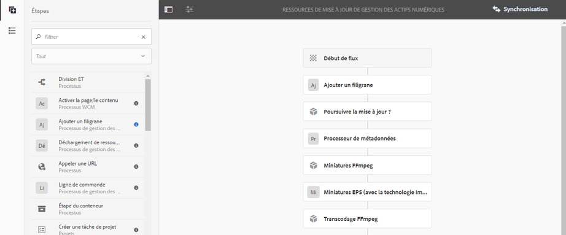

# Mettre vos ressources numériques en filigrane {#watermarking}

Les ressources d’Adobe Experience Manager (AEM) vous permettent d’ajouter un filigrane numérique aux ressources, ce qui permet aux utilisateurs de vérifier l’authenticité et la propriété des ressources par copyright. AEM Assets prend en charge le texte à utiliser comme un filigrane sur les fichiers PNG et JPEG.

To be able to apply watermark on assets, add the watermarking step in the [!UICONTROL DAM Update Asset] workflow.

1. Accédez à l’interface utilisateur d’AEM, puis à **[!UICONTROL Outils]** > **[!UICONTROL Processus]** > **[!UICONTROL Modèles]**.
1. From the **[!UICONTROL Workflow Models]** page, select the **[!UICONTROL DAM Update Asset]** workflow and click **[!UICONTROL Edit]**.

1. From the side panel, drag the **[!UICONTROL Add Watermark]** step to the [!UICONTROL DAM Update Asset] workflow.

   

   >[!NOTE]
   >
   >Place the [!UICONTROL Add Watermark] step anywhere before the [!UICONTROL Process Thumbnail] step.

1. Ouvrez l’étape **[!UICONTROL Ajouter un filigrane]** pour afficher ses propriétés.
1. Sous l’onglet **[!UICONTROL Arguments]**, spécifiez des valeurs valides dans les différents champs, notamment le texte, le type de police, la taille, la couleur, l’emplacement, l’orientation, etc. Pour confirmer les modifications, appuyez/cliquez sur l’icône Terminé.

   

1. Save the **[!UICONTROL DAM Update Asset]** workflow with the watermark step.
1. Dans l’interface utilisateur Ressources, téléchargez un exemple de fichier. Le filigrane apparaît avec la taille de police, la couleur, etc., à l’emplacement configuré aux étapes ci-dessus.
