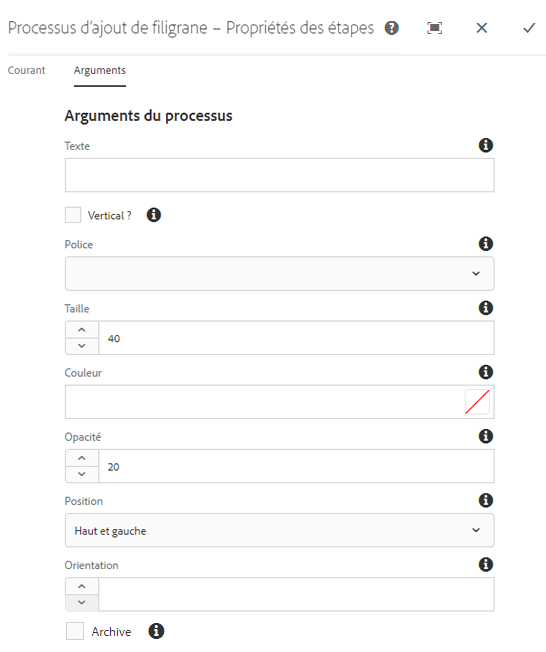

# Mettre vos ressources numériques en filigrane {#watermarking}

[!DNL Adobe Experience Manager Assets] vous permet d’ajouter un filigrane numérique aux fichiers afin d’aider les utilisateurs à vérifier l’authenticité et la propriété des fichiers sur les droits d’auteur. [!DNL Experience Manager Assets] prend en charge le texte à utiliser comme un filigrane sur les fichiers PNG et JPEG.

To be able to apply watermark on assets, add the watermarking step in the [!UICONTROL DAM Update Asset] workflow.

1. Accédez à l’interface [!DNL Experience Manager] utilisateur et accédez à **[!UICONTROL Outils]** > **[!UICONTROL Processus]** > **[!UICONTROL Modèles]**.
1. From the **[!UICONTROL Workflow Models]** page, select the **[!UICONTROL DAM Update Asset]** workflow and click **[!UICONTROL Edit]**.

1. From the side panel, drag the **[!UICONTROL Add Watermark]** step to the [!UICONTROL DAM Update Asset] workflow.

   ![Faites glisser l’étape [!UICONTROL Ajouter le filigrane] et ajoutez-la au processus ](assets/add_watermark_step_aem_assets.png)2 de mise à jour de la ressourceDAM2.
   *Figure : Faites glisser l’étape[!UICONTROL Ajouter le filigrane]et ajoutez-la au processus[!UICONTROL DAM Update Asset].*

   >[!NOTE]
   >
   >Place the [!UICONTROL Add Watermark] step anywhere before the [!UICONTROL Process Thumbnail] step.

1. Ouvrez l’étape **[!UICONTROL Ajouter un filigrane]** pour afficher ses propriétés.
1. Sous l’onglet **[!UICONTROL Arguments]**, spécifiez des valeurs valides dans les différents champs, notamment le texte, le type de police, la taille, la couleur, l’emplacement, l’orientation, etc. Pour confirmer les modifications, cliquez sur **[!UICONTROL Terminé]**.

   

   *Figure : Fournissez les arguments dans l’étape d’ajout de filigrane dans[!DNL Assets].*

1. Save the **[!UICONTROL DAM Update Asset]** workflow with the watermark step.
1. From the [!DNL Assets] user interface, upload a sample asset. Le filigrane apparaît avec la taille de police, la couleur, etc., à l’emplacement configuré aux étapes ci-dessus.

Pour mettre en filigrane des documents PDF par programmation ou avec des informations dynamiques, pensez à utiliser l’offre [Experience Manager Document Services](/help/forms/using/overview-aem-document-services.md) .
