# Utilisation de sélecteurs {#working-with-selectors}

Lorsque vous utilisez une image interactive, une vidéo interactive ou une bannière de carrousel, vous sélectionnez des ressources, ainsi que des sites et des produits auxquels relier les zones réactives et les zones cliquables. Lorsque vous travaillez avec des visionneuses d’images, des visionneuses à 360° et de contenu multimédia, vous devez également sélectionner les ressources à l’aide du sélecteur de ressources.

Cette rubrique décrit comment utiliser les sélecteurs de produits, de sites et de ressources, y compris comment naviguer, filtrer et trier dans les sélecteurs.

Vous accédez aux sélecteurs lorsque vous créez des ensembles de carrousels, vous ajoutez des zones réactives et des zones cliquables et vous créez des vidéos et des images interactives.

Par exemple, dans cette bannière de carrousel, vous utilisez le sélecteur de produits si vous liez une zone réactive ou une zone cliquable à une page d’aperçu rapide. Utilisez le sélecteur de sites si vous liez une zone réactive ou une zone cliquable à un lien hypertexte ; utilisez le sélecteur de ressources lorsque vous créez une diapositive.

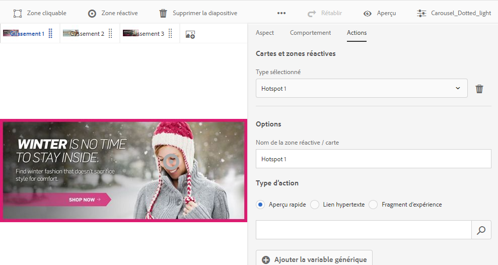

Lorsque vous sélectionnez (au lieu de saisir manuellement) l’emplacement des zones réactives ou des zones cliquables, vous utilisez le sélecteur. Le sélecteur de sites ne fonctionne que si vous êtes client d’Experience Manager Sites. Le sélecteur de produits nécessite également Experience Manager Commerce.

## Utilisation du sélecteur de produits {#selecting-products}

Utilisez le sélecteur de produits pour choisir un produit lorsque vous souhaitez une zone réactive ou une zone cliquable pour proposer l’aperçu rapide d’un produit de votre catalogue de produits.

1. Accédez à l’ensemble de carrousels, à l’image interactive ou à la vidéo interactive, puis sélectionnez l’onglet **[!UICONTROL Actions]** (disponible uniquement si vous avez défini une zone réactive ou une zone cliquable).

   Le sélecteur de produits se trouve dans la zone **[!UICONTROL Type d’action]**.

   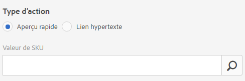

1. Sélectionnez l’icône du **[!UICONTROL sélecteur de produits]** (loupe) et accédez à un produit dans le catalogue.

   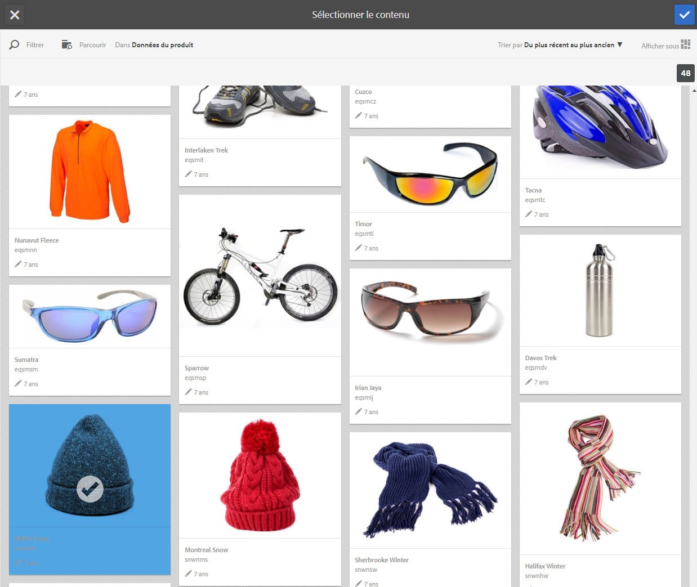

   Filtrez par mot-clé ou balise en appuyant sur **[!UICONTROL Filtrer]** et en entrant des mots-clés ou en sélectionnant des balises, ou les deux à la fois.

   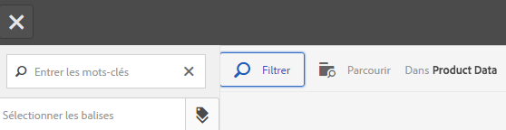

   Vous pouvez modifier l’emplacement dans lequel Experience Manager recherche les données de produit en appuyant sur **[!UICONTROL Parcourir]** et en accédant à un autre dossier.

   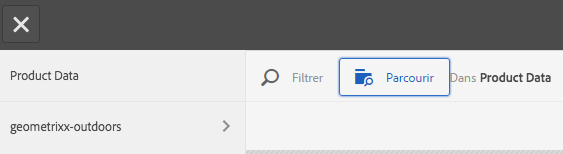

   Sélectionnez **[!UICONTROL Trier par]** pour indiquer si Experience Manager trie du plus récent au plus ancien ou du plus ancien au plus récent.

   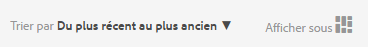

   Sélectionnez **[!UICONTROL Afficher sous]** pour changer l’affichage des produits (**[!UICONTROL Vue Liste]** ou **[!UICONTROL Vue Carte]**).

   

1. Une fois le produit sélectionné, le champ reçoit la miniature et le nom du produit.

   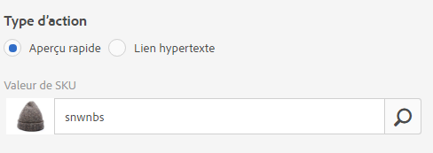

1. En mode **[!UICONTROL Aperçu]**, vous pouvez sélectionner la zone réactive ou la zone cliquable et voir à quoi ressemble l’aperçu rapide.

   

## Utilisation du sélecteur de sites {#selecting-sites}

Utilisez le sélecteur de sites pour choisir une page web lorsque vous souhaitez qu’une zone réactive ou une zone cliquable pointe vers une page web gérée dans Experience Manager Sites.

1. Accédez à l’ensemble de carrousels, à l’image interactive ou à la vidéo interactive, puis sélectionnez l’onglet **[!UICONTROL Actions]** (disponible uniquement si vous avez défini une zone réactive ou une zone cliquable).

   Le sélecteur de sites se trouve dans la zone **[!UICONTROL Type d’action]**.

   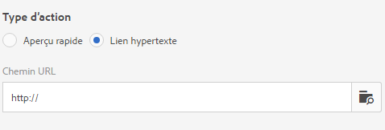

1. Sélectionnez l’icône **[!UICONTROL Sélecteur de sites]** (dossier avec loupe) et accédez dans Experience Manager Sites à une page à laquelle vous voulez relier la zone réactive ou la zone cliquable.

   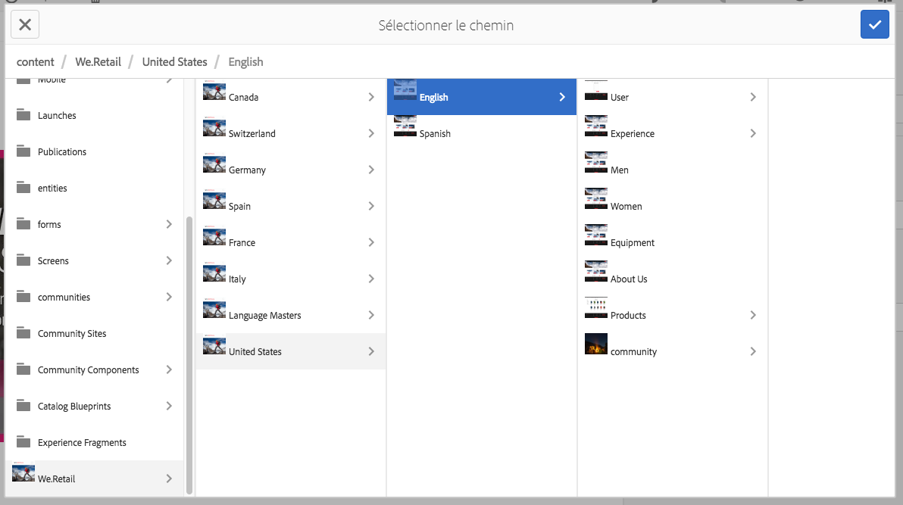

1. Une fois le site sélectionné, le champ reçoit le chemin d’accès.

   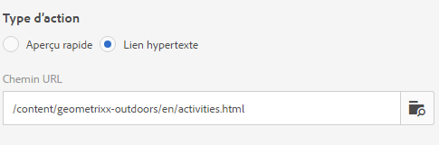

1. En mode **[!UICONTROL Aperçu]**, si vous sélectionnez la zone réactive ou la zone cliquable, vous accédez à la page du site Experience Manager que vous avez spécifiée.

## Utilisation du sélecteur de ressources {#selecting-assets}

Utilisez ce sélecteur pour sélectionner les images à utiliser dans une bannière de carrousel, une vidéo interactive, des visionneuses d’images, de contenus multimédia variés et à 360°. Dans la vidéo interactive, le sélecteur de ressources est disponible lorsque vous sélectionnez **[!UICONTROL Sélectionner des ressources]** dans l’onglet **[!UICONTROL Contenu]**. Dans les ensembles de carrousels, le sélecteur de ressources est disponible lorsque vous créez une diapositive. Dans les visionneuses d’images, de contenus multimédia variés et à 360°, le sélecteur de ressources est disponible lorsque vous créez respectivement une visionneuse d’images, de contenus multimédia variés ou à 360°.

Reportez-vous également à la section [Sélecteur de ressources](search-assets.md#assetpicker) pour plus d’informations.

1. Accédez à l’ensemble de carrousels et créez une diapositive. Ou accédez à la vidéo interactive, accédez à l’onglet **[!UICONTROL Contenu]** et sélectionnez des ressources. Vous pouvez également créer des visionneuses de contenu multimédia varié, d’images ou à 360°.
1. Sélectionnez l’icône **[!UICONTROL Sélecteur de ressources]** (dossier avec loupe) et accédez à une ressource.

   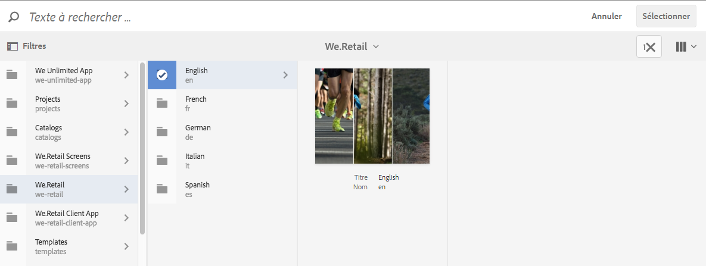

   Filtrez par mot-clé ou balise en appuyant sur **[!UICONTROL Filtrer]** et en entrant des mots-clés ou en ajoutant des critères, ou les deux à la fois.

   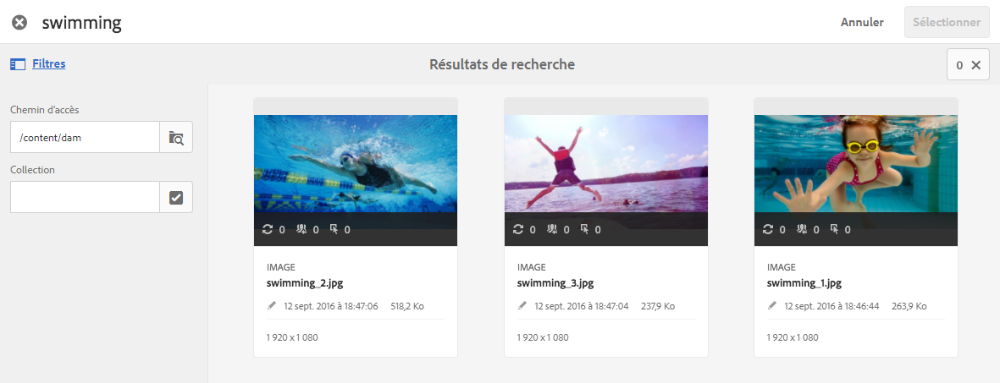

   Vous pouvez modifier l’emplacement où Experience Manager recherche les ressources en accédant à un autre dossier dans le champ **[!UICONTROL Chemin]**.

   Sélectionnez **[!UICONTROL Collection]** pour rechercher uniquement des ressources dans les collections.

   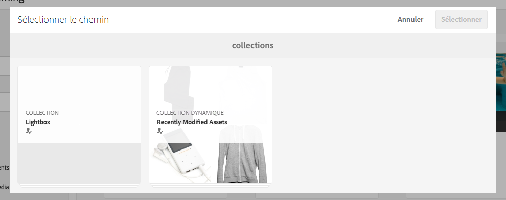

   Sélectionnez **[!UICONTROL Afficher sous]** pour changer l’affichage des produits (**[!UICONTROL Vue Liste]**, **[!UICONTROL Vue Colonne]** ou **[!UICONTROL Vue Carte]**).

   

1. Sélectionnez la ressource en activant la case à cocher. La ressource s’affiche.

   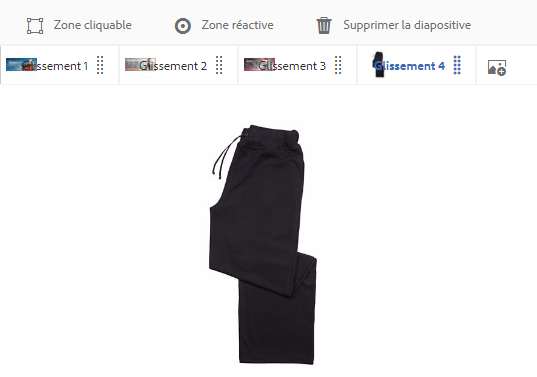
