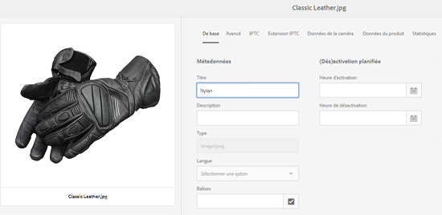
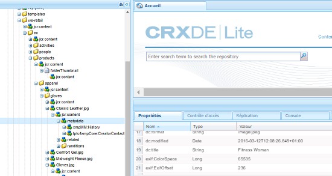
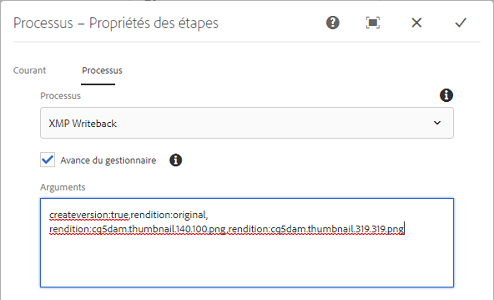

# Écriture différée XMP sur les rendus {#xmp-writeback-to-renditions}

La fonction d’écriture différée XMP permet de [!DNL Adobe Experience Manager Assets] répliquer les modifications de métadonnées de fichier dans les rendus de la ressource. When you change the metadata for an asset from within [!DNL Experience Manager Assets] or while uploading the asset, changes are initially stored within the asset node in CRXDe. La fonction d’écriture différée XMP propage les modifications de métadonnées à tous les rendus ou à des rendus spécifiques de la ressource.

Supposons que vous remplaciez la propriété [!UICONTROL Titre] d’une ressource intitulée `Classic Leather` par `Nylon`.

In this case, the [!DNL Experience Manager Assets] saves the changes to the **[!UICONTROL Title]** property in the `dc:title` parameter for the asset metadata stored in the asset hierarchy.

However, [!DNL Experience Manager Assets] does not automatically propagate any metadata changes to the renditions of an asset.

La fonction d’enregistrement XMP vous permet de propager les modifications de métadonnées à tous les rendus ou à des rendus spécifiques de la ressource. Toutefois, les modifications ne sont pas stockées sous le nœud de métadonnées dans la hiérarchie de la ressource. Au lieu de cela, cette fonction incorpore les modifications dans les fichiers binaires pour les rendus.

## Activation de l’écriture différée XMP {#enabling-xmp-writeback}

Pour activer la propagation des modifications apportées aux métadonnées aux rendus de la ressource lors de leur chargement, modifiez la configuration **[!UICONTROL Créateur de rendus de gestion des actifs numériques Adobe CQ]** dans Configuration Manager.

1. Pour ouvrir Configuration Manager, accédez à `https://[aem_server]:[port]/system/console/configMgr`.
1. Ouvrez la configuration **[!UICONTROL Créateur de rendus de gestion des actifs numériques Adobe CQ]**.
1. Sélectionnez l&#39;option **[!UICONTROL Propagate XMP[!UICONTROL **, puis enregistrez les modifications.

   

## Activation de l’écriture différée XMP pour des rendus spécifiques {#enabling-xmp-writeback-for-specific-renditions}

To let the XMP Writeback feature propagate metadata changes to select renditions, specify these renditions to the XMP Writeback Process workflow step of [!UICONTROL DAM Metadata WriteBack] workflow. Par défaut, cette étape est configurée avec le rendu d’origine.

Pour que la fonction Écriture différée XMP propage les métadonnées aux miniatures de rendu 140.100.png et 319.319.png, procédez comme suit :

1. Dans l’interface du Experience Manager, accédez à **[!UICONTROL Outils]** > **[!UICONTROL Processus]** > **[!UICONTROL Modèles]**.
1. Sur la page Modèles, ouvrez le modèle de workflow **[!UICONTROL Écriture différée des métadonnées de gestion des actifs numériques]**.
1. Sur la page de propriétés **[!UICONTROL Écriture différée des métadonnées de gestion des actifs numériques]**, ouvrez l’étape **[!UICONTROL Processus d’écriture différée XMP]**.
1. In the [!UICONTROL Step Properties] dialog box, click the **[!UICONTROL Process]** tab.
1. In the **Arguments** box, add `rendition:cq5dam.thumbnail.140.100.png,rendition:cq5dam.thumbnail.319.319.png`, andd then click **OK**.

   

1. Enregistrez les modifications.
1. To regenerate the pyramid TIFF renditions for [!DNL Dynamic Media] images with the new attributes, add the **[!UICONTROL Dynamic Media Process Image Assets]** step to the [!UICONTROL DAM Metadata Writeback] workflow.

   Les rendus PTIFF sont uniquement créés et conservés localement dans une implémentation hybride Dynamic Media.

1. Enregistrez le workflow.

Les modifications apportées aux métadonnées sont propagées aux rendus thumbnail.140.100.png et thumbnail.319.319.png de la ressource uniquement.

>[!NOTE]
>
>For XMP writeback issues in 64 bit Linux, see [How to enable XMP write-back on 64-bit RedHat Linux](https://helpx.adobe.com/experience-manager/kb/enable-xmp-write-back-64-bit-redhat.html).
>
>For more information about supported platforms, see [XMP metadata write-back prerequisites](/help/sites-deploying/technical-requirements.md#requirements-for-aem-assets-xmp-metadata-write-back).

## Filtrage des métadonnées XMP {#filtering-xmp-metadata}

[!DNL Experience Manager Assets] prend en charge à la fois le filtrage de liste bloquée et de liste autorisée des propriétés/noeuds pour les métadonnées XMP lues à partir de fichiers binaires et stockées dans le JCR lorsque des fichiers sont ingérés.

Le filtrage à l’aide d’une liste bloquée vous permet d’importer toutes les propriétés de métadonnées XMP, à l’exception des propriétés spécifiées pour l’exclusion. Cependant, pour les types de ressources tels que les fichiers INDD comportant un très grand nombre de métadonnées XMP (par exemple 1 000 nœuds avec 10 000 propriétés), les noms des nœuds à filtrer ne sont pas toujours connus à l’avance. Si le filtrage à l’aide d’une liste bloquée permet l’importation d’un grand nombre de fichiers avec de nombreuses métadonnées XMP, l’instance/la grappe AEM peut rencontrer des problèmes de stabilité, par exemple des files d’attente d’observation bloquées.

Le filtrage des métadonnées XMP par liste autorisée résout ce problème en vous permettant de définir les propriétés XMP à importer. Ainsi, toute autre propriété XMP ou inconnue est ignorée. Pour une compatibilité ascendante, vous pouvez ajouter certaines de ces propriétés au filtre qui utilise une liste bloquée.

>[!NOTE]
>
>Le filtrage fonctionne uniquement pour les propriétés dérivées des sources XMP dans les binaires des ressources. Pour les propriétés dérivées de sources autres que XMP, comme les formats EXIF et IPTC, le filtrage ne fonctionne pas. Par exemple, la date de création de la ressource est stockée dans la propriété appelée `CreateDate` dans EXIF TIFF. Le Experience Manager stocke cette valeur dans un champ de métadonnées nommé `exif:DateTimeOriginal`. Comme la source est autre que XMP, le filtrage ne fonctionne pas sur cette propriété.

<!-- TBD: The instructions don't seem to match the UI. I see com.day.cq.dam.commons.metadata.XmpFilterBlackWhite.description
in Config Manager. And the settings are,
com.day.cq.dam.commons.metadata.XmpFilterBlackWhite.xmp.filter.apply_whitelist.name
com.day.cq.dam.commons.metadata.XmpFilterBlackWhite.xmp.filter.whitelist.name
com.day.cq.dam.commons.metadata.XmpFilterBlackWhite.xmp.filter.apply_blacklist.name
com.day.cq.dam.commons.metadata.XmpFilterBlackWhite.xmp.filter.blacklist.name
 
TBD: Make updates to configurations for allow and block list after product updates are done.
-->

1. Pour ouvrir Configuration Manager, accédez à `https://[aem_server]:[port]/system/console/configMgr`.
1. Ouvrez la configuration **[!UICONTROL Filtre XMP de gestion des actifs numériques Adobe CQ]**.
1. To apply filtering via an allowed list, select **[!UICONTROL Apply Allowlist to XMP Properties]**, and specify the properties to be imported in the **[!UICONTROL Allowed XML Names for XMP filtering]** box.

   

1. Pour filtrer les propriétés XMP bloquées après l’application du filtrage par liste autorisée, spécifiez celles qui se trouvent dans la zone Noms XML **[!UICONTROL bloqués pour le filtrage]** XMP.

   >[!NOTE]
   >
   >The **[!UICONTROL Apply Blocklist to XMP Properties]** option is selected by default. En d’autres termes, le filtrage à l’aide d’une liste bloquée est activé par défaut. To disable such filtering, deselect the **[!UICONTROL Apply Blocklist to XMP Properties]** option.

1. Enregistrez les modifications.
