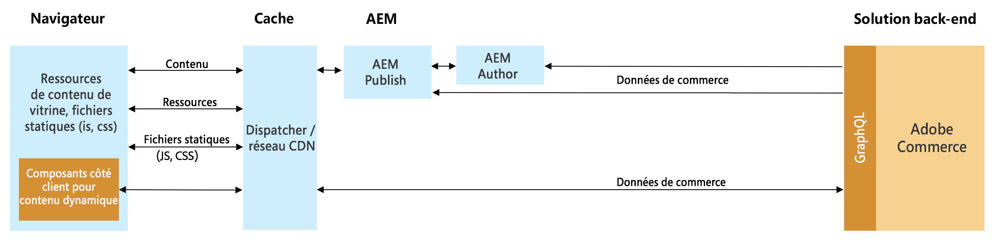
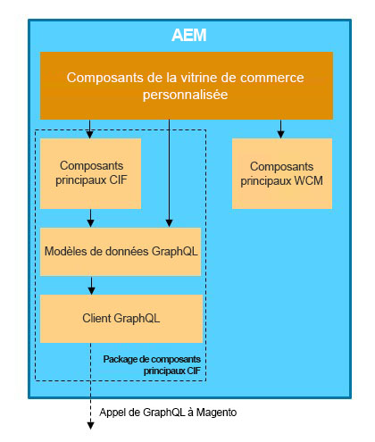

# Intégration d’AEM et d’Adobe Commerce (Magento) à l’aide de Commerce Integration Framework {#aem-commerce-framework}

Experience Manager et Adobe Commerce sont intégrés de manière transparente à l’aide de Commerce Integration Framework (CIF). CIF permet à AEM d’accéder directement à l’instance de Commerce et de communiquer avec cette dernière à l’aide des [API GraphQL](https://devdocs.magento.com/guides/v2.4/graphql/) d’Adobe Commerce.

>[!NOTE]
>
>La version minimale de l’API GraphQL prise en charge est la version 2.3.5. Certaines fonctionnalités ne sont prises en charge que dans les versions plus récentes ou uniquement dans l’édition Adobe Commerce.

## Aperçu de l’architecture {#overview}

L’architecture globale est la suivante :

CIF prend en charge les modèles de communication côté serveur et côté client.
Les appels d’API côté serveur sont implémentés à l’aide du [client GraphQL](https://github.com/adobe/commerce-cif-graphql-client) générique intégré, associé à un [jeu de modèles de données générés](https://github.com/adobe/commerce-cif-magento-graphql) pour le schéma GraphQL de Commerce. De plus, toute requête GraphQL ou mutation au format GQL peut être utilisée.

Pour les composants côté client, qui sont créés à l’aide de [React](https://reactjs.org/), le [client Apollo](https://www.apollographql.com/docs/react/) est utilisé.

## Architecture des composants principaux AEM CIF {#cif-core-components}

Les [composants principaux AEM CIF](https://github.com/adobe/aem-core-cif-components) suivent des modèles de conception et des bonnes pratiques très similaires à ceux des [composants principaux AEM WCM](https://github.com/adobe/aem-core-wcm-components).

La logique commerciale et la communication d’arrière-plan avec Adobe Commerce pour les composants principaux AEM CIF sont mises en œuvre dans les modèles Sling. Au cas où il est nécessaire de personnaliser cette logique pour répondre aux exigences spécifiques du projet, le modèle de délégation des modèles Sling peut être utilisé.

>[!TIP]
>
>La page [Personnalisation des composants principaux AEM CIF](../customizing/customize-cif-components.md) contient un exemple détaillé et des bonnes pratiques sur la personnalisation des composants principaux du CIF.

Dans les projets, les composants principaux AEM CIF et les composants de projet personnalisés peuvent facilement récupérer le client configuré pour un magasin Adobe Commerce lié à une page AEM via la configuration tenant compte du contexte Sling.
