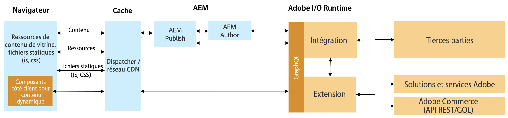

# Intégration commerciale des AEM et des tiers à l&#39;aide du cadre d&#39;intégration commerciale {#aem-third-party}

L&#39;intégration de la solution de commerce non-Adobe est un scénario courant pour CIF. les solutions tierces avec différentes API et différents schémas sont connectées via une couche d’intégration.

## Architecture {#architecture}

L’architecture globale se présente comme suit :

Cette couche d’intégration a pour but de mapper les API et les schémas tiers aux API et schémas GraphQL de commerce d’Adobe pris en charge en dehors du Experience Manager. Grâce à cette encapsulation, la logique d&#39;intégration et les systèmes peuvent être mis à jour sans modifier le code dans le Experience Manager.

## Configuration requise pour une intégration

Lorsque le Experience Manager récupère les données à la demande, des API en temps réel pour le catalogue de produits sont requises.

>[!TIP]
>
>Si aucune API en temps réel n’est disponible, un cache de produit externe avec des API doit être utilisé pour l’intégration. Exemple [Magento open-source](https://magento.com/products/magento-open-source).

Il n&#39;est pas nécessaire de mettre en oeuvre le schéma GraphQL complet, juste les objets du schéma pour activer les utilisations souhaitées.

## Cas d’utilisation principaux

CIF étend le Experience Manager avec l’accès en temps réel aux catalogues de produits et les outils de gestion de l’expérience des produits. Cette intégration transparente permet aux auteurs d’accéder aux données commerciales à l’aide d’interfaces intégrées chaque fois que cela est nécessaire sans quitter le contexte de contenu.

L’intégration des API de catalogue de produits est requise pour déverrouiller ces cas d’utilisation.

## Cas d’utilisation principaux

[AEM ](https://github.com/adobe/aem-core-cif-components) Composants principaux CIF récupèrent et échangent des données via les API de commerce d&#39;Adobe prises en charge par CIF. Pour réutiliser les composants, les API correspondantes doivent être implémentées.

La recommandation pour les composants côté client critiques en termes de performances consiste à communiquer directement avec la solution tierce afin d’éviter toute latence.

## Développement d&#39;une intégration {#develop-integration}

Nous vous recommandons d’utiliser [Adobe I/O Runtime](https://www.adobe.io/apis/experienceplatform/runtime.html) pour la couche d’intégration. Il est inclus dans le module complémentaire CIF pour les tiers. Comme elle fonctionne avec une approche de microservice, elle est bien adaptée pour intégrer facilement plusieurs solutions.

L&#39;[implémentation de référence](https://github.com/adobe/commerce-cif-graphql-integration-reference) est un excellent point de départ pour construire l&#39;intégration à votre solution commerciale. Bien qu&#39;il prenne en charge GraphQL, il peut également être intégré à tout autre type d&#39;API tel que REST.

Cette couche d’intégration n’est pas requise si une couche tierce est disponible (telle que Mulesoft) ou si l’intégration est construite sur la solution tierce.
