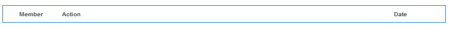
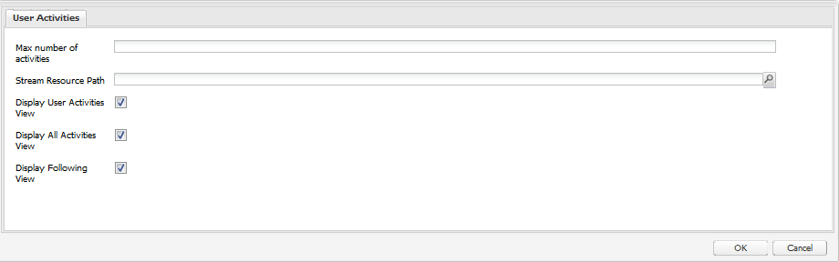
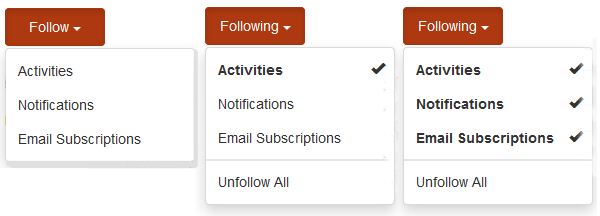

# Fonctionnalité Flux d’activités {#activity-streams-feature}

## Présentation {#introduction}

Les activités d’un membre de la communauté connecté, telles que la publication sur un forum ou un blog, sont rassemblées dans un flux qui peut être filtré et affiché de différentes manières par le biais de la configuration du composant `Activity Streams`.

La possibilité de suivre ajoute une autre vue des activités lorsque les membres de la communauté suivent des messages d’intérêt ou suivent les activités d’autres membres de la communauté.

Le document décrit :

* Ajout du composant Flux d’activités à un site AEM
* Paramètres de configuration du composant Flux d’activités

### Ajout de flux d’activités à une page {#adding-activity-streams-to-a-page}

Si vous souhaitez ajouter un composant `Activity Streams` à une page en mode de création, utilisez l’explorateur de composants pour localiser .

* `Communities / Activity Streams`

Et faites-le glisser sur une page où les flux d’activité doivent apparaître.

Pour plus d’informations, consultez [Principes de base des composants de communautés](/help/communities/basics.md).

Lorsque les [bibliothèques côté client requises](/help/communities/essentials-activities.md#essentials-for-client-side) sont incluses, le composant `Activity Streams` s’affiche de la manière suivante :

### Configuration des flux d’activités {#configuring-activity-streams}

Sélectionnez le composant de `Activity Streams` placé afin de pouvoir accéder à l’icône de `Configure` qui ouvre la boîte de dialogue de modification et de la sélectionner.

Sous l’onglet **Activités utilisateur**, spécifiez les activités à afficher :

* **Nb max d&#39;activités**

  Nombre d’activités à afficher

* **Chemin d’accès à la ressource du flux**

  Laissez vide pour définir par défaut le site ou le groupe de la communauté. Le chemin d’accès à la ressource de flux identifie la source des activités. La valeur par défaut est vide.

* **Afficher La Vue Des Activités Utilisateur**

  Si cette case est cochée, la page des activités comprend un onglet qui filtre les activités en fonction de celles générées dans la communauté par le membre actuel. La valeur par défaut est cochée.

* **Afficher la vue Toutes les activités**

  Si cette case est cochée, la page des activités comprend un onglet comprenant toutes les activités générées dans la communauté à laquelle le membre actuel a accès. La valeur par défaut est cochée.

* **Afficher la vue suivante**

  Si cette case est cochée, la page des activités comprend un onglet qui filtre les activités en fonction de celles que le membre actuel suit. La valeur par défaut est cochée.

### Vue suivante {#following-view}

Les composants doivent être configurés pour activer les éléments suivants. Les fonctionnalités qui permettent d’effectuer les opérations suivantes sont [blog](/help/communities/blog-feature.md), [forum](/help/communities/forum.md), [QnA](/help/communities/working-with-qna.md), [calendar](/help/communities/calendar.md)[, [file library](/help/communities/file-library.md) et ](/help/communities/comments.md)comments.

Le bouton **Suivre** permet de suivre les entrées en tant qu’activités, [notifications](/help/communities/notifications.md) ou [abonnements](/help/communities/subscriptions.md). Chaque fois que le bouton **Suivre** est sélectionné, il est possible d’activer ou de désactiver une sélection. La sélection `Email Subscriptions` n’est présente que lors de la configuration.

Si l’une des méthodes suivantes est sélectionnée, le texte du bouton devient **Suivant**. Pour des raisons pratiques, il est possible de sélectionner `Unfollow All` pour désactiver toutes les méthodes.

Le bouton **Suivre** s’affiche :

* Lors de l&#39;affichage du profil d&#39;un autre membre.
* Sur une page de fonctionnalités principale, telle que les forums, QnA et les blogs.

  * Suit toutes les activités pour cette fonctionnalité générale.

* Pour une entrée spécifique, telle qu’un sujet de forum, une question ou un article de blog.

  * Suit toutes les activités pour cette entrée spécifique.

### Informations supplémentaires {#additional-information}

Pour plus d’informations, consultez la page [Activity Streams Essentials](/help/communities/essentials-activities.md) destinée aux développeurs.
