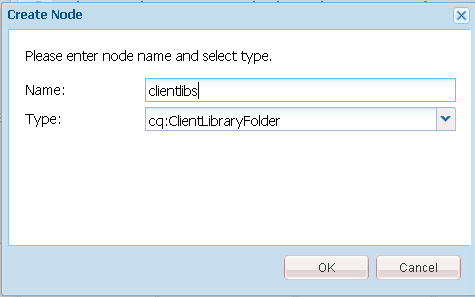
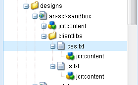
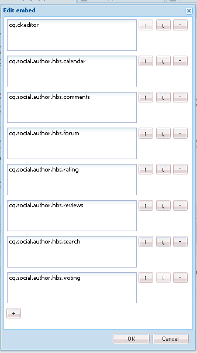
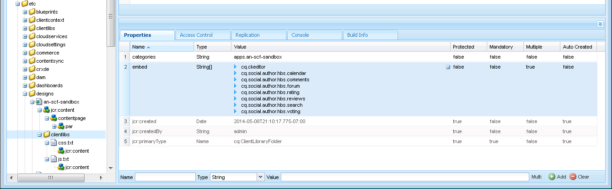
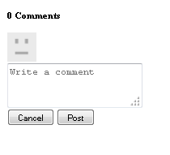
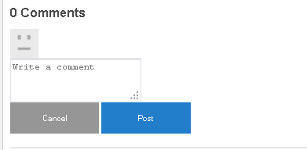
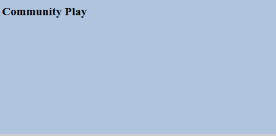

# Ajouter Clientlibs {#add-clientlibs}

## Ajouter un dossier de bibliothèques clientes (clientlibs) {#add-a-clientlibraryfolder-clientlibs}

Créez un dossier de bibliothèque cliente appelé `clientlibs` qui contient les feuilles de style en cascade (CSS) et JavaScript (JS) utilisées pour effectuer le rendu des pages de votre site.

La valeur de propriété `categories` donnée à cette bibliothèque cliente est l’identifiant utilisé pour inclure directement cette bibliothèque cliente à partir d’une page de contenu ou pour l’incorporer dans d’autres bibliothèques clientes.

1. À l’aide de **&#x200B;**, développez `/etc/designs`

1. Cliquez avec le bouton droit sur `an-scf-sandbox` et sélectionnez `Create Node`

   * Nom : `clientlibs`
   * Type : `cq:ClientLibraryFolder`

1. Cliquez sur **OK**



Dans l&#39;onglet **Propriétés** du nouveau nœud de `clientlibs`, saisissez la propriété **categories** :

* Nom : **categories**
* Type : **String**
* Valeur : **apps.an-scf-sandbox**
* Cliquez sur **Ajouter**
* Cliquez sur **Enregistrer tout**

Remarque : la valeur des catégories est précédée de « apps ». Il s&#39;agit d&#39;une convention permettant d&#39;identifier l&#39;application propriétaire comme se trouvant dans le dossier /apps, et non dans /libs. IMPORTANT : ajoutez un espace réservé `js.tx`t et des fichiers **`css.txt`**. (Ce n’est pas officiellement un cq:ClientLibraryFolder sans eux.)

1. Clic avec le bouton droit sur **`/etc/designs/an-scf-sandbox/clientlibs`**
1. Sélectionnez **Créer un fichier...**
1. Enter **Name:** `css.txt`
1. Sélectionnez **Créer un fichier...**
1. Enter **Name:** `js.txt`
1. Cliquez sur **Enregistrer tout**



La première ligne des fichiers css.txt et js.txt identifie l’emplacement de base à partir duquel les listes de fichiers suivantes sont disponibles.

Essayez de définir le contenu du fichier css.txt sur .

```
#base=.
 style.css
```

Créez ensuite un fichier sous clientlibs nommé style.css, puis définissez le contenu sur .

`body {`

`background-color: #b0c4de;`

`}`

### Incorporer SCF Clientlibs {#embed-scf-clientlibs}

Dans l’onglet **Propriétés** du nœud de `clientlibs`, saisissez la propriété String à plusieurs valeurs **embed**. Cela incorpore les [bibliothèques côté client (clientlibs) nécessaires pour les composants SCF](/help/communities/client-customize.md#clientlibs-for-scf). Pour ce tutoriel, la plupart des bibliothèques clientes nécessaires aux composants de Communities sont ajoutées.

Il peut s’agir de l’approche souhaitée pour un site d’exploitation, car elle tient compte des aspects pratiques par rapport à la taille/vitesse des bibliothèques clientes téléchargées pour chaque page.

Si vous utilisez une seule fonctionnalité sur une page, vous pouvez inclure la bibliothèque cliente complète de cette fonctionnalité directement sur la page, par exemple :

`% ui:includeClientLib categories=cq.social.hbs.forum" %`

Dans ce cas, il est préférable de les inclure tous, de sorte que les bibliothèques clientes SCF les plus basiques, c’est-à-dire les bibliothèques clientes de création, soient privilégiées :

* Nom : **`embed`**
* Type : **`String`**
* Clic **`Multi`**
* Valeur : **`cq.social.scf`**

  * Une boîte de dialogue s’affiche,
    cliquez sur **`+`** après chaque entrée pour ajouter les catégories de bibliothèques clientes suivantes :

    * **`cq.ckeditor`**
    * **`cq.social.author.hbs.comments`**
    * **`cq.social.author.hbs.forum`**
    * **`cq.social.author.hbs.rating`**
    * **`cq.social.author.hbs.reviews`**
    * **`cq.social.author.hbs.voting`**
    * Cliquez sur **OK**

* Cliquez sur **Enregistrer tout**



Voici comment les `/etc/designs/an-scf-sandbox/clientlibs` doivent maintenant apparaître dans le référentiel :



### Inclure les bibliothèques clientes dans le modèle PlayPage {#include-clientlibs-in-playpage-template}

Sans inclure la catégorie `apps.an-scf-sandbox` ClientLibraryFolder sur la page, les composants SCF ne sont pas fonctionnels ni stylisés, car les styles JavaScript et CSS nécessaires ne sont pas disponibles.

Par exemple, sans inclure les bibliothèques clientes, le composant Commentaires SCF n’a pas de style :



Une fois que les bibliothèques clientes apps.an-scf-sandbox sont incluses, le composant Commentaires SCF apparaît avec le style :



L’instruction d’inclusion appartient à la section `head` du script `html`. L’**`foundation head.jsp`** par défaut comprend un script qui peut être recouvert : **`headlibs.jsp`**.

**Copiez headlibs.jsp et incluez clientlibs:**

1. À l&#39;aide de **&#x200B;**, sélectionnez **`/libs/foundation/components/page/headlibs.jsp`**

1. Cliquez avec le bouton droit et sélectionnez **Copier** (ou sélectionnez Copier dans la barre d’outils)
1. Sélectionnez **`/apps/an-scf-sandbox/components/playpage`**.
1. Cliquez avec le bouton droit et sélectionnez **Coller** (ou sélectionnez Coller dans la barre d’outils).
1. Double-cliquez sur **`headlibs.jsp`** pour pouvoir l’ouvrir
1. Ajoutez la ligne suivante à la fin du fichier
   **`<ui:includeClientLib categories="apps.an-scf-sandbox"/>`**

1. Cliquez sur **Enregistrer tout**

```xml
<%@ page session="false" %><%
%><%@include file="/libs/foundation/global.jsp" %><%
%><ui:includeClientLib categories="cq.foundation-main"/><%
%>
<cq:include script="/libs/cq/cloudserviceconfigs/components/servicelibs/servicelibs.jsp"/>
<% currentDesign.writeCssIncludes(pageContext); %>
<ui:includeClientLib categories="apps.an-scf-sandbox"/>
```

Chargez votre site web dans le navigateur et vérifiez si l’arrière-plan n’est pas une nuance de bleu.

[&#128279;](https://localhost:4502/content/an-scf-sandbox/en/play.html)



### Enregistrement De Votre Travail Jusqu’À Présent {#saving-your-work-so-far}

À ce stade, il existe un sandbox minimaliste. Il peut être intéressant de l’enregistrer en tant que package afin de pouvoir désactiver votre serveur lors de la lecture si votre référentiel est corrompu et que vous souhaitez recommencer à zéro. Renommez ou supprimez ensuite le dossier crx-quickstart/, allumez votre serveur, chargez et installez ce package enregistré et n’avez pas à répéter ces étapes des plus basiques.

Ce package figure dans le tutoriel [Créer un exemple de page](/help/communities/create-sample-page.md) destiné aux personnes qui ne peuvent pas attendre pour se lancer et commencer la lecture.

Pour créer un package :

* Dans CRXDE Lite, cliquez sur l’icône [&#x200B; Package &#x200B;](https://localhost:4502/crx/packmgr/)
* Cliquez sur **Créer un package**

  * Nom du package : an-scf-sandbox-minimal-pkg
  * Version : 0.1
  * Groupe : `leave as default`
  * Cliquez sur **OK**

* Cliquez sur **Modifier**.

  * Sélectionnez l’onglet **Filtres**

    * Cliquez sur **Ajouter un filtre**
    * Chemin racine : accéder à `/apps/an-scf-sandbox`
    * Cliquez sur **Terminé**
    * Cliquez sur **Ajouter un filtre**
    * Chemin racine : accéder à `/etc/designs/an-scf-sandbox`
    * Cliquez sur **Terminé**
    * Cliquez sur **Ajouter un filtre**
    * Chemin racine : accéder à `/content/an-scf-sandbox**`
    * Cliquez sur **Terminé**

  * Cliquer sur **Enregistrer**

* Cliquez sur **Créer**

Vous pouvez maintenant sélectionner **Télécharger** pour l’enregistrer sur le disque et **Télécharger le package** ailleurs, puis sélectionner **Plus > Répliquer** pour pousser le sandbox vers une instance de publication localhost afin d’étendre le domaine de votre sandbox.
