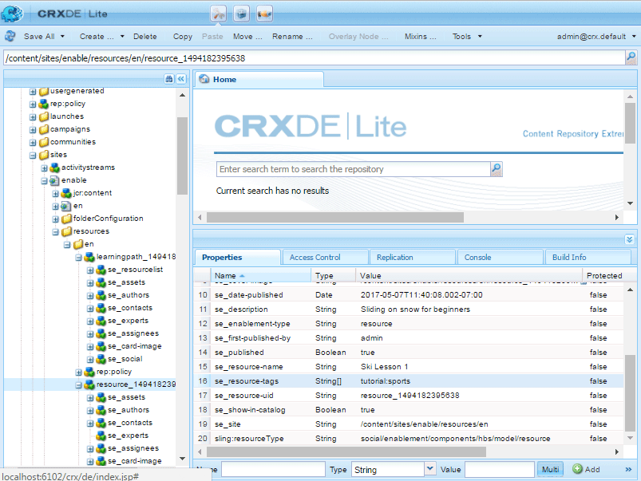
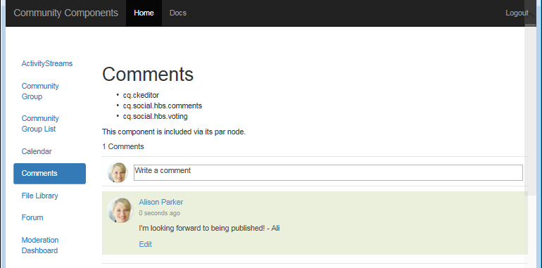

# Configuration d’Analytics pour les fonctionnalités des communautés {#analytics-configuration-for-communities-features}

## Présentation {#overview}

Adobe Analytics et Adobe Experience Manager (AEM) sont deux solutions d’Adobe Marketing Cloud.

Adobe Analytics peut être configuré pour les communautés AEM de sorte que, lorsqu’un membre interagit avec les fonctionnalités des communautés prises en charge, les  sont envoyées à Adobe Analytics à partir desquelles les rapports sont générés.

Par exemple, lorsqu’un membre d’un site de la communauté d’activation  une ressource vidéo qui lui est affectée, le lecteur de ressources envoie un  à Analytics, y compris les données de pulsation vidéo. Sur le site de la communauté, les administrateurs peuvent consulter divers rapports sur la lecture de la vidéo.

En outre, des analyses sont nécessaires pour :

* Dans le  de publication  :

   *  sur les [tendances des communautés](/help/communities/trends.md)
   * Permet aux du site de trier par &quot;le plus vu&quot;, &quot;le plus actif&quot;, &quot;le plus aimé&quot;
   *  compte sur les UGC

* Dans l&#39;auteur   :

   * Affichage des données de participation dans la console [de gestion des](/help/communities/members.md) membres (, publications, mentions J’aime, etc.)
   * Résumé des tendances, pulsation vidéo et périphérique vidéo pour les [rapports de ressources d’activation](/help/communities/reports.md)

Les fonctionnalités des communautés prises en charge sont les suivantes :

* [Ressources d&#39;activation](/help/communities/resources.md)
* [Forum](/help/communities/forum.md)
* [Q&amp;R](/help/communities/working-with-qna.md)
* [Blog](/help/communities/blog-feature.md)
* [Bibliothèque de fichiers](/help/communities/file-library.md)
* [Calendrier](/help/communities/calendar.md)

Cette section de la documentation décrit la connexion d’une suite de rapports Analytics aux fonctionnalités des communautés. Les étapes de base sont les suivantes :

1. [Répliquer la clé](#replicate-the-crypto-key) de chiffrement pour vous assurer que le chiffrement/déchiffrement se produit correctement sur toutes les instances AEM
1. Préparation d’une suite de [rapports Adobe Analytics](#adobe-analytics-report-suite-for-video-reporting)
1. Création d’un service [et d’une](#aem-analytics-cloud-service-configuration) structure AEM Analytics [Cloud](#aem-analytics-framework-configuration)

1. [Activation d’Analytics](#enable-analytics-for-a-community-site) pour un site communautaire
1. [**Vérification **](#verify-analytics-to-aem-variable-mapping)du mappage Analytics/variable AEM
1. Identifier l’éditeur [principal](#primary-publisher)
1. [Publication](#publish-community-site-and-analytics-cloud-service) du site de la communauté
1. Configurer l’ [importation des données](#obtaining-reports-from-analytics) de rapport d’Adobe Analytics vers le site de la communauté

## Conditions préalables {#prerequisites}

Pour configurer les fonctionnalités d’Analytics pour les communautés, vous devez travailler avec votre gestionnaire de compte pour configurer un compte Adobe Analytics et une suite [de](#adobe-analytics-report-suite-for-video-reporting)rapports. Une fois établies, les informations suivantes doivent être disponibles :

* **Nom**

   associé au compte Adobe Analytics.

* **Nom d’utilisateur**

   Nom d’utilisateur de connexion de l’utilisateur autorisé à gérer le compte Analytics (doit inclure les privilèges d’accès aux services Web).

* **Mot de passe**

   mot de passe de connexion de l’utilisateur autorisé.

* **Centre de données Analytics**

   URL du centre de données Analytics pour le compte.

* **Suite de rapports**

   Nom de la suite de rapports Analytics à utiliser.

## Suite de rapports Adobe Analytics pour les  vidéo {#adobe-analytics-report-suite-for-video-reporting}

À l’aide du Gestionnaire [de suites de](https://marketing.adobe.com/resources/help/en_US/reference/new_report_suite.html)rapports d’Adobe Marketing Cloud, il est possible de configurer les suites de rapports Analytics de sorte qu’un site de la communauté puisse être activé pour fournir des rapports pour les fonctionnalités des communautés.

En vous connectant à [Adobe Marketing Cloud](https://marketing.adobe.com/resources/help/en_US/analytics/getting-started/analytics-navigation.html) avec le nom [d’ du](/help/communities/analytics.md#prerequisites)et le nom d’utilisateur, vous pouvez configurer une suite de rapports nouvelle ou existante afin qu’elle dispose des éléments suivants :

* [11 Variables](https://marketing.adobe.com/resources/help/en_US/reference/conversion_var_admin.html) de conversion (eVars)

   * **`evar1`** par **`evar11`** activé

   * Peut réutiliser (renommer) des eVars existantes ou en créer de nouvelles à utiliser pour les fonctionnalités des communautés

* [7](https://marketing.adobe.com/resources/help/en_US/reference/success_event.html) de réussite ()

   * **`event1`** par **`event7`** activé

   * type **`Counter`**

      * not **`Counter (no subrelations)`**
   * Peut réutiliser (renommer) les  existantes ou en créer de nouvelles à utiliser pour les fonctionnalités des communautés


* [Gestion des vidéos](https://marketing.adobe.com/resources/help/en_US/sc/appmeasurement/hbvideo/video_analytics_config.html)

   * Console de  vidéo

      * Activer `Video Core`
      * Sélectionnez Enregistrer
   * Console de mesure coeur de la vidéo

      * Sélectionner `Use Solution Variables`
      * Sélectionnez Enregistrer


Si vous utilisez une **nouvelle suite** de rapports, sachez qu’une nouvelle suite de rapports ne peut comporter que 4 eVars et 6 variables de , tandis que 11 eVar et 7  de sont requises pour les communautés.

Si vous utilisez une suite **de rapports** existante, il peut être nécessaire de [modifier le mappage](#modifying-analytics-variable-mapping) des variables avant d’activer la structure Analytics pour un site de la communauté. Contactez votre gestionnaire de compte pour toute question concernant les variables dédiées aux Communautés.

>[!CAUTION]
>
>**Si vous utilisez une suite de rapports existante qui utilise déjà des variables dans**
>
>* **`evar1`** à **`evar11`**
   >
   >
* **`event1`** à **`event7`**
>
>
**Avant la publication du site de la communauté,** il est important de restaurer le mappage préexistant en déplaçant les variables AEM automatiquement mises en correspondance avec les variables Analytics lorsque Analytics était activé pour un site de la communauté.
>
>Pour restaurer le mappage préexistant et déplacer les variables AEM vers d’autres variables Analytics, reportez-vous à la section sur la [modification du mappage](#modifying-analytics-variable-mapping)des variables Analytics.
>
>Si vous ne le faites pas, vous risquez d’entraîner une perte de données irrécupérable.

### Analyses de pulsation vidéo {#video-heartbeat-analytics}

Lorsque la licence d’Analytics Video Heartbeat est concédée, une `Marketing Cloud Org Id` licence est attribuée.

Pour activer le Video Heartbeat après avoir [configuré la suite de rapports Analytics pour les](#adobe-analytics-report-suite-for-video-reporting)vidéo :

* Création d’un service cloud [Analytics](#aem-analytics-cloud-service-configuration)
* Activation d’ [Analytics pour un site de la communauté](#enable-analytics-for-a-community-site)
* Associer le site `Marketing Cloud Org Id` à la communauté

La valeur `Marketing Cloud Org Id` peut être saisie au moment de la création [du site](/help/communities/sites-console.md#enablement) communautaire ou plus tard en [modifiant](/help/communities/sites-console.md#modifying-site-properties) les propriétés du site communautaire. [](#aem-analytics-cloud-service-configuration)


Lorsque l’option Analytics de pulsation vidéo est activée, le code JavaScript (JS) du lecteur vidéo instancie le code de bibliothèque de pulsation vidéo (également dans JS) qui gère toute la logique d’envoi de mises à jour d’état vidéo aux serveurs de suivi vidéo Analytics toutes les 10 secondes (non configurables) et, éventuellement, d’envoi d’un rapport cumulatif de la session vidéo aux serveurs Analytics principaux.

S’il n’est pas activé, le code de pulsation vidéo n’est jamais instancié et seul le suivi de la progression vidéo et de la reprise de la position est conservé dans le SRP pour .

## Configuration du service AEM Analytics Cloud {#aem-analytics-cloud-service-configuration}

Pour créer une intégration Analytics qui intègre Adobe Analytics au site de la communauté AEM, utilisez l’interface utilisateur standard de l’instance d’auteur :

* A partir de la navigation globale : **[!UICONTROL Outils > Déploiement > Services Cloud]**
* Scroll-down to **[!UICONTROL Adobe Analytics]**
* Sélectionnez **[!UICONTROL Configurer maintenant]** ou **[!UICONTROL Afficher les configurations]**


### Boîte de dialogue Créer une configuration {#create-configuration-dialog}

* Sélectionnez `[+]` une icône en regard de **[!UICONTROL Configurations]** disponibles pour créer une nouvelle configuration.

Dans la boîte de dialogue Créer une configuration, les valeurs à saisir identifient la configuration.


* **Titre**

   (Obligatoire) Titre d’affichage de la configuration.
Par exemple, saisissez *Activation Community Analytics*

* **Nom**

   (Facultatif) S’il n’est pas spécifié, le nom est défini par défaut sur un nom de noeud valide dérivé du titre.
For example, enter *communities*

* **Template (Modèle)**

   Sélectionner `Adobe Analytics Configuration`

* Sélectionnez **Créer**

   * Lance la page de configuration et ouvre `Analytics Settings` la boîte de dialogue

### Boîte de dialogue Paramètres Analytics {#analytics-settings-dialog}

La création initiale d’une nouvelle configuration Analytics entraîne l’affichage de la configuration et une nouvelle boîte de dialogue pour l’entrée des paramètres Analytics. Cette boîte de dialogue nécessite les informations [de compte](#prerequisites) prérequises obtenues auprès du représentant du compte.


* **Société**

    associé au compte Adobe Analytics

* **Nom d’utilisateur**

   Nom d’utilisateur de connexion de l’utilisateur autorisé à gérer le compte Analytics.

* **Mot de passe**

   Mot de passe de connexion de l’utilisateur autorisé

* **Centre de données**

   Sélectionnez le centre de données Analytics qui héberge la suite de rapports.

* **Ne pas ajouter la balise de suivi sur la page**

   Conserver comme valeur par défaut (désélectionnée)

* **Utiliser AppMeasurement**

   Conserver comme valeur par défaut (désélectionnée)

* **Ne pas importer des impressions de page de nuit (auteur)**

   Conserver comme valeur par défaut (désélectionnée)

* **Ne pas importer les impressions de page de nuit (publier)** laisser comme valeur par défaut (désélectionnée)

Pour enregistrer les paramètres :

* Select **Connect to Analytics**

   * En cas d’échec,

      * Vérifier que les entrées ne contiennent pas d’espace de début
      * Tester un autre centre de données
      * Contactez votre représentant de compte

* **Cliquez sur OK**


### Créer une structure {#create-framework}

Après une configuration réussie de la connexion de base à Adobe Analytics, il est nécessaire de créer ou de modifier une structure pour le site de la communauté. La structure a pour objectif de mapper des variables de fonction Communautés (AEM) à des variables Analytics (suite de rapports).

* Sélectionnez `[+]` une icône en regard de l’option **[!UICONTROL Structures]** disponibles pour créer une nouvelle structure.


* **Titre**

   (Obligatoire) Titre d&#39;affichage du cadrePar exemple, saisissez *Enablement Community Framework*

* **Nom**

   (Facultatif) S’il n’est pas spécifié, le nom est défini par défaut sur un nom de noeud valide dérivé du titre.
For example, enter *communities*

* *Template (Modèle)*

   Sélectionner `Adobe Analytics Framework`

* Sélectionnez **Créer**

La création d’Analytics Framework ouvre la structure de configuration.

## Configuration du cadre d’AEM Analytics {#aem-analytics-framework-configuration}

La structure a pour objectif de mapper les variables AEM aux variables Analytics (eVars et  de). Les variables Analytics disponibles pour le mappage sont [définies dans la suite](#adobe-analytics-report-suite-for-video-reporting)de rapports.


### Sélectionner une Report Suite {#select-report-suite}

Sélectionnez la suite de rapports configurée pour les  de vidéo.

Si une suite de rapports n’a pas encore été créée ou n’a pas été correctement configurée, reportez-vous à la section précédente :
Suite de rapports[Adobe Analytics pour les  vidéo](#adobe-analytics-report-suite-for-video-reporting)

Le sidekick n’est pas nécessaire et peut être réduit de sorte qu’il n’obstrue pas l’accès aux paramètres Report Suites.

#### Boîte de dialogue Report Suites avant et après avoir sélectionné &quot;Ajouter élément&quot; {#report-suites-dialog-before-and-after-selecting-add-item}


1. Sélectionner **Ajouter élément +**

   Deux listes déroulantes s’affichent.

1. Choose a `Report suite.`

   Les suites de rapports associées au compte  sont disponibles pour sélection.

1. Sélectionnez **Oui** dans la boîte de dialogue qui s’ouvre :

   ```
   Load default server settings?
    Do you want to load the default server settings and overwrite current values in the Server section?
   ```

1. Choose a `Run Mode`

1. Sélectionnez **Publier**


Le service et la structure de cloud Analytics sont maintenant terminés. Les mappages seront définis une fois qu’un site de la communauté a été créé avec ce service Analytics activé.

## Activation d’Analytics pour un site de la communauté {#enable-analytics-for-a-community-site}

### Activer pour le nouveau site de la communauté {#enable-for-new-community-site}

Pour ajouter le service cloud Analytics lors de la [création d’un site](/help/communities/sites-console.md)communautaire :

* A l’étape 3, sous l’onglet [](/help/communities/sites-console.md#analytics)ANALYTICS :
   * Cochez la case **Activer Analytics** .
   * Sélectionnez le cadre dans la liste déroulante.

* Vous pouvez éventuellement revenir à la configuration de la structure Analytics pour ajuster les mappages de variables.

### Activer pour le site de la communauté existante {#enable-for-existing-community-site}

Pour ajouter le service cloud Analytics à un site [communautaire](/help/communities/sites-console.md#modifying-site-properties)existant :

* Accédez à la console **Communautés > Sites** .
* Sélectionnez l’icône Modifier le site du site de la communauté.
* Sélectionnez les PARAMÈTRES.
* Dans la section Analytics :
   * Cochez la case **Activer Analytics** .
   * Sélectionnez le cadre dans la liste déroulante.

* Vous pouvez éventuellement revenir à la configuration de la structure Analytics pour ajuster les mappages de variables.

### Activer pour les sites personnalisés {#enable-for-customized-sites}

Pour que le suivi et l’importation Analytics fonctionnent correctement pour un site de la communauté, un élément de page avec les attributs `scf-js-site-title` class et href doit être présent. Un seul élément de ce type doit exister sur la page, par exemple dans un `sitepage.hbs` script non modifié pour un site communautaire. La valeur de `siteUrl` est extraite et envoyée à Adobe Analytics en tant que chemin d’accès *du* site.

```xml
# present in default sitepage.hbs
# only one scf-js-site-title class should be included
# this example sets it to be hidden as it serves no visual purpose
<div
    class="navbar-brand scf-js-site-title"
    href="{{siteUrl}}.html"
    style="visibility: hidden;"
>
</div>
```

Pour un site **communautaire** personnalisé qui chevauche le `sitepage.hbs` script, assurez-vous que l’élément est présent. La `siteUrl`variable sera définie une fois générée sur le serveur avant d’être diffusée sur le client.

Pour un site **AEM** générique qui comprend des composants Communautés, mais qui n’est pas créé avec l’assistant [de création de](/help/communities/sites-console.md)site, il est nécessaire d’ajouter l’élément. La valeur de href doit être le chemin d’accès au site. Par exemple, si le chemin du site est `/content/my/company/en`, utilisez :

```xml
<div
    class="navbar-brand scf-js-site-title"
    href="/content/my/company/en.html"
    style="visibility: hidden;"
>
</div>
```

## Fonctionnalités d’Analytics pour les communautés {#analytics-for-communities-features}

Analytics est automatiquement utilisé pour plusieurs fonctions de communautés.

L’auteur  la configuration [](/help/sites-deploying/configuring-osgi.md)OSGi , `AEM Communities Analytics Component Configuration`, fournit une liste des composants créés pour Analytics. Le mappage automatique des variables est déterminé par les composants répertoriés.

Si de nouveaux composants personnalisés créés pour Analytics sont créés, ils doivent être ajoutés à ce de composants configurés.

### Configuration des composants {#component-configuration}


>[!NOTE]
>
>Les composants  sont utilisés pour implémenter la fonction de blog.

### Association d’Analytics aux variables AEM {#mapped-analytics-to-aem-variables}

Une fois le site de la communauté enregistré avec Analytics activé et la structure de configuration du cloud sélectionnée, les variables AEM sont automatiquement mises en correspondance avec les eVars et les  Analytics en commençant par evar1 et1, respectivement, et en les incrémentant de 1.

Si vous utilisez une suite de rapports existante qui a mappé l’une des variables d’evar1 à evar11 et de1 à7, vous devez [remapper les variables](#modifying-analytics-variable-mapping) AEM et restaurer le mappage d’origine.

Voici un exemple de mappage par défaut après avoir suivi le didacticiel [de](/help/communities/getting-started-enablement.md)prise en main :


#### Carte des eVars envoyées avec chaque {#map-of-evars-sent-with-each-event}

<table>
 <tbody>
  <tr>
   <td><strong> </strong></td>
   <td><strong>Type de ressource<br /><br /> d'activation</strong></td>
   <td><strong>Titre du site<br /></strong></td>
   <td><strong>Type de fonction<br /></strong></td>
   <td><strong>Titre du groupe<br /></strong></td>
   <td><strong>Group<br /> Path</strong></td>
   <td><strong>Type UGC<br /></strong></td>
   <td><strong>Titre UGC<br /></strong></td>
   <td><strong>Utilisateur<br /> (membre)</strong></td>
   <td><strong>Chemin UGC<br /></strong></td>
   <td><strong>Chemin du site<br /></strong></td>
  </tr>
  <tr>
   <td><strong> </strong></td>
   <td><strong>eVar1</strong></td>
   <td><strong>eVar2</strong></td>
   <td><strong>eVar3</strong></td>
   <td><strong>eVar4</strong></td>
   <td><strong>eVar5</strong></td>
   <td><strong>eVar6</strong></td>
   <td><strong>eVar7</strong></td>
   <td><strong>eVar8</strong></td>
   <td><strong>eVar9</strong></td>
   <td><strong>eVar10</strong></td>
  </tr>
  <tr>
   <td><strong>1<br /> Ressource Jeu</strong></td>
   <td><em>(une)</em></td>
   <td><em>-</em></td>
   <td><em>-</em></td>
   <td><em>-</em></td>
   <td><em>-</em></td>
   <td><em>-</em></td>
   <td><em>-</em></td>
   <td><em>-</em></td>
   <td><em>(i)</em></td>
   <td><em>-</em></td>
  </tr>
  <tr>
   <td><strong>2<br /> SCFView</strong></td>
   <td><em>(une)</em></td>
   <td><em>(b)</em></td>
   <td><em>(c)</em></td>
   <td><em>(d)</em></td>
   <td><em>(e)</em></td>
   <td><em>(f)</em></td>
   <td><em>(g)</em></td>
   <td><em>(h)</em></td>
   <td><em>(i)</em></td>
   <td><em>j)</em></td>
  </tr>
  <tr>
   <td><strong>3<br /> SCFCreate (publication)</strong></td>
   <td><em>-</em></td>
   <td><em>(b)</em></td>
   <td><em>(c)</em></td>
   <td><em>(d)</em></td>
   <td><em>(e)</em></td>
   <td><em>(f)</em></td>
   <td><em>(g)</em></td>
   <td><em>(h)</em></td>
   <td><em>(i)</em></td>
   <td><em>j)</em></td>
  </tr>
  <tr>
   <td><strong>4<br /> SCFFollow</strong></td>
   <td><em>-</em></td>
   <td><em>(b)</em></td>
   <td><em>(c)</em></td>
   <td><em>(d)</em></td>
   <td><em>(e)</em></td>
   <td><em>(f)</em></td>
   <td><em>(g)</em></td>
   <td><em>(h)</em></td>
   <td><em>(i)</em></td>
   <td><em>j)</em></td>
  </tr>
  <tr>
   <td><strong>5<br /> SCFVoteUp</strong></td>
   <td><em>-</em></td>
   <td><em>(b)</em></td>
   <td><em>(c)</em></td>
   <td><em>(d)</em></td>
   <td><em>(e)</em></td>
   <td><em>(f)</em></td>
   <td><em>(g)</em></td>
   <td><em>(h)</em></td>
   <td><em>(i)</em></td>
   <td><em>j)</em></td>
  </tr>
  <tr>
   <td><strong>6<br /> SCFVoteDown</strong></td>
   <td><em>-</em></td>
   <td><em>(b)</em></td>
   <td><em>(c)</em></td>
   <td><em>(d)</em></td>
   <td><em>(e)</em></td>
   <td><em>(f)</em></td>
   <td><em>(g)</em></td>
   <td><em>(h)</em></td>
   <td><em>(i)</em></td>
   <td><em>j)</em></td>
  </tr>
  <tr>
   <td><strong>7<br /> SCFRate</strong></td>
   <td><em>-</em></td>
   <td><em>(b)</em></td>
   <td><em>(c)</em></td>
   <td><em>(d)</em></td>
   <td><em>(e)</em></td>
   <td><em>(f)</em></td>
   <td><em>(g)</em></td>
   <td><em>(h)</em></td>
   <td><em>(i)</em></td>
   <td><em>j)</em></td>
  </tr>
 </tbody>
</table>

**Exemples de valeurs d’eVar :**

* *[Type](https://www.iana.org/assignments/media-types)*MIME : video/mp4
* *[titre](/help/communities/sites-console.md#step13asitetemplate)*du site communautaire : Communautés Geometrixx
* *[nom](/help/communities/functions.md)*de la fonction communautaire : Forum
* *[nom](/help/communities/creating-groups.md#creating-a-new-group)*du groupe communautaire : Randonnée
* *chemin d’accès au contenu* du groupe communautaire : `/content/sites/communities/en/groups/hiking`
* *[RessourceType](/help/communities/essentials.md)*de composant UGC :`social/forum/components/hbs/topic`
* *Titre* du composant UGC : Rubriques de randonnée
* *login (authizableId)*: `aaron.mcdonald@mailinator.com`
* *Chemin SRP vers UGC*: `/content/usergenerated/asi/.../forum/jmtz-topic3`ou *chemin du composant à suivre*: `/content/sites/communities/en/jcr:content/content/primary/forum`

* *chemin vers le contenu* du site communautaire : `/content/sites/community/en`

### Modification du mappage des variables Analytics {#modifying-analytics-variable-mapping}

Le mappage des eVars et des  Analytics aux variables AEM est visible à partir de la configuration de la structure après l’activation d’Analytics pour un site de la communauté.

Une fois Analytics activé et avant la publication du site de la communauté, le mappage peut être modifié dans la structure en faisant glisser la variable eVar ou le  Analytics de votre choix depuis le rail de gauche et en la déposant dans la ligne correspondante de la table de mappage.

Pour éviter les mappages de  de, veillez à supprimer la variable eVar ou le  d’Analytics remplacé de la ligne en la survolant et en sélectionnant le &quot;X&quot; qui apparaît à droite de l’élément de variable Analytics.

Si les eVars de communautés et les  de communautés remplacent les mappages qui existaient avant dans la suite de rapports, pour éviter la perte de données, affectez les variables AEM pour les fonctionnalités de communautés à d’autres eVars ou  de Analytics et restaurez les mappages d’origine.

>[!CAUTION]
>
>Il est important de procéder à un remappage avant que le site de la communauté ne soit [publié](#publishing-the-community-site) avec Analytics activé, faute de quoi les données risquent d’être perdues.

#### Exemple d’étape 1 : Glissement d’evar14 Analytics dans la table de mappage {#example-step-dragging-analytics-evar-into-mapping-table}


#### Exemple d’étape 2 : Sélection de &quot;x&quot; pour supprimer evar11 remplacée {#example-step-selecting-x-to-remove-replaced-evar}


#### Exemple d’étape 3 : AEM var eventdata.siteId remis en correspondance avec evar14 d’Analytics {#example-step-aem-var-eventdata-siteid-remapped-to-analytics-evar}



## Publication du site de la communauté {#publishing-the-community-site}

### Vérification du mappage Analytics/variables AEM {#verify-analytics-to-aem-variable-mapping}

Il est judicieux de vérifier le mappage des variables avant de publier le site de la communauté, qui publie également le service et la structure de cloud Analytics.

Voir sections :

* [Association d’Analytics aux variables AEM](#mapped-analytics-to-aem-variables)
* [Modification du mappage des variables Analytics](#modifying-analytics-variable-mapping)

>[!CAUTION]
>
>**Si vous utilisez une suite de rapports existante qui utilise déjà des variables dans**
>
>* **`evar1`** à **`evar11`**
   >
   >
* **`event1`** à **`event7`**
>
>
**Avant la publication du site de la communauté,** il est important de restaurer le mappage préexistant et de déplacer les variables AEM des communautés automatiquement mises en correspondance (lorsque Analytics était activé pour le site de la communauté) vers d’autres variables Analytics. Ce remappage doit être cohérent pour tous les composants des communautés.
>
>Si vous ne le faites pas, vous risquez d’entraîner une perte de données irrécupérable.

### Éditeur principal {#primary-publisher}

Lorsque le déploiement choisi est une batterie de [publication](/help/communities/topologies.md#tarmk-publish-farm), une instance de publication AEM doit être identifiée comme l’éditeur principal pour interroger Adobe Analytics sur les données de rapport à écrire dans [SRP](/help/communities/working-with-srp.md).

Par défaut, la configuration `AEM Communities Publisher Configuration` OSGi identifie son instance de publication en tant qu’éditeur principal, de sorte que toutes les instances de publication dans une batterie de publication s’identifient elles-mêmes en tant qu’éditeur principal.

Par conséquent, il est nécessaire de modifier la configuration sur toutes les instances de publication secondaires pour désélectionner la case à cocher Editeur **** principal.

Pour obtenir des instructions spécifiques, reportez-vous à la section principale de l’éditeur de [Déploiement de communautés](/help/communities/deploy-communities.md#primary-publisher).

>[!CAUTION]
>
>Il est important que l’éditeur principal soit configuré pour empêcher l’interrogation de plusieurs instances de publication.

### Répliquer la clé Crypto {#replicate-the-crypto-key}

Les informations d’identification d’Adobe Analytics sont chiffrées. Pour faciliter la réplication ou la transmission des informations d’identification d’analyse chiffrées entre l’auteur et les éditeurs, toutes les instances AEM doivent partager la même clé de chiffrement principale.

Pour ce faire, suivez les instructions de la section [Répliquer la clé](/help/communities/deploy-communities.md#replicate-the-crypto-key)Crypto.

### Publier le site de la communauté et le service Analytics Cloud {#publish-community-site-and-analytics-cloud-service}

Une fois que le service cloud Analytics a été activé pour un site de la communauté et que, si nécessaire, le [mappage d’Analytics avec les variables AEM a été ajusté](#mapped-analytics-to-aem-variables), il est nécessaire de répliquer la configuration dans le  de publication  en [(re)publiant le site](/help/communities/sites-console.md#publishing-the-site)de la communauté.

## Obtention de rapports à partir d’Analytics {#obtaining-reports-from-analytics}

### Gestion des rapports {#report-management}

La configuration [OSGi de l’auteur et de l’éditeur principal,](/help/sites-deploying/configuring-osgi.md)`AEM Communities Analytics Report Management`, est utilisée pour  Analytics.

Sur l’auteur, les  sont destinées aux rapports en temps réel.

Sur l’éditeur principal, les  de sont utilisées pour fournir des informations en vue de l’importation des données Analytics de l’importateur de rapports.

L’intervalle de  du est défini par défaut sur 10 secondes.

### Importateur de rapports {#report-importer}

Une fois qu’un site de la communauté compatible Analytics a été publié, la configuration [OSGi de l’éditeur principal](/help/sites-deploying/configuring-osgi.md)`AEM Communities Analytics Report Importer`peut être configurée pour définir l’intervalle d’interrogation par défaut pour les configurations qui ne sont pas configurées individuellement dans CRXDE.

L’intervalle d’interrogation contrôle la fréquence des demandes à Adobe Analytics pour que les données soient extraites et enregistrées dans [SRP](/help/communities/working-with-srp.md).

Lorsque les données peuvent être classées comme &quot;données massives&quot;, des sondages plus fréquents peuvent entraîner une charge importante sur le site communautaire.

L’intervalle **d’** importation d’interrogation par défaut est défini sur 12 heures.



### Personnalisation des rapports de composants {#component-report-customization}

Actuellement, pour personnaliser les mesures à suivre, les noeuds sont créés dans le référentiel qui définit les périodes pour lesquelles générer un rapport sur cette mesure.

La rubrique du forum est actuellement le seul exemple de cette personnalisation :

* Sur l’éditeur principal, connectez-vous avec des droits d’administrateur.
* Navigate to [CRXDE Lite](/help/sites-developing/developing-with-crxde-lite.md). For example, [https://localhost:4503/crx/de](https://localhost:4503/crx/de).

* Sous le noeud jcr:content de la racine du langage (par exemple, `/content/sites/engage/en/jcr:content),`accédez au composant configuré pour les  Analytics.
Par exemple, **`analytics/reportConfigs/social_forum_components_hbs_topic`**

* Notez les périodes créées :

   * `last30Days`
   * `last90Days`
   * `thisYear`

* Remarquez le `total`noeud.

   * La modification de la **`interval`** propriété remplace l’intervalle de l’importateur de rapports.
   * La valeur est exprimée en secondes et est définie sur 4 heures (1 400 secondes).


## Gestion des données utilisateur dans Analytics {#manage-user-data-in-analytics}

Adobe Analytics fournit des API qui vous permettent d’accéder aux données utilisateur, de les exporter et de les supprimer. Pour plus d’informations, voir [Envoyer des requêtes](https://marketing.adobe.com/resources/help/en_US/analytics/gdpr/gdpr_submit_access_delete.html)d’accès et de suppression.

## Ressources {#resources}

* Adobe Marketing Cloud : Aide et référence [d’Analytics](https://marketing.adobe.com/resources/help/en_US/reference/)
* AEM: [Integrating with Adobe Analytics](/help/sites-administering/adobeanalytics.md)
* AEM: [Analytics with External Providers](/help/sites-administering/external-providers.md)

