# Configuration d’Analytics pour les fonctionnalités de Communities {#analytics-configuration-for-communities-features}

## Vue d’ensemble {#overview}

Adobe Analytics et Adobe Experience Manager (AEM) sont deux solutions d’Adobe Experience Cloud.

Adobe Analytics peut être configuré pour AEM Communities de sorte que, lorsqu’un membre interagit avec les fonctionnalités de Communities prises en charge, les événements soient envoyés à Adobe Analytics à partir duquel les rapports sont générés.

Par exemple, sur le site de la communauté , les administrateurs et administratrices peuvent voir divers rapports concernant la lecture de la vidéo.

En outre, l’analyse est nécessaire pour :

* Dans l’environnement de publication :

  * Reporting sur les [tendances](/help/communities/trends.md) de la communauté
  * Autoriser les visiteurs et visiteuses du site à trier par « les plus consultés », « les plus actifs », « les plus appréciés »
  * Afficher le nombre de sur les listes de contenu créé par l’utilisateur (UGC)

* Dans l’environnement de création :

  * Affichage des données de participation dans la [console de gestion des membres](/help/communities/members.md) (vues, publications, suivis, likes)
  * Résumé des tendances, pulsation vidéo et appareil vidéo pour la ressource d’activation [rapports](/help/communities/reports.md)

Les fonctionnalités de communautés prises en charge sont les suivantes :

* [Forum](/help/communities/forum.md)
* [Q&amp;R](/help/communities/working-with-qna.md)
* [Blog](/help/communities/blog-feature.md)
* [Bibliothèque de fichiers](/help/communities/file-library.md)
* [Calendrier](/help/communities/calendar.md)

Cette section de la documentation décrit comment connecter une suite de rapports Analytics aux fonctionnalités de Communities. Les étapes de base sont les suivantes :

1. [Répliquez la clé de chiffrement](#replicate-the-crypto-key) afin de vous assurer que le chiffrement/déchiffrement se produit correctement sur toutes les instances AEM
1. Préparation d’une suite de rapports Adobe Analytics](#adobe-analytics-report-suite-for-video-reporting)[
1. Création d’un service [Cloud](#aem-analytics-cloud-service-configuration) AEM Analytics et d’un [framework](#aem-analytics-framework-configuration)

1. [Activation d’Analytics](#enable-analytics-for-a-community-site) pour un site communautaire
1. [**Vérifier**](#verify-analytics-to-aem-variable-mapping) mappage de variables Analytics à AEM
1. Identifier [éditeur principal](#primary-publisher)
1. [Publier](#publish-community-site-and-analytics-cloud-service) le site de la communauté
1. Configurer [l’importation des données de rapport](#obtaining-reports-from-analytics) d’Adobe Analytics vers le site de la communauté

## Conditions préalables {#prerequisites}

Pour configurer les fonctionnalités d’Analytics for Communities, il est nécessaire de travailler avec le représentant de votre compte pour configurer un compte Adobe Analytics et une [suite de rapports](#adobe-analytics-report-suite-for-video-reporting). Une fois établies, les informations suivantes doivent être disponibles :

* **Nom de la société**

  Société associée au compte Adobe Analytics.

* **Nom d’utilisateur**

  Nom d’utilisateur de connexion de l’utilisateur autorisé à gérer le compte Analytics
  (doit inclure les privilèges d’accès aux services web).

* **Password**

  Mot de passe de connexion de l’utilisateur autorisé.

* **Centre de données Analytics**

  URL du centre de données Analytics pour le compte.

* **Suite de rapports**

  Nom de la suite de rapports Analytics à utiliser.

## Suite de rapports Adobe Analytics pour les rapports vidéo {#adobe-analytics-report-suite-for-video-reporting}

Grâce au [Gestionnaire de suites de rapports](https://experienceleague.adobe.com/docs/analytics/admin/admin-tools/manage-report-suites/c-new-report-suite/new-report-suite.html?lang=fr) d’Adobe Experience Cloud, les suites de rapports Analytics peuvent être configurées afin qu’un site communautaire puisse être activé pour fournir des rapports sur les fonctionnalités de Communities.

En vous connectant à [Adobe Experience Cloud](https://experienceleague.adobe.com/docs/analytics/analyze/analysis-workspace/home.html?lang=fr) avec [Nom de société et Nom d’utilisateur](/help/communities/analytics.md#prerequisites), vous pouvez configurer une suite de rapports nouvelle ou existante pour obtenir les éléments suivants :

* [11 Variables de conversion ](https://experienceleague.adobe.com/docs/analytics/admin/admin-tools/manage-report-suites/edit-report-suite/conversion-variables/conversion-var-admin.html?lang=fr) (eVars)

  * **`evar1`** via **`evar11`** activé

  * Peut réutiliser (renommer) des eVars existantes ou en créer d’autres à utiliser pour les fonctionnalités de Communities

* [7 Événements de succès ](https://experienceleague.adobe.com/docs/analytics/admin/admin-tools/manage-report-suites/edit-report-suite/conversion-variables/success-events/success-event.html?lang=fr) (événements)

  * **`event1`** via **`event7`** activé

  * type **`Counter`**

    * non **`Counter (no subrelations)`**

  * Peut réutiliser (renommer) des événements existants ou en créer d’autres à utiliser pour les fonctionnalités de Communities

* [Gestion des vidéos](https://experienceleague.adobe.com/docs/media-analytics/using/media-overview.html?lang=fr)

  * Console de création de rapports vidéo

    * Activer le `Video Core`
    * Sélectionnez Enregistrer .

  * Console de mesure Video Core

    * Sélectionnez `Use Solution Variables`.
    * Sélectionnez Enregistrer .

Si vous utilisez une **nouvelle suite de rapports**, une nouvelle suite de rapports ne peut comporter que 4 evars et 6 variables d’événement, tandis que 11 evars et 7 vars d’événement sont requises pour Communities.

Si vous utilisez une **suite de rapports existante**, il peut être nécessaire de [modifier le mappage des variables](#modifying-analytics-variable-mapping) avant d’activer le framework Analytics pour un site communautaire.

Contactez votre représentant de compte pour toute question concernant les variables dédiées aux communautés.

>[!CAUTION]
>
>**Si vous utilisez une suite de rapports existante qui utilise déjà des variables dans**
>
>* **`evar1`** à **`evar11`**
>
>* **`event1`** à **`event7`**
>
>**Ensuite, avant la publication du site de la communauté** il est important de restaurer le mappage préexistant en déplaçant les variables AEM qui ont été automatiquement mappées aux variables Analytics lorsqu’Analytics a été activé pour un site de la communauté.
>
>Pour restaurer le mappage préexistant et déplacer les variables AEM vers d’autres variables Analytics, reportez-vous à la section [ Modification du mappage des variables Analytics ](#modifying-analytics-variable-mapping).
>
>Si vous ne le faites pas, vous risquez de perdre des données irrécupérables.

### Analyse de pulsation vidéo {#video-heartbeat-analytics}

Lorsque Video Heartbeat Analytics est sous licence, un `Marketing Cloud Org Id` est attribué.

Pour activer le rapport de pulsation vidéo après [configuration de la suite de rapports Analytics pour le rapport vidéo](#adobe-analytics-report-suite-for-video-reporting) :

* Créez un service [](#aem-analytics-cloud-service-configuration)
* Activer [Analytics pour un site communautaire](#enable-analytics-for-a-community-site)
* Associer le `Marketing Cloud Org Id` au site de la communauté

La `Marketing Cloud Org Id` peut être saisie au moment de la [création du site communautaire](/help/communities/sites-console.md) ou ultérieurement en [modifiant](/help/communities/sites-console.md#modifying-site-properties) les propriétés du site communautaire.

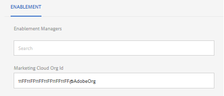

Lorsque l’analyse de pulsation vidéo est activée, le code JavaScript (JS) du lecteur vidéo instancie le code de la bibliothèque de pulsation vidéo (également en JS). Le code gère toute la logique d’envoi des mises à jour de statut vidéo aux serveurs de suivi vidéo Analytics toutes les 10 secondes (non configurable). Il envoie finalement un rapport cumulatif de la session vidéo aux principaux serveurs Analytics.

Si ce paramètre n’est pas activé, le code de pulsation vidéo n’est jamais instancié et seul le suivi de la progression vidéo et de la position de reprise est conservé dans le SRP pour la création de rapports.

## Configuration du service AEM Analytics Cloud {#aem-analytics-cloud-service-configuration}

>[!CAUTION]
>
>L’API [Adobe Analytics 1.4 a atteint sa fin de vie](https://developer.adobe.com/analytics-apis/docs/1.4/guides/eol/). Par conséquent, les configurations Adobe Analytics qui utilisent des informations d’identification d’utilisateur (nom d’utilisateur et mot de passe) ne sont plus prises en charge.

Pour créer une intégration Analytics qui intègre Adobe Analytics au site de la communauté AEM, à l’aide de l’interface utilisateur standard sur l’instance de création :

* À partir de la navigation globale : **[!UICONTROL Outils]** > **[!UICONTROL Déploiement]** > **[!UICONTROL Services cloud]**
* Faites défiler jusqu’à ****
* Sélectionnez **[!UICONTROL Configurer maintenant]** ou **[!UICONTROL Afficher les configurations]**

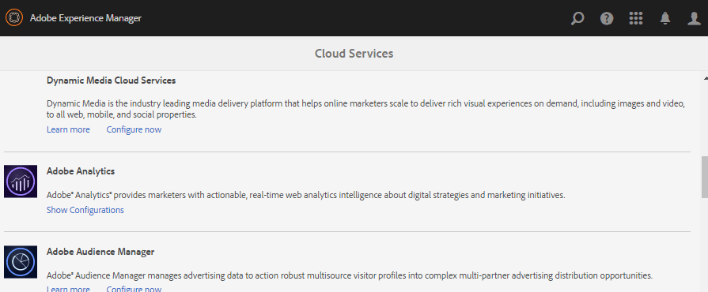

### Boîte de dialogue Créer une configuration {#create-configuration-dialog}

* Sélectionnez `[+]` icône en regard de **[!UICONTROL Configurations disponibles]** afin de pouvoir créer une configuration.

Dans la boîte de dialogue Créer une configuration , les valeurs à renseigner identifient la configuration.

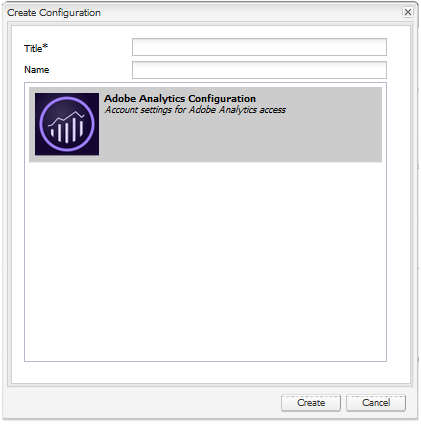

* **Titre**

  (Obligatoire) Titre affiché pour la configuration.
  Par exemple, saisissez *Analyse de la communauté*

* **Nom**

  (Facultatif) S’il n’est pas spécifié, le nom par défaut est un nom de nœud valide dérivé du titre.
  Par exemple, saisissez *communautés*

* **Modèle**

  Sélectionnez `Adobe Analytics Configuration`.

* Sélectionnez **Créer**

  * Lance la page de configuration et ouvre `Analytics Settings` boîte de dialogue

### Boîte de dialogue Paramètres Analytics {#analytics-settings-dialog}

La création initiale d’une configuration Analytics entraîne l’affichage de la configuration et une nouvelle boîte de dialogue pour la saisie des paramètres Analytics. Cette boîte de dialogue nécessite les [informations de compte préalables](#prerequisites) obtenues auprès du représentant du compte.

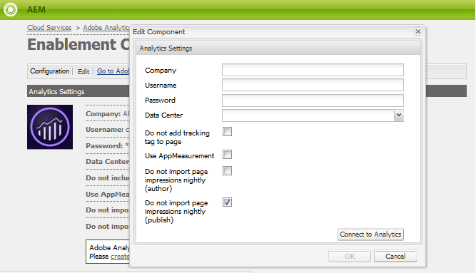

* **Société**

  Société associée au compte Adobe Analytics.

* **Nom d’utilisateur**

  Nom d’utilisateur de connexion de l’utilisateur autorisé à gérer le compte Analytics.

* **Password**

  Mot de passe de connexion de l’utilisateur autorisé.

* **Centre de données**

  Sélectionnez le centre de données Analytics qui héberge la suite de rapports.

* **Ne pas ajouter de balise de tracking à la page**

  Conserver comme valeur par défaut (désélectionné).

* **Utiliser AppMeasurement**

  Conserver comme valeur par défaut (désélectionné).

* **Ne pas importer les impressions de page de nuit (auteur)**

  Conserver comme valeur par défaut (désélectionné).

* **Ne pas importer les impressions de page de nuit (publication)**

  Conserver comme valeur par défaut (désélectionné).

Pour enregistrer les paramètres :

* Sélectionnez **Connexion à Analytics**

  * En cas d’échec,

    * Vérifiez que les entrées ne contiennent pas d’espaces de début.
    * Essayez un autre centre de données.

* Sélectionnez **OK**.

  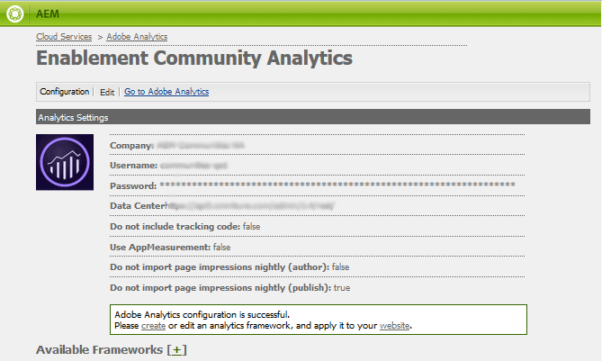

### Créer une structure {#create-framework}

Une fois la configuration de la connexion de base à Adobe Analytics terminée, il est nécessaire de créer ou de modifier un framework pour le site de la communauté. L’objectif du framework est de mapper des variables de fonctionnalité Communities (AEM) à des variables Analytics (suite de rapports).

* Sélectionnez `[+]` icône en regard de **[!UICONTROL Frameworks disponibles]** afin de pouvoir créer un framework.

  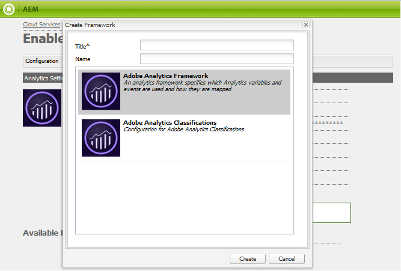

* **Titre**

  (Obligatoire) Titre affiché pour le framework
  Par exemple, saisissez *Community Framework*.

* **Nom**

  (Facultatif) S’il n’est pas spécifié, le nom par défaut est un nom de nœud valide dérivé du titre.
  Par exemple, saisissez *communautés*.

* *Modèle*

  Sélectionnez `Adobe Analytics Framework`.

* Sélectionnez **Créer**.

La création du framework Analytics ouvre le framework pour la configuration.

## Configuration de la structure AEM Analytics {#aem-analytics-framework-configuration}

L’objectif du framework est de mapper des variables AEM à des variables Analytics (eVars et événements). Les variables Analytics disponibles pour le mappage sont [définies dans la suite de rapports](#adobe-analytics-report-suite-for-video-reporting).

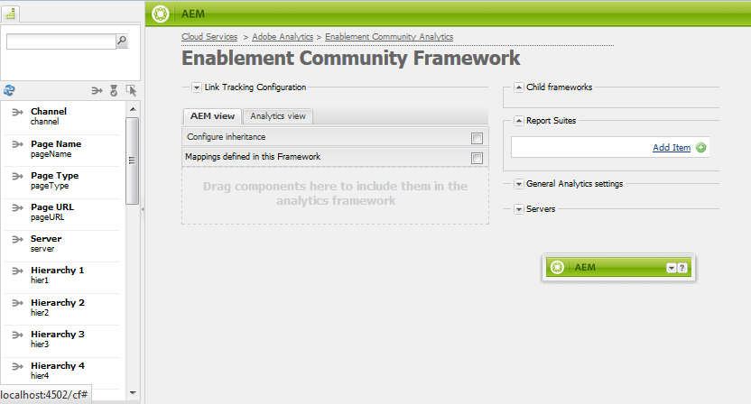

### Sélectionner une suite de rapports {#select-report-suite}

Sélectionnez la suite de rapports qui a été configurée pour les rapports vidéo.

Si une suite de rapports n’a pas encore été créée ou n’est pas correctement configurée, consultez la section précédente :
[Suite de rapports Adobe Analytics pour les rapports vidéo](#adobe-analytics-report-suite-for-video-reporting)

Le Sidekick n’est pas nécessaire et peut être réduit afin de ne pas bloquer l’accès aux paramètres des suites de rapports.

#### Boîte de dialogue Suites de rapports avant et après avoir sélectionné Ajouter un élément {#report-suites-dialog-before-and-after-selecting-add-item}

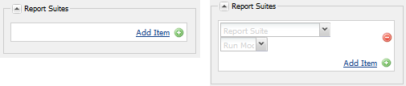

1. Sélectionnez **Ajouter un élément +**.

   Deux listes déroulantes s’affichent.

1. Choisir un `Report suite.`

   Les suites de rapports associées au compte d’entreprise peuvent être sélectionnées.

1. Sélectionnez **Oui** dans la boîte de dialogue qui s’ouvre :

   ```
   Load default server settings?
    Do you want to load the default server settings and overwrite current values in the Server section?
   ```

1. Choisissez un `Run Mode`.

1. Sélectionnez **Publier**.

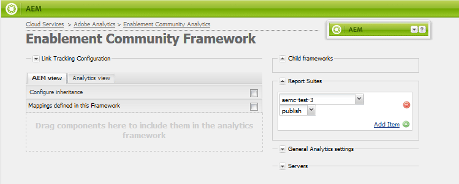

Le service et le framework Analytics Cloud sont maintenant terminés. Les mappages sont définis après la création d’un site de la communauté avec ce service Analytics activé.

## Activation d’Analytics pour un site communautaire {#enable-analytics-for-a-community-site}

### Activer pour le nouveau site de la communauté {#enable-for-new-community-site}

Pour ajouter le service Analytics Cloud lors de la [création d’un site communautaire](/help/communities/sites-console.md) :

* À l’étape 3, sous l’onglet [ANALYTICS](/help/communities/sites-console.md#analytics) :
  * Cochez la case **Activer Analytics**.
  * Sélectionnez le framework dans la liste déroulante.

* Vous pouvez éventuellement revenir à la configuration du framework Analytics pour ajuster les mappages de variables.

### Activer pour le site de la communauté existante {#enable-for-existing-community-site}

Pour ajouter le service Analytics Cloud à un [site communautaire existant](/help/communities/sites-console.md#modifying-site-properties) :

* Accédez à la console **Communities > Sites**.
* Sélectionnez l’icône Modifier le site du site de la communauté.
* Sélectionnez les PARAMÈTRES.
* Dans la section Analytics :
  * Cochez la case **Activer Analytics**.
  * Choisissez le framework dans la liste déroulante.

* Vous pouvez éventuellement revenir à la configuration du framework Analytics pour ajuster les mappages de variables.

### Activer pour les sites personnalisés {#enable-for-customized-sites}

Pour que le suivi et l’importation Analytics fonctionnent correctement pour un site communautaire, un élément de page avec la classe `scf-js-site-title` et les attributs href doit être présent. Un seul de ces éléments doit exister sur la page, comme c’est le cas dans un script `sitepage.hbs` non modifié pour un site communautaire. La valeur de `siteUrl` est extraite et envoyée à Adobe Analytics en tant que *chemin du site*.

```xml
# present in default sitepage.hbs
# only one scf-js-site-title class should be included
# this example sets it to be hidden as it serves no visual purpose
<div
    class="navbar-brand scf-js-site-title"
    href="{{siteUrl}}.html"
    style="visibility: hidden;"
>
</div>
```

Pour un **site communautaire personnalisé** qui recouvre le script `sitepage.hbs`, assurez-vous que l’élément est présent. La variable `siteUrl` est définie lors du rendu sur le serveur avant la diffusion au client.

Pour un **site AEM générique** qui inclut des composants de communautés, mais qui n’est pas créé avec l’assistant de création de site [site](/help/communities/sites-console.md), il est nécessaire d’ajouter l’élément . La valeur de href doit correspondre au chemin d’accès au site. Par exemple, si le chemin d’accès au site est `/content/my/company/en`, utilisez :

```xml
<div
    class="navbar-brand scf-js-site-title"
    href="/content/my/company/en.html"
    style="visibility: hidden;"
>
</div>
```

## Fonctionnalités d’Analytics for Communities {#analytics-for-communities-features}

Analytics est automatiquement utilisé pour plusieurs fonctionnalités de Communities.

La configuration [OSGi](/help/sites-deploying/configuring-osgi.md) de l’environnement de création, `AEM Communities Analytics Component Configuration`, fournit une liste des composants qui ont été instrumentés pour Analytics. Le mappage automatique des variables est déterminé par les composants répertoriés.

Si de nouveaux composants personnalisés sont créés et instrumentés pour Analytics, ils doivent être ajoutés à cette liste de composants configurés.

### Configuration du composant {#component-configuration}


>[!NOTE]
>
>Les composants de journal sont utilisés pour implémenter la fonctionnalité de blog.

### Variables Analytics mappées à AEM {#mapped-analytics-to-aem-variables}

Une fois le site de la communauté enregistré, avec Analytics activé et le framework de configuration cloud sélectionné, les variables AEM sont automatiquement mappées aux eVars et événements Analytics. Elle commence par evar1 et event1, respectivement, et est incrémentée de 1.

Si vous utilisez une suite de rapports existante qui a mappé l’une des variables dans evar1 à evar11 et event1 à event7, il devient nécessaire de [remapper les variables AEM](#modifying-analytics-variable-mapping) et de restaurer le mappage d’origine.

Voici un exemple de mappages par défaut :

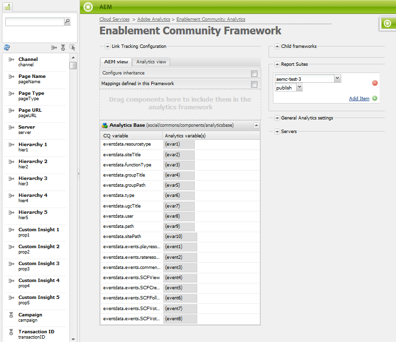

#### Mappage des eVars envoyées avec chaque événement {#map-of-evars-sent-with-each-event}

<table>
 <tbody>
  <tr>
   <td><strong> </strong></td>
   <td><strong>Activation<br /> ressource<br /> type</strong></td>
   <td><strong>Site <br /> Titre</strong></td>
   <td><strong>Fonction <br /> type</strong></td>
   <td><strong>Groupe <br /> titre</strong></td>
   <td><strong>Groupe <br /> Chemin</strong></td>
   <td><strong>Type UGC<br /></strong></td>
   <td><strong>UGC<br /> Titre</strong></td>
   <td><strong>Utilisateur <br /> (membre)</strong></td>
   <td><strong>UGC<br /> Chemin</strong></td>
   <td><strong>Site <br /> chemin</strong></td>
  </tr>
  <tr>
   <td><strong> </strong></td>
   <td><strong>eVar1</strong></td>
   <td><strong>eVar2</strong></td>
   <td><strong>eVar3</strong></td>
   <td><strong>EVAR4</strong></td>
   <td><strong>EVAR5</strong></td>
   <td><strong>EVAR6</strong></td>
   <td><strong>EVAR7</strong></td>
   <td><strong>EVAR8</strong></td>
   <td><strong>EVAR9</strong></td>
   <td><strong>eVar10</strong></td>
  </tr>
  <tr>
   <td><strong>event1 <br /> lecture des ressources</strong></td>
   <td><em>(a)</em></td>
   <td><em>-</em></td>
   <td><em>-</em></td>
   <td><em>-</em></td>
   <td><em>-</em></td>
   <td><em>-</em></td>
   <td><em>-</em></td>
   <td><em>-</em></td>
   <td><em>(i)</em></td>
   <td><em>-</em></td>
  </tr>
  <tr>
   <td><strong>event2<br /> SCFView</strong></td>
   <td><em>(a)</em></td>
   <td><em>(b)</em></td>
   <td><em>(c)</em></td>
   <td><em>(d)</em></td>
   <td><em>(e)</em></td>
   <td><em>(f)</em></td>
   <td><em>(g)</em></td>
   <td><em>(h)</em></td>
   <td><em>(i)</em></td>
   <td><em>(j)</em></td>
  </tr>
  <tr>
   <td><strong>event3<br /> SCFCreate (Post)</strong></td>
   <td><em>-</em></td>
   <td><em>(b)</em></td>
   <td><em>(c)</em></td>
   <td><em>(d)</em></td>
   <td><em>(e)</em></td>
   <td><em>(f)</em></td>
   <td><em>(g)</em></td>
   <td><em>(h)</em></td>
   <td><em>(i)</em></td>
   <td><em>(j)</em></td>
  </tr>
  <tr>
   <td><strong>event4<br /> SCFFollow</strong></td>
   <td><em>-</em></td>
   <td><em>(b)</em></td>
   <td><em>(c)</em></td>
   <td><em>(d)</em></td>
   <td><em>(e)</em></td>
   <td><em>(f)</em></td>
   <td><em>(g)</em></td>
   <td><em>(h)</em></td>
   <td><em>(i)</em></td>
   <td><em>(j)</em></td>
  </tr>
  <tr>
   <td><strong>event5<br /> SCFVoteUp</strong></td>
   <td><em>-</em></td>
   <td><em>(b)</em></td>
   <td><em>(c)</em></td>
   <td><em>(d)</em></td>
   <td><em>(e)</em></td>
   <td><em>(f)</em></td>
   <td><em>(g)</em></td>
   <td><em>(h)</em></td>
   <td><em>(i)</em></td>
   <td><em>(j)</em></td>
  </tr>
  <tr>
   <td><strong>event6 <br /> SCFVoteDown</strong></td>
   <td><em>-</em></td>
   <td><em>(b)</em></td>
   <td><em>(c)</em></td>
   <td><em>(d)</em></td>
   <td><em>(e)</em></td>
   <td><em>(f)</em></td>
   <td><em>(g)</em></td>
   <td><em>(h)</em></td>
   <td><em>(i)</em></td>
   <td><em>(j)</em></td>
  </tr>
  <tr>
   <td><strong>event7 <br /> SCFRate</strong></td>
   <td><em>-</em></td>
   <td><em>(b)</em></td>
   <td><em>(c)</em></td>
   <td><em>(d)</em></td>
   <td><em>(e)</em></td>
   <td><em>(f)</em></td>
   <td><em>(g)</em></td>
   <td><em>(h)</em></td>
   <td><em>(i)</em></td>
   <td><em>(j)</em></td>
  </tr>
 </tbody>
</table>

**Exemples pour les valeurs eVar :**

* *[Type MIME](https://www.iana.org/assignments/media-types/media-types.xhtml)* : video/mp4
* *[titre du site de la communauté](/help/communities/sites-console.md#step13asitetemplate)* : Geometrixx Communities
* *[nom de la fonction communautaire](/help/communities/functions.md)* : Forum
* *[nom du groupe communautaire](/help/communities/creating-groups.md#creating-a-new-group)* : Randonnée
* *chemin d’accès au contenu du groupe communautaire* : `/content/sites/<site name>/en/groups/hiking`
* *[UGC component resourceType](/help/communities/essentials.md)* : `social/forum/components/hbs/topic`
* *Titre du composant UGC* : Rubriques de randonnée
* *login (authorizableId)* : `aaron.mcdonald@mailinator.com`
* *Chemin SRP vers UGC* : `/content/usergenerated/asi/.../forum/jmtz-topic3`
ou *chemin du composant à suivre* : `/content/sites/<site name>/en/jcr:content/content/primary/forum`

* *chemin d’accès au contenu du site de la communauté* : `/content/sites/<site name>/en`

### Modification du mappage des variables Analytics {#modifying-analytics-variable-mapping}

Le mappage des eVars et des événements Analytics aux variables AEM est visible à partir de la configuration du framework une fois qu’Analytics est activé pour un site communautaire.

Une fois Analytics activé et avant la publication du site de la communauté, le mappage peut être modifié dans le framework. Faites simplement glisser l’evar ou l’événement Analytics de votre choix depuis le rail de gauche et déposez-le dans la ligne appropriée du tableau de mappage.

Pour éviter les mappages en double, veillez à supprimer l’evar ou l’événement Analytics remplacé de la ligne en le survolant et en sélectionnant le « X » qui s’affiche à droite de l’élément de variable Analytics.

Si les eVars et les événements de Communities remplacent les mappages qui existaient auparavant dans la suite de rapports, pour éviter la perte de données, affectez les variables AEM pour les fonctionnalités de Communities à d’autres eVars ou événements d’Analytics et restaurez les mappages d’origine.

>[!CAUTION]
>
>Il est important de remapper le site communautaire avant sa [publication](#publishing-the-community-site) avec Analytics activé, sinon il y a un risque de perte de données.

#### Exemple d’étape 1 : glisser Analytics evar14 dans le tableau de mappage {#example-step-dragging-analytics-evar-into-mapping-table}

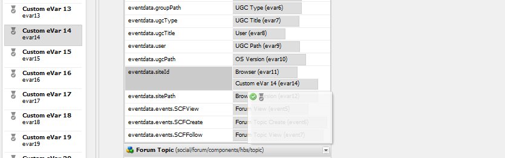

#### Exemple d’étape 2 : sélection de « x » pour supprimer l’evar11 remplacée {#example-step-selecting-x-to-remove-replaced-evar}

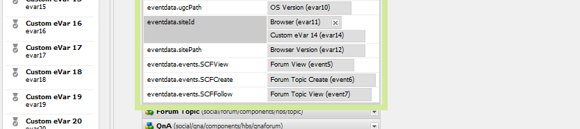

#### Exemple d’étape 3 : AEM var eventdata.siteId remappé sur Analytics evar14 {#example-step-aem-var-eventdata-siteid-remapped-to-analytics-evar}

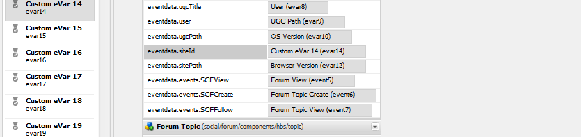

## Publication du site de la communauté {#publishing-the-community-site}

### Vérification du mappage d’Analytics aux variables AEM {#verify-analytics-to-aem-variable-mapping}

Il est préférable de vérifier le mappage des variables avant de publier le site de la communauté, qui publie également le service et le framework Analytics Cloud.

Voir les sections :

* [Variables Analytics mappées à AEM](#mapped-analytics-to-aem-variables)
* [Modification du mappage des variables Analytics](#modifying-analytics-variable-mapping)

>[!CAUTION]
>
>**Si vous utilisez une suite de rapports existante qui utilise déjà des variables dans**
>
>* **`evar1`** à **`evar11`**
>
>* **`event1`** à **`event7`**
>
>**Ensuite, avant la publication du site de la communauté** restaurez le mappage préexistant. Déplacez les variables AEM de Communities qui ont été automatiquement mappées (lorsqu’Analytics a été activé pour le site de la communauté) à d’autres variables Analytics. Ce remappage doit être cohérent sur tous les composants de Communities.
>
>Si vous ne le faites pas, vous risquez de perdre des données irrécupérables.

### Principal Publisher {#primary-publisher}

Lorsque le déploiement choisi est une [ferme de publication](/help/communities/topologies.md#tarmk-publish-farm), une instance de publication AEM doit être identifiée comme éditeur principal pour interroger Adobe Analytics afin que les données du rapport soient écrites dans [SRP](/help/communities/working-with-srp.md).

Par défaut, la configuration OSGi `AEM Communities Publisher Configuration` identifie son instance de publication comme l’éditeur principal, de sorte que toutes les instances de publication d’une ferme de publication s’identifient comme l’instance principale.

Par conséquent, il est nécessaire de modifier la configuration sur toutes les instances de publication secondaires pour désélectionner la case **Éditeur de Principal**.

Pour obtenir des instructions spécifiques, consultez la section sur l’éditeur principal dans [Déploiement de communautés](/help/communities/deploy-communities.md#primary-publisher).

>[!CAUTION]
>
>Il est important que l’éditeur principal soit configuré pour empêcher l’interrogation de plusieurs instances de publication.

### Répliquer la clé de chiffrement {#replicate-the-crypto-key}

Les informations d’identification Adobe Analytics sont chiffrées. Pour faciliter la réplication ou la transmission des informations d’identification d’analyse chiffrées entre l’instance de création et l’instance de publication, toutes les instances AEM doivent partager la même clé de chiffrement principale.

Pour ce faire, suivez les instructions de la section [ Répliquer la clé de chiffrement ](/help/communities/deploy-communities.md#replicate-the-crypto-key).

### Site de la communauté de publication et service Analytics Cloud {#publish-community-site-and-analytics-cloud-service}

Une fois que le service Analytics Cloud est activé pour un site communautaire et que, si nécessaire, le [mappage d’Analytics aux variables AEM est ajusté](#mapped-analytics-to-aem-variables), répliquez la configuration dans l’environnement de publication en [(re)publiant le site communautaire](/help/communities/sites-console.md#publishing-the-site).

## Obtention de rapports à partir d’Analytics {#obtaining-reports-from-analytics}

### Gestion des rapports {#report-management}

La configuration [OSGi](/help/sites-deploying/configuring-osgi.md) de l’auteur et de l’éditeur principal, `AEM Communities Analytics Report Management`, est utilisée pour interroger Analytics.

En mode de création, les requêtes concernent les rapports en temps réel.

Sur l’éditeur principal, les requêtes sont utilisées pour fournir des informations en vue de l’importation des données Analytics de l’importateur de rapports.

L’intervalle de requête est de 10 secondes par défaut.

### Importateur de rapports {#report-importer}

Une fois qu’un site de la communauté activé pour Analytics a été publié, la [configuration OSGi](/help/sites-deploying/configuring-osgi.md) de l’éditeur principal, `AEM Communities Analytics Report Importer`, peut être configurée pour définir l’intervalle d’interrogation par défaut pour les configurations qui ne sont pas configurées individuellement dans CRXDE.

L’intervalle d’interrogation contrôle la fréquence des requêtes à Adobe Analytics pour que les données soient extraites et enregistrées dans [SRP](/help/communities/working-with-srp.md).

Lorsque les données peuvent être classées comme « données volumineuses », des sondages plus fréquents peuvent placer une charge importante sur le site de la communauté.

L’interrogation par défaut **Intervalle d’importation** est définie sur 12 heures.


### Personnalisation des rapports de composants {#component-report-customization}

Actuellement, pour personnaliser les mesures à suivre, des nœuds sont créés dans le référentiel pour définir les périodes pendant lesquelles générer un rapport sur cette mesure.

Le sujet du forum est actuellement le seul exemple de cette personnalisation :

* Sur l’éditeur principal, connectez-vous avec les droits d’administrateur.
* Accédez à [CRXDE Lite](/help/sites-developing/developing-with-crxde-lite.md). Par exemple, [](https://localhost:4503/crx/de).

* Sous le nœud `jcr:content` de la racine de langue (par exemple, `/content/sites/engage/en/jcr:content`), accédez au composant configuré pour les rapports Analytics.
Par exemple, **`analytics/reportConfigs/social_forum_components_hbs_topic`**.

* Notez les périodes créées :

  * `last30Days`
  * `last90Days`
  * `thisYear`

* Remarquez le nœud `total`.

  * La modification de la propriété **`interval`** remplace l’intervalle de l’importateur de rapports.
  * La valeur est exprimée en secondes et est définie sur quatre heures (14400 secondes).

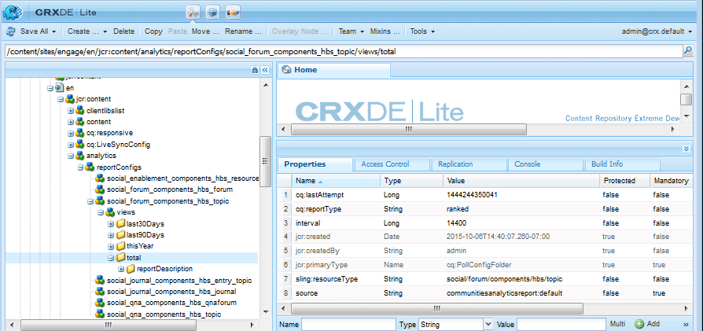

## Gestion des données utilisateur dans Analytics {#manage-user-data-in-analytics}

Adobe Analytics fournit des API qui vous permettent d’accéder aux données utilisateur, de les exporter et de les supprimer. Pour plus d’informations, voir [Soumettre des demandes d’accès et de suppression](https://experienceleague.adobe.com/docs/analytics/admin/admin-tools/data-governance/an-gdpr-workflow.html?lang=fr).

## Ressources {#resources}

* Adobe Experience Cloud : [Aide et référence d’Analytics](https://experienceleague.adobe.com/docs/analytics.html)
* AEM : [Intégration à Adobe Analytics](/help/sites-administering/adobeanalytics.md)
* AEM : [ Analytics avec des fournisseurs externes ](/help/sites-administering/external-providers.md)
