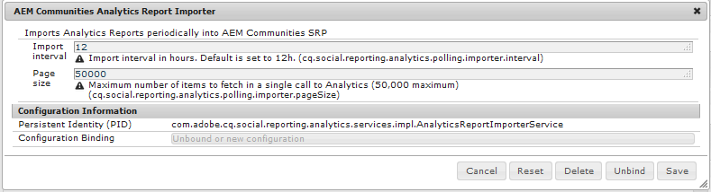

# Configuration d’Analytics pour les fonctionnalités des communautés {#analytics-configuration-for-communities-features}

## Présentation {#overview}

Adobe Analytics et Adobe Experience Manager (AEM) sont les deux solutions de Adobe Marketing Cloud.

Adobe Analytics peut être configuré pour AEM Communities afin que, lorsqu’un membre interagit avec les fonctionnalités de communauté prises en charge, des événements soient envoyés à Adobe Analytics à partir duquel des rapports sont générés.

Par exemple, sur le site de la communauté, les administrateurs peuvent consulter divers rapports concernant la lecture de la vidéo.

En outre, les analyses sont nécessaires pour :

* Dans l’environnement de publication :

   * Reporting sur la communauté [tendances](/help/communities/trends.md)
   * Permet aux visiteurs du site de trier par &quot;le plus consulté&quot;, &quot;le plus principal&quot;, &quot;le plus apprécié&quot;
   * Affichage du nombre de listes UGC

* Dans l’environnement de création :

   * Affichage des données de participation dans la variable [console de gestion des membres](/help/communities/members.md) (vues, publications, mentions &quot;J’aime&quot;)
   * Synthèse des tendances, pulsation vidéo et périphérique vidéo pour la ressource d’activation [rapports](/help/communities/reports.md)

Fonctionnalités de communautés prises en charge :

* [Forum](/help/communities/forum.md)
* [Q&amp;R](/help/communities/working-with-qna.md)
* [Blog](/help/communities/blog-feature.md)
* [Bibliothèque de fichiers](/help/communities/file-library.md)
* [Calendrier](/help/communities/calendar.md)

Cette section de la documentation décrit comment connecter une suite de rapports Analytics aux fonctionnalités de Communities. Les étapes de base sont les suivantes :

1. [Réplication de la clé de cryptage](#replicate-the-crypto-key) pour s’assurer que le cryptage/décryptage se produit correctement sur toutes les instances AEM
1. Préparation d’une Adobe Analytics [suite de rapports](#adobe-analytics-report-suite-for-video-reporting)
1. Création d’une AEM Analytics [service cloud](#aem-analytics-cloud-service-configuration) et [framework](#aem-analytics-framework-configuration)

1. [Activation d’Analytics](#enable-analytics-for-a-community-site) pour un site communautaire
1. [**Vérifier**](#verify-analytics-to-aem-variable-mapping) Mappage Analytics vers AEM variable
1. Identifier [Éditeur Principal](#primary-publisher)
1. [Publier](#publish-community-site-and-analytics-cloud-service) site de la communauté
1. Configurer [import de données de rapport](#obtaining-reports-from-analytics) d’Adobe Analytics au site de la communauté

## Prérequis {#prerequisites}

Pour configurer les fonctionnalités d’Analytics for Communities, il est nécessaire de travailler avec le représentant de votre compte pour configurer un compte Adobe Analytics et [suite de rapports](#adobe-analytics-report-suite-for-video-reporting). Une fois établies, les informations suivantes doivent être disponibles :

* **Nom de l’entreprise**

   Société associée au compte Adobe Analytics.

* **Nom d’utilisateur**

   Nom d’utilisateur de connexion de l’utilisateur autorisé à gérer le compte Analytics (doit inclure les privilèges d’accès au service Web).

* **Password**

   Mot de passe de connexion de l’utilisateur autorisé.

* **Centre de données Analytics**

   URL du centre de données Analytics pour le compte.

* **Suite de rapports**

   Nom de la suite de rapports Analytics à utiliser.

## Suite de rapports Adobe Analytics pour les rapports vidéo {#adobe-analytics-report-suite-for-video-reporting}

Utilisation des [Gestionnaire de suites de rapports](https://experienceleague.adobe.com/docs/analytics/admin/manage-report-suites/new-report-suite/new-report-suite.html), les suites de rapports Analytics peuvent être configurées de sorte qu’un site de communauté puisse être activé afin de fournir des rapports pour les fonctionnalités de communauté.

En vous connectant à [Adobe Experience Cloud](https://experienceleague.adobe.com/docs/analytics/analyze/analysis-workspace/home.html) avec [Nom de la société et nom d’utilisateur](/help/communities/analytics.md#prerequisites), il est possible de configurer une nouvelle suite de rapports ou une suite de rapports existante pour que :

* [11 variables de conversion](https://experienceleague.adobe.com/docs/analytics/admin/admin-tools/conversion-variables/conversion-var-admin.html) (eVars)

   * **`evar1`** through **`evar11`** enabled

   * Peut réutiliser (renommer) des eVars existantes ou en créer de nouvelles à utiliser pour les fonctionnalités de communauté

* [7 Événements de succès](https://experienceleague.adobe.com/docs/analytics/admin/admin-tools/success-events/success-event.html) (events)

   * **`event1`** through **`event7`** enabled

   * type **`Counter`**

      * sauf **`Counter (no subrelations)`**
   * Peut réutiliser (renommer) des événements existants ou en créer de nouveaux à utiliser pour les fonctionnalités de communauté


* [Gestion des vidéos](https://experienceleague.adobe.com/docs/media-analytics/using/media-overview.html?lang=fr)

   * Console Rapports vidéo

      * Activer `Video Core`
      * Sélectionnez Enregistrer
   * Console de mesures coeur de la vidéo

      * Sélectionner `Use Solution Variables`
      * Sélectionnez Enregistrer


Si vous utilisez un **nouvelle suite de rapports**, sachez qu’une nouvelle suite de rapports ne peut comporter que 4 eVars et 6 variables d’événement, tandis que 11 eVar et 7 variables d’événement sont requises pour Communities.

Si vous utilisez un **suite de rapports existante**, il peut être nécessaire de [modification du mapping des variables](#modifying-analytics-variable-mapping) avant d’activer la structure Analytics pour un site de communauté.

Contactez le représentant de votre compte pour toute question concernant les variables dédiées aux communautés.

>[!CAUTION]
>
>**Si vous utilisez une suite de rapports existante qui utilise déjà des variables dans**
>
>* **`evar1`** à **`evar11`**
>
>* **`event1`** à **`event7`**
>
>**Avant que le site de la communauté ne soit publié,** il est important de restaurer le mappage préexistant en déplaçant les variables AEM automatiquement mappées aux variables Analytics lorsque Analytics a été activé pour un site de communauté.
>
>Pour restaurer le mappage préexistant et déplacer AEM variables vers d’autres variables Analytics, reportez-vous à la section sur [Modification du mappage des variables Analytics](#modifying-analytics-variable-mapping).
>
>Si vous ne le faites pas, il se peut qu’il y ait une perte de données irrécupérable.

### Video Heartbeat Analytics {#video-heartbeat-analytics}

Lorsque Video Heartbeat Analytics est sous licence, une `Marketing Cloud Org Id` est affectée.

Pour activer la création de rapports Video Heartbeat après [configuration de la suite de rapports Analytics pour la création de rapports vidéo](#adobe-analytics-report-suite-for-video-reporting):

* Créez un [Service cloud Analytics](#aem-analytics-cloud-service-configuration)
* Activer [Analytics pour un site communautaire](#enable-analytics-for-a-community-site)
* Associez la variable `Marketing Cloud Org Id` avec le site de la communauté

Le `Marketing Cloud Org Id` peut être saisie au moment de la [création de site communautaire](/help/communities/sites-console.md) ou plus tard [modification](/help/communities/sites-console.md#modifying-site-properties) les propriétés du site de la communauté.


Lorsque Video Heartbeat Analytics est activé, le code JavaScript (JS) du lecteur vidéo instancie le code de bibliothèque Video Heartbeat (également dans JS) qui gère toute la logique d’envoi de mises à jour d’état vidéo aux serveurs de suivi vidéo Analytics toutes les 10 secondes (non configurables) et éventuellement d’envoi d’un rapport cumulatif de la session vidéo aux serveurs Analytics principaux.

Si cette option n’est pas activée, le code de pulsation vidéo n’est jamais instancié et seul le suivi de progression et de reprise de la vidéo est conservé à la SRP pour la création de rapports.

## Configuration du service Analytics Cloud AEM {#aem-analytics-cloud-service-configuration}

Pour créer une intégration Analytics, qui intègre Adobe Analytics au site de la communauté AEM, à l’aide de l’interface utilisateur standard sur l’instance de création :

* À partir de la navigation globale : **[!UICONTROL Outils]** > **[!UICONTROL Déploiement]** > **[!UICONTROL Cloud Services]**
* Faites défiler la page vers le bas jusqu’à **[!UICONTROL Adobe Analytics]**
* Sélectionner **[!UICONTROL Configurer maintenant]** ou **[!UICONTROL Afficher les configurations]**


### Boîte de dialogue Créer une configuration {#create-configuration-dialog}

* Sélectionner `[+]` en regard de **[!UICONTROL Configurations disponibles]** pour créer une configuration

Dans la boîte de dialogue Créer une configuration , les valeurs à renseigner identifient la configuration.


* **Titre**

   (Obligatoire) Titre affiché de la configuration.
Par exemple, saisissez *Analyse de la communauté*

* **Nom**

   (Facultatif) S’il n’est pas spécifié, le nom est défini par défaut sur un nom de noeud valide dérivé du titre.
Par exemple, saisissez *communities*

* **Modèle**

   Sélectionner `Adobe Analytics Configuration`

* Sélectionnez **Créer**

   * Lance la page de configuration et s’ouvre. `Analytics Settings` dialog

### Boîte de dialogue de paramètres Analytics {#analytics-settings-dialog}

La création initiale d’une nouvelle configuration Analytics entraîne l’affichage de la configuration et une nouvelle boîte de dialogue pour l’entrée des paramètres Analytics. Cette boîte de dialogue nécessite [informations du compte prérequis](#prerequisites) obtenu auprès du représentant du compte.


* **Entreprise**

   Société associée au compte Adobe Analytics.

* **Nom d’utilisateur**

   Nom d’utilisateur de connexion de l’utilisateur autorisé à gérer le compte Analytics.

* **Password**

   Mot de passe de connexion de l’utilisateur autorisé.

* **Centre de données**

   Sélectionnez le centre de données Analytics hébergeant la suite de rapports.

* **Ne pas ajouter la balise de suivi sur la page**

   Laissez le paramètre par défaut (désélectionné).

* **Utiliser AppMeasurement**

   Laissez le paramètre par défaut (désélectionné).

* **Ne pas importer des impressions de page de nuit (auteur)**

   Laissez le paramètre par défaut (désélectionné).

* **Ne pas importer des impressions de page de nuit (publication)**

   Laissez le paramètre par défaut (désélectionné).

Pour enregistrer les paramètres :

* Sélectionner **Connexion à Analytics**

   * En cas d’échec,

      * Vérifiez que les entrées ne contiennent pas d’espaces de début.
      * Essayez un autre centre de données.

* Sélectionnez **OK**.

   

### Créer une structure {#create-framework}

Après une configuration réussie de la connexion de base à Adobe Analytics, il est nécessaire de créer ou de modifier une structure pour le site de la communauté. L’objectif de la structure est de mapper les variables de fonctionnalités (AEM) de communautés aux variables Analytics (suite de rapports).

* Sélectionner `[+]` en regard de **[!UICONTROL Structures disponibles]** pour créer une structure

   

* **Titre**

   (Obligatoire) Titre affiché de la structure. Par exemple, saisissez *Cadre communautaire*.

* **Nom**

   (Facultatif) S’il n’est pas spécifié, le nom est défini par défaut sur un nom de noeud valide dérivé du titre.
Par exemple, saisissez *communities*.

* *Modèle*

   Sélectionner `Adobe Analytics Framework`.

* Sélectionnez **Créer**.

La création de la structure Analytics ouvre la structure pour la configuration.

## Configuration de la structure d’AEM Analytics {#aem-analytics-framework-configuration}

L’objectif de la structure est de mapper AEM variables aux variables Analytics (eVars et événements). Les variables Analytics disponibles pour le mappage sont les suivantes : [défini dans la suite de rapports](#adobe-analytics-report-suite-for-video-reporting).


### Sélectionner une suite de rapports {#select-report-suite}

Sélectionnez la suite de rapports qui a été configurée pour la création de rapports vidéo.

Si une suite de rapports n’a pas encore été créée ou n’a pas été correctement configurée, reportez-vous à la section précédente :
[Suite de rapports Adobe Analytics pour les rapports vidéo](#adobe-analytics-report-suite-for-video-reporting)

Le sidekick n’est pas nécessaire et peut être réduit afin de ne pas entraver l’accès aux paramètres des suites de rapports.

#### Boîte de dialogue Suites de rapports avant et après la sélection de l’option &quot;Ajouter un élément&quot; {#report-suites-dialog-before-and-after-selecting-add-item}


1. Sélectionner **Ajouter un élément +**.

   Deux listes déroulantes s’affichent.

1. Choisissez une `Report suite.`

   Les suites de rapports associées au compte d’entreprise peuvent être sélectionnées.

1. Sélectionner **Oui** dans la boîte de dialogue qui s’ouvre :

   ```
   Load default server settings?
    Do you want to load the default server settings and overwrite current values in the Server section?
   ```

1. Choisissez une `Run Mode`.

1. Sélectionner **Publier**.


Le service et la structure cloud Analytics sont désormais terminés. Les mappages seront définis une fois qu’un site de communauté a été créé avec ce service Analytics activé.

## Activation d’Analytics pour un site de la communauté {#enable-analytics-for-a-community-site}

### Activation pour le nouveau site de la communauté {#enable-for-new-community-site}

Ajout du service cloud Analytics lors de la [création d’un site communautaire](/help/communities/sites-console.md):

* À l’étape 3, sous [Onglet ANALYTICS](/help/communities/sites-console.md#analytics):
   * Sélectionnez la **Activation d’Analytics** .
   * Sélectionnez la structure dans la liste déroulante.

* Si vous le souhaitez, revenez à la configuration de la structure Analytics pour ajuster les mappages des variables.

### Activer pour le site de la communauté existant {#enable-for-existing-community-site}

Pour ajouter le service cloud Analytics à une [site de communauté existant](/help/communities/sites-console.md#modifying-site-properties):

* Accédez au **Communautés > Sites** console.
* Sélectionnez l’icône Modifier le site du site de la communauté.
* Sélectionnez LES PARAMÈTRES.
* Dans la section Analytics :
   * Sélectionnez la **Activation d’Analytics** .
   * Sélectionnez la structure dans la liste déroulante.

* Si vous le souhaitez, revenez à la configuration de la structure Analytics pour ajuster les mappages des variables.

### Activation pour les sites personnalisés {#enable-for-customized-sites}

Pour que le suivi et l’importation Analytics fonctionnent correctement pour un site de communauté, un élément de page avec la variable `scf-js-site-title` Les attributs class et href doivent être présents. Un seul élément de ce type doit exister sur la page, comme c’est le cas dans un élément non modifié. `sitepage.hbs` script pour un site communautaire. La valeur de `siteUrl` est extrait et envoyé à Adobe Analytics en tant que *chemin du site*.

```xml
# present in default sitepage.hbs
# only one scf-js-site-title class should be included
# this example sets it to be hidden as it serves no visual purpose
<div
    class="navbar-brand scf-js-site-title"
    href="{{siteUrl}}.html"
    style="visibility: hidden;"
>
</div>
```

Pour un **site de communauté personnalisé** qui incruste l’objet `sitepage.hbs` , assurez-vous que l’élément est présent. Le `siteUrl` est définie lorsqu’elle est générée sur le serveur avant d’être diffusée sur le client.

Pour un **site d&#39;AEM générique** qui inclut des composants Communities, mais qui n’est pas créé avec la variable [assistant de création de site](/help/communities/sites-console.md), il est nécessaire d’ajouter l’élément . La valeur de href doit être le chemin d’accès au site. Par exemple, si le chemin du site est `/content/my/company/en`, puis utilisez :

```xml
<div
    class="navbar-brand scf-js-site-title"
    href="/content/my/company/en.html"
    style="visibility: hidden;"
>
</div>
```

## Fonctionnalités d’Analytics for Communities {#analytics-for-communities-features}

Analytics est automatiquement utilisé pour plusieurs fonctions de communauté.

L’environnement de création [Configuration OSGi](/help/sites-deploying/configuring-osgi.md), `AEM Communities Analytics Component Configuration`, fournit une liste des composants créés pour Analytics. Le mappage automatique des variables est déterminé par les composants répertoriés.

Si de nouveaux composants personnalisés créés sont créés et créés pour Analytics, ils doivent être ajoutés à cette liste de composants configurés.

### Configuration des composants {#component-configuration}


>[!NOTE]
>
>Les composants de journal sont utilisés pour mettre en oeuvre la fonction de blog.

### Analytics mappé sur AEM variables {#mapped-analytics-to-aem-variables}

Une fois le site de la communauté enregistré avec Analytics activé et la structure de configuration cloud sélectionnée, les variables AEM sont automatiquement mises en correspondance avec les eVars et les événements Analytics, en commençant par evar1 et event1, respectivement, et en étant incrémentées de 1.

Si vous utilisez une suite de rapports existante qui a mappé l’une des variables d’evar1 à evar11 et event1 à event7, il sera nécessaire de [suppression des variables AEM](#modifying-analytics-variable-mapping) et restaurer le mappage d’origine.

Voici un exemple de mappages par défaut :


#### Carte des eVars envoyées avec chaque événement {#map-of-evars-sent-with-each-event}

<table>
 <tbody>
  <tr>
   <td><strong> </strong></td>
   <td><strong>Activation<br /> Ressource<br /> Type</strong></td>
   <td><strong>Site<br /> Titre</strong></td>
   <td><strong>Fonction<br /> Type</strong></td>
   <td><strong>Groupe<br /> Titre</strong></td>
   <td><strong>Groupe<br /> Chemin</strong></td>
   <td><strong>UGC<br /> Type</strong></td>
   <td><strong>UGC<br /> Titre</strong></td>
   <td><strong>Utilisateur<br /> (Membre)</strong></td>
   <td><strong>UGC<br /> Chemin</strong></td>
   <td><strong>Site<br /> Chemin</strong></td>
  </tr>
  <tr>
   <td><strong> </strong></td>
   <td><strong>eVar1</strong></td>
   <td><strong>eVar2</strong></td>
   <td><strong>eVar3</strong></td>
   <td><strong>eVar4</strong></td>
   <td><strong>eVar5</strong></td>
   <td><strong>eVar6</strong></td>
   <td><strong>eVar7</strong></td>
   <td><strong>eVar8</strong></td>
   <td><strong>eVar9</strong></td>
   <td><strong>eVar10</strong></td>
  </tr>
  <tr>
   <td><strong>event1<br /> Lecture de ressource</strong></td>
   <td><em>(a)</em></td>
   <td><em>-</em></td>
   <td><em>-</em></td>
   <td><em>-</em></td>
   <td><em>-</em></td>
   <td><em>-</em></td>
   <td><em>-</em></td>
   <td><em>-</em></td>
   <td><em>(i)</em></td>
   <td><em>-</em></td>
  </tr>
  <tr>
   <td><strong>event2<br /> SCFView</strong></td>
   <td><em>(a)</em></td>
   <td><em>(b)</em></td>
   <td><em>(c)</em></td>
   <td><em>(d)</em></td>
   <td><em>(e)</em></td>
   <td><em>(f)</em></td>
   <td><em>(g)</em></td>
   <td><em>(h)</em></td>
   <td><em>(i)</em></td>
   <td><em>(j)</em></td>
  </tr>
  <tr>
   <td><strong>event3<br /> SCFCreate (Post)</strong></td>
   <td><em>-</em></td>
   <td><em>(b)</em></td>
   <td><em>(c)</em></td>
   <td><em>(d)</em></td>
   <td><em>(e)</em></td>
   <td><em>(f)</em></td>
   <td><em>(g)</em></td>
   <td><em>(h)</em></td>
   <td><em>(i)</em></td>
   <td><em>(j)</em></td>
  </tr>
  <tr>
   <td><strong>event4<br /> SCFFollow</strong></td>
   <td><em>-</em></td>
   <td><em>(b)</em></td>
   <td><em>(c)</em></td>
   <td><em>(d)</em></td>
   <td><em>(e)</em></td>
   <td><em>(f)</em></td>
   <td><em>(g)</em></td>
   <td><em>(h)</em></td>
   <td><em>(i)</em></td>
   <td><em>(j)</em></td>
  </tr>
  <tr>
   <td><strong>event5<br /> SCFVoteUp</strong></td>
   <td><em>-</em></td>
   <td><em>(b)</em></td>
   <td><em>(c)</em></td>
   <td><em>(d)</em></td>
   <td><em>(e)</em></td>
   <td><em>(f)</em></td>
   <td><em>(g)</em></td>
   <td><em>(h)</em></td>
   <td><em>(i)</em></td>
   <td><em>(j)</em></td>
  </tr>
  <tr>
   <td><strong>event6<br /> SCFVoteDown</strong></td>
   <td><em>-</em></td>
   <td><em>(b)</em></td>
   <td><em>(c)</em></td>
   <td><em>(d)</em></td>
   <td><em>(e)</em></td>
   <td><em>(f)</em></td>
   <td><em>(g)</em></td>
   <td><em>(h)</em></td>
   <td><em>(i)</em></td>
   <td><em>(j)</em></td>
  </tr>
  <tr>
   <td><strong>event7<br /> SCFRate</strong></td>
   <td><em>-</em></td>
   <td><em>(b)</em></td>
   <td><em>(c)</em></td>
   <td><em>(d)</em></td>
   <td><em>(e)</em></td>
   <td><em>(f)</em></td>
   <td><em>(g)</em></td>
   <td><em>(h)</em></td>
   <td><em>(i)</em></td>
   <td><em>(j)</em></td>
  </tr>
 </tbody>
</table>

**Exemples de valeurs d’eVar :**

* *[Type MIME](https://www.iana.org/assignments/media-types)*: video/mp4
* *[titre du site de la communauté](/help/communities/sites-console.md#step13asitetemplate)*: Communautés de Geometrixx
* *[nom de la fonction de communauté](/help/communities/functions.md)*: Forum
* *[nom du groupe de communautés](/help/communities/creating-groups.md#creating-a-new-group)*: La randonnée
* *chemin d’accès au contenu du groupe de communautés*: `/content/sites/<site name>/en/groups/hiking`
* *[ResourceType du composant UGC](/help/communities/essentials.md)*: `social/forum/components/hbs/topic`
* *Titre du composant UGC*: Rubriques de randonnée
* *login (authorizableId)*: `aaron.mcdonald@mailinator.com`
* *Chemin SRP vers UGC*: `/content/usergenerated/asi/.../forum/jmtz-topic3`
ou 
*chemin du composant à suivre*: `/content/sites/<site name>/en/jcr:content/content/primary/forum`

* *chemin d’accès au contenu du site de la communauté*: `/content/sites/<site name>/en`

### Modification du mappage des variables Analytics {#modifying-analytics-variable-mapping}

La mise en correspondance des eVars et événements Analytics avec les variables AEM est visible à partir de la configuration de la structure une fois Analytics activé pour un site de communauté.

Une fois Analytics activé et avant la publication du site de la communauté, le mappage peut être modifié dans la structure en faisant glisser l’eVar ou l’événement Analytics de votre choix depuis le rail de gauche et en le déposant sur la ligne correspondante dans le tableau de mappage.

Pour éviter les mappages en double, veillez à supprimer l’eVar ou l’événement Analytics remplacé de la ligne en la survolant et en sélectionnant le &quot;X&quot; qui apparaît à droite de l’élément de variable Analytics.

Si les eVars et événements Communities remplacent les mappages qui existaient auparavant dans la suite de rapports, puis, pour éviter toute perte de données, affectez les variables AEM des fonctionnalités Communities à d’autres eVars ou événements Analytics et restaurez les mappages d’origine.

>[!CAUTION]
>
>Il est important de procéder à une recodification avant que le site de la communauté ne soit [publié](#publishing-the-community-site) si Analytics est activé, il existe un risque de perte de données.

#### Exemple d’étape 1 : Déplacement d’Analytics evar14 dans la table de mappage {#example-step-dragging-analytics-evar-into-mapping-table}


#### Exemple d’étape 2 : Sélectionner &quot;x&quot; pour supprimer evar11 remplacé {#example-step-selecting-x-to-remove-replaced-evar}


#### Exemple d’étape 3 : AEM var eventdata.siteId mappé sur Analytics evar14 {#example-step-aem-var-eventdata-siteid-remapped-to-analytics-evar}


## Publication du site de la communauté {#publishing-the-community-site}

### Vérification d’Analytics pour AEM mappage des variables {#verify-analytics-to-aem-variable-mapping}

Il est conseillé de vérifier le mappage des variables avant de publier le site de la communauté, qui publie également le service et la structure cloud Analytics.

Voir les sections :

* [Analytics mappé sur AEM variables](#mapped-analytics-to-aem-variables)
* [Modification du mappage des variables Analytics](#modifying-analytics-variable-mapping)

>[!CAUTION]
>
>**Si vous utilisez une suite de rapports existante qui utilise déjà des variables dans**
>
>* **`evar1`** à **`evar11`**
>
>* **`event1`** à **`event7`**
>
>**Avant que le site de la communauté ne soit publié,** il est important de restaurer le mappage préexistant et de déplacer les variables d’AEM Communities qui étaient automatiquement mappées (lorsque Analytics a été activé pour le site de la communauté) vers d’autres variables Analytics. Ce remappage doit être cohérent dans tous les composants de Communities.
>
>Si vous ne le faites pas, il se peut qu’il y ait une perte de données irrécupérable.

### Éditeur Principal {#primary-publisher}

Lorsque le déploiement sélectionné est un [batterie de publication](/help/communities/topologies.md#tarmk-publish-farm), une instance de publication AEM doit être identifiée en tant qu’éditeur Principal pour interroger Adobe Analytics afin que les données de rapport soient écrites dans . [SRP](/help/communities/working-with-srp.md).

Par défaut, la variable `AEM Communities Publisher Configuration` La configuration OSGi identifie son instance de publication comme l’éditeur Principal, de sorte que toutes les instances de publication dans une batterie de publication s’identifient elles-mêmes comme l’instance Principale.

Par conséquent, il est nécessaire de modifier la configuration sur toutes les instances de publication secondaires pour désélectionner la fonction **Éditeur Principal** .

Pour obtenir des instructions spécifiques, reportez-vous à la section Principale de la rubrique Éditeur de [Déploiement de communautés](/help/communities/deploy-communities.md#primary-publisher).

>[!CAUTION]
>
>Il est important que l’éditeur Principal soit configuré pour empêcher l’interrogation de plusieurs instances de publication.

### Réplication de la clé de chiffrement {#replicate-the-crypto-key}

Les informations d’identification Adobe Analytics sont chiffrées. Pour faciliter la réplication ou la transmission des informations d’identification d’analyse chiffrées entre l’auteur et les éditeurs, toutes les instances AEM doivent partager la même clé de chiffrement Principale.

Pour ce faire, suivez les instructions de la section [Réplication de la clé de chiffrement](/help/communities/deploy-communities.md#replicate-the-crypto-key).

### Publier le site de la communauté et le service Analytics Cloud {#publish-community-site-and-analytics-cloud-service}

Une fois que le service cloud Analytics a été activé pour un site de communauté et, si nécessaire, la variable [la mise en correspondance d’Analytics avec AEM variables a été ajustée.](#mapped-analytics-to-aem-variables), il est nécessaire de répliquer la configuration dans l’environnement de publication en [(re) publier le site de la communauté](/help/communities/sites-console.md#publishing-the-site).

## Obtention de rapports à partir d’Analytics {#obtaining-reports-from-analytics}

### Gestion des rapports {#report-management}

L’auteur et le Principal éditeur [Configuration OSGi](/help/sites-deploying/configuring-osgi.md), `AEM Communities Analytics Report Management`, est utilisé pour interroger Analytics.

Sur l’auteur, les requêtes concernent les rapports en temps réel.

Sur l’éditeur Principal, les requêtes sont utilisées pour fournir des informations en vue de l’importation des données Analytics de l’importateur de rapports.

L’intervalle de requête est défini par défaut sur 10 secondes.

### Importateur de rapports {#report-importer}

Une fois qu’un site de la communauté Analytics a été publié, l’Principal éditeur de [Configuration OSGi](/help/sites-deploying/configuring-osgi.md), `AEM Communities Analytics Report Importer`, peut être configuré pour définir l’intervalle d’interrogation par défaut pour les configurations qui ne sont pas configurées individuellement dans CRXDE.

L’intervalle d’interrogation contrôle la fréquence des demandes à Adobe Analytics pour que les données soient extraites et enregistrées dans . [SRP](/help/communities/working-with-srp.md).

Lorsque les données peuvent être classées comme &quot;données massives&quot;, des sondages plus fréquents peuvent imposer une charge importante sur le site de la communauté.

interrogation par défaut **Intervalle d’importation** est définie sur 12 heures.



### Personnalisation des rapports de composants {#component-report-customization}

Actuellement, pour personnaliser les mesures à suivre, les noeuds sont créés dans le référentiel qui définit des périodes pour lesquelles générer un rapport sur cette mesure.

Le sujet du forum est actuellement le seul exemple de cette personnalisation :

* Sur l’Principal éditeur, connectez-vous avec les droits d’administrateur.
* Accédez à [CRXDE Lite](/help/sites-developing/developing-with-crxde-lite.md). Par exemple : [https://localhost:4503/crx/de](https://localhost:4503/crx/de).

* Sous le noeud jcr:content de la racine de langue (par exemple `/content/sites/engage/en/jcr:content),`accédez au composant configuré pour la création de rapports Analytics.
Par exemple, **`analytics/reportConfigs/social_forum_components_hbs_topic`**

* Notez les périodes créées :

   * `last30Days`
   * `last90Days`
   * `thisYear`

* Remarquez la variable `total`noeud .

   * Modification de la variable **`interval`** remplace l’intervalle de l’importateur de rapports.
   * La valeur est exprimée en secondes et est définie sur 4 heures (14 400 secondes).


## Gestion des données utilisateur dans Analytics {#manage-user-data-in-analytics}

Adobe Analytics fournit des API qui vous permettent d’accéder, d’exporter et de supprimer des données utilisateur. Pour plus d’informations, voir [Soumettre des demandes d’accès et de suppression](https://experienceleague.adobe.com/docs/analytics/admin/data-governance/gdpr-submit-access-delete.html).

## Ressources {#resources}

* Adobe Experience Cloud : [Aide et référence d’Analytics](https://experienceleague.adobe.com/docs/analytics.html)
* AEM : [Intégration à Adobe Analytics](/help/sites-administering/adobeanalytics.md)
* AEM : [Analytics avec des fournisseurs externes](/help/sites-administering/external-providers.md)
