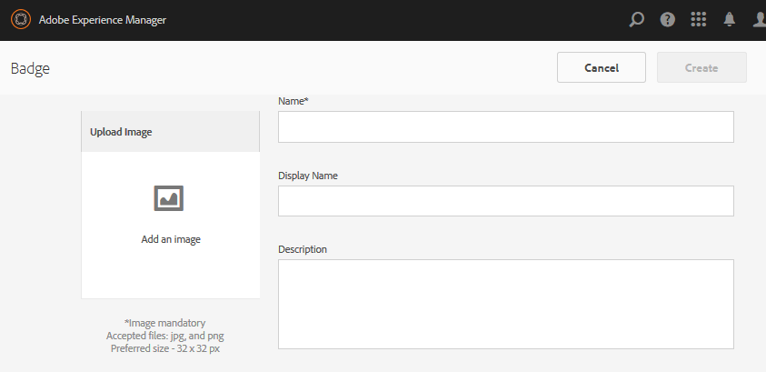

# Console de badges {#badges-console}

## A propos des badges {#about-badges}

La console Badges communautaires permet d&#39;ajouter des badges personnalisés qui peuvent être affichés pour un membre lorsqu&#39;il est gagné (attribué) ou lorsqu&#39;il assume un rôle spécifique dans la communauté (attribué).

### Visibilité du badge {#badge-visibility}

Actuellement, les badges gagnés ou attribués à un membre de la communauté apparaissent avec son nom et son avatar aux emplacements suivants :

* Profils
* [Forums](/help/communities/forum.md)
* [Q&amp;R](/help/communities/working-with-qna.md)
* [Tableaux de bord](/help/communities/enabling-leaderboard.md)
* [Conceptualisation](/help/communities/ideation-feature.md)

Dans l’environnement d’auteur, accédez à la console Badges :

* A partir de la navigation globale : **[!UICONTROL Outils]** > **[!UICONTROL Communautés]** > **[!UICONTROL Badges]**

Cette console affiche les badges actuellement disponibles et à partir desquels de nouveaux badges peuvent être ajoutés.

## Créer le badge {#create-badge}

Un badge est créé en téléchargeant une image suffisamment petite (72 dpi avec une hauteur comprise entre 26 et 32 pixels) et en fournissant un nom. L’image de badge est stockée dans le référentiel à l’emplacement `/libs/settings/community/badging/images` et automatiquement répliquée dans l’environnement de publication.

Si l’environnement de publication est une batterie d’éditeurs, il est nécessaire de configurer la synchronisation utilisateur.

* **Télécharger l’image**

   (*Obligatoire*) Image de badge d’une taille recommandée de 32 x 32 pixels à 72 ppp au format JPEG ou PNG.

* **Nom**

   (*Obligatoire*) Nom du badge. Il s’agit de la valeur par défaut `Display Name` ainsi que du nom du noeud du référentiel. Si le nom `Name` de noeud de référentiel n&#39;est pas valide, il sera modifié.

* **Nom d’affichage**

   (*Facultatif*) Nom à afficher pour le badge dans l’interface utilisateur. La valeur par défaut est le texte non modifié saisi pour le `Name`.

* **Description**

   (*Optional*) A description for the badge.

## Informations supplémentaires {#additional-information}

Pour plus d’informations sur la configuration des règles d’évaluation et de mise en badge, voir [Scoring and Badges](/help/communities/implementing-scoring.md)(Scores et badges).

Pour la gestion des badges pour les membres, voir Console Membres.
