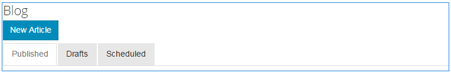
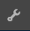
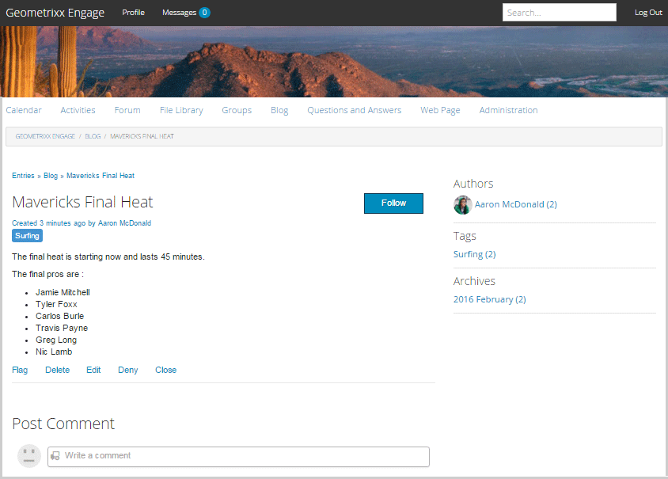
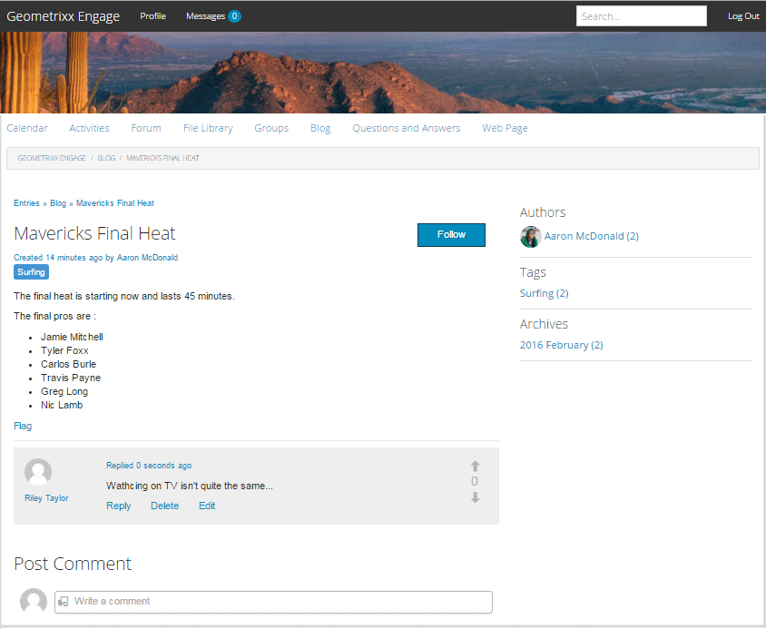
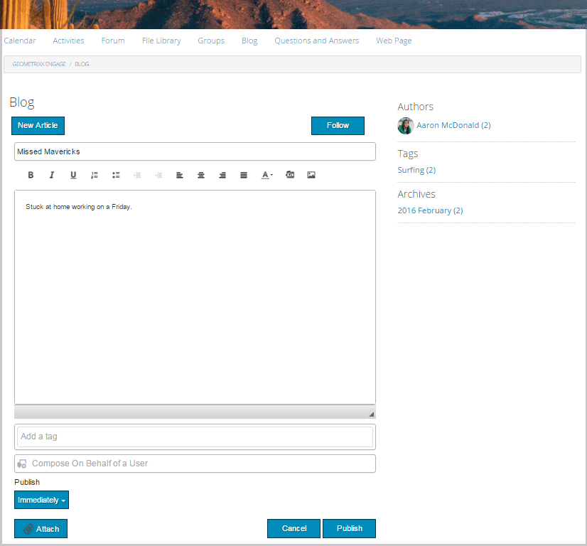
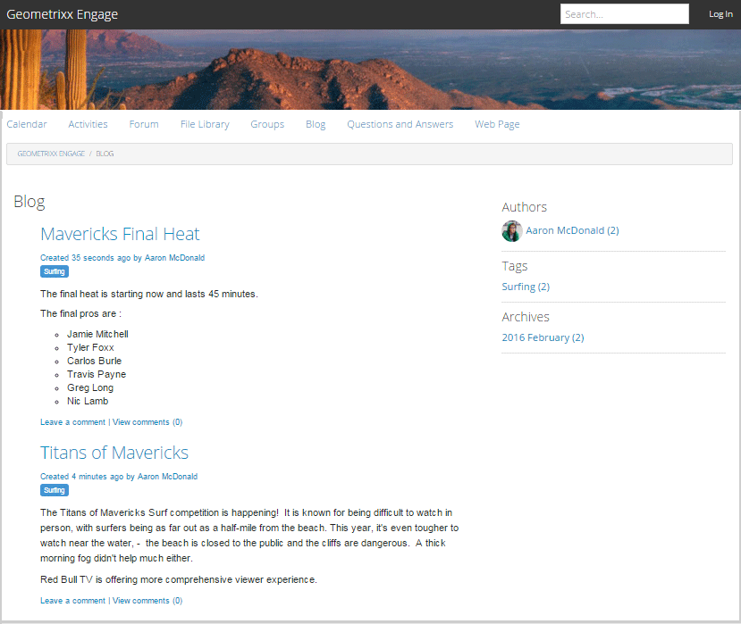

# Fonctionnalité de blog {#blog-feature}

## Présentation {#introduction}

La fonctionnalité de blog d’AEM Communities est passée d’une activité de création à une véritable activité de communauté, qui a lieu dans l’environnement de publication.

La fonctionnalité de blog prend en charge la fourniture d’informations de communauté dans un format de journalisation. Les entrées de blog sont effectuées dans l’environnement de publication par des membres autorisés (utilisateurs inscrits et connectés).

La fonctionnalité de blog fournit les éléments suivants :

* Création côté publication d’articles de blog et de commentaires
* Modification de texte enrichi
* Images intégrées (avec prise en charge du glisser-déposer)
* Contenu de réseau social intégré ([prise en charge d’Embed](/help/communities/blog-developer-basics.md#allowing-rich-media))
* Mode Brouillon
* Publication planifiée
* Composer pour le compte (un [membre privilégié](/help/communities/users.md#privileged-members-group) peut créer du contenu au nom d’un autre membre de la communauté)
* [Modération en contexte et en masse](/help/communities/moderate-ugc.md) des articles et commentaires de blog

Cette section de la documentation décrit les éléments suivants :

* Ajout de la fonction de blog à un site AEM
* Paramètres de configuration des composants de blog

>[!NOTE]
>
>Les composants `Journal` et `Journal Sidebar` sont intitulés `Blog` et `Blog Sidebar`.
>
>La fonctionnalité de blog d’AEM 6.0 et des versions antérieures est désormais supprimée. Il était basé sur un modèle et permettait uniquement aux auteurs de créer du contenu dans l’environnement de création.

## Ajout de composants Blog à une page {#adding-blog-components-to-a-page}

Si vous souhaitez ajouter un blog à une page en mode de création, utilisez l’explorateur de composants pour localiser .

* `Communities / Blog`
* `Communities / Blog Sidebar`

Et faites-les glisser jusqu&#39;à ce qu&#39;ils se trouvent sur une page où le blog doit apparaître.

Pour plus d’informations, consultez [Principes de base des composants de communautés](/help/communities/basics.md).

Lorsque les [bibliothèques côté client requises](/help/communities/blog-developer-basics.md#essentials-for-client-side) sont incluses, le composant `Blog` apparaît comme suit :

### Configuration du blog {#configuring-blog}

Sélectionnez le composant de `Blog` placé afin de pouvoir accéder à l’icône de `Configure` qui ouvre la boîte de dialogue de modification et de la sélectionner.

#### Onglet Paramètres {#settings-tab}

Sous l’onglet **Paramètres**, spécifiez les fonctionnalités de base du blog :

* **Autoriser la miniature de la pièce jointe**

  Si cette case est cochée, une miniature de l’image jointe est créée.

* **Taille max. de la miniature jointe**

  Taille maximale (en pixels) de l’image miniature de la pièce jointe. La valeur par défaut est 800 x 800.

* **Taille minimale de l’image de la miniature**

  Taille minimale (en octets) de l’image pour la génération de la miniature des images intégrées. La valeur par défaut est de 100000 octets (100 Ko).

* **Taille max. de la miniature**

  Taille maximale (en pixels) de l’image miniature de l’image intégrée. La valeur par défaut est 800 x 800.

* **Autoriser les membres privilégiés**

  Si cette case est cochée, seuls les membres privilégiés sont autorisés à créer du contenu.

* **Membres autorisés**

  Ajoutez les membres privilégiés autorisés à créer du contenu.

* **Bloquez le contenu créé par l’utilisateur en mode d’édition Auteur**

  Si cette option est activée, bloque le contenu créé par l’utilisateur lors de la modification en mode création.

* **Titre du journal**

  Titre du blog à afficher sur la page.

>[!NOTE]
>
>Le Titre du journal permet de créer automatiquement une URL pour le blog.
>
>Un maximum de 50 caractères (avec 5 caractères supplémentaires pour l’unicité) est utilisé à partir du titre du journal que vous spécifiez ici pour créer l’URL du blog.

* **Description du journal**

  Description du blog.

* **Rubriques Par Page**

  Définit le nombre d’entrées/commentaires de blog affichés par page. La valeur par défaut est 10.

* **Modéré**

  Si cette case est cochée, la publication d&#39;entrées de blog et de commentaires doit être approuvée avant d&#39;apparaître sur un site publié. La valeur par défaut n’est pas cochée.

* **Fermé**

  Si cette case est cochée, le blog est fermé aux nouvelles entrées et commentaires de blog. La valeur par défaut n’est pas cochée.

* **Éditeur de texte enrichi**

  Si cette case est cochée, les entrées de blog et les commentaires peuvent être saisis avec des balises. La valeur par défaut est cochée.

* **Autoriser le balisage**

  Si cette case est cochée, permet aux membres d’ajouter des libellés de balise à leurs publications (voir **Champ de balise** onglet). La valeur par défaut n’est pas cochée.

* **Autoriser les chargements de fichiers**

  Si cette case est cochée, autorisez l&#39;ajout de pièces jointes à une entrée de blog ou à un commentaire. La valeur par défaut n’est pas cochée.

* **Taille de fichier max**

  Pertinent uniquement si `Allow File Uploads` est coché. Ce champ limite la taille (en octets) d’un fichier chargé. La valeur par défaut est 104857600 (10 Mo).

* **Types de fichiers autorisés**

  Pertinent uniquement si `Allow File Uploads` est coché. Liste d’extensions de fichier séparées par des virgules avec le séparateur « point ». Par exemple : .jpg, .jpeg, .png, .doc, .docx, .pdf. Si des types de fichiers sont spécifiés, ceux qui ne le sont pas ne peuvent pas être chargés. Par défaut, aucun fichier n’est spécifié, de sorte que tous les types de fichiers soient autorisés.

* **Taille max. du fichier image joint**

  Pertinent uniquement si Autoriser le chargement de fichiers est coché. Nombre maximal d’octets qu’un fichier image chargé peut avoir. La valeur par défaut est 2097152 (2 Mo).

* **Autoriser les réponses**

  Si cette case est cochée, autoriser les réponses aux commentaires publiés sur l&#39;entrée de blog. La valeur par défaut n’est pas cochée.

* **Autoriser le vote**

  Si cette case est cochée, incluez la fonction Vote avec une entrée de blog. La valeur par défaut n’est pas cochée.

* **Autoriser les utilisateurs à supprimer des commentaires et des rubriques**

  Si cette case est cochée, permet aux membres de supprimer les commentaires et les entrées de blog qu&#39;ils ont publiés. La valeur par défaut n’est pas cochée.

* **Autoriser les éléments suivants**

  Si cette case est cochée, incluez la fonctionnalité suivante pour les articles de blog, qui permet aux membres d’être [avertis](/help/communities/notifications.md) de nouvelles publications. La valeur par défaut n’est pas cochée.

* **Autoriser les abonnements par e-mail**

  Si cette case est cochée, autoriser les membres à être avertis des nouvelles publications par e-mail ([abonnement](/help/communities/subscriptions.md)). Exige que les `Allow Following` soient vérifiées et que les [e-mails soient configurés](/help/communities/email.md). La valeur par défaut n’est pas cochée.

* **Afficher les badges**

  Si cette case est cochée, afficher les [badges](/help/communities/implementing-scoring.md) gagnés et attribués avec l’entrée de blog d’un membre. La valeur par défaut n’est pas cochée.

* **Ne pas obtenir de réponses sur la page de liste**

* **Autoriser le contenu en vedette**

  Si cette case est cochée, l’idée est identifiée comme [contenu présenté](/help/communities/featured.md). La valeur par défaut n’est pas cochée.

* **Activer la mention**

  Si cette option est activée, elle permet aux utilisateurs de la communauté enregistrés d’identifier d’autres membres enregistrés (à l’aide de leur prénom, de leur nom et de leur nom d’utilisateur) et de les baliser en utilisant la syntaxe de @user-name commune. Les utilisateurs identifiés reçoivent des notifications sur leurs propres mentions.

* **Mentions max**

  Limitez le nombre maximal de mentions autorisées dans une publication. La valeur par défaut est 10.

* **Modèle de mention de l’interface utilisateur**

  Spécifiez la chaîne de modèle autorisée pour baliser (@mention) l’utilisateur enregistré dans une publication. Par exemple, `~{{familyName}}{{givenName}}`.

#### Onglet Modération des utilisateurs {#user-moderation-tab}

Sous l’onglet **Modération des utilisateurs**, spécifiez les paramètres de modération :

* **Refuser les publications**

  Si cette case est cochée, les modérateurs membres de confiance sont autorisés à refuser les publications et à empêcher la publication d&#39;apparaître sur le forum public. La valeur par défaut n’est pas cochée.

* **Fermer/Rouvrir les rubriques**

  Si cette case est cochée, les modérateurs membres de confiance peuvent fermer une rubrique pour apporter d’autres modifications et commentaires, et peuvent également rouvrir une rubrique. La valeur par défaut n’est pas cochée.

* **Publications de drapeaux**

  Si cette case est cochée, autorisez les membres à signaler les sujets ou commentaires des autres comme inappropriés. La valeur par défaut n’est pas cochée.

* **Liste des motifs de l&#39;indicateur**

  Si cette case est cochée, permet aux membres de choisir, dans une liste déroulante, la raison pour laquelle ils signalent un sujet ou un commentaire comme inapproprié. La valeur par défaut n’est pas cochée.

* **Motif de l’indicateur personnalisé**

  Si cette case est cochée, autorisez les membres à saisir leur propre raison pour signaler un sujet ou un commentaire comme inapproprié. La valeur par défaut n’est pas cochée.

* **Seuil de modération**

  Permet d&#39;entrer le nombre de fois où un sujet ou un commentaire doit être marqué par les membres avant que les modérateurs ne soient avertis. La valeur par défaut est 1 (une seule fois).

* **Limite de marquage**

  Entrez le nombre de fois où un sujet ou un commentaire doit être marqué avant d&#39;être masqué de la vue publique. Si la valeur est définie sur -1, la rubrique ou le commentaire marqué n&#39;est jamais masqué de la vue publique. Sinon, ce nombre doit être supérieur ou égal au seuil de modération. La valeur par défaut est 5.

#### Onglet Champ de balise {#tag-field-tab}

Sous l’onglet **Champ de balise**, spécifiez les balises pouvant être appliquées si l’option **Autoriser le balisage** est cochée dans l’onglet **Paramètres** :

* **Espaces de noms autorisés**

  Pertinent si `Allow Tagging` est coché sous l’onglet **Paramètres**. Les balises pouvant être appliquées sont limitées aux balises appartenant aux catégories d’espaces de noms cochées. La liste des espaces de noms inclut « Balises standard » (l’espace de noms par défaut) et « Inclure toutes les balises ». La valeur par défaut n’est pas cochée, ce qui signifie que tous les espaces de noms sont autorisés.

* **Limite de suggestions**

  Saisissez le nombre de balises à afficher en tant que suggestion au membre qui publie sur le forum. Une valeur de -1 signifie qu’aucune limite n’est définie. La valeur par défaut est 0.

### Configuration de la barre latérale du blog {#configuring-blog-sidebar}

Lorsque vous double-cliquez sur le composant `Blog Sidebar`, une boîte de dialogue de modification s’ouvre.

Sous l’onglet **Paramètres de la barre latérale du journal**, spécifiez le format de date des archives et le type d’entrées à afficher dans la barre latérale :

* **Format de date**

  Format utilisé pour l’affichage des archives des entrées de blog. Le format utilise des espaces réservés conformes à la convention Java™.

   * aaaa : année complète, comme « 2015 »
   * yy : année courte, comme &#39;15&#39;
   * MMMM : mois complet, comme juin
   * MMM : mois court, comme juin
   * MM : numéro du mois, comme 06

  La valeur par défaut est « aaaa MMMM » qui s’affiche, par exemple, « Juin 2015 »

* **Type de vue**

  Titre et type des entrées de blog à afficher dans la barre latérale. Vous avez le choix entre

   * Auteurs
   * Catégories
   * Archives

* **Chemin d’accès du composant Blog**

  *(Facultatif)* Emplacement de la ressource de blog à partir de laquelle les articles de blog doivent être répertoriés. Si rien n’est indiqué, il utilise le composant resourceType `social/journal/components/hbs/journal` qui apparaît sur la même page.

   * Par exemple, `/content/sites/engage/en/blog/jcr:content/content/primary/blog`.

* **Limite de suggestions**

  Nombre d&#39;articles de blog à afficher. Une valeur de -1 signifie qu’aucune limite n’est définie. La valeur par défaut est -1.

## Expérience du visiteur du site {#site-visitor-experience}

Dans l’environnement de publication, la fonction de blog affiche l’article de blog le plus récent, suivi des articles de blog plus anciens dans l’ordre décroissant de création. Les barres latérales de blog permettent aux visiteurs du site d’appliquer des filtres afin de limiter la sélection d’articles de blog affichés.

L&#39;article de blog est suivi d&#39;un lien pour publier ou afficher des commentaires.

Lorsqu’un article de blog est sélectionné, l’article de blog et les commentaires s’affichent (si activé).

Les autres capacités dépendent du fait que le visiteur du site soit un modérateur, un administrateur, un membre de la communauté, un membre privilégié ou un anonyme.

### Utilisation des articles {#working-with-articles}

Lors de la création d’un article de blog, vous pouvez effectuer les opérations suivantes :

1. Publier immédiatement
1. Publier un brouillon
1. Publier à une date et une heure planifiées

Les articles de blog s’affichent sous l’onglet approprié (Publié, Brouillons ou Planifié) pour les membres en mesure de créer lors de la publication.

#### Modérateurs et administrateurs {#moderators-and-administrators}

Lorsque l’utilisateur connecté dispose des privilèges de modérateur ou d’administrateur, il peut effectuer des [tâches de modération](/help/communities/moderate-ugc.md) (comme l’autorise la configuration du composant ) sur tous les articles de blog et commentaires publiés sur un blog.

#### Membres {#members}

Lorsque l’utilisateur connecté est un membre de la communauté ou [membre privilégié](/help/communities/users.md#privileged-members-group) (selon la configuration), il peut sélectionner des `New Article` pour créer et publier un nouvel article de blog.

Plus précisément, ils peuvent :

* Créer un article de blog
* Publier un nouvel article de blog au nom d&#39;un autre membre
* Publier un commentaire sur un article de blog
* Modifier son propre article de blog ou commentaire
* Supprimer leur propre article de blog ou commentaire
* Signaler les articles ou les commentaires des autres blogs

#### Anonyme {#anonymous}

Les visiteurs du site qui ne sont pas connectés peuvent uniquement lire les articles de blog publiés et les commentaires, les traduire si cela est pris en charge, mais ne peuvent pas ajouter d’article de blog ou de commentaire, ni signaler les articles ou commentaires d’autres utilisateurs.

## Informations supplémentaires {#additional-information}

Vous trouverez plus d’informations à ce sujet sur la page [Blog Essentials](/help/communities/blog-developer-basics.md) destinée aux développeurs et développeuses.

Pour la modération des entrées de blog et des commentaires, voir [Modération du contenu créé par l’utilisateur](/help/communities/moderate-ugc.md).

Pour baliser les entrées de blog et les commentaires, reportez-vous à la section [Balisage du contenu créé par l’utilisateur](/help/communities/tag-ugc.md).

Pour la traduction des entrées de blog et des commentaires, voir [ Traduction de contenu créé par l’utilisateur ](/help/communities/translate-ugc.md).
