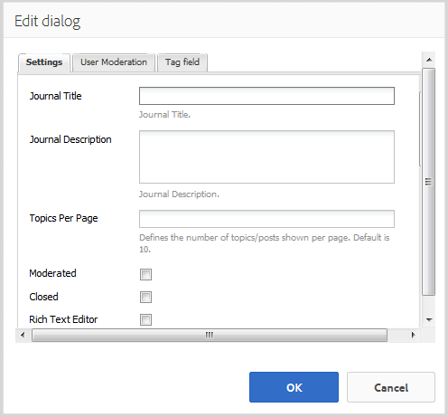

# Fonction Calendrier{#calendar-feature}

## Présentation {#introduction}

La fonction Calendrier offre des informations relatives aux événements de la communauté dans un calendrier. Sont concernés tous les visiteurs ou uniquement ceux qui sont inscrits (membres de la communauté). Tous les membres autorisés peuvent ajouter des événements.

Cette section de la documentation décrit :

* l’ajout de la fonction Calendrier à un site AEM ;
* configuration settings for `Calendar`components

## Ajout d’un calendrier à une page {#adding-a-calendar-to-a-page}

To add a `Calendar` component to a page in author mode, use the component browser to locate

* `Communities / Calendar`

et faites glisser le composant sur une page, par exemple à un endroit relatif à la fonction, pour permettre aux utilisateurs de le consulter.

For necessary information, visit [Communities Components Basics](/help/communities/basics.md).

When the [required client-side libraries](/help/communities/calendar-basics-for-developers.md#essentials-for-client-side) are included, this is how the `Calendar` component will appear.

### Configuration du calendrier {#configuring-calendar}

Select the placed `Calendar`component to access and select the `Configure` icon which opens the edit dialog.

 

#### Onglet Settings {#settings-tab}

Sous l’onglet **Paramètres **, indiquez si vous souhaitez autoriser l’application de balises aux entrées de calendrier.

* **Événements par page** Définit le nombre d’événements affichés par page. La valeur par défaut est 10.

* **Modéré** Si cette option est cochée, les événements et les commentaires du calendrier doivent être approuvés avant d’être visibles sur un site de publication. Cette option n’est pas cochée par défaut.

* **Fermé** Si cette option est cochée, le calendrier est fermé et n’accepte aucun nouvel événement ou commentaire. Cette option n’est pas cochée par défaut.

* **Éditeur de texte enrichi** Si cette option est cochée, les événements et les commentaires du calendrier peuvent être saisis avec une mise en forme. Cette option est cochée par défaut.

* **Autoriser le balisage** Si cette option est cochée, les membres ont le droit d’ajouter des libellés de balise à leurs événements (voir l’onglet **Champ de balise**). Cette option est cochée par défaut.

* **Autoriser les chargements de fichiers** Si cette option est cochée, des fichiers joints peuvent être ajoutés à un événement ou à un commentaire de calendrier. Cette option est cochée par défaut.

* **Autoriser abonnement** Si cette option est cochée, les membres sont autorisés à suivre les événements publiés pour le calendrier. Cette option est cochée par défaut.

* **Taille** de fichier maximale pertinente uniquement si `Allow File Uploads` est cochée. Ce champ limite la taille (en octets) d’un fichier chargé. La valeur par défaut est 1 048 57 600 (10 Mo).

* **Types** de fichiers autorisés pertinents uniquement si `Allow File Uploads` l’option est cochée. Liste d’extensions de fichiers séparées par des virgules avec le séparateur &quot;point&quot;. Par exemple : .jpg, .jpeg, .png, .doc, .docx, .pdf. Si des types de fichier sont spécifiés, ceux qui ne sont pas spécifiés ne seront pas autorisés à être téléchargés. Par défaut, aucun type de fichier n’est spécifié, de sorte que tous les types de fichier soient autorisés.

* **Taille** max. du fichier image joint, applicable uniquement si l’option Autoriser les téléchargements de fichiers est cochée. Taille maximale en octets pour un fichier image chargé. La valeur par défaut est 2097152** **(2 Mo).

* **Types** d’image de couverture autorisés Liste séparée par des virgules des extensions de fichier image avec le séparateur &quot;point&quot;. La valeur par défaut est `.jpg,.jpeg,.png,.gif,.bmp`.

* **Autoriser les réponses à thème** Si cette option est cochée, les réponses aux commentaires sont publiées pour l’événement de calendrier. Cette option est cochée par défaut.

* **Autoriser les utilisateurs à supprimer des commentaires et des événements** Si cette option est cochée, autoriser les membres à supprimer les commentaires et les événements de calendrier qu’ils ont publiés. La valeur par défaut est** **cochée.

* **Autoriser le vote** Si cette option est cochée, la fonction de vote est ajoutée aux événements de calendrier. Cette option est cochée par défaut.

* **Afficher le fil d’Ariane** Affiche le fil d’Ariane sur la page de l’événement. Cette option est cochée par défaut.

* **Filtre** de plage de dates Définit le nombre de jours ajoutés à la date actuelle afin de calculer la valeur &quot;À&quot; du filtre de page de liste des événements de calendrier. Le nombre par défaut est 30.

* **Si cette option est cochée, l’idée peut être identifiée comme contenu**phare. Cette option n’est pas cochée par défaut.

Sous l’onglet **Modération utilisateur **, spécifiez la manière dont les rubriques et réponses publiées (contenu généré par l’utilisateur) sont gérées. Pour plus d’informations, voir [Modération de contenu généré par les utilisateurs](/help/communities/moderate-ugc.md).

#### Onglet Modération utilisateur {#user-moderation-tab}

* **Refuser les publications** Si cette option est cochée, les membres modérateurs autorisés ont le droit de refuser des articles et, par conséquent, d’empêcher leur publication sur le forum public. Cette option est cochée par défaut.

* **Fermer/rouvrir les événements** Si cette option est cochée, les membres modérateurs autorisés ont le droit de fermer un événement pour empêcher la publication d’autres modifications et commentaires, puis de le rouvrir. Cette option est cochée par défaut.

* **Marquer les publications** Si cette option est cochée, les membres ont le droit de marquer les événements ou commentaires d’autres membres comme étant inappropriés. Cette option est cochée par défaut**.**

* **Marquer la liste de motifs** Si cette option est cochée, les membres ont le droit de sélectionner dans une liste déroulante la ou les raisons pour lesquelles ils ont marqué un événement ou un commentaire comme étant inapproprié. Cette option n’est pas cochée par défaut.

* **Motif de la marque personnalisée** Si cette option est cochée, les membres ont le droit de préciser la raison pour laquelle ils ont marqué un événement ou un commentaire comme étant inapproprié. Cette option n’est pas cochée par défaut**.**

* **Seuil de modération** Saisissez le nombre de fois qu’un événement ou un commentaire doit être marqué par les membres avant que les modérateurs n’en soient informés. La valeur par défaut est 1 (une fois).

* **Limite de marquage** Saisissez le nombre de fois qu’un événement ou un commentaire doit être marqué avant qu’il ne soit plus visible pour le public. Si la valeur est -1, le sujet ou le commentaire marqué est toujours visible pour le public. Dans le cas contraire, cette valeur doit être supérieure ou égale au seuil de modération. La valeur par défaut est 5.

#### Onglet Champ de balise {#tag-field-tab}

Under the **Tag field** tab, the tags which may be applied, if allowed under the **Settings **tab, are limited according to namespaces chosen.

* **Espaces de noms** autorisés Pertinents si `Allow Tagging` est coché sous l’onglet **Paramètres **Paramètres. Les balises pouvant être appliquées se limitent à celles liées aux catégories d’espace de noms cochées. La liste des espaces de noms inclut &quot;Balises standard&quot; (espace de noms par défaut) ainsi que &quot;Inclure toutes les balises&quot;. La valeur par défaut n’est pas cochée, ce qui signifie que tous les espaces de noms sont autorisés.

* **Limite de suggestions** Entrez le nombre de balises à afficher comme suggestion destinée au membre qui publie sur le forum. La valeur par défaut est **-**1 (aucune limite).

>[!NOTE]
>
>Consultez la rubrique [Administration des balises](/help/sites-administering/tags.md) pour savoir comment ajouter un espace de noms de balise (taxonomie).

#### Onglet Traduction {#translation-tab}

Sous l’onglet **Traduction **, si la traduction est activée pour le site de la communauté, la traduction peut être configurée pour traduire l’intégralité du fil (événement et commentaires) au lieu de publications spécifiques.

* **Tout traduire** Si cette option est cochée, l’événement et les commentaires sont traduits dans la langue par défaut de l’utilisateur. Cette option est cochée par défaut.

## Expérience des visiteurs {#site-visitor-experience}

Dans l’environnement de publication, la fonction Calendrier présente un champ de recherche avec une plage de dates par défaut et tous les événements de calendrier prévus pour cette plage.

Lorsqu’un événement de calendrier est sélectionné, ses détails, sa description et ses commentaires sont affichés.

Les autres choix varient selon que le visiteur est modérateur, administrateur, membre de la communauté, membre privilégié ou anonyme.

### Modérateurs et administrateurs {#moderators-and-administrators}

Lorsque l’utilisateur connecté dispose de privilèges de modérateur ou d’administrateur, il peut se charger d’[activités de modération](/help/communities/moderate-ugc.md) (autorisées par la configuration du composant) pour tous les événements et commentaires de calendrier publiés pour un événement.

#### Membres {#members}

When the signed in user is a community member or [privileged member](/help/communities/users.md#privileged-members-group) (depending on configuration), they are able to select `New Event` to create and post a new calendar event.

Plus précisément, il est autorisé à :

* créer un événement de calendrier ;
* publier un commentaire pour un événement de calendrier ;
* modifier son propre événement ou commentaire de calendrier ;
* supprimer son propre événement ou commentaire de calendrier ;
* marquer les événements ou commentaires de calendrier d’autres membres.

 

#### Anonyme {#anonymous}

Les visiteurs non inscrits peuvent lire les événements de calendrier et les traduire lorsque cela est possible. Toutefois, ils ne sont pas autorisés à ajouter un événement ou un commentaire de calendrier, ni à marquer les événements ou les commentaires d’autres membres.

## Informations supplémentaires {#additional-information}

More information may be found on the [Calendar Essentials](/help/communities/calendar-basics-for-developers.md) page for developers.

Pour des informations sur la modération des événements et des commentaires de calendrier, voir [Modération de contenu généré par les utilisateurs](/help/communities/moderate-ugc.md).

For tagging calendar events and comments, see [Tagging User Generated Content](/help/communities/tag-ugc.md).

For translation of calendar events and comments, see [Translating User Generated Content](/help/communities/translate-ugc.md).
