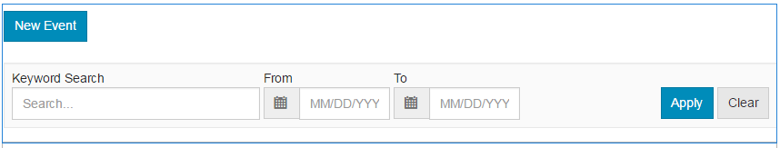
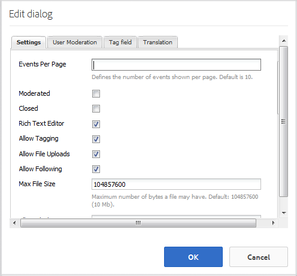
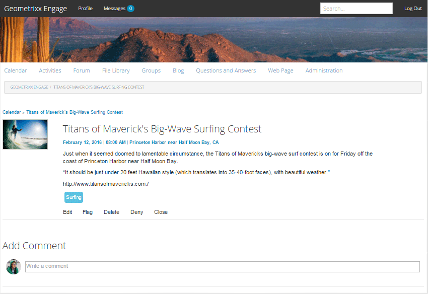
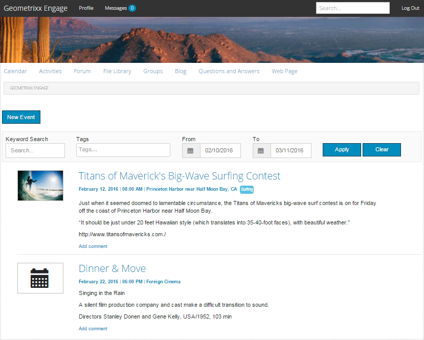
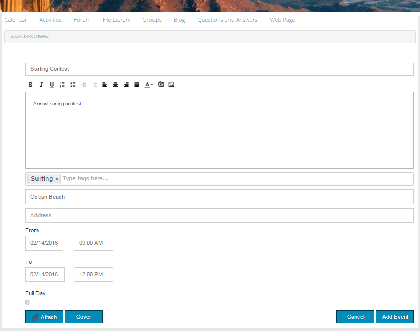
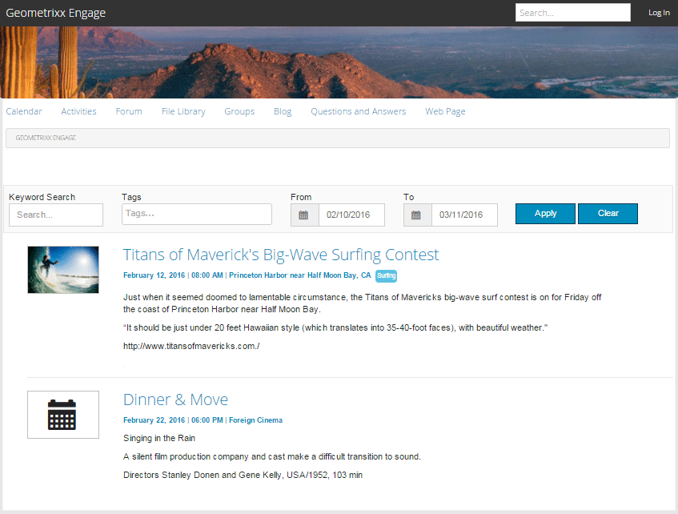

# Fonctionnalité de calendrier {#calendar-feature}

## Présentation {#introduction}

La fonction de calendrier prend en charge la fourniture d’informations sur les événements de la communauté au format calendrier à tous les visiteurs du site ou uniquement aux visiteurs connectés au site (membres de la communauté), tandis que seuls les membres autorisés peuvent ajouter des événements.

Cette section de la documentation décrit

* Ajout de la fonction de calendrier à un site AEM
* Paramètres de configuration des composants `Calendar`

## Ajout d’un calendrier à une page {#adding-a-calendar-to-a-page}

Pour ajouter un composant `Calendar` à une page en mode création, utilisez l’explorateur de composants pour localiser .

* `Communities / Calendar`

Et faites-le glisser sur une page, par exemple à un emplacement relatif à la fonction que les utilisateurs pourront examiner.

Pour plus d’informations, consultez [Principes de base des composants de communautés](/help/communities/basics.md).

Lorsque les [bibliothèques côté client requises](/help/communities/calendar-basics-for-developers.md#essentials-for-client-side) sont incluses, le composant `Calendar` s’affiche de cette manière.

### Configuration du calendrier {#configuring-calendar}

Sélectionnez le composant de `Calendar` placé afin de pouvoir accéder à l’icône de `Configure` qui ouvre la boîte de dialogue de modification et de la sélectionner.

#### Onglet Paramètres {#settings-tab}

Sous l’onglet **Paramètres**, indiquez si les balises doivent être appliquées aux entrées du calendrier.

* **Événements Par Page**

  Définit le nombre d’événements affichés par page. La valeur par défaut est 10.

* **Modéré**

  Si cette case est cochée, la publication des événements et commentaires du calendrier doit être approuvée avant d&#39;apparaître sur un site de publication. La valeur par défaut n’est pas cochée.

* **Fermé**

  Si cette case est cochée, le calendrier est fermé aux nouvelles entrées d&#39;événement et aux nouveaux commentaires. La valeur par défaut n’est pas cochée.

* **Éditeur de texte enrichi**

  Si cette case est cochée, les événements de calendrier et les commentaires peuvent être saisis avec des balises. La valeur par défaut est cochée.

* **Autoriser le balisage**

  Si cette case est cochée, permet aux membres d’ajouter des libellés de balise aux événements qu’ils publient (voir **Champ de balise** onglet). La valeur par défaut est cochée.

* **Autoriser les chargements de fichiers**

  Si cette case est cochée, autorisez l&#39;ajout de pièces jointes à un commentaire ou à un événement de calendrier. La valeur par défaut est cochée.

* **Autoriser les éléments suivants**

  Si cette case est cochée, autoriser les membres à suivre les événements publiés dans le calendrier. La valeur par défaut est cochée.

* **Taille de fichier max**

  Pertinent uniquement si `Allow File Uploads` est coché. Ce champ limite la taille (en octets) d’un fichier chargé. La valeur par défaut est 104857600 (10 Mo).

* **Types de fichiers autorisés**

  Pertinent uniquement si `Allow File Uploads` est coché. Liste d’extensions de fichier séparées par des virgules avec le séparateur « point ». Par exemple, .jpg, .jpeg, .png, .doc, .docx, .pdf. Si des types de fichiers sont spécifiés, ceux qui ne le sont pas ne peuvent pas être chargés. Par défaut, aucun fichier n’est spécifié, de sorte que tous les types de fichiers soient autorisés.

* **Taille max. du fichier image joint**

  Pertinent uniquement si Autoriser le chargement de fichiers est coché. Nombre maximal d’octets qu’un fichier image chargé peut avoir. La valeur par défaut est ** **(2 Mo).

* **Types d’images de couverture autorisés**

  Liste d’extensions de fichier image séparées par des virgules avec le séparateur « point ». La valeur par défaut est `.jpg,.jpeg,.png,.gif,.bmp`.

* **Autoriser les réponses avec thread**

  Si cette case est cochée, autoriser les réponses aux commentaires publiés sur l&#39;événement de calendrier. La valeur par défaut est cochée.

* **Autoriser les utilisateurs à supprimer des commentaires et des événements**

  Si cette case est cochée, permet aux membres de supprimer les commentaires et les événements de calendrier qu&#39;ils ont publiés. La valeur par défaut est cochée.

* **Autoriser le vote**

  Si cette case est cochée, incluez la fonction Vote avec un événement de calendrier. La valeur par défaut est cochée.

* **Afficher le chemin de navigation**

  Afficher les chemins de navigation sur la page de l’événement. La valeur par défaut est cochée.

* **Filtre de période**

  Définit le nombre de jours ajoutés à la date actuelle pour calculer la valeur « À » du filtre de page de liste d’événements de calendrier. La valeur par défaut est 30.

* **Autoriser le contenu en vedette**

  Si cette case est cochée, l’idée est identifiable comme [contenu présenté](/help/communities/featured.md). La valeur par défaut n’est pas cochée.

Sous l’onglet **Modération des utilisateurs**, spécifiez la manière dont les rubriques publiées et les réponses (contenu généré par l’utilisateur) sont gérées. Pour plus d’informations, voir [Modération du contenu créé par l’utilisateur](/help/communities/moderate-ugc.md).

#### Onglet Modération des utilisateurs {#user-moderation-tab}

* **Refuser les publications**

  Si cette case est cochée, les modérateurs membres de confiance sont autorisés à refuser les publications et à empêcher la publication d&#39;apparaître sur le forum public. La valeur par défaut est cochée.

* **Fermer/Rouvrir des événements**

  Si cette case est cochée, les modérateurs membres de confiance peuvent fermer un événement pour apporter d’autres modifications et commentaires, et peuvent également rouvrir un événement. La valeur par défaut est cochée.

* **Publications de drapeaux**

  Si cette case est cochée, autorisez les membres à signaler les événements ou commentaires des autres comme inappropriés. La valeur par défaut est cochée.

* **Liste des motifs de l&#39;indicateur**

  Si cette case est cochée, permet aux membres de choisir, dans une liste déroulante, la raison pour laquelle ils signalent un événement ou un commentaire comme inapproprié. La valeur par défaut n’est pas cochée.

* **Motif de l’indicateur personnalisé**

  Si cette option est cochée, permettez aux membres de saisir leur propre raison pour laquelle un événement ou un commentaire est signalé comme inapproprié. La valeur par défaut n’est pas cochée.

* **Seuil de modération**

  Permet d&#39;entrer le nombre de fois où un événement ou un commentaire doit être marqué par les membres avant que les modérateurs ne soient avertis. La valeur par défaut est 1 (une seule fois).

* **Limite de marquage**

  Saisissez le nombre de fois où un événement ou un commentaire doit être marqué avant qu&#39;il ne soit masqué de la vue publique. Si la valeur est définie sur -1, la rubrique ou le commentaire marqué n&#39;est jamais masqué de la vue publique. Sinon, ce nombre doit être supérieur ou égal au seuil de modération. La valeur par défaut est 5.

#### Onglet Champ de balise {#tag-field-tab}

Sous l’onglet **Champ de balise**, les balises qui peuvent être appliquées, si elles sont autorisées sous l’onglet **Paramètres** sont limitées en fonction des espaces de noms choisis.

* **Espaces de noms autorisés**

  Pertinent si `Allow Tagging` est coché sous l’onglet **Paramètres**. Les balises qui peuvent être appliquées sont limitées à celles qui se trouvent dans les catégories d’espaces de noms cochées. La liste des espaces de noms inclut « Balises standard » (l’espace de noms par défaut) et « Inclure toutes les balises ». La valeur par défaut n’est pas cochée, ce qui signifie que tous les espaces de noms sont autorisés.

* **Limite de suggestions**

  Saisissez le nombre de balises à afficher en tant que suggestion au membre qui publie sur le forum. La valeur par défaut est **-**1 (aucune limite).

>[!NOTE]
>
>Rendez-vous sur la page [Administration des balises](/help/sites-administering/tags.md) pour découvrir comment ajouter un espace de noms de balise (taxonomie).

#### Onglet Traduction {#translation-tab}

Sous l’onglet **Traduction**, si la traduction est activée pour le site de la communauté, vous pouvez définir la traduction pour traduire l’ensemble du thread (événement et commentaires) au lieu de publications spécifiques.

* **Tout traduire**

  Si cette case est cochée, l’événement et les commentaires sont traduits dans la langue préférée de l’utilisateur ou de l’utilisatrice. La valeur par défaut est cochée.

## Expérience du visiteur du site {#site-visitor-experience}

Dans l’environnement de publication, la fonction de calendrier affiche un champ de recherche avec une période par défaut et tous les événements de calendrier qui se trouvent dans cette période.

Lorsqu’un événement de calendrier est sélectionné, les détails, la description et les commentaires de l’événement de calendrier s’affichent.

Les autres capacités dépendent du fait que le visiteur du site soit un modérateur, un administrateur, un membre de la communauté, un membre privilégié ou un anonyme.

### Modérateurs et administrateurs {#moderators-and-administrators}

Lorsque l’utilisateur connecté dispose des privilèges de modérateur ou d’administrateur, il peut effectuer des [tâches de modération](/help/communities/moderate-ugc.md) (comme l’autorise la configuration du composant) sur tous les événements de calendrier et commentaires publiés sur un événement.

#### Membres {#members}

Lorsque l’utilisateur connecté est un membre de la communauté ou [membre privilégié](/help/communities/users.md#privileged-members-group) (selon la configuration), il peut sélectionner des `New Event` pour créer et publier un événement de calendrier.

Plus précisément, ils peuvent :

* Créer un événement de calendrier
* Publier un commentaire sur un événement de calendrier
* Modifier leur propre événement ou commentaire de calendrier
* Supprimer leur propre événement ou commentaire de calendrier
* Signaler les événements ou commentaires du calendrier des autres

#### Anonyme {#anonymous}

Les visiteurs et visiteuses du site qui ne sont pas connectés peuvent uniquement lire les événements de calendrier publiés et les traduire s’ils sont pris en charge, mais ils ne peuvent pas ajouter d’événement ou de commentaire ni signaler les événements ou commentaires d’autres personnes.

## Informations supplémentaires {#additional-information}

Pour plus d’informations, consultez la page [Calendar Essentials](/help/communities/calendar-basics-for-developers.md) destinée aux développeurs et développeuses.

Pour la modération des événements et des commentaires du calendrier, voir [Modération du contenu créé par l’utilisateur](/help/communities/moderate-ugc.md).

Pour baliser des commentaires et des événements de calendrier, consultez [Balisage de contenu créé par l’utilisateur](/help/communities/tag-ugc.md).

Pour la traduction des événements de calendrier et des commentaires, voir [ Traduction de contenu créé par l’utilisateur ](/help/communities/translate-ugc.md).
