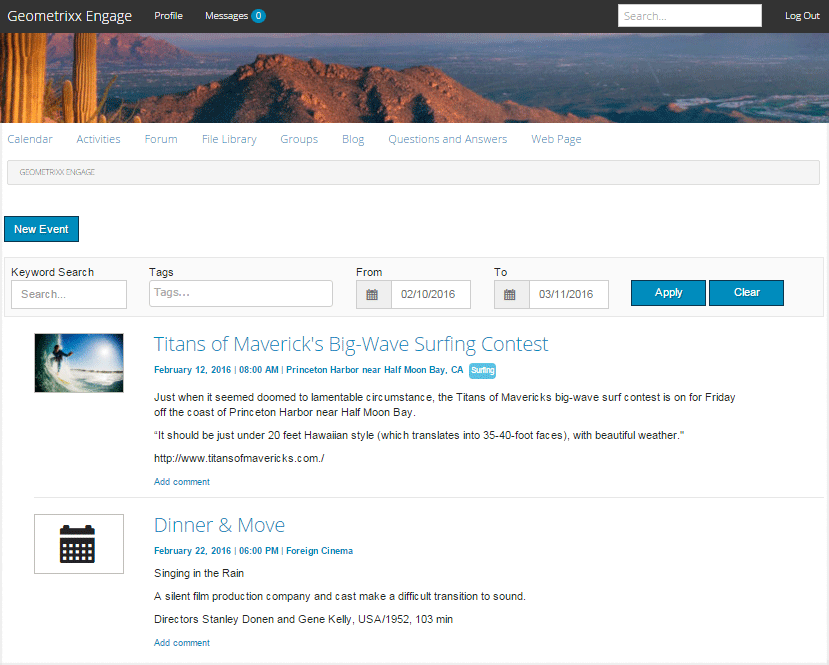

# Fonctionnalité Calendrier {#calendar-feature}

## Présentation {#introduction}

La fonction Calendrier prend en charge la fourniture d’informations sur les événements de la communauté au format Calendrier à tous les visiteurs du site ou uniquement aux visiteurs connectés (membres de la communauté), tandis que seuls les membres autorisés peuvent ajouter des événements.

Cette section de la documentation décrit

* Ajout de la fonction Calendrier à un site AEM
* Paramètres de configuration des composants `Calendar`

## Ajout d’un calendrier à une page {#adding-a-calendar-to-a-page}

Pour ajouter un composant `Calendar` à une page en mode création, utilisez l’explorateur de composants pour accéder à :

* `Communities / Calendar`

Faites-le glisser sur la page, par exemple à un emplacement relatif à la fonction à réviser par les utilisateurs.

Pour plus d’informations, consultez la page [Principes de base des composants Communities](/help/communities/basics.md).

Lorsque les [bibliothèques côté client demandées](/help/communities/calendar-basics-for-developers.md#essentials-for-client-side) sont incluses, voici comment le composant `Calendar` apparaît.

### Configuration du calendrier {#configuring-calendar}

Sélectionnez le composant `Calendar` inséré afin que vous puissiez accéder à l’icône `Configure` qui ouvre la boîte de dialogue de modification.

#### Onglet Paramètres {#settings-tab}

Sous l’onglet **Paramètres** , indiquez si les balises doivent être appliquées aux entrées du calendrier.

* **Événements par page**

  Définit le nombre d’événements affichés par page. La valeur par défaut est 10.

* **Modéré**

  Si cette case est cochée, la publication d’événements et de commentaires de calendrier doit être approuvée avant d’apparaître sur un site de publication. La case par défaut est décochée.

* **Fermé**

  Si cette case est cochée, le calendrier est fermé aux nouvelles entrées et commentaires d’événement. La case par défaut est décochée.

* **Éditeur de texte enrichi**

  Si cette case est cochée, les événements et les commentaires du calendrier peuvent être saisis avec une annotation. La valeur par défaut est cochée.

* **Autoriser le balisage**

  Si cette case est cochée, les membres ont le droit d’ajouter des libellés de balise aux événements qu’ils publient (voir l’onglet **Champ de balise** ). La valeur par défaut est cochée.

* **Autoriser les chargements de fichiers**

  Si cette case est cochée, les fichiers joints peuvent être ajoutés à un événement ou à un commentaire de calendrier. La valeur par défaut est cochée.

* **Autoriser l’abonnement**

  Si cette case est cochée, les membres ont le droit de suivre les événements publiés dans le calendrier. La valeur par défaut est cochée.

* **Taille de fichier max.**

  Pertinent uniquement si `Allow File Uploads` est coché. Ce champ limite la taille (en octets) d’un fichier chargé. La valeur par défaut est 104857600 (10 Mo).

* **Types de fichiers autorisés**

  Pertinent uniquement si `Allow File Uploads` est coché. Liste d’extensions de fichier séparées par des virgules avec le séparateur &quot;point&quot;. Par exemple, .jpg, .jpeg, .png, .doc, .docx, .pdf. Si des types de fichiers sont spécifiés, ceux qui ne sont pas spécifiés ne peuvent pas être chargés. Par défaut, aucun n’est spécifié, de sorte que tous les types de fichiers soient autorisés.

* **Taille max. du fichier image joint**

  À définir uniquement si l’option Autoriser les chargements de fichiers est cochée. Nombre maximal d’octets qu’un fichier image chargé peut contenir. La valeur par défaut est 2097152 **&#x200B; &#x200B;**(2 Mo).

* **Types d’image de couverture autorisés**

  Liste d’extensions de fichier image séparées par des virgules avec le séparateur &quot;point&quot;. La valeur par défaut est `.jpg,.jpeg,.png,.gif,.bmp`.

* **Autoriser les réponses à threads**

  Si cette case est cochée, les réponses aux commentaires sont publiées sur l’événement de calendrier. La valeur par défaut est cochée.

* **Autoriser les utilisateurs à supprimer des commentaires et des événements**

  Si cette case est cochée, autorisez les membres à supprimer les commentaires et les événements de calendrier qu’ils ont publiés. La valeur par défaut est cochée.

* **Autoriser le vote**

  Si cette case est cochée, la fonction de vote est ajoutée à un événement de calendrier. La valeur par défaut est cochée.

* **Afficher le chemin de navigation**

  Afficher le chemin de navigation sur la page d’événement. La valeur par défaut est cochée.

* **Filtre de plage de dates**

  Définit le nombre de jours ajoutés à la date actuelle pour calculer la valeur &quot;À&quot; du filtre de la page de liste des événements du calendrier. La valeur par défaut est 30.

* **Autoriser le contenu en vedette**

  Si cette case est cochée, l’idée est identifiable en tant que [contenu présenté](/help/communities/featured.md). La case par défaut est décochée.

Sous l’onglet **Modération d’utilisateur** , spécifiez la manière dont les sujets et réponses publiés (contenu généré par l’utilisateur) sont gérés. Pour plus d’informations, voir [Modération de contenu généré par l’utilisateur](/help/communities/moderate-ugc.md).

#### Onglet Modération d’utilisateur {#user-moderation-tab}

* **Refuser des publications**

  Si cette case est cochée, les membres modérateurs autorisés sont autorisés à refuser des publications et à empêcher que la publication ne s’affiche sur le forum public. La valeur par défaut est cochée.

* **Fermer/rouvrir les événements**

  Si cette case est cochée, les membres modérateurs autorisés peuvent fermer un événement afin d’apporter d’autres modifications et commentaires et rouvrir un événement. La valeur par défaut est cochée.

* **Marquer les publications**

  Si cette case est cochée, les membres ont le droit de signaler les événements ou commentaires d’autres personnes comme étant inappropriés. La valeur par défaut est cochée.

* **Liste des motifs de l’indicateur**

  Si cette case est cochée, les membres ont le droit de choisir dans une liste déroulante la raison pour laquelle ils ont marqué un événement ou un commentaire comme étant inapproprié. La case par défaut est décochée.

* **Motif d’indicateur personnalisé**

  Si cette case est cochée, autorisez les membres à indiquer leur propre raison de signaler un événement ou un commentaire comme étant inapproprié. La case par défaut est décochée.

* **Seuil de modération**

  Saisissez le nombre de fois qu’un événement ou un commentaire doit être marqué par les membres avant que les modérateurs ne soient informés. La valeur par défaut est 1 (une fois).

* **Limite de marquage**

  Saisissez le nombre de fois qu’un événement ou un commentaire doit être marqué avant qu’il ne soit plus visible pour le public. S’il est défini sur -1, le sujet ou le commentaire marqué n’est jamais masqué à la vue du public. Sinon, ce nombre doit être supérieur ou égal au seuil de modération. La valeur par défaut est 5.

#### Onglet Champ de balise {#tag-field-tab}

Sous l’onglet **Champ de balise** , les balises qui peuvent être appliquées, si elles sont autorisées sous l’onglet **Paramètres**, sont limitées en fonction des espaces de noms sélectionnés.

* **Espaces de noms autorisés**

  Pertinent si `Allow Tagging` est coché sous l’onglet **Paramètres**. Les balises qui peuvent être appliquées sont limitées aux catégories d’espace de noms cochées. La liste des espaces de noms inclut &quot;Balises standard&quot; (espace de noms par défaut) et &quot;Inclure toutes les balises&quot;. La valeur par défaut n’est pas cochée, ce qui signifie que tous les espaces de noms sont autorisés.

* **Limite de suggestion**

  Saisissez le nombre de balises à afficher comme suggestion au membre qui publie sur le forum. La valeur par défaut est **-**&#x200B;1 (aucune limite).

>[!NOTE]
>
>Visitez [Administration des balises](/help/sites-administering/tags.md) où vous pouvez apprendre à ajouter un espace de noms de balise (taxonomie).

#### Onglet Traduction {#translation-tab}

Sous l’onglet **Traduction**, si la traduction est activée pour le site de la communauté, la traduction peut être définie pour traduire l’intégralité du fil (événement et commentaires) au lieu de publications spécifiques.

* **Traduire tout**

  Si cette case est cochée, l’événement et les commentaires sont traduits dans la langue préférée de l’utilisateur. La valeur par défaut est cochée.

## Expérience du visiteur du site {#site-visitor-experience}

Dans l’environnement de publication, la fonction Calendrier affiche un champ de recherche avec une période par défaut et tous les événements du calendrier compris dans cette période.

Lorsqu’un événement de calendrier est sélectionné, les détails, la description et les commentaires de l’événement de calendrier s’affichent.

Les autres fonctionnalités dépendent si le visiteur du site est modérateur, administrateur, membre de la communauté, membre privilégié ou anonyme.

### Modérateurs et administrateurs {#moderators-and-administrators}

Lorsque l’utilisateur connecté dispose de privilèges de modérateur ou d’administrateur, il peut exécuter [des tâches de modération](/help/communities/moderate-ugc.md) (comme autorisé par la configuration du composant) sur tous les événements et commentaires de calendrier publiés pour un événement.

#### Membres {#members}

Lorsque l’utilisateur connecté est membre de la communauté ou [membre privilégié](/help/communities/users.md#privileged-members-group) (selon la configuration), il peut sélectionner `New Event` pour créer et publier un nouvel événement de calendrier.

Plus précisément, ils peuvent :

* Créer un événement de calendrier
* Post d’un commentaire à un événement de calendrier
* Modifier leur propre événement ou commentaire de calendrier
* Suppression de leur propre événement ou commentaire de calendrier
* Marquer les événements ou commentaires de calendrier d’autres

#### Anonyme {#anonymous}

Les visiteurs qui ne sont pas connectés ne peuvent lire que les événements de calendrier publiés, les traduire s’ils sont pris en charge, mais ne peuvent pas ajouter d’événement ou de commentaire, ni marquer les événements ou commentaires d’autres personnes.

## Informations supplémentaires {#additional-information}

Pour plus d’informations, reportez-vous à la page [Notions fondamentales sur le calendrier](/help/communities/calendar-basics-for-developers.md) pour les développeurs.

Pour la modération des événements et des commentaires de calendrier, voir [Modération de contenu généré par l’utilisateur](/help/communities/moderate-ugc.md).

Pour baliser les événements de calendrier et les commentaires, voir [Balisage de contenu généré par l’utilisateur](/help/communities/tag-ugc.md).

Pour la traduction des événements et des commentaires de calendrier, voir [Traduction de contenu généré par l’utilisateur](/help/communities/translate-ugc.md).
