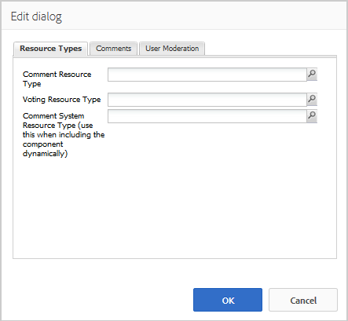

# Utilisation des commentaires {#using-comments}

## Présentation {#introduction}

La fonction Commentaires permet aux visiteurs connectés (membres) d’échanger leurs opinions et leurs connaissances concernant le contenu du site. Cette fonction est souvent déjà présente dans d’autres fonctions, mais peut être ajoutée à n’importe quel site web.

Le document décrit :

* Adding `Comments` to a page.
* Configuration settings for the `Comments` component.

>[!NOTE]
>
>La publication anonyme d’un commentaire n’est pas possible. Les visiteurs du site doivent s&#39;inscrire (devenir membre) et se connecter pour participer.

### Ajout de commentaires à une page {#adding-comments-to-a-page}

To add a `Comments` component to a page in author mode, use the component browser to locate

* `Communities / Comments`

et faites glisser le composant sur une page, par exemple à un endroit relatif à la fonction pour que les utilisateurs puissent commenter, ou simplement au bas de la page.

For necessary information, visit [Communities Components Basics](/help/communities/basics.md).

When the [required client-side libraries](/help/communities/essentials-comments.md#essentials-for-client-side) are included, this is how the `Comments` component appears.

>[!NOTE]
>
>Only one `Comments` component may exist on a page. Sachez que de nombreuses fonctions d’AEM Communities incluent déjà des commentaires. C’est le cas des blogs, des calendriers, des forums, des Q&amp;R et des révisions.

### Configuration des commentaires {#configuring-comments}

Select the placed `Comments` component to access and select the `Configure` icon which opens the edit dialog.

#### Comments tab {#comments-tab}

Sous l’onglet **Commentaires**, indiquez la façon dont les commentaires seront entrés par les visiteurs.

* **Autoriser les réponses**

   Si cette option est cochée, permet aux membres de répondre aux commentaires existants. La valeur par défaut est désélectionnée.

* **Commentaires par page**

   Limite le nombre de commentaires affichés par page et le nombre de réponses affichées. La valeur par défaut est 10.

* **Autoriser les transferts de fichiers**

   Si cette case est cochée, l’option de téléchargement d’un fichier s’affiche avec la zone de texte. La valeur par défaut est désélectionnée.

* **Taille maximale du fichier**

   N’est pertinent que si l’option Autoriser les téléchargements de fichiers est cochée. Cette valeur limite la taille du fichier téléchargé. La limite par défaut est de 10 Mo.

* **Longueur de message max.**

   Nombre maximal de caractères pouvant être saisis dans la zone de texte. La valeur par défaut est de 4 096 caractères.

* **Types de fichier autorisés**

   N’est pertinent que si l’option Autoriser les téléchargements de fichiers est cochée. liste séparée par des virgules d’extensions de nom de fichier avec le séparateur &quot;point&quot;. Par exemple : .jpg, .jpeg, .png, .doc, .docx, .pdf. Si des types de fichier sont spécifiés, ceux qui ne sont pas spécifiés ne sont pas autorisés. Par défaut, aucun type de fichier n’est spécifié, de sorte que tous les types de fichier soient autorisés.

* **Éditeur de texte enrichi**

   Si cette case est cochée, les commentaires sont saisis avec une annotation. La valeur par défaut est désélectionnée.

* **Autoriser le vote**

   Si cette case est cochée, l&#39;option de vote vers le haut ou vers le bas est présentée avec la zone de texte. La valeur par défaut est désélectionnée.

* **Autoriser abonnement**

   Si cette option est cochée, autorisez les membres à suivre les commentaires. La valeur par défaut est désélectionnée.

* **Afficher les badges**

   Si coché, autoriser l&#39;affichage des badges gagnés et attribués. La valeur par défaut est désélectionnée.

#### Onglet Modération utilisateur {#user-moderation-tab}

Under the **User Moderation** tab, specify how the posted comments are managed. Pour plus d’informations, voir [Modération de contenu généré par les utilisateurs](/help/communities/moderate-ugc.md).

* **Prémodération**

   Si cette case est cochée, les commentaires doivent être approuvés avant d’apparaître sur un site de publication. La valeur par défaut est désélectionnée.

* **Supprimer les commentaires**

   Si cette case est cochée, le membre qui a publié le commentaire peut le supprimer. La valeur par défaut est désélectionnée.

* **Refuser les commentaires**

   Si cette option est cochée, autorisez les modérateurs à refuser les commentaires. La valeur par défaut est désélectionnée.

* **Fermer/rouvrir les commentaires**

   Si cette option est cochée, autorisez les modérateurs à fermer et rouvrir les commentaires. La valeur par défaut est désélectionnée.

* **Marquer les commentaires**

   Si cette option est cochée, autorisez les membres à signaler les commentaires comme inappropriés. La valeur par défaut est désélectionnée.

* **Marquer la liste de motifs**

   Si cette option est cochée, permettez aux membres de choisir, dans une liste déroulante, la raison pour laquelle ils signalent un commentaire comme inapproprié. La valeur par défaut est désélectionnée.

* **Motif de la marque personnalisée**

   Si cette option est cochée, autorisez les membres à indiquer leur propre raison de signaler un commentaire comme inapproprié. La valeur par défaut est désélectionnée.

* **Seuil de modération**

   Entrez le nombre de fois où un commentaire doit être marqué par les membres avant que les modérateurs ne soient avertis. La valeur par défaut est une fois (1).

* **Limite de marquage**

   Indiquez le nombre de fois où un commentaire doit être marqué avant d’être masqué dans la vue publique. Dans le cas contraire, cette valeur doit être supérieure ou égale au **seuil de modération**. La valeur par défaut est 5.

#### Onglet Paramètres de tri {#sort-settings-tab}

Sous l’onglet Paramètres **de** tri, indiquez comment les commentaires publiés sont triés lorsqu’ils s’affichent.

* **Champ de tri**

   Appuyez sur la touche &lt;Entrée> pour sélectionner l’une des options `Newest, Oldest, Last Updated, Most Viewed, Most Active, Most Followed`, ou `Most Liked`.

* **Ordre de tri**

   Maintenez la touche enfoncée pour sélectionner l’un des `Ascending` ou `Descending`.

### Modification d’un type de commentaire personnalisé {#changing-to-a-custom-comment-type}

En modifiant le type de ressource Commentaire, le système de commentaires ne génère plus une instance de commentaire à l’aide de la valeur par défaut, mais une instance qui a été personnalisée (étendue) par les développeurs.

Once the custom resource types are known, enter [Design Mode](/help/sites-authoring/default-components-designmode.md) and double click the placed `Comments` component to open a dialog with an extra tab.

Under the **Resource Types** tab, specify the custom resourceType for new instances of the `Comments or Voting` components:

* **Type de ressource de commentaire**

   Accédez à resourceType d&#39;un `comment` composant étendu (commentaire unique) dans /apps. Par exemple, `/apps/social/commons/components/hbs/comments/comment`

   Cette ressource identifie le type de ressource de l&#39;UGC créé lorsqu&#39;un visiteur publie un commentaire.

* **Type de ressource de vote**

   Accédez à resourceType d&#39;un `voting` composant étendu dans /apps. Par exemple, `/apps/social/components/hbs/voting`

   Cette ressource identifie le type de ressource de l&#39;UGC créé lorsqu&#39;un visiteur publie un vote.

* **Type de ressource système de commentaires**

   Accédez à resourceType d&#39;un `comments`composant étendu (système de commentaires) dans /apps. Leave blank unless the page template [dynamically includes](/help/communities/scf.md#add-or-include-a-communities-component) the Comment System in the underlying script instead of being added to the page as a resource (comments node). Learn more by reading about the [{{include}} helper](/help/communities/handlebars-helpers.md#include).

### Expérience des visiteurs {#site-visitor-experience}

#### Modérateurs et administrateurs {#moderators-and-administrators}

Lorsque l’utilisateur connecté dispose de privilèges de modérateur ou d’administrateur, il peut se charger d’activités de modération autorisées par la configuration du composant, peu importe qui a créé le commentaire.

#### Membres {#members}

Lorsque le visiteur est connecté, selon la configuration, il peut :

* Publier un nouveau commentaire
* Modifier leur propre commentaire
* Supprimer leur propre commentaire
* Signaler les commentaires des autres

#### Anonyme {#anonymous}

Les visiteurs non connectés peuvent lire les commentaires et les traduire lorsque cela est possible. Toutefois, ils ne sont pas autorisés à ajouter un commentaire, ni à marquer les commentaires d’autres membres.

### Informations supplémentaires {#additional-information}

More information may be found on the [Comments Essentials](/help/communities/essentials-comments.md) page for developers.

For moderation of posted comments, see [Moderating User Generated Content](/help/communities/moderate-ugc.md).

Pour des informations sur la traduction des commentaires publiés, voir [Traduction de contenu généré par les utilisateurs](/help/communities/translate-ugc.md).
