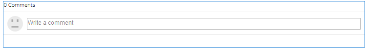
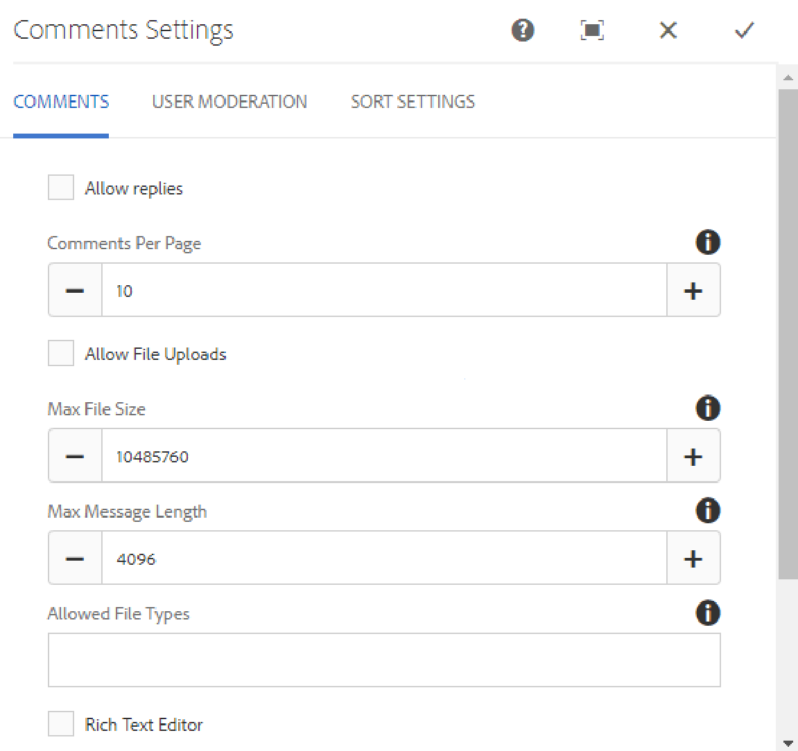
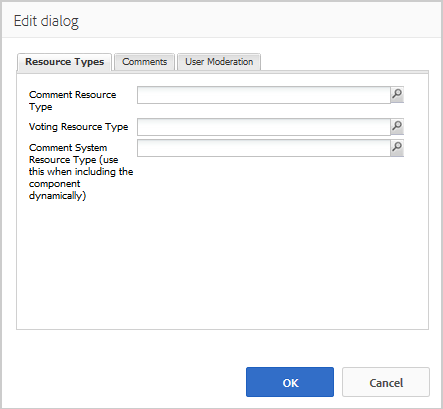

# Utilisation des commentaires {#using-comments}

## Présentation {#introduction}

La fonction de commentaires permet aux visiteurs (membres) connectés de partager leurs opinions et leurs connaissances concernant le contenu du site. Cette fonctionnalité est souvent déjà présente dans d’autres fonctionnalités, mais peut être ajoutée à n’importe quel site web.

Le document décrit :

* Ajout de `Comments` à une page.
* Paramètres de configuration du composant `Comments`.

>[!NOTE]
>
>La publication anonyme d’un commentaire n’est pas prise en charge. Les visiteurs et visiteuses du site doivent s’inscrire (devenir membre) et se connecter pour participer.

### Ajout de commentaires à une page {#adding-comments-to-a-page}

Pour ajouter un composant `Comments` à une page en mode création, utilisez l’explorateur de composants pour localiser .

* `Communities / Comments`

et faites-le glisser sur une page, par exemple une position relative à la fonction sur laquelle les utilisateurs pourront ajouter des commentaires, ou simplement en bas de la page.

Pour plus d’informations, consultez [Principes de base des composants de communautés](/help/communities/basics.md).

Lorsque les [bibliothèques côté client requises](/help/communities/essentials-comments.md#essentials-for-client-side) sont incluses, le composant `Comments` s’affiche de cette manière.

>[!NOTE]
>
>Un seul composant `Comments` peut exister sur une page. Gardez à l’esprit que plusieurs fonctionnalités de Communities incluent déjà des commentaires, tels qu’un blog, un calendrier, un forum, un QnA et des avis.

### Configuration des commentaires {#configuring-comments}

Sélectionnez le composant de `Comments` placé auquel accéder, puis sélectionnez l’icône `Configure` qui ouvre la boîte de dialogue de modification.

#### Onglet Commentaires {#comments-tab}

Sous l’onglet **Commentaires**, spécifiez la manière dont les commentaires sont saisis par les visiteurs.

* **Autoriser les réponses**

  Si cette case est cochée, permet aux membres de répondre aux commentaires existants. La valeur par défaut est désélectionnée.

* **Commentaires par page**

  Limite le nombre de commentaires affichés par page et le nombre de réponses affichées. La valeur par défaut est 10.

* **Autoriser les chargements de fichiers**

  Si cette option est cochée, l’option de téléchargement de fichier s’affiche avec la zone de texte. La valeur par défaut est désélectionnée.

* **Taille de fichier max**

  Pertinent uniquement si Autoriser le chargement de fichiers est coché. Cette valeur limite la taille du fichier chargé. La limite par défaut est de 10 Mo.

* **Longueur max. du message**

  Nombre maximal de caractères pouvant être saisis dans la zone de texte. La valeur par défaut est de 4 096 caractères.

* **Types de fichiers autorisés**

  Pertinent uniquement si Autoriser le chargement de fichiers est coché. Liste d’extensions de nom de fichier séparées par des virgules avec le séparateur « point ». Par exemple : .jpg, .jpeg, .png, .doc, .docx, .pdf. Si des types de fichiers sont spécifiés, ceux qui ne le sont pas ne sont pas autorisés. Par défaut, aucun fichier n’est spécifié, de sorte que tous les types de fichiers soient autorisés.

* **Éditeur de texte enrichi**

  Si cette case est cochée, les commentaires sont saisis avec des balises. La valeur par défaut est désélectionnée.

* **Autoriser le vote**

  Si cette option est cochée, l’option de vote pour ou contre est présentée avec la zone de saisie de texte. La valeur par défaut est désélectionnée.

* **Autoriser les éléments suivants**

  Si cette case est cochée, autoriser les membres à suivre les commentaires. La valeur par défaut est désélectionnée.

* **Afficher les badges**

  Si cette case est cochée, autorisez l’affichage des badges gagnés et attribués. La valeur par défaut est désélectionnée.

#### Onglet Modération des utilisateurs {#user-moderation-tab}

Sous l’onglet **Modération des utilisateurs**, spécifiez la manière dont les commentaires publiés sont gérés. Pour plus d’informations, voir [Modération du contenu créé par l’utilisateur](/help/communities/moderate-ugc.md).

* **Pré-Modération**

  Si cette option est cochée, les commentaires doivent être approuvés avant d’apparaître sur un site de publication. La valeur par défaut est désélectionnée.

* **Supprimer les commentaires**

  Si cette case est cochée, le membre qui a publié le commentaire peut le supprimer. La valeur par défaut est désélectionnée.

* **Refuser les commentaires**

  Si cette case est cochée, autoriser les modérateurs à refuser les commentaires. La valeur par défaut est désélectionnée.

* **Fermer/Rouvrir les commentaires**

  Si cette case est cochée, autorisez les modérateurs à fermer et à rouvrir les commentaires. La valeur par défaut est désélectionnée.

* **Signaler les commentaires**

  Si cette case est cochée, autorisez les membres à signaler les commentaires comme inappropriés. La valeur par défaut est désélectionnée.

* **Liste des motifs de l&#39;indicateur**

  Si cette case est cochée, permet aux membres de choisir, dans une liste déroulante, la raison pour laquelle ils signalent un commentaire comme inapproprié. La valeur par défaut est désélectionnée.

* **Motif de l’indicateur personnalisé**

  Si cette case est cochée, permet aux membres de saisir leur propre raison pour laquelle un commentaire n&#39;est pas approprié. La valeur par défaut est désélectionnée.

* **Seuil de modération**

  Permet d&#39;entrer le nombre de fois où un commentaire doit être marqué par les membres avant que les modérateurs ne soient avertis. La valeur par défaut est une fois (1).

* **Limite de marquage**

  Permet d&#39;entrer le nombre de fois où un commentaire doit être marqué avant d&#39;être masqué de la vue publique. Ce nombre doit être supérieur ou égal au **seuil de modération**. La valeur par défaut est 5.

#### Onglet Paramètres de tri {#sort-settings-tab}

Sous l’onglet **Paramètres de tri**, indiquez comment les commentaires publiés sont triés lorsqu’ils sont affichés.

* **Champ de tri**

  Faites défiler l’écran vers le bas pour sélectionner l’une des options `Newest, Oldest, Last Updated, Most Viewed, Most Active, Most Followed` ou `Most Liked`.

* **Ordre de tri**

  Faites glisser vers le bas pour sélectionner l’une des options `Ascending` ou `Descending`.

### Modification en un type de commentaire personnalisé {#changing-to-a-custom-comment-type}

En modifiant le Type de ressource Commentaire, le système de commentaires ne génère plus une instance de commentaire à l’aide de la valeur par défaut, mais une instance personnalisée (étendue) par les développeurs.

Une fois les types de ressources personnalisés connus, accédez au [Mode de conception](/help/sites-authoring/default-components-designmode.md) et double-cliquez sur le composant de `Comments` placé pour ouvrir une boîte de dialogue avec un onglet supplémentaire.

Sous l’onglet **Types de ressources**, spécifiez le type de ressource personnalisé pour les nouvelles instances des composants `Comments or Voting` :

* **Type de ressource Commentaire**

  Accédez au type de ressource d’un composant `comment` étendu (commentaire unique) dans /apps. Par exemple, `/apps/social/commons/components/hbs/comments/comment`.

  Cette ressource identifie le type de ressource du contenu créé par l’utilisateur créé lorsqu’un visiteur publie un commentaire.

* **Type de ressource de vote**

  Accédez à resourceType d’un composant `voting` étendu dans /apps. Par exemple, `/apps/social/components/hbs/voting`.

  Cette ressource identifie le type de ressource du contenu créé par l’utilisateur créé lorsqu’un visiteur publie un vote.

* **Commenter le type de ressource système**

  Accédez au type de ressource d’un composant `comments`système de commentaires) étendu dans /apps. Laissez ce champ vide, sauf si le modèle de page [inclut dynamiquement](/help/communities/scf.md#add-or-include-a-communities-component) le système de commentaires dans le script sous-jacent au lieu d’être ajouté à la page en tant que ressource (nœud comments). En savoir plus en consultant la section sur l’assistant ](/help/communities/handlebars-helpers.md#include).[`{{include}}`

### Expérience du visiteur du site {#site-visitor-experience}

#### Modérateurs et administrateurs {#moderators-and-administrators}

Lorsque l’utilisateur connecté dispose des privilèges de modérateur ou d’administrateur, il peut effectuer les tâches de modération autorisées par la configuration du composant, quelle que soit la personne qui a créé le commentaire.

#### Membres {#members}

Lorsque le visiteur du site est connecté, selon la configuration, il peut

* Publier un nouveau commentaire
* Modifier leur propre commentaire
* Supprimer leur propre commentaire
* Signaler les commentaires des autres

#### Anonyme {#anonymous}

Les visiteurs et visiteuses du site qui ne sont pas connectés peuvent uniquement lire les commentaires publiés, les traduire si pris en charge, mais peuvent ne pas ajouter de commentaire ni marquer les commentaires des autres.

### Informations supplémentaires {#additional-information}

Vous trouverez plus d’informations à ce sujet sur la page [Comments Essentials](/help/communities/essentials-comments.md) destinée aux développeurs et développeuses.

Pour la modération des commentaires publiés, voir [Modération du contenu créé par l’utilisateur](/help/communities/moderate-ugc.md).

Pour la traduction des commentaires publiés, voir [ Traduction de contenu créé par l’utilisateur ](/help/communities/translate-ugc.md).
