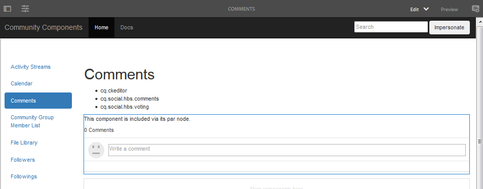
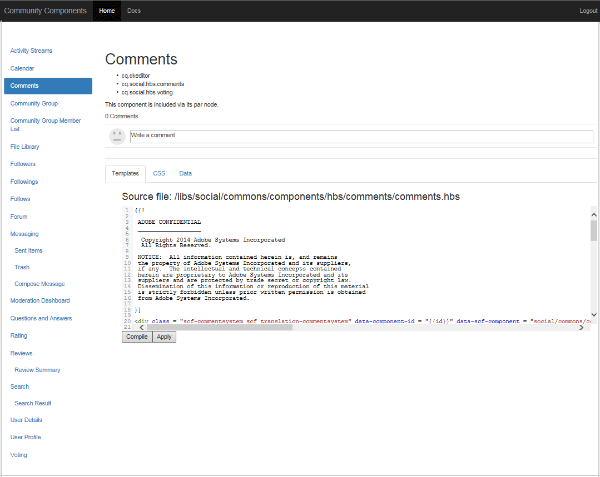

# Guide de composants de communauté  {#community-components-guide}

Le guide Composants de la communauté est un outil de développement interactif pour la [structure de composants sociaux (SCF)](scf.md). Il fournit une liste des composants AEM Communities disponibles ou des fonctionnalités plus complexes composées de plusieurs composants.

Outre les informations de base pour chaque composant, le guide permet d’expérimenter le fonctionnement des composants/fonctionnalités SCF et leur configuration ou personnalisation.

Pour plus d’informations sur les éléments essentiels de développement associés à chaque composant, voir [Notions fondamentales sur les fonctionnalités et les composants](essentials.md).

## Prise en main {#getting-started}

Ce guide est destiné aux installations de développement des instances de création (localhost:4502) et de publication (localhost:4503).

Le site Composants de la communauté est accessible en accédant à

* [https://&lt;server> : &lt;port>/content/community-components/en.html](http://localhost:4502/content/community-components/en.html)

Les interactions avec les composants Communities varient en fonction des éléments suivants :

* Serveur (auteur ou publication).
* Indique si le visiteur du site est connecté ou non.
* S’il est connecté, les privilèges affectés au membre.
* Si la SRP par défaut, [JSRP](jsrp.md), est ou non utilisée.

Sur l’auteur, pour passer en mode d’édition, insérez `editor.html` ou `cf#` comme premier segment de chemin d’accès après le nom du serveur :

* Interface utilisateur standard:

   [https://&lt;server> : &lt;port>/editor.html/content/community-components/en.html](http://localhost:4502/editor.html/content/community-components/en.html)

* IU classique :

   [https://&lt;server>:&lt;port>/cf#/content/community-components/en.html](http://localhost:4502/cf#/content/community-components/en.html)

>[!NOTE]
>
>En mode d’édition, les liens d’une page ne sont pas principaux.
>
>Pour accéder à une page de composant, sélectionnez tout d’abord le mode Aperçu pour activer les liens.
>
>La page du composant s’affichant dans le navigateur, revenez au mode d’ édition afin d’ouvrir la boîte de dialogue de modification du composant.
>
>Pour obtenir des informations générales sur la création, consultez le [guide rapide sur la création de pages](../../help/sites-authoring/qg-page-authoring.md).
>
>Si vous ne connaissez pas AEM, consultez la documentation sur la [gestion de base](../../help/sites-authoring/basic-handling.md).

### Page d’accueil {#home-page}

Le guide fournit une liste des composants SCF disponibles pour l’aperçu et le prototypage le long du côté gauche de la page.

Guide des composants tel qu’affiché sur une instance de création en mode d’édition :

## Pages de composants {#component-pages}

Sélectionnez un composant dans la liste située le long du côté gauche de la page.

Le corps principal du guide affiche :

1. Titre : Nom du composant sélectionné
1. [Bibliothèques](#client-side-libraries) côté client : Liste d’une ou de plusieurs catégories obligatoires
1. [Incluable](scf.md#add-or-include-a-communities-component) : Si le composant peut être inclus dynamiquement, l’état peut être basculé en mode d’édition de création :

   * En cas d’ajout, le texte affiché est le suivant : &quot;Ce composant est inclus via son noeud par.&quot;
   * Si inclus, le texte affiché est : &quot;Ce composant est inclus dynamiquement.&quot;
   * Si elle n’est pas incluse, aucun texte n’est affiché.

1. Exemple de composant ou de fonctionnalité : une instance principale du composant ou de la fonctionnalité. Si un composant est modifié, il peut l’être avec les modifications apportées aux modèles, aux CSS et aux données fournies dans la section des onglets.

>[!NOTE]
>
>Après avoir effectué une sélection à gauche, le composant apparaît en dessous, plutôt qu’à côté, de la liste des composants lorsque la fenêtre du navigateur est trop étroite.

### Interactions de création {#author-interactions}

Lorsque vous utilisez le guide sur une instance d’auteur, il est possible de configurer un composant en ouvrant sa boîte de dialogue. Les informations pour les développeurs sont fournies dans la section [Notions fondamentales sur les composants et les fonctionnalités](essentials.md) de la documentation, tandis que les paramètres de la boîte de dialogue sont décrits dans la section [Composants communautaires](author-communities.md) pour les auteurs.

Pour le guide Composants de la communauté , certains paramètres de la boîte de dialogue de composant sont superposés avec l’état de basculement [Incluable](scf.md#add-or-include-a-communities-component) . Pour basculer entre l’utilisation de la ressource existante ou d’une ressource incluse dynamiquement, en mode d’édition, sélectionnez le composant et le texte inclusible, puis double-cliquez pour ouvrir la boîte de dialogue de modification :

Sous l’onglet **Modèles** :

* **Inclure le composant enfant avec sling:include**

   Si cette option n’est pas cochée, le guide des composants utilise la ressource existante dans le référentiel (un noeud jcr enfant d’un noeud par).

   * Le texte affiché est : &quot;Ce composant est inclus via son noeud par.&quot;

   Si cette case est cochée, le guide des composants utilise sling pour inclure de manière dynamique un composant de resourceType du noeud enfant (ressource non existante).

   * Le texte affiché est : &quot;Ce composant est inclus dynamiquement.&quot;

   Cette option n’est pas cochée par défaut.

### Interactions de publication {#publish-interactions}

Lors de l’utilisation du guide sur une instance de publication, il est possible d’expérimenter les composants et fonctionnalités en tant que visiteur du site (non connecté) et en tant que membres disposant de divers privilèges lorsqu’ils sont connectés.

>[!NOTE]
>
>N’oubliez pas que si la valeur par défaut de la SRP est [JSRP](jsrp.md), le contenu généré par l’utilisateur entré sur l’instance de publication sera uniquement visible lors de la publication et *pas* sera visible à partir de la console [modération](moderate-ugc.md) sur l’instance d’auteur.

## Bibliothèques côté client {#client-side-libraries}

Les bibliothèques côté client (clientlibs) répertoriées pour chaque composant sont celles *requises* à référencer lorsque le composant est placé sur une page. Les clientlibs permettent de gérer et d’optimiser le téléchargement du code JavaScript et CSS utilisé pour le rendu du composant dans le navigateur.

Pour plus d’informations, voir [Clientlibs for Communities Components](clientlibs.md).

## Emprunt d’identité {#impersonation}

Sur l’instance d’auteur, où un utilisateur est souvent connecté en tant qu’administrateur ou développeur, pour tester le composant connecté en tant qu’autre utilisateur, utilisez la zone de texte située à gauche du bouton **[!UICONTROL Emprunter l’identité]** pour saisir le nom d’utilisateur ou sélectionner dans la liste déroulante, puis cliquez sur le bouton. Cliquez sur Rétablir pour vous déconnecter et terminer l’emprunt d’identité.

Il n’est pas nécessaire d’emprunter l’identité de l’instance de publication. Utilisez simplement le lien Connexion/Déconnexion pour emprunter l’identité de divers utilisateurs, tels que les [utilisateurs de démonstration](tutorials.md#demo-users).

## Personnalisation {#customization}

Une fois activé, chaque composant SCF est disponible pour le prototypage de personnalisations possibles en modifiant temporairement le modèle, le CSS et les données du composant.

### Activation de la personnalisation {#enabling-customization}

>[!NOTE]
>
>**Cet outil est en lecture seule**. Aucune des modifications apportées aux modèles, aux CSS ou aux données n’est enregistrée dans le référentiel.

Pour tester rapidement les personnalisations, la propriété `scg:showIde`doit être ajoutée au noeud de contenu JCR de la page de composant et définie sur true.

En utilisant le composant de commentaires comme exemple, sur l’instance d’auteur ou de publication, connectez-vous avec les privilèges d’administrateur :

1. Accédez à [CRXDE Lite](../../help/sites-developing/developing-with-crxde-lite.md)

   Par exemple, [http://localhost:4503/crx/de](http://localhost:4503/crx/de)

1. Sélectionnez le noeud `jcr:content` du composant.

   Par exemple, `/content/community-components/en/comments/jcr:content`

1. Ajouter une propriété

   * **Nom** `scg:showIde`
   * **Type** `String`
   * **Valeur** `true`

1. Sélectionnez **[!UICONTROL Enregistrer tout]**.
1. Rechargez la page Commentaires du guide.

   [http://localhost:4503/content/community-components/en/comments.html](http://localhost:4503/content/community-components/en/comments.html)

1. Notez qu’il existe désormais 3 onglets pour les modèles, CSS et Data.

### Onglet Modèles {#templates-tab}

Sélectionnez l’onglet Modèles pour afficher les modèles associés au composant.

L’éditeur de modèles permet de compiler et d’appliquer les modifications locales à l’instance d’exemple de composant en haut de la page sans affecter le composant dans le référentiel.

L’exécution de la compilation sur les modifications locales permet de mettre en évidence les erreurs en plaçant un point dans la corbeille et en marquant le texte en rouge.

### Onglet CSS {#css-tab}

Sélectionnez l’onglet CSS pour afficher le CSS associé au composant.

Si un composant est un composite de plusieurs composants, certains CSS peuvent être répertoriés sous l’un des autres composants.

L’éditeur CSS permet de modifier et d’appliquer le CSS à l’exemple d’instance de composant en haut de la page.

Une règle peut être sélectionnée pour mettre en surbrillance les parties du DOM à l’aide de cette règle en cliquant sur en regard de la règle dans la barre oblique.

### Onglet Données {#data-tab}

Sélectionnez l’onglet Données pour afficher les données du point d’entrée .social.json . Ces données sont modifiables et appliquées à l’exemple d’instance de composant.

Les erreurs de syntaxe peuvent être marquées dans la corbeille et mises en évidence dans l’éditeur.
