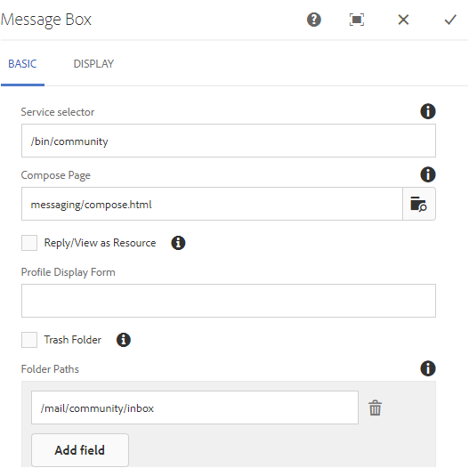
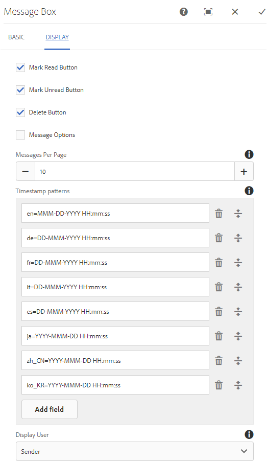
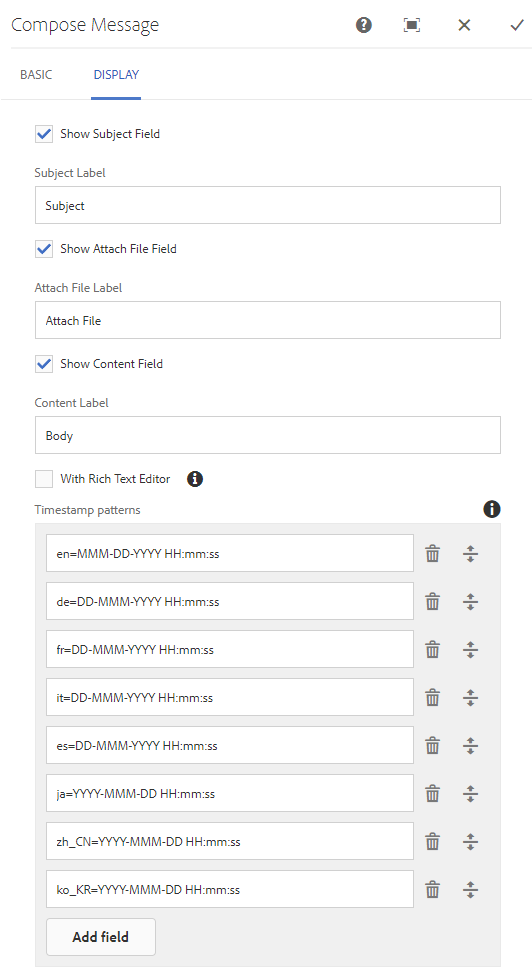

# Fonctionnalité de messagerie {#messaging-feature}

Outre les interactions visibles publiquement qui se produisent dans les forums et les commentaires, la fonction de messagerie d’AEM Communities permet aux membres de la communauté d’interagir les uns avec les autres de manière plus privée.

Cette fonctionnalité peut être incluse lors de la création d’un [site communautaire](/help/communities/overview.md#communitiessites).

La fonctionnalité de messagerie vous permet d’effectuer les opérations suivantes :

**A** - Envoyez un message à un ou plusieurs membres de la communauté

**B** - envoyez des messages directs en [bloc aux groupes membres de la communauté](/help/communities/messaging.md#group-messaging)

**C** - Envoyez un message avec des pièces jointes

**D** - Transférer un message

**E** - Répondre à un message

**F** - Supprimer un message

**G** - Restaurer un message supprimé

Pour activer et modifier la fonction de messagerie, voir :

* [Configurer la messagerie](/help/communities/messaging.md) pour les administrateurs
* [Messaging Essentials](/help/communities/essentials-messaging.md) pour les développeurs

>[!NOTE]
>
>Il n’est pas pris en charge d’ajouter des composants `Compose Message, Message, or Message List` (qui se trouvent dans `Communities`groupe de composants) à une page en mode d’édition Création.

## Configuration des composants de messagerie {#configure-messaging-components}

Lorsque la messagerie est activée pour un site communautaire, elle est configurée sans autre configuration nécessaire. Les informations sont fournies s’il est nécessaire de modifier la configuration par défaut.

### Configurer la liste de messages (zone de message) {#configure-message-list-message-box}

Pour modifier la configuration de la liste des messages pour les pages **Boîte de réception**, **Éléments envoyés** et **Corbeille** de la fonctionnalité de messagerie, ouvrez le site en [mode d’édition Auteur](/help/communities/sites-console.md#authoring-site-content).

1. En mode `Preview`, sélectionnez le lien **Messages** pour ouvrir la page principale de la messagerie. Sélectionnez ensuite **Boîte de réception**, **Éléments envoyés** ou **Corbeille** pour configurer le composant de cette liste de messages.

1. En mode `Edit`, sélectionnez le composant sur la page.
1. Pour accéder à la boîte de dialogue de configuration, annulez l’héritage en sélectionnant l’icône `link` .Une fois l’héritage annulé, il est possible de sélectionner l’icône de configuration pour ouvrir la boîte de dialogue de configuration.

1. Une fois la configuration terminée, il est nécessaire de restaurer l’héritage en sélectionnant l’icône `broken link` .

#### Onglet de base {#basic-tab}

* **Sélecteur de service**

  (*Obligatoire*) Définissez-le sur la valeur de la propriété **`serviceSelector.name`** du service [Opérations de messagerie AEM Communities](/help/communities/messaging.md#messaging-operations-service).

* **Composer la page**

  (*Obligatoire*) Page à ouvrir lorsqu’un membre clique sur le bouton **`Reply`**. La page cible doit contenir le formulaire **Composer le message**.

* **Répondre/Afficher comme ressource**

  Si cette case est cochée, l’URL de réponse et l’URL d’affichage font référence à une ressource, ou bien les données sont transmises en tant que paramètres de requête dans l’URL.

* **Formulaire d’affichage du profil**

  Formulaire de profil à utiliser pour afficher le profil de l’expéditeur.

* **Dossier de la corbeille**

  Si cette case est cochée, ce composant Liste de messages affiche uniquement les messages marqués comme supprimés (corbeille).

* **Chemins d’accès aux dossiers**

  (*Obligatoire*) Référencement des valeurs définies pour **inbox.path.name** et **sentitems.path.name** dans le service [Opérations de messagerie AEM Communities](/help/communities/messaging.md#messaging-operations-service). Lors de la configuration d’pour une `Inbox`, ajoutez une entrée en utilisant la valeur de **inbox.path.name**. Lors de la configuration d’pour une `Outbox`, ajoutez une entrée en utilisant la valeur de **sentitems.path.name**. Lors de la configuration de pour `Trash`, ajoutez deux entrées avec les deux valeurs.

#### Onglet Affichage {#display-tab}

* **Bouton Marquer comme lu**

  Si cette case est cochée, affiche un bouton `Read` permettant de marquer un message comme lu.

* **Bouton Marquer comme non lu**

  Si cette case est cochée, affiche un bouton `Mark Unread` permettant de marquer un message comme lu.

* **Bouton Supprimer**

  Si cette case est cochée, affiche un bouton `Delete` permettant de marquer un message comme lu. Duplique la fonctionnalité de suppression si **`Message Options`** est également coché.

* **Options de message**

  Si cette case est cochée, affiche les boutons **`Reply`**, **`Reply All`**, **`Forward`** et **`Delete`** permettant de renvoyer ou supprimer un message. Duplique la fonctionnalité de suppression si **`Delete Button`** est également coché.

* **Messages Par Page**

  Le nombre spécifié est le nombre maximal de messages affichés par page dans un schéma de pagination. Si aucun nombre n’est spécifié (laissé vide), tous les messages sont affichés et il n’y a pas de pagination.

* **Modèles d’horodatage**

  Fournissez des modèles d’horodatage pour une ou plusieurs langues. La valeur par défaut est pour en, de, fr, it, es, ja, zh_CN, ko_KR.

* **Afficher utilisateur**

  Choisissez **`Sender`** ou **`Recipients`** afin de déterminer s’il faut afficher l’expéditeur ou les destinataires.

### Configurer la composition du message {#configure-compose-message}

Pour modifier la configuration de la page de message de composition, ouvrez le site en [mode d’édition auteur](/help/communities/sites-console.md#authoring-site-content).

* En mode `Preview`, sélectionnez le lien **Messages** pour ouvrir la page principale de la messagerie. Sélectionnez ensuite le bouton Nouveau message pour ouvrir la page `Compose Message`.

* En mode `Edit`, sélectionnez le composant principal sur la page contenant le corps du message.
* Pour accéder à la boîte de dialogue de configuration, annulez l’héritage en sélectionnant l’icône `link` .Une fois l’héritage annulé, il est possible de sélectionner l’icône de configuration pour ouvrir la boîte de dialogue de configuration.

* Une fois la configuration terminée, il est nécessaire de restaurer l’héritage en sélectionnant l’icône `broken link` .

#### Onglet de base {#basic-tab-1}

* **URL de redirection.**

  Saisissez l’URL de la page affichée après l’envoi du message. Par exemple, `../messaging.html`.

* **Annuler URL**

  Saisissez l’URL de la page affichée si l’expéditeur annule le message. Par exemple, `../messaging.html`.

* **Longueur maximale de l’objet du message**

  Nombre maximal de caractères autorisés dans le champ Objet. Par exemple, 500. La valeur par défaut n’est pas une limite.

* **Longueur maximale du corps du message**

  Nombre maximal de caractères autorisés dans le champ Contenu. Par exemple, 10000. La valeur par défaut n’est pas une limite.

* **Sélecteur de service**

  (*Obligatoire*) Définissez-le sur la valeur de la propriété **`serviceSelector.name`** du service [Opérations de messagerie AEM Communities](/help/communities/messaging.md#messaging-operations-service).

#### Onglet Affichage {#display-tab-1}

* **Afficher le champ Objet**

  Si cette case est cochée, afficher le champ `Subject` et activer l’ajout d’un objet au message. Valeur par défaut non cochée.

* **Libellé du sujet**

  Saisissez le texte à afficher en regard du champ `Subject`. La valeur par défaut est `Subject`.

* **Afficher le champ Joindre un fichier**

  Si cette case est cochée, afficher le champ `Attachment` et activer l’ajout de pièces jointes au message. Valeur par défaut non cochée.

* **Joindre un libellé de fichier**

  Saisissez le texte à afficher en regard du champ `Attachment`. La valeur par défaut est **`Attach File`**.

* **Afficher le champ de contenu**

  Si cette case est cochée, afficher le champ `Content` et activer l’ajout d’un corps de message. Valeur par défaut non cochée.

* **Libellé du contenu**

  Saisissez le texte à afficher en regard du champ `Content`. La valeur par défaut est **`Body`**.

* **Avec Éditeur De Texte Enrichi**

  Si cette case est cochée, cela indique l’utilisation d’une zone de texte de contenu personnalisée avec son propre éditeur de texte enrichi. Valeur par défaut non cochée.

* **Modèles d’horodatage**

  Fournissez des modèles d’horodatage pour une ou plusieurs langues. La valeur par défaut est pour en, de, fr, it, es, ja, zh_CN, ko_KR.
