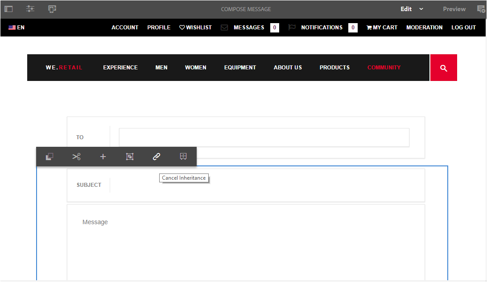

# Fonction de messagerie{#messaging-feature}

En plus des interactions visibles par le public qui se produisent dans les forums et les commentaires, la fonction de messagerie des** **communautés AEM permet aux membres de la communauté d’interagir entre eux de manière plus privée.

This feature can be included when a [community site](/help/communities/overview.md#communitiessites) is created.

La fonction de messagerie permet d’effectuer les opérations suivantes :

**A** - envoyer un message à un ou plusieurs membres **B** de la communauté - envoyer des messages directs en [masse aux groupes](/help/communities/messaging.md#group-messaging)membres de la communauté C **** - envoyer un message avec des pièces jointesD - faire suivre un message**E - **répondre à un message - supprimer un message**G **- restaurer un message supprimé&#x200B;********

 de message- 

Pour activer et modifier la fonction de messagerie, voir :

* [Configuration de la messagerie](/help/communities/messaging.md) pour les administrateurs
* [Messaging Essentials](/help/communities/essentials-messaging.md) pour les développeurs

>[!NOTE]
>
>Il n’est pas pris en charge d’ajouter `Compose Message, Message, or Message List` des composants (trouvés dans le groupe de `Communities`composants) à une page en mode d’édition Auteur.

## Configuration des composants de messagerie {#configure-messaging-components}

Lorsque la messagerie est activée pour un site communautaire, elle est configurée sans autre configuration nécessaire. Les informations sont fournies s’il est nécessaire de modifier la configuration par défaut.

### Configurer la liste des messages (boîte de message) {#configure-message-list-message-box}

Pour modifier la configuration de la liste des messages pour la **boîte** de réception, les éléments **envoyés et les **pages corbeille **pages de la fonction de messagerie, ouvrez le site en mode** d&#39;édition auteur.

1. En `Preview`mode, sélectionnez le lien **Messages **pour ouvrir la page de messagerie principale. Sélectionnez ensuite **Boîte de réception**, **Éléments envoyés **ou **Corbeille **pour configurer le composant pour cette liste de messages.

1. En `Edit` mode, sélectionnez le composant sur la page.
1. Pour accéder à la boîte de dialogue de configuration, annulez l’héritage en sélectionnant l’ `link`icône.
Une fois l’héritage annulé, il est possible de sélectionner l’icône Configurer pour ouvrir la boîte de dialogue de configuration.

1. Une fois la configuration terminée, il est nécessaire de restaurer l’héritage en sélectionnant l’ `broken link` icône.

#### Basic tab {#basic-tab}

* **Sélecteur** de service (*Obligatoire*) Définissez cette valeur sur la valeur de la propriété**`serviceSelector.name`** du service [d’opérations de messagerie des communautés](/help/communities/messaging.md#messaging-operations-service)AEM.

* **Composer la page**(*Obligatoire*) Page à ouvrir lorsqu&#39;un membre clique sur le **`Reply`**bouton. La page cible devrait contenir le formulaire **Composer le message.**

* **Répondre/Afficher en tant que ressource** Si vous cochez cette case, les URL de réponse et d’affichage font référence à une ressource. Dans le cas contraire, les données sont transmises sous forme de paramètres de requête dans l’URL. 

* **Formulaire d’affichage du profil** Formulaire de profil à utiliser pour afficher le profil de l’expéditeur.

* **Dossier Corbeille** Si vous cochez cette case, ce composant Liste des messages affiche uniquement les messages marqués comme supprimés (corbeille).

* **Chemins** du dossier (*Obligatoire*) Référence aux valeurs définies pour **inbox.path.name** et **stitems.path.name **dans le service [d’opérations de messagerie des communautés](/help/communities/messaging.md#messaging-operations-service)AEM. Lors de la configuration pour une `Inbox`, ajoutez une entrée à l’aide de la valeur **inbox.path.name**. Lors de la configuration d’une `Outbox`, ajoutez une entrée à l’aide de la valeur de **stitems.path.name**. Lors de la configuration pour `Trash`, ajoutez deux entrées avec les deux valeurs.

#### Onglet Affichage {#display-tab}

* **Marquer le bouton** Lu Si coché, affiche un `Read`bouton permettant de marquer un message comme lu.

* **Marquer le bouton** Non lu Si coché, affiche un `Mark Unread` bouton permettant de marquer un message comme lu.

* **Bouton** Supprimer Si coché, affiche un `Delete`bouton permettant de marquer un message comme lu. Will duplicate the delete functionality if **`Message Options`** is also checked.

* **Options** de message Si cette option est cochée, affiche **`Reply`**, **`Reply All`**, **`Forward`**et **`Delete`**les boutons permettant de renvoyer ou de supprimer un message. Will duplicate the delete functionality if **`Delete Button`** is also checked.

* **Messages par page** Le nombre spécifié est le nombre maximal de messages affichés par page dans le modèle de pagination. Si aucun chiffre n’est spécifié (si vous laissez le champ vide), tous les messages s’affichent sans pagination.

* **Modèles d’horodatage** Indiquez des modèles d’horodatage pour une ou plusieurs langues. Des valeurs sont fournies par défaut pour en, de, fr, it, es, ja, zh_CN et ko_KR.

* **Afficher l’utilisateur** Choisissez **`Sender`**ou **`Recipients`**pour déterminer s’il faut afficher l’expéditeur ou les destinataires.

### Configurer le message de composition {#configure-compose-message}

Pour modifier la configuration de la page de composition des messages, ouvrez le site en mode [d’édition](/help/communities/sites-console.md#authoring-site-content)auteur.

* En `Preview`mode, sélectionnez le lien **Messages **pour ouvrir la page de messagerie principale. Sélectionnez ensuite le bouton Nouveau message pour ouvrir la `Compose Message` page.

* En `Edit` mode, sélectionnez le composant principal sur la page contenant le corps du message.
* Pour accéder à la boîte de dialogue de configuration, annulez l’héritage en sélectionnant l’ `link`icône.
Une fois l’héritage annulé, il est possible de sélectionner l’icône Configurer pour ouvrir la boîte de dialogue de configuration.

* Une fois la configuration terminée, il est nécessaire de restaurer l’héritage en sélectionnant l’ `broken link`icône.

#### Basic tab {#basic-tab-1}

* **URL de redirection** Saisissez l’URL de la page affichée une fois le message envoyé. Par exemple, `../messaging.html`.

* **Annuler l’URL** Saisissez l’URL de la page affichée si l’expéditeur annule le message. Par exemple, `../messaging.html`.

* **Longueur maximale de l’objet du message** Nombre maximal de caractères autorisé dans le champ Objet. Par exemple, 500. La valeur par défaut n’est pas une limite.

* **Longueur maximale du corps du message** Nombre maximal de caractères autorisé dans le champ Contenu. Par exemple, 10000. La valeur par défaut n’est pas une limite.

* **Sélecteur** de service (*Obligatoire*) Définissez cette valeur sur la valeur de la propriété**`serviceSelector.name`** du service [d’opérations de messagerie des communautés](/help/communities/messaging.md#messaging-operations-service)AEM.

#### Onglet Affichage {#display-tab-1}

* **Afficher le champ** Objet Si cette option est cochée, affichez le `Subject` champ et activez l’ajout d’un objet au message. Cette option n’est pas cochée par défaut.

* **Etiquette** du sujet Entrez le texte à afficher en regard du `Subject` champ. La valeur par défaut est `Subject`.

* **Afficher le champ** Joindre le fichier Si coché, affichez le `Attachment` champ et activez l’ajout de pièces jointes au message. Cette option n’est pas cochée par défaut.

* **Joindre le libellé** du fichier Entrez le texte à afficher en regard du `Attachment` champ. La valeur par défaut est **`Attach File`**.

* **Afficher le champ** de contenu Si coché, affichez le `Content` champ et activez l’ajout d’un corps de message. Cette option n’est pas cochée par défaut.

* **Libellé** du contenu Entrez le texte à afficher en regard du `Content` champ. La valeur par défaut est **`Body`**.

* **Avec l’éditeur de texte enrichi** Si vous cochez cette case, une zone de texte personnalisée Contenu est utilisée avec son propre éditeur de texte enrichi. Cette option n’est pas cochée par défaut.

* **Modèles d’horodatage** Indiquez des modèles d’horodatage pour une ou plusieurs langues. Des valeurs sont fournies par défaut pour en, de, fr, it, es, ja, zh_CN et ko_KR.

