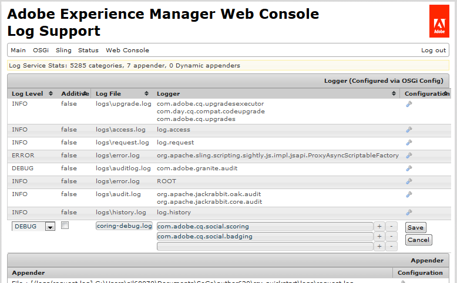
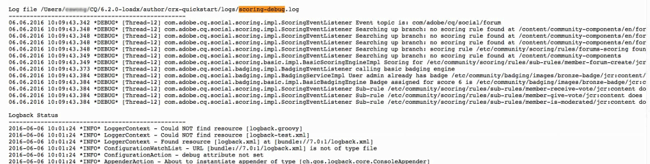
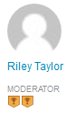
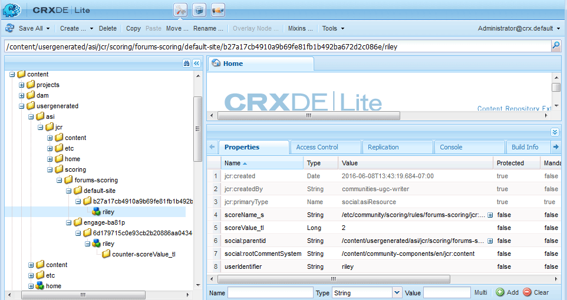
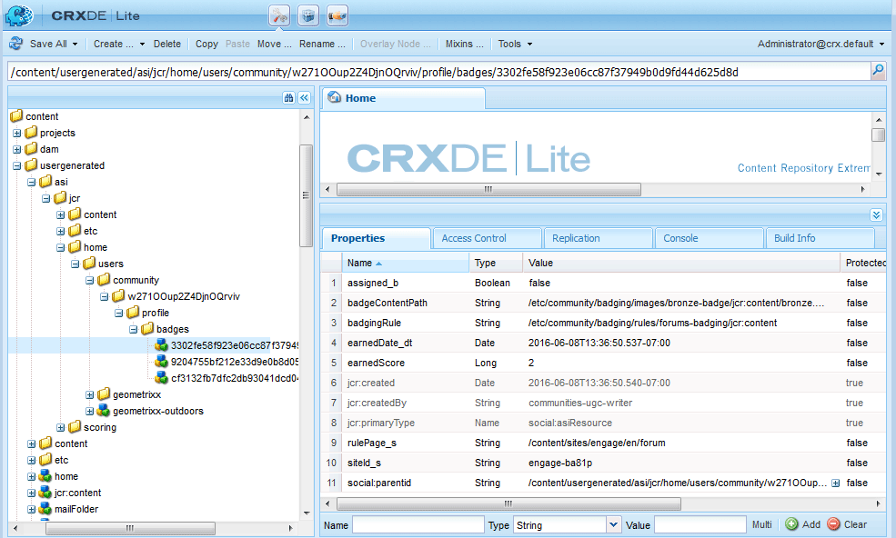
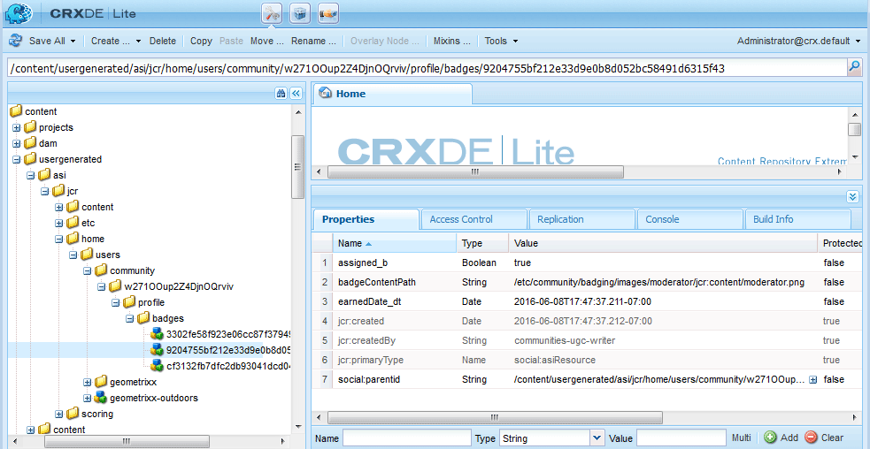

# Notions fondamentales relatives à la notation et aux badges {#scoring-and-badges-essentials}

La fonctionnalité de notation et de badges d’AEM Communities identifie et récompense les membres de la communauté.

Les détails de la configuration de la fonctionnalité sont décrits à l’adresse

* [Notation et badges de Communities](/help/communities/implementing-scoring.md)

Cette page contient des détails techniques supplémentaires :

* Comment [afficher un badge](#displaying-badges) sous forme d’image ou de texte
* Comment activer la journalisation complète du [débogage](#debug-log-for-scoring-and-badging)
* Comment [accéder au contenu créé par l’utilisateur](#ugc-for-scoring-and-badging) lié à la notation et au badge

>[!CAUTION]
>
>La structure d’implémentation visible dans CRXDE Lite peut faire l’objet de modifications.

## Affichage des badges {#displaying-badges}

Le fait qu’un badge s’affiche ou non en tant que texte ou image est contrôlé côté client dans le modèle HBS.

Par exemple, recherchez `this.isAssigned` dans `/libs/social/forum/components/hbs/topic/list-item.hbs` :

```
{{#each author.badges}}

  {{#if this.isAssigned}}

    <div class="scf-badge-text">

      {{this.title}}

    </div>

  {{/if}}

{{/each}}

{{#each author.badges}}

  {{#unless this.isAssigned}}

    

  {{/unless}}

{{/each}}
```

Si la valeur est true, `isAssigned` indique que le badge a été attribué à un rôle et qu’il doit s’afficher sous forme de texte.

Si la valeur est false, `isAssigned` indique que le badge a été attribué pour un score gagné et qu’il doit s’afficher sous forme d’image.

Toute modification de ce comportement doit être effectuée dans un script personnalisé (remplacement ou recouvrement). Voir [Personnalisation côté client](/help/communities/client-customize.md).

## Journal de débogage pour le score et le badge {#debug-log-for-scoring-and-badging}

Pour aider à déboguer le score et le badge, un fichier journal personnalisé peut être configuré. Le contenu de ce fichier journal peut ensuite être fourni au service clientèle en cas de problème avec la fonctionnalité.

Pour obtenir des instructions détaillées, consultez [Créer un fichier journal personnalisé](/help/sites-deploying/monitoring-and-maintaining.md#create-a-custom-log-file).

Pour configurer rapidement un fichier slinglog :

1. Accédez à la prise en charge des journaux de la console web de **&#x200B;**&#x200B;par exemple

   * https://localhost:4502/system/console/slinglog

1. Sélectionnez **Ajouter un nouvel enregistreur**

   1. Sélectionnez `DEBUG` pour **Niveau de journal**

   1. Saisissez un nom pour **Fichier journal**, par exemple

      * logs/scoring-debug.log

   1. Saisissez deux entrées **Enregistreur** (classe) (à l’aide de l’icône `+`)

      * `com.adobe.cq.social.scoring`
      * `com.adobe.cq.social.badging`

   1. Sélectionnez **Enregistrer**.



Pour afficher les entrées de journal :

* À partir de la console web

  * Dans le menu **Statut**
  * Sélectionnez **Fichiers journaux**
  * Recherchez le nom de votre fichier journal, par exemple `scoring-debug`

* Sur le disque local du serveur

  * Le fichier journal se trouve à l’adresse &lt;*server-install-dir*>/crx-quickstart/logs/&lt;*log-file-name*>.log

  * Par exemple, `.../crx-quickstart/logs/scoring-debug.log`.



## Contenu créé par l’utilisateur pour la notation et le badge {#ugc-for-scoring-and-badging}

Il est possible d’afficher le contenu créé par l’utilisateur associé à la notation et à la création de badges lorsque le SRP choisi est JSRP ou MSRP, mais pas ASRP. (Si vous ne connaissez pas ces termes, consultez [Community Content Storage](/help/communities/working-with-srp.md) et [Storage Resource Provider Overview](/help/communities/srp.md).)

Les descriptions d’accès aux données de notation et de badge utilisent JSRP, car le contenu créé par l’utilisateur est facilement accessible à l’aide de [&#128279;](/help/sites-developing/developing-with-crxde-lite.md).

**JSRP sur l’environnement de création** : l’expérimentation dans l’environnement de création aboutit à un contenu créé par l’utilisateur uniquement visible depuis l’environnement de création.

**JSRP en mode de publication** : de même, en cas de test dans l’environnement de publication, il est nécessaire d’accéder à CRXDE Lite avec les privilèges d’administration sur une instance de publication. Si l’instance de publication est en cours d’exécution en [mode de production](/help/sites-administering/production-ready.md) (mode d’exécution nosamplecontent), il est nécessaire d’[activer CRXDE Lite](/help/sites-administering/enabling-crxde-lite.md).

L’emplacement de base du contenu créé par l’utilisateur sur JSRP est `/content/usergenerated/asi/jcr/`.

### API de notation et de badge {#scoring-and-badging-apis}

Les API suivantes sont disponibles :

* [com.adobe.cq.social.scoring.api dans 6.3](https://experienceleague.adobe.com/docs/experience-manager-release-information/aem-release-updates/previous-updates/aem-previous-versions.html?lang=fr)
* [com.adobe.cq.social.badging.api dans 6.3](https://experienceleague.adobe.com/docs/experience-manager-release-information/aem-release-updates/previous-updates/aem-previous-versions.html?lang=fr)

Les derniers Javadocs pour le pack de fonctionnalités installé sont disponibles pour les développeurs à partir du référentiel Adobe. Voir [Utilisation de Maven pour Communities : Javadocs](/help/communities/maven.md#javadocs).

**L’emplacement et le format du contenu créé par l’utilisateur dans le référentiel peuvent être modifiés sans avertissement**.

### Exemple de configuration {#example-setup}

Les captures d’écran des données du référentiel proviennent de la configuration de la notation et du badge pour un forum sur deux sites AEM différents :

1. Un site AEM *avec* un identifiant unique (site de la communauté créé avec l’assistant) :

   * Utilisation du site Tutoriel de prise en main (engage) créé lors du [tutoriel de prise en main](/help/communities/getting-started.md)
   * Recherchez le nœud de page du forum

     `/content/sites/engage/en/forum/jcr:content`

   * Ajout des propriétés de notation et de badge

   ```
   scoringRules = [/libs/settings/community/scoring/rules/comments-scoring,
   /libs/settings/community/scoring/rules/forums-scoring]
   ```

   ```
   badgingRules =[/libs/settings/community/badging/rules/comments-scoring,
   /libs/settings/community/badging/rules/forums-scoring]
   ```

   * Recherchez le nœud du composant de forum

     `/content/sites/engage/en/forum/jcr:content/content/primary/forum`
( `sling:resourceType = social/forum/components/hbs/forum`)

   * Pour afficher les badges, ajoutez la propriété .

     `allowBadges = true`

   * Un utilisateur se connecte, crée un sujet de forum et se voit attribuer un badge en bronze

1. Un site AEM *sans* un identifiant unique :

   * Utilisation du guide [Composants de communauté](/help/communities/components-guide.md)
   * Recherchez le nœud de page du forum

     `/content/community-components/en/forum/jcr:content`

   * Ajout des propriétés de notation et de badge

   ```
   scoringRules = [/libs/settings/community/scoring/rules/comments-scoring,
   /libs/settings/community/scoring/rules/forums-scoring]
   ```

   ```
   badgingRules =[/libs/settings/community/badging/rules/comments-badging,
   /libs/settings/community/badging/rules/forums-badging]
   ```

   * Recherchez le nœud du composant de forum

     `/content/community-components/en/forum/jcr:content/content/forum`
( `sling:resourceType = social/forum/components/hbs/forum`)

   * Pour afficher les badges, ajoutez la propriété .

     `allowBadges = true`

   * Un utilisateur se connecte, crée un sujet de forum et se voit attribuer un badge en bronze

1. Un badge de modérateur est attribué à un utilisateur à l’aide de cURL :

   ```shell
   curl -i -X POST -H "Accept:application/json" -u admin:admin -F ":operation=social:assignBadge" -F "badgeContentPath=/libs/settings/community/badging/images/moderator/jcr:content/moderator.png" https://localhost:4503/home/users/community/w271OOup2Z4DjnOQrviv/profile.social.json
   ```

   Comme un utilisateur a gagné deux badges bronze et s’est vu attribuer un badge modérateur, il apparaît avec son entrée de forum comme suit :

   

>[!NOTE]
>
>Cet exemple ne suit pas les bonnes pratiques suivantes :
>
>* Les noms des règles de score doivent être globalement uniques et ne doivent pas se terminer par le même nom.
>
>  Exemple de ce qu *il ne faut pas* :
>
>  /libs/settings/community/scoring/rules/site1/forums-scoring
>  /libs/settings/community/scoring/rules/site2/forums-scoring
>
>* Création d’images de badge uniques pour différents sites AEM

### Accéder au contenu créé par l’utilisateur pour la notation {#access-scoring-ugc}

Il est préférable d’utiliser les [API](#scoring-and-badging-apis).

À des fins d’enquête, en utilisant JSRP par exemple, le dossier de base contenant les notes est

* `/content/usergenerated/asi/jcr/scoring`

Le nœud enfant de `scoring` est le nom de la règle de notation. Il est donc recommandé que les noms des règles de score sur un serveur soient uniques dans le monde.

Pour le site Geometrixx Engage, l’utilisateur et sa note se trouvent dans un chemin d’accès construit avec le nom de la règle de note, l’identifiant du site de la communauté ( `engage-ba81p`), un identifiant unique et l’identifiant de l’utilisateur :

* `.../scoring/forums-scoring/engage-ba81p/6d179715c0e93cb2b20886aa0434ca9b5a540401/riley`

Pour le site du guide Composants de la communauté , l’utilisateur et sa note se trouvent dans un chemin construit avec le nom de la règle de note, un identifiant par défaut ( `default-site`), un identifiant unique et l’identifiant de l’utilisateur :

* `.../scoring/forums-scoring/default-site/b27a17cb4910a9b69fe81fb1b492ba672d2c086e/riley`

Le score est stocké dans la propriété `scoreValue_tl` qui ne peut contenir qu&#39;une valeur ou faire indirectement référence à un atomicCounter.



### Badge d’accès au contenu créé par l’utilisateur {#access-badging-ugc}

Il est préférable d’utiliser les [API](#scoring-and-badging-apis).

À des fins d’enquête, en utilisant JSRP par exemple, le dossier de base contenant des informations sur les badges attribués est .

* `/content/usergenerated/asi/jcr`

Suivi du chemin d’accès au profil de l’utilisateur, se terminant par un dossier de badges, tel que :

* `/home/users/community/w271OOup2Z4DjnOQrviv/profile/badges`

#### Badge attribué {#awarded-badge}



#### Badge attribué {#assigned-badge}



## Informations supplémentaires {#additional-information}

Pour afficher une liste triée de membres en fonction de points :

* [Fonction de tableau des scores](/help/communities/functions.md#leaderboard-function) à inclure dans un site communautaire ou un modèle de groupe.
* [Composant Tableau des scores](/help/communities/enabling-leaderboard.md), le composant proposé de la fonction Tableau des scores, pour la création de pages.
