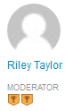

# Notions fondamentales sur la notation et les badges {#scoring-and-badges-essentials}

La fonction Scores et badges d’AEM Communities permet d’identifier et de récompenser les membres de la communauté.

Les détails de la configuration de la fonctionnalité sont décrits à la section

* [Notation et badges des communautés](/help/communities/implementing-scoring.md)

Cette page contient des détails techniques supplémentaires :

* Comment [afficher un badge](#displaying-badges) sous forme d’image ou de texte
* Comment activer la [journalisation de débogage](#debug-log-for-scoring-and-badging) étendue
* Comment [accéder au contenu généré par l’utilisateur](#ugc-for-scoring-and-badging) lié à la notation et à la notation

>[!CAUTION]
>
>La structure d’implémentation visible dans CRXDE Lite peut faire l’objet de modifications.

## Affichage des badges {#displaying-badges}

Le fait qu’un badge s’affiche sous forme de texte ou d’image est contrôlé du côté client dans le modèle HBS.

Par exemple, recherchez `this.isAssigned` dans `/libs/social/forum/components/hbs/topic/list-item.hbs` :

```
{{#each author.badges}}

  {{#if this.isAssigned}}

    <div class="scf-badge-text">

      {{this.title}}

    </div>

  {{/if}}

{{/each}}

{{#each author.badges}}

  {{#unless this.isAssigned}}

    

  {{/unless}}

{{/each}}
```

Si la valeur est true, isAssigned indique que le badge a été attribué pour un rôle et que le badge doit s’afficher sous forme de texte.

Si la valeur est false, l’attribut est attribué pour un score gagné et le badge doit s’afficher sous forme d’image.

Toute modification de ce comportement doit être effectuée dans un script personnalisé (remplacement ou recouvrement). Voir [Personnalisation côté client](/help/communities/client-customize.md).

## Journal de débogage pour la notation et la mise en badge {#debug-log-for-scoring-and-badging}

Pour aider à déboguer la notation et le badge, un fichier journal personnalisé peut être configuré. Le contenu de ce fichier journal peut ensuite être fourni au service clientèle en cas de problèmes liés à la fonctionnalité.

Pour obtenir des instructions détaillées, consultez [Création d’un fichier journal personnalisé](/help/sites-deploying/monitoring-and-maintaining.md#create-a-custom-log-file).

Pour configurer rapidement un fichier sling :

1. Accédez à la **prise en charge du journal de la console web Adobe Experience Manager**, par exemple

   * https://localhost:4502/system/console/slinglog

1. Sélectionnez **Ajouter un nouveau journal**

   1. Sélectionnez `DEBUG` pour **Niveau de journal**

   1. Saisissez le nom **Fichier journal**, par exemple

      * logs/scoring-debug.log
   1. Saisissez deux entrées **Enregistreur** (classe) (à l’aide de l’icône `+`).

      * `com.adobe.cq.social.scoring`
      * `com.adobe.cq.social.badging`
   1. Sélectionnez **Enregistrer**


Pour afficher les entrées de journal :

* À partir de la console Web

   * Sous le menu **État**
   * Sélectionnez **Fichiers journaux**
   * Recherchez votre nom de fichier journal, par exemple `scoring-debug`

* Sur le disque local du serveur

   * Le fichier journal se trouve à l’emplacement suivant : &quot;a0/>server-install-dir */crx-quickstart/logs/&quot;a2/>log-file-name*.log **

   * Par exemple, `.../crx-quickstart/logs/scoring-debug.log`


## Contenu généré par l’utilisateur pour la notation et la attribution de badges {#ugc-for-scoring-and-badging}

Il est possible d’afficher le contenu généré par l’utilisateur relatif à la notation et à la mise en badge lorsque la priorité de priorité de performance choisie est JSRP ou MSRP, mais pas ASRP. (Si ces termes ne sont pas familiers, consultez [Présentation du stockage de contenu de la communauté](/help/communities/working-with-srp.md) et [Présentation du fournisseur de ressources de stockage](/help/communities/srp.md).)

Les descriptions d’accès aux données de notation et de badge utilisent JSRP, car le contenu créé par l’utilisateur est facilement accessible à l’aide de [CRXDE Lite](/help/sites-developing/developing-with-crxde-lite.md).

**JSRP sur l’auteur** : l’expérimentation dans l’environnement de création génère un contenu créé par l’utilisateur qui n’est visible que depuis l’environnement de création.

**JSRP lors de la publication** : de même, si vous effectuez un test sur l’environnement de publication, il sera nécessaire d’accéder à CRXDE Lite avec des privilèges d’administrateur sur une instance de publication. Si l’instance de publication s’exécute en [mode de production](/help/sites-administering/production-ready.md) (mode d’exécution nosamplecontent), il sera nécessaire d’[activer CRXDE Lite](/help/sites-administering/enabling-crxde-lite.md).

L’emplacement de base du contenu généré par l’utilisateur sur JSRP est `/content/usergenerated/asi/jcr/`.

### API de notation et de badge {#scoring-and-badging-apis}

Les API suivantes sont disponibles :

* [com.adobe.cq.social.scoring.api](https://docs.adobe.com/content/docs/en/aem/6-3/develop/ref/javadoc/com/adobe/cq/social/scoring/api/package-summary.html)
* [com.adobe.cq.social.badging.api](https://docs.adobe.com/content/docs/en/aem/6-3/develop/ref/javadoc/com/adobe/cq/social/badging/api/package-summary.html)

Les derniers JavaDocs pour le Feature Pack installé sont disponibles pour les développeurs à partir du référentiel Adobe. Voir [Utilisation de Maven pour Communities : Javadocs](/help/communities/maven.md#javadocs).

**L’emplacement et le format du contenu créé par l’utilisateur dans le référentiel peuvent être modifiés sans avertissement**.

### Exemple de configuration {#example-setup}

Les captures d’écran des données du référentiel proviennent de la configuration de la notation et de la mise en badge d’un forum sur deux sites AEM différents :

1. Un site d’AEM *avec* un id unique (site de communauté créé à l’aide de l’assistant) :

   * Utilisation du site de tutoriel de prise en main créé pendant le [tutoriel de prise en main](/help/communities/getting-started.md)
   * Localisez le noeud de page du forum

      `/content/sites/engage/en/forum/jcr:content`

   * Ajout de propriétés de notation et de badge

   ```
   scoringRules = [/libs/settings/community/scoring/rules/comments-scoring,
   /libs/settings/community/scoring/rules/forums-scoring]
   ```

   ```
   badgingRules =[/libs/settings/community/badging/rules/comments-scoring,
   /libs/settings/community/badging/rules/forums-scoring]
   ```

   * Localisez le noeud du composant de forum

      `/content/sites/engage/en/forum/jcr:content/content/primary/forum`
( `sling:resourceType = social/forum/components/hbs/forum`)

   * Ajouter une propriété pour afficher les badges

      `allowBadges = true`

   * Un utilisateur se connecte, crée un sujet de forum et se voit attribuer un badge bronze


1. Un site AEM *sans* identifiant unique :

   * Utilisation du [Guide des composants de la communauté](/help/communities/components-guide.md)
   * Localisez le noeud de page du forum

      `/content/community-components/en/forum/jcr:content`

   * Ajout de propriétés de notation et de badge

   ```
   scoringRules = [/libs/settings/community/scoring/rules/comments-scoring,
   /libs/settings/community/scoring/rules/forums-scoring]
   ```

   ```
   badgingRules =[/libs/settings/community/badging/rules/comments-badging,
   /libs/settings/community/badging/rules/forums-badging]
   ```

   * Localisez le noeud du composant de forum

      `/content/community-components/en/forum/jcr:content/content/forum`
(  `sling:resourceType = social/forum/components/hbs/forum`)

   * Ajouter une propriété pour afficher les badges

      `allowBadges = true`

   * Un utilisateur se connecte, crée un sujet de forum et se voit attribuer un badge bronze


1. Un badge de modérateur est attribué à un utilisateur à l’aide de cURL :

   ```shell
   curl -i -X POST -H "Accept:application/json" -u admin:admin -F ":operation=social:assignBadge" -F "badgeContentPath=/libs/settings/community/badging/images/moderator/jcr:content/moderator.png" https://localhost:4503/home/users/community/w271OOup2Z4DjnOQrviv/profile.social.json
   ```

   Un utilisateur ayant obtenu deux badges en bronze et se voyant attribuer un badge de modérateur, voici comment il apparaît avec son entrée de forum.

   

>[!NOTE]
>
>Cet exemple ne suit pas les bonnes pratiques suivantes :
>
>* Les noms des règles de notation doivent être uniques au niveau global. ils ne doivent pas se terminer par le même nom.
>
>  
Exemple de ce que *ne doit pas* faire :
>
>  /libs/settings/community/scoring/rules/site1/forums-scoring
>  /libs/settings/community/scoring/rules/site2/forums-scoring
>
>* Création d’images de badge uniques pour différents sites AEM


### Accéder au score UGC {#access-scoring-ugc}

L’utilisation des [API](#scoring-and-badging-apis) est préférable.

À des fins d’enquête, à l’aide de JSRP pour l’exemple, le dossier de base contenant les scores est

* `/content/usergenerated/asi/jcr/scoring`

Le noeud enfant de `scoring` est le nom de la règle de notation. Par conséquent, il est recommandé que les noms des règles de notation sur un serveur soient uniques globalement.

Pour le site Engage, l’utilisateur et son score se trouvent dans un chemin construit avec le nom de la règle de notation, l’identifiant du site de la communauté ( `engage-ba81p`), un identifiant unique et l’identifiant de l’utilisateur :

* `.../scoring/forums-scoring/engage-ba81p/6d179715c0e93cb2b20886aa0434ca9b5a540401/riley`

Pour le site du guide des composants de la communauté, l’utilisateur et son score se trouvent dans un chemin construit avec le nom de la règle de notation, un identifiant par défaut ( `default-site`), un identifiant unique et l’identifiant de l’utilisateur :

* `.../scoring/forums-scoring/default-site/b27a17cb4910a9b69fe81fb1b492ba672d2c086e/riley`

Le score est stocké dans la propriété `scoreValue_tl` qui ne peut directement contenir qu’une valeur ou indirectement faire référence à un atomicCounter.


### Badge d’accès UGC {#access-badging-ugc}

L’utilisation des [API](#scoring-and-badging-apis) est préférable.

À des fins d’enquête, à l’aide de JSRP pour l’exemple, le dossier de base contenant des informations sur les badges attribués ou attribués est :

* `/content/usergenerated/asi/jcr`

Suivi du chemin d’accès au profil de l’utilisateur, qui se termine par un dossier de badges, tel que :

* `/home/users/community/w271OOup2Z4DjnOQrviv/profile/badges`

#### Badge attribué {#awarded-badge}


#### Badge attribué {#assigned-badge}


## Informations supplémentaires {#additional-information}

Pour afficher une liste triée des membres en fonction des points :

* [Fonctions du tableau de bord ](/help/communities/functions.md#leaderboard-function) à inclure dans un site communautaire ou un modèle de groupe.
* [Composant](/help/communities/enabling-leaderboard.md) de classement, composant présenté de la fonction de classement, pour la création de pages.
