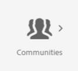

# Consoles Communities {#communities-consoles}

Les consoles AEM Communities, disponibles dans l’environnement de création à partir du panneau de navigation globale, permettent d’accéder aux tâches administratives telles que :

* [Créer un site communautaire](sites-console.md)
* Ajout de [groupes](groups.md) imbriqués dans le site
* Gestion des [modèles de site communautaire](sites.md)
* Gestion des [membres de la communauté](members.md)
*  Modération du contenu généré par l’utilisateur
* Créer [badges personnalisés](badges.md)
* Configuration du [stockage par défaut pour le contenu généré par l’utilisateur](srp-config.md)

Lorsque [l’espace de stockage UGC](working-with-srp.md) est configuré pour être un magasin commun partagé par les environnements de création et de publication, la [console de modération](moderation.md), disponible à la fois dans les environnements de création et de publication, fonctionne sur une instance unique de contenu UGC.

Dans l’environnement de création, après la connexion avec des privilèges d’administrateur, les consoles `Communities` sont disponibles à partir des consoles de navigation et d’outils.

>[!NOTE]
>
>Dans l’environnement de publication, un [site communautaire](sites-console.md) affiche un élément de menu `Administration` lorsque le membre connecté dispose des privilèges appropriés.

## Panneau de navigation globale {#global-navigation-panel}

Sélectionnez l’icône `Adobe Experience Manager` dans le coin supérieur gauche pour ouvrir le panneau de navigation globale et accéder à deux icônes :

* [Console de navigation](#navigation-console)
* [Console Outils](tools.md)

## Console de navigation {#navigation-console}

Pour accéder aux différentes consoles Communities, dans la navigation globale, sélectionnez **navigation, Communities**.

* [Sites](sites-console.md)

   La console Sites est accessible dans l’environnement de création dans le but de créer et de gérer des sites de communauté et ses [groupes](groups.md).

* [Modération](moderation.md)

   La console Modération sert à la modération en masse du contenu généré par l’utilisateur et dans l’environnement de création. Une console de modération en bloc similaire est accessible dans l’environnement de publication aux membres de la communauté auxquels est affecté le rôle de [modérateur de communauté](users.md#publishenvironmentusersandgroups) pour un ou plusieurs sites de la communauté.

* [Membres, groupes](members.md)

   Les consoles Membres et Groupes permettent de gérer les membres de la communauté et les groupes de membres qui existent dans l’environnement de publication à partir de l’environnement de création.

* [Rapports](reports.md)

   Dans la console Rapports, des rapports sur les affectations, les pages vues et le contenu publié peuvent être générés lorsqu’Adobe Analytics](sites-console.md#analytics) est activé pour un site de communauté. [ La console n’est disponible que dans l’environnement de création.

* [Ressources](resources.md)

   Dans la console Ressources, [les gestionnaires d’activation](enablement.md#communitymanagers) créent, gèrent et assignent des ressources aux membres d’un [site de la communauté d’activation](overview.md#enablement-community). La console n’est disponible que dans l’environnement de création.

## Console Outils {#tools-console}

Pour accéder à [Outils de communautés](tools.md) (anciennement la console d’administration), à partir de la navigation globale : **[!UICONTROL Outils]** **[!UICONTROL Communautés]**
