# Créer un site communautaire{#author-a-new-community-site}

## Créer un site communautaire {#create-a-community-site}

Utilisez l’instance d’auteur pour créer un site communautaire. Sur l’instance d’auteur AEM :

1. Connectez-vous avec des droits d’administrateur.
1. Dans la navigation globale, accédez à **[!UICONTROL Communities]** > **[!UICONTROL Sites]**.

La console Sites de communautés fournit un assistant qui vous guide tout au long des étapes de création d’un site de communauté. Il est possible de passer à l’étape `Next` ou de `Back` à l’étape précédente avant de valider le site à l’étape finale.

Pour commencer à créer un site communautaire :

* Sélectionnez le bouton `Create` .

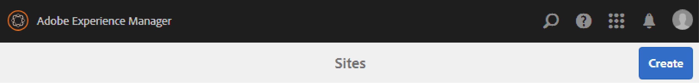

### Étape 1 : modèle de site {#step-site-template}

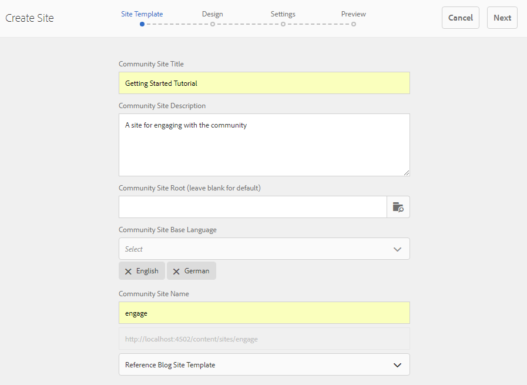

À l’étape [&#x200B; Modèle de site &#x200B;](/help/communities/sites-console.md#step2013asitetemplate), saisissez un titre, une description et le nom de l’URL, puis sélectionnez un modèle de site de communauté, par exemple :

* **Titre du site communautaire** : `Getting Started Tutorial`
* **Description du site de la communauté** : `A site for engaging with the community.`
* **Racine du site de la communauté** : (laisser vide pour la `/content/sites` racine par défaut).
* **Configurations cloud** : (laissez ce champ vierge si aucune configuration cloud n’est spécifiée) indiquez le chemin d’accès aux configurations cloud spécifiées.
* **Langue de base du site de la communauté** : (ne pas toucher pour une seule langue : anglais) utilisez la liste déroulante pour choisir une *ou plusieurs* langues de base parmi les langues disponibles : allemand, italien, français, japonais, espagnol, portugais (Brésil), chinois (traditionnel) et chinois (simplifié). Un site communautaire est créé pour chaque langue ajoutée et existe dans le même dossier de site conformément aux bonnes pratiques décrites dans la section [Traduction de contenu pour les sites multilingues](/help/sites-administering/translation.md). La page racine de chaque site contient une page enfant nommée selon le code de langue de l’une des langues sélectionnées (en pour l’anglais, fr pour le français, par exemple).

* **Nom du site de la communauté** : engage

   * Vérifiez à nouveau le nom, car il ne peut pas être facilement modifié une fois le site créé
   * L’URL initiale s’affiche sous le nom du site de la communauté
   * Pour obtenir une URL valide, ajoutez un code de langue de base + « .html »
   * *Par exemple*, https://localhost:4502/content/sites/ `engage/en.html`

* **Modèle** : faites défiler l’écran vers le bas pour choisir `Reference Site`

* Sélectionnez **Suivant**.

### Étape 2 : conception {#step-design}

L’étape de conception est présentée en deux sections pour sélectionner le thème et la bannière de branding :

#### THÈME DU SITE DE LA COMMUNAUTÉ {#community-site-theme}

Sélectionnez le style que vous souhaitez appliquer au modèle. Lorsqu’il est sélectionné, le thème est recouvert d’une coche.

#### IDENTITÉ GRAPHIQUE DU SITE DE LA COMMUNAUTÉ {#community-site-branding}

(Facultatif) Chargez une image de bannière à afficher sur toutes les pages du site. La bannière est épinglée sur le bord gauche du navigateur, entre l’en-tête du site de la communauté et les liens de navigation. La hauteur de la bannière est réduite à 120 pixels. Il n’existe aucun redimensionnement de la bannière pour l’adapter à la largeur du navigateur et à la hauteur de 120 pixels.

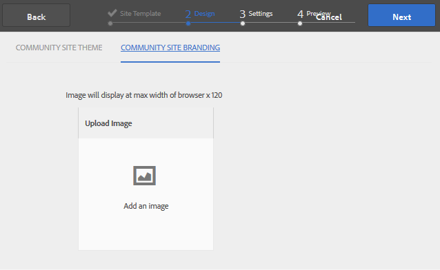

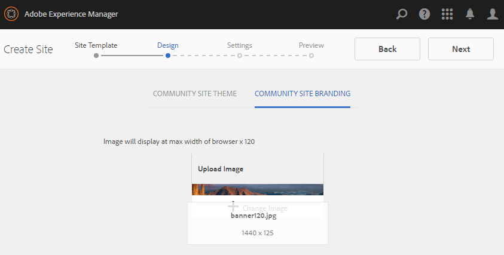

Sélectionnez **Suivant**.

### Étape 3 : Paramètres {#step-settings}

À l’étape Paramètres, avant de sélectionner `Next`, sept sections permettent d’accéder aux configurations impliquant la gestion des utilisateurs, le balisage, la modération, la gestion des groupes, les analyses et la traduction.

#### Gestion des utilisateurs et utilisatrices {#user-management}

Cochez toutes les cases de [Gestion des utilisateurs](/help/communities/sites-console.md#user-management).

* Pour permettre aux visiteurs du site de s’auto-enregistrer
* Pour autoriser les visiteurs et visiteuses du site à consulter le site sans se connecter
* Pour permettre aux membres d&#39;envoyer et de recevoir des messages d&#39;autres membres de la communauté
* Pour autoriser la connexion avec Facebook au lieu de s’enregistrer et de créer un profil
* Pour autoriser la connexion avec Twitter au lieu de s’enregistrer et de créer un profil

>[!NOTE]
>
>Pour un environnement de production, il est nécessaire de créer des applications Facebook et Twitter personnalisées. Voir [Connexion sociale avec Facebook et Twitter](/help/communities/social-login.md).

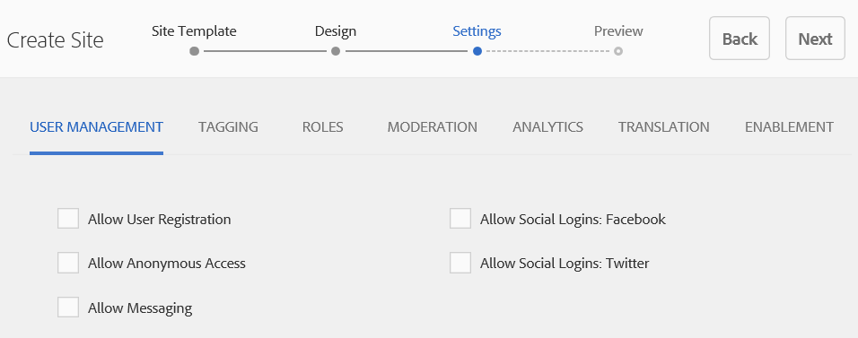

#### BALISAGE {#tagging}

Les balises appliquées au contenu de la communauté sont contrôlées en sélectionnant les espaces de noms AEM précédemment définis via la [console de balisage](/help/sites-administering/tags.md#tagging-console) (par exemple, l’espace de noms [&#x200B; Tutoriel](/help/communities/setup.md#create-tutorial-tags)).

La recherche d’espaces de noms est facile à l’aide de la recherche avec saisie semi-automatique. Par exemple :

* Type `tut`
* Sélectionnez `Tutorial`.

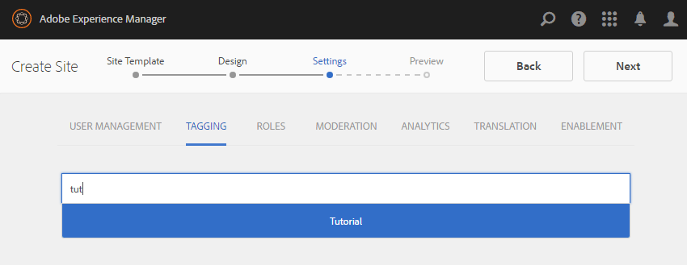

#### ROLE {#roles}

Les [rôles de membre de la communauté](/help/communities/users.md) sont attribués par le biais des paramètres de la section Rôles .

Pour permettre à un membre de la communauté (ou à un groupe de membres) d’expérimenter le site en tant que gestionnaire de la communauté, utilisez la recherche avec saisie semi-automatique et sélectionnez le nom du membre ou du groupe dans les options de la liste déroulante.

Par exemple :

* Type `q`
* Sélectionner Quinn Harper

>[!NOTE]
>
>Le [service Tunnel](https://helpx.adobe.com/fr/experience-manager/6-3/help/communities/deploy-communities.html#tunnel-service-on-author) permet de sélectionner des membres et des groupes qui existent uniquement dans l’environnement de publication.

#### MODÉRATION {#moderation}

Acceptez les paramètres globaux par défaut pour [modération](/help/communities/sites-console.md#moderation) du contenu créé par l’utilisateur).

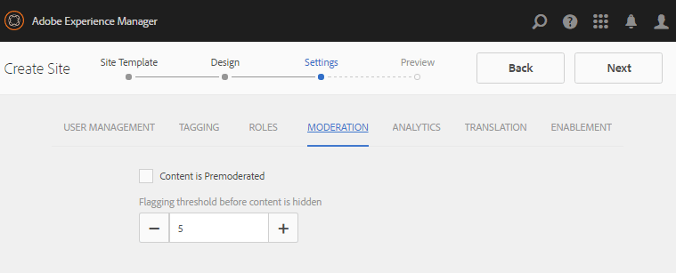

#### ANALYTICS {#analytics}

Si Adobe Analytics dispose d’une licence et qu’un service et un framework Analytics Cloud ont été configurés, il est possible d’activer Analytics et de sélectionner le framework.

Voir [Configuration d’Analytics pour les fonctionnalités de Communities](/help/communities/analytics.md).

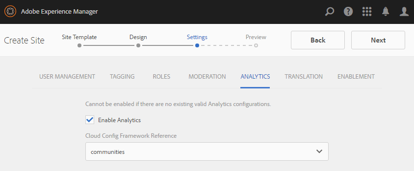

#### TRADUCTION {#translation}

Les [&#x200B; Paramètres de traduction &#x200B;](/help/communities/sites-console.md#translation) spécifient la langue de base du site, indiquent si le contenu créé par l’utilisateur peut être traduit et dans quelle langue, le cas échéant.

* Cochez **Autoriser la traduction automatique**
* Laissez les langues par défaut sélectionnées pour la traduction par le service de traduction automatique par défaut
* Quitter le fournisseur de traduction et la configuration par défaut
* Vous n’avez pas besoin d’un magasin global, car il n’existe aucune copie de langue
* Sélectionnez **Traduire la page entière**
* Laissez l’option de persistance par défaut

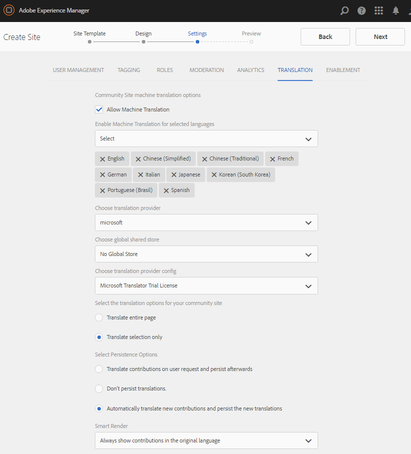

### Étape 4 : Créer un site de communautés {#step-create-communities-site}

Sélectionnez **Créer.**

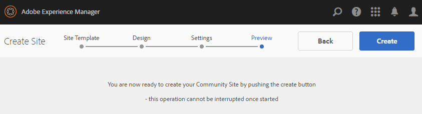

Une fois le processus terminé, le dossier du nouveau site s’affiche dans la console Communities - Sites .

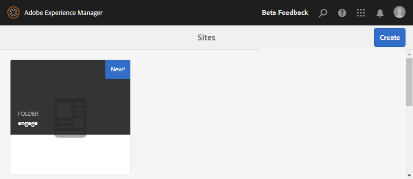

## Publication du site de la communauté {#publish-the-community-site}

Le site créé doit être géré à partir de la console Communities - Sites , la même console que celle à partir de laquelle de nouveaux sites peuvent être créés.

Après avoir sélectionné le dossier du site de la communauté pour l’ouvrir, pointez sur l’icône du site de sorte que quatre icônes d’action s’affichent :

Lorsque vous sélectionnez la quatrième icône représentant des points de suspension (Autres actions), les options Exporter le site et Supprimer le site s’affichent.

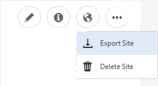

De gauche à droite, ils sont :

* **Ouvrir le site**

  Si vous sélectionnez l’icône en forme de crayon, le site de la communauté s’ouvre en mode d’édition Auteur, où vous pouvez ajouter ou configurer des composants de page.

* **Modifier le site**

  Si vous sélectionnez l’icône Propriétés, le site de la communauté s’ouvre pour permettre la modification des propriétés, comme le titre, ou pour modifier le thème.

* **Publier le site**

  Si vous sélectionnez l’icône représentant un monde, le site de la communauté est publié (par exemple, si votre serveur de publication est en cours d’exécution sur votre ordinateur local, sur localhost:4503 par défaut).

* **Exporter le site**

  Si vous sélectionnez l’icône d’exportation, un package du site de la communauté est créé, stocké dans [Gestionnaire de packages](/help/sites-administering/package-manager.md) et téléchargé. Le contenu créé par l’utilisateur n’est pas inclus dans le package de site.

* **Supprimer le site**

  Sélectionner l’icône de suppression supprime le site de la communauté de la console **[!UICONTROL Communities > Sites]**. Cette action supprime tous les éléments associés au site, tels que le contenu créé par l’utilisateur, les groupes d’utilisateurs, les ressources et les enregistrements de base de données.

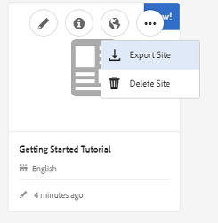

>[!NOTE]
>
>Si vous n’utilisez pas le port par défaut 4503 pour l’instance de publication, modifiez l’agent de réplication par défaut pour définir le numéro de port sur la valeur correcte.
>
>Dans l’instance d’auteur, à partir du menu principal :
>
>1. Accédez au menu **[!UICONTROL Outils]** > **[!UICONTROL Opérations]** > **[!UICONTROL Réplication]**.
>1. Sélectionnez **[!UICONTROL Agents sur l’auteur]**.
>1. Sélectionnez **[!UICONTROL Agent par défaut (publication)]**.
>1. En regard de **[!UICONTROL Paramètres]**, sélectionnez **[!UICONTROL Modifier]**.
>1. Dans la boîte de dialogue pop-up des paramètres d’agent, sélectionnez l’onglet **[!UICONTROL Transport]**.
>1. Dans URI, remplacez le numéro de port, 4503, par le numéro de port souhaité. Par exemple, pour utiliser le port 6103: :6103/bin/receive?sling:authRequestLogin=1
>1. Sélectionnez **[!UICONTROL OK]**.
>1. (Facultatif) Sélectionnez **[!UICONTROL Effacer]** ou **[!UICONTROL Forcer une nouvelle tentative]** pour réinitialiser la file d’attente de réplication.

### Sélectionner Publier {#select-publish}

Après vous être assuré que le serveur de publication est en cours d’exécution, sélectionnez l’icône représentant un globe pour publier le site de la communauté.

Une fois le site de la communauté publié, un message « Site publié » s’affiche brièvement.

### Nouveaux groupes d’utilisateurs de la communauté {#new-community-user-groups}

Outre le nouveau site de la communauté, de nouveaux groupes d’utilisateurs sont créés et disposent des autorisations appropriées définies pour diverses fonctions administratives. Pour plus d’informations, consultez [Groupes d’utilisateurs pour les sites de la communauté](/help/communities/users.md#usergroupsforcommunitysites).

Pour ce nouveau site de la communauté, étant donné le nom du site « engage » à l’étape 1, les quatre nouveaux groupes d’utilisateurs sont visibles dans la console [Groupes](/help/communities/members.md) (navigation globale : Communities, Groups) :

* Community Engage Gestionnaires de communauté
* Administrateurs du groupe Community Engage
* Membres de l’engagement communautaire
* Mobilisation de la communauté Modérateurs
* Membres privilégiés de l’engagement communautaire
* Gestionnaire de contenu du site Community Engage

[Aaron McDonald](/help/communities/tutorials.md#demo-users) est membre de

* Community Engage Gestionnaires de communauté
* Mobilisation de la communauté Modérateurs
* Membres de l&#39;engagement communautaire (indirectement en tant que membre du groupe des modérateurs)

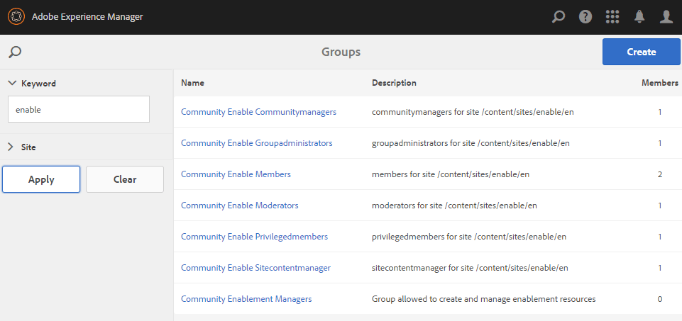

#### https://localhost:4503/content/sites/engage/en.html {#http-localhost-content-sites-engage-en-html}

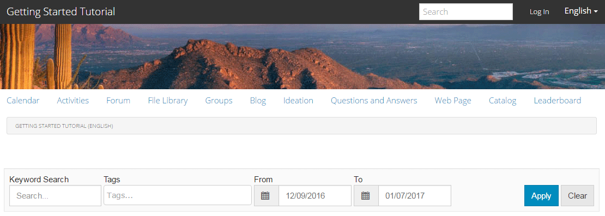

## Erreur de configuration d’pour l’authentification {#configure-for-authentication-error}

Une fois qu’un site a été configuré et envoyé pour publication, [configurez le mappage de connexion](/help/communities/sites-console.md#configure-for-authentication-error) ( `Adobe Granite Login Selector Authentication Handler`) sur l’instance de publication. Lorsque les informations de connexion ne sont pas saisies correctement, l’erreur d’authentification réaffiche la page de connexion du site de la communauté avec un message d’erreur.

Ajouter un `Login Page Mapping` en tant que

* `/content/sites/engage/en/signin:/content/sites/engage/en`

## Étapes facultatives {#optional-steps}

### Modifier la page d’accueil par défaut {#change-the-default-home-page}

Lorsque vous utilisez le site de publication à des fins de démonstration, il peut s’avérer utile de remplacer la page d’accueil par défaut par le nouveau site.

Pour ce faire, vous devez utiliser [CRXDE](https://localhost:4503/crx/de) Lite pour modifier le tableau [resource-mapping](/help/sites-deploying/resource-mapping.md) lors de la publication.

Pour commencer :

1. Sur l’instance de publication, connectez-vous avec les privilèges d’administrateur.
1. Accédez à [:4503/crx/de](https://localhost:4503/crx/de).
1. Dans l’explorateur de projets, développez `/etc/map.`
1. Sélectionnez le nœud `http` :

   * Sélectionnez **Créer un nœud :**

      * **Name** localhost.4503
(ne *pas* utiliser &#39;:&#39;)

      * **Type** [sling:Mapping](https://sling.apache.org/documentation/the-sling-engine/mappings-for-resource-resolution.html)

1. Avec le nœud `localhost.4503` nouvellement créé sélectionné :

   * Ajoutez la propriété :

   * **Nom** sling:match
      * **Type** String
      * **Value** localhost.4503/$
(doit se terminer par le caractère &#39;$&#39;)

   * Ajoutez la propriété :

      * **Nom** sling:internalRedirect
      * **Type** String
      * **Value** /content/sites/engage/en.html

1. Sélectionnez **Enregistrer tout.**
1. (Facultatif) Supprimez l’historique de navigation.
1. Accédez à :4503/.

   * Arrivée à https://localhost:4503/content/sites/engage/en.html

>[!NOTE]
>
>Pour désactiver cette fonction, ajoutez simplement le préfixe « x » (`xlocalhost.4503/$`) à la valeur de la propriété `sling:match` et **Tout enregistrer**.

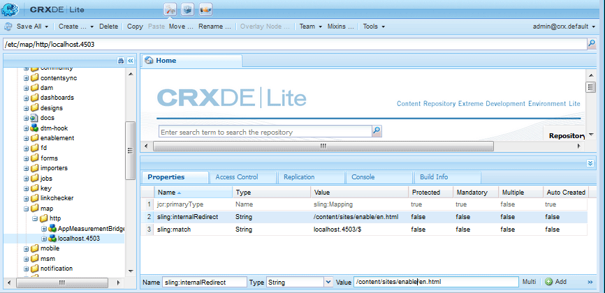

#### Dépannage : erreur lors de l’enregistrement de la carte {#troubleshooting-error-saving-map}

Si vous ne parvenez pas à enregistrer les modifications, assurez-vous que le nom du nœud est `localhost.4503`, avec un séparateur « point », et non `localhost:4503` avec un séparateur « deux-points », car `localhost` n’est pas un préfixe d’espace de noms valide.

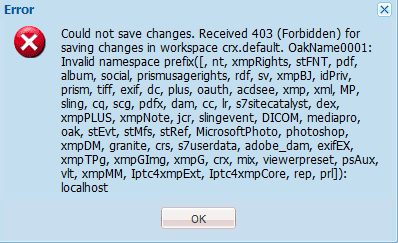

#### Dépannage : échec de la redirection {#troubleshooting-fail-to-redirect}

Le caractère « **$** » à la fin de l’expression régulière `sling:match`string) est essentiel pour que seul `https://localhost:4503/` soit mappé, sinon la valeur de redirection est précédée de tout chemin qui pourrait exister après le serveur:port dans l’URL. Par conséquent, lorsque AEM tente de rediriger vers la page de connexion, l’opération échoue.

### Modification du site {#modify-the-site}

Une fois le site créé, les auteurs peuvent utiliser l’icône [Ouvrir le site](/help/communities/sites-console.md#authoring-site-content) pour effectuer des activités de création AEM standard.

En outre, les administrateurs peuvent utiliser l’icône [Modifier le site](/help/communities/sites-console.md#modifying-site-properties) pour modifier les propriétés du site, telles que le titre.

Après toute modification, pensez à **Enregistrer** puis **Publier** le site.

>[!NOTE]
>
>Si vous ne connaissez pas AEM, consultez la documentation sur [la gestion de base](/help/sites-authoring/basic-handling.md) et un [guide rapide sur la création de pages](/help/sites-authoring/qg-page-authoring.md).
