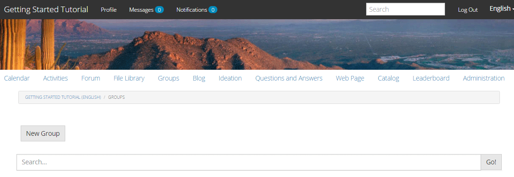
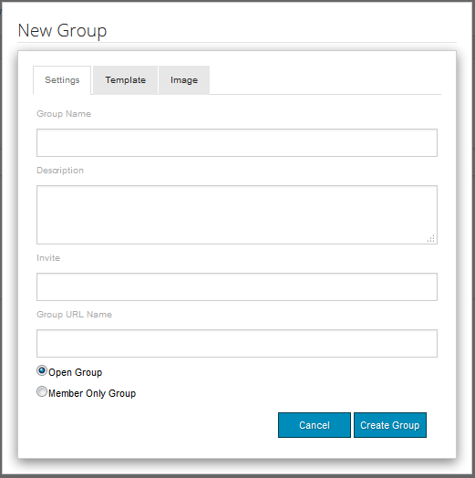
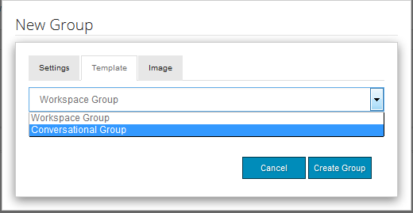
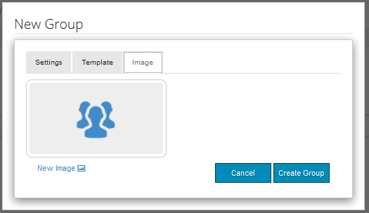
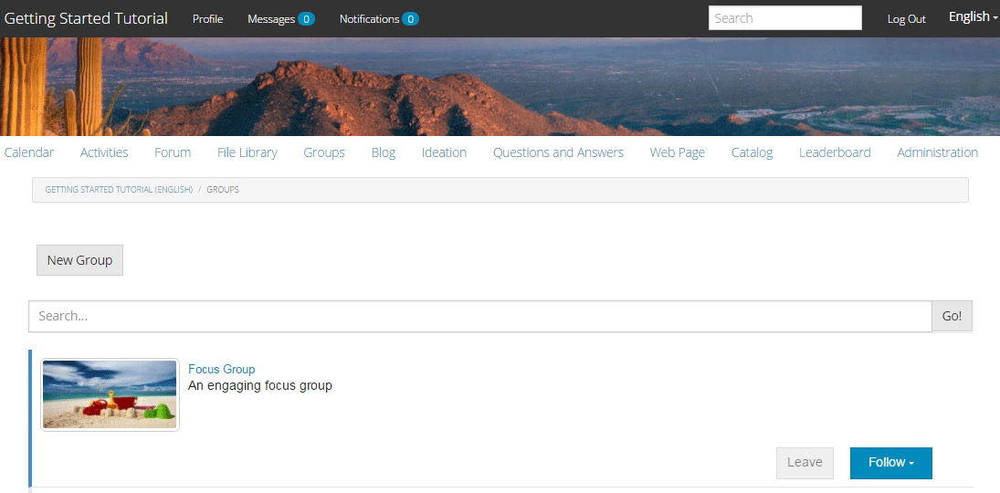
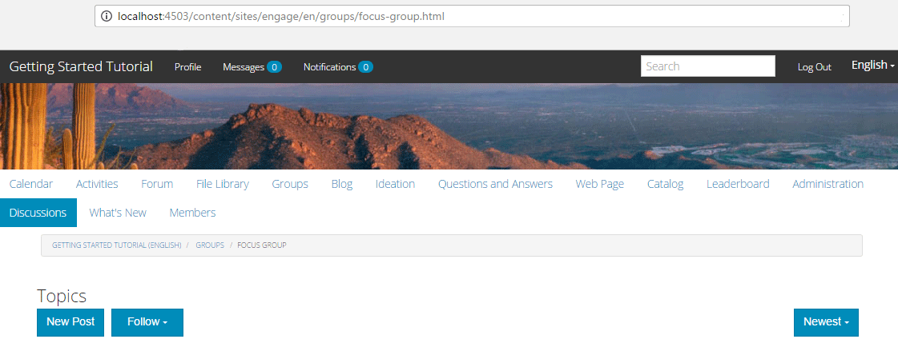

# Groupes communautaires {#community-groups}

La fonctionnalité de groupes de communautés permet à une sous-communauté d’être créée dynamiquement au sein d’un site communautaire par des utilisateurs autorisés (membres de la communauté et auteurs) à partir des environnements de publication et de création.

Cette fonctionnalité est présente lorsque la fonction [groupes](/help/communities/functions.md#groups-function) est présente dans la structure [site de la communauté](/help/communities/sites-console.md).

Un [ modèle de groupe communautaire ](/help/communities/tools-groups.md) permet de concevoir la page du groupe communautaire lorsqu’un groupe communautaire est créé de manière dynamique.

Un ou plusieurs modèles de groupe sont sélectionnés pour la fonction groupes lorsque celle-ci est ajoutée à la structure d&#39;un site communautaire ou à un modèle de site communautaire. Cette liste de modèles de groupe est présentée au membre ou à l’auteur qui crée dynamiquement un groupe à partir du site de la communauté.

## Création d’un groupe {#creating-a-new-group}

La possibilité de créer un groupe de communautés repose sur l’existence d’un site de communauté qui inclut la fonction de groupes , tel que celui créé à partir du [ Modèle de site de référence ](/help/communities/sites.md).

Les exemples qui suivent utilisent le site de la communauté créé à partir du `Reference Site Template`, comme décrit dans le tutoriel [Prise en main d’AEM Communities](/help/communities/getting-started.md).

Il s’agit de la page qui se charge lors de la publication lorsque l’élément de menu **Groupes** est sélectionné :

Lorsque vous sélectionnez l’icône **Nouveau groupe**, une boîte de dialogue de modification s’ouvre.

Sous l’onglet **Paramètres**, vous fournissez les fonctionnalités de base du groupe :

* **Nom du groupe**

  Titre du groupe que vous souhaitez afficher sur le site de la communauté. Évitez d’utiliser les caractères de soulignement (_) et les mots-clés tels que les ressources et la configuration dans le nom du groupe.

* **Description**

  Description du groupe à afficher sur le site de la communauté.

* **Invite**

  Liste des membres à inviter au groupe. La recherche par saisie semi-automatique fournit des suggestions de membres de la communauté à inviter.

* **Nom de l’URL du groupe**

  Nom de la page de groupe qui devient une partie de l’URL.

* **Ouvrir le groupe**

  Sélectionner `Open Group` indique que tout visiteur anonyme du site peut afficher le contenu et désélectionne `Member Only Group`.

* **Groupe de membres uniquement**

  Sélectionner `Member Only Group` indique que seuls les membres du groupe peuvent afficher le contenu et désélectionne `Open Group`.

Sous l’onglet **Modèle**, vous pouvez effectuer une sélection dans la liste des modèles de groupe de la communauté. Ces modèles ont été spécifiés lorsque la fonction de groupes a été incluse dans la structure du site communautaire ou dans un modèle de site communautaire.

Sous l’onglet **Image**, vous pouvez charger une image à afficher pour le groupe sur la page Groupes du site de la communauté. La feuille de style par défaut mesure l’image sur 170 x 90 pixels.

En sélectionnant **Créer un groupe**, les pages du groupe sont créées en fonction du modèle choisi. Un groupe d’utilisateurs est créé pour l’appartenance et la page Groupes est mise à jour pour afficher la nouvelle sous-communauté.

Par exemple, la page Groupes avec une nouvelle sous-communauté intitulée « Groupe cible », pour laquelle une miniature d’image a été chargée, s’affiche comme suit (toujours connectée en tant qu’administrateur de groupe de la communauté) :

La sélection du lien `Focus Group` ouvre la page du groupe de discussion dans le navigateur, qui a un aspect initial en fonction du modèle choisi et inclut un sous-menu sous le menu du site communautaire principal :

### Composant Liste des membres du groupe de la communauté {#community-group-member-list-component}

Le composant `Community Group Member List` est destiné à être utilisé par les développeurs de modèles de groupe.

### Informations supplémentaires {#additional-information}

Pour plus d’informations, consultez la page [Community Group Essentials](/help/communities/essentials-groups.md) destinée aux développeurs et développeuses.

Pour plus d’informations sur les groupes de communautés, consultez [Gestion des utilisateurs et des groupes d’utilisateurs](/help/communities/users.md).
