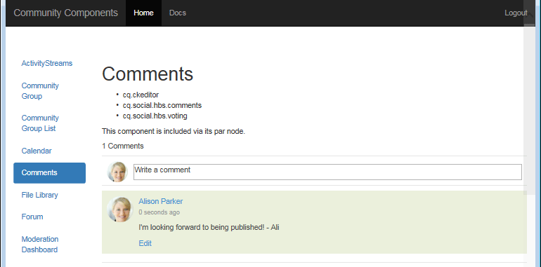
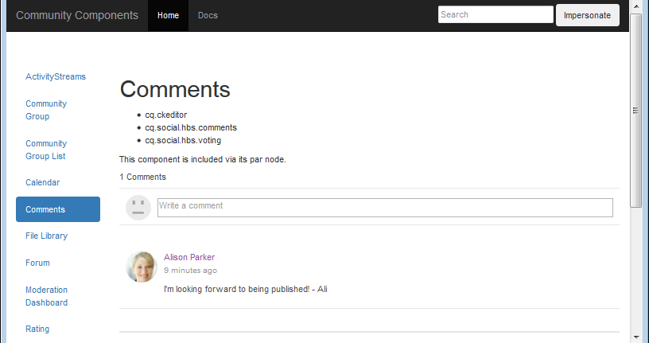
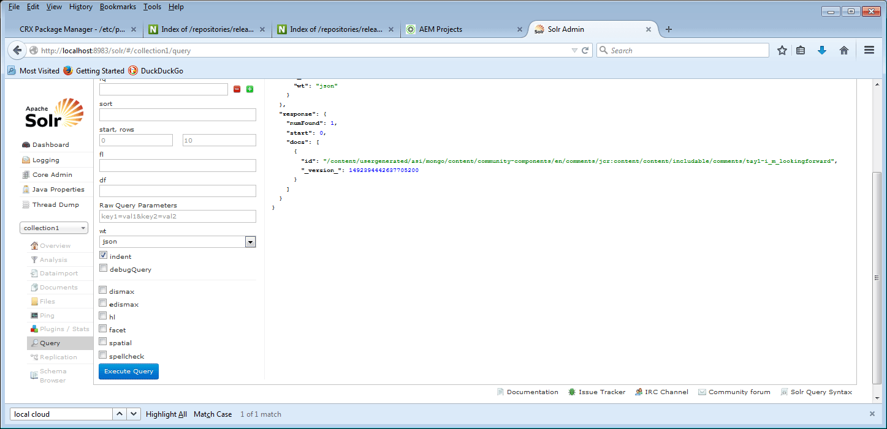

# Configuration de MongoDB pour la démonstration {#how-to-setup-mongodb-for-demo}

## Présentation {#introduction}

Ce tutoriel décrit comment configurer [MSRP](msrp.md) pour *une instance de création* et *une instance de publication*.

Grâce à cette configuration, le contenu de la communauté est accessible à partir des environnements de création et de publication sans avoir à transférer ou à répliquer à l’inverse le contenu créé par l’utilisateur.

Cette configuration est adaptée aux environnements *hors production* tels que le développement et/ou la démonstration.

**Un environnement *de production* doit :**

* Exécutez MongoDB avec un ensemble de répliques.
* Utilisation de SolrCloud
* Contiennent plusieurs instances d’éditeur

## MongoDB {#mongodb}

### Installation de MongoDB {#install-mongodb}

* Téléchargez MongoDB depuis 

   * Choix du système d’exploitation :

      * Linux®
      * Mac 10.8
      * Windows 7

   * Choix de la version :

      * Utilisez au minimum la version 2.6

* Configuration de base

   * Suivez les instructions d’installation de MongoDB.
   * Configurez pour mongod :

      * Pas besoin de configurer les mongos ou le partage.

   * Le dossier MongoDB installé est nommé &lt;mongo-install>.
   * Le chemin d’accès au répertoire de données défini est appelé &lt;mongo-dbpath>.

* MongoDB peut s’exécuter sur le même hôte qu’AEM ou à distance.

### Démarrer MongoDB {#start-mongodb}

* &lt;mongo-install>/bin/mongod —dbpath &lt;mongo-dbpath>

Un serveur MongoDB démarre à l’aide du port par défaut 27017.

* Pour Mac, augmentez ulimit avec l’argument de début « ulimit -n 2048 ».

>[!NOTE]
>
>Si MongoDB est démarré *après* AEM, **redémarrez** toutes les **instances AEM** afin qu’elles se connectent correctement à MongoDB.

### Option de production de démonstration : Configurer le jeu de Secondaires MongoDB {#demo-production-option-setup-mongodb-replica-set}

Les commandes suivantes sont un exemple de configuration d’un ensemble de répliques avec 3 nœuds sur localhost :

* `bin/mongod --port 27017 --dbpath data --replSet rs0&`
* `bin/mongo`

   * `cfg = {"_id": "rs0","version": 1,"members": [{"_id": 0,"host": "127.0.0.1:27017"}]}`
   * `rs.initiate(cfg)`

* `bin/mongod --port 27018 --dbpath data1 --replSet rs0&`
* `bin/mongod --port 27019 --dbpath data2 --replSet rs0&`
* `bin/mongo`

   * `rs.add("127.0.0.1:27018")`
   * `rs.add("127.0.0.1:27019")`
   * `rs.status()`

## Solr {#solr}

### Installer Solr {#install-solr}

* Téléchargez Solr à partir de [Apache Lucene](https://archive.apache.org/dist/lucene/solr/) :

   * Convient à tous les systèmes d&#39;exploitation.
   * Solr version 7.0.
   * Solr nécessite Java™ 1.7 ou une version ultérieure.

* Configuration de base

   * Suivez la configuration Solr « exemple ».
   * Aucun service n’est nécessaire.
   * Le dossier Solr installé est nommé &lt;solr-install>.

### Configuration de Solr pour AEM Communities {#configure-solr-for-aem-communities}

Pour configurer une collection Solr pour MSRP pour la démonstration, deux décisions doivent être prises (sélectionnez les liens vers la documentation principale pour plus de détails) :

1. Exécutez Solr en mode autonome ou [SolrCloud](msrp.md#solrcloudmode).
1. Installez [recherche multilingue standard](msrp.md#installingstandardmls) ou [avancée](msrp.md#installingadvancedmls) (MLS).

### Solr Autonome {#standalone-solr}

La méthode d’exécution de Solr peut varier en fonction de la version et du mode d’installation. Le [Guide de référence Solr](https://archive.apache.org/dist/lucene/solr/ref-guide/) fait autorité en matière de documentation.

Pour plus de simplicité, en utilisant la version 4.10 comme exemple, démarrez Solr en mode autonome :

* cd à &lt;solrinstall>/exemple
* Java™ -jar start.jar

Ce processus démarre un serveur HTTP Solr à l’aide du port par défaut 8983. Vous pouvez accéder à la console Solr pour obtenir une console Solr à des fins de test.

* console Solr par défaut : [:8983/solr/](http://localhost:8983/solr/)

>[!NOTE]
>
>Si la console Solr n’est pas disponible, vérifiez les journaux sous &lt;solrinstall>/example/logs. Recherchez si SOLR tente de se lier à un nom d’hôte spécifique qui ne peut pas être résolu (par exemple, « user-macbook-pro »).
>
>Si tel est le cas, mettez à jour `etc/hosts` fichier avec une nouvelle entrée pour ce nom d’hôte (par exemple, 127.0.0.1 user-macbook-pro) pour démarrer Solr correctement.

### SolrCloud {#solrcloud}

Pour exécuter une configuration de base de solrCloud (hors production), démarrez solr avec :

* `java -Dbootstrap_confdir=./solr/collection1/conf -Dbootstrap_conf=true -DzkRun -jar start.jar`

## Identification de MongoDB en tant que magasin commun {#identify-mongodb-as-common-store}

Lancez les instances d’auteur et de publication AEM, si nécessaire.

Si AEM était en cours d’exécution avant le démarrage de MongoDB, les instances AEM doivent être redémarrées.

Suivez les instructions de la page de documentation principale : [MSRP - MongoDB Common Store](msrp.md)

## Tester {#test}

Pour tester et vérifier le magasin commun MongoDB, publiez un commentaire sur l’instance de publication et affichez-le sur l’instance de création, puis affichez le contenu créé par l’utilisateur dans MongoDB et Solr :

1. Sur l’instance de publication, accédez à la page [Guide des composants de communauté](http://localhost:4503/content/community-components/en/comments.html) et sélectionnez le composant Commentaires .
1. Connectez-vous pour poster un commentaire :
1. Saisissez du texte dans la zone de texte Commentaire, puis cliquez sur **[!UICONTROL Publier]**

   

1. Il vous suffit d’afficher le commentaire sur l’[instance d’auteur](http://localhost:4502/content/community-components/en/comments.html) (probablement toujours connectée en tant qu’administrateur/admin).

   

   Remarque : bien qu’il existe des nœuds JCR sous le *asipath* sur l’instance de création, ces nœuds sont destinés au framework SCF. Le contenu créé par l’utilisateur ne figure pas dans JCR, mais dans MongoDB.

1. Affichez le contenu créé par l’utilisateur dans mongodb **[!UICONTROL Communities]** > **[!UICONTROL Collections]** > **[!UICONTROL Contenu]**

   

1. Affichez le contenu créé par l’utilisateur dans Solr :

   * Accédez au tableau de bord Solr : [:8983/solr/](http://localhost:8983/solr/).
   * L’utilisateur `core selector` sélectionner des `collection1`.
   * Sélectionnez `Query`.
   * Sélectionnez `Execute Query`.

   

## Résolution des problèmes {#troubleshooting}

### Aucun contenu créé par l’utilisateur n’apparaît {#no-ugc-appears}

1. Vérifiez que MongoDB est installé et s’exécute correctement.

1. Assurez-vous que MSRP a été configuré pour être le fournisseur par défaut :

   * Sur toutes les instances d’AEM de création et de publication, revenez sur la [console de configuration de stockage](srp-config.md) ou vérifiez le référentiel AEM :

   * Dans JCR, si [/etc/socialconfig](http://localhost:4502/crx/de/index.jsp#/etc/socialconfig/) ne contient pas de nœud [srpc](http://localhost:4502/crx/de/index.jsp#/etc/socialconfig/srpc), cela signifie que le fournisseur de stockage est JSRP.
   * Si le nœud srpc existe et contient le nœud [defaultconfiguration](http://localhost:4502/crx/de/index.jsp#/etc/socialconfig/srpc/defaultconfiguration), les propriétés de la configuration par défaut doivent définir MSRP comme fournisseur par défaut.

1. Assurez-vous qu’AEM a été redémarré après la sélection du MSRP.
