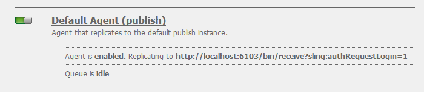
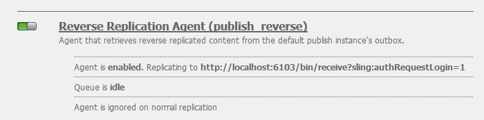
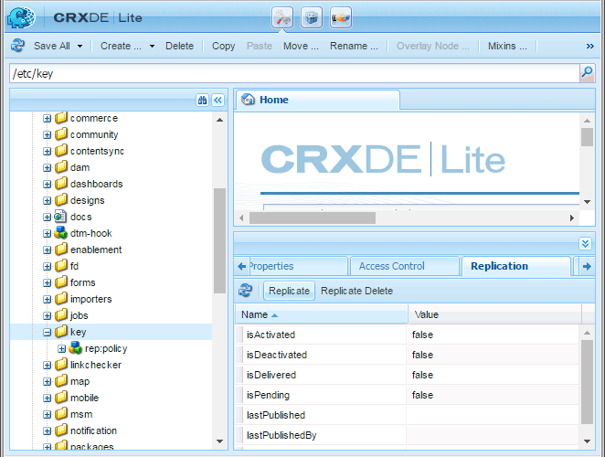

# Déploiement de Communities {#deploying-communities}

## Conditions préalables {#prerequisites}

* [Plateforme AEM 6.5](/help/sites-deploying/deploy.md)

* Licence AEM Communities

* Licences facultatives pour :

   * [Fonctionnalités d’Adobe Analytics for Communities](/help/communities/analytics.md)
   * [MongoDB pour MSRP](/help/communities/msrp.md)
   * [Adobe Cloud pour ASRP](/help/communities/asrp.md)

## Liste de contrôle d’installation {#installation-checklist}

**Pour la plateforme [AEM](/help/sites-deploying/deploy.md#what-is-aem)**

* Installez les dernières mises à jour d’[AEM 6.5](#aem64updates)

* Si vous n’utilisez pas les ports par défaut (4502, 4503), [configurez les agents de réplication](#replication-agents-on-author)
* [Répliquer la clé de chiffrement](#replicate-the-crypto-key)
* Si vous prenez en charge la mondialisation, [configurez la traduction automatisée](/help/sites-administering/translation.md)
(un exemple de configuration est fourni pour le développement)

**Pour la fonctionnalité [Communities](/help/communities/overview.md)**

* Si vous déployez une [ferme de publication](/help/sites-deploying/recommended-deploys.md#tarmk-farm), [identifiez l’éditeur principal](#primary-publisher)

* [Activer le service de tunnel](#tunnel-service-on-author)
* [Activer la connexion sociale](/help/communities/social-login.md#adobe-granite-oauth-authentication-handler)
* [Configuration d’Adobe Analytics](/help/communities/analytics.md)
* Configurer un [service de messagerie par défaut](/help/communities/email.md)
* Identifiez le choix pour le [stockage UGC partagé](/help/communities/working-with-srp.md) (**SRP**)

   * Si MongoDB SRP [(MSRP)](/help/communities/msrp.md)

      * [Installation et configuration de MongoDB](/help/communities/msrp.md#mongodb-configuration)
      * [Configuration De Solr](/help/communities/solr.md)
      * [Sélectionner un MSRP](/help/communities/srp-config.md)

   * Si la base de données relationnelle SRP [(DSRP)](/help/communities/dsrp.md)

      * [Installation du pilote JDBC pour MySQL](#jdbc-driver-for-mysql)
      * [Installer et configurer MySQL pour DSRP](/help/communities/dsrp-mysql.md)
      * [Configuration De Solr](/help/communities/solr.md)
      * [Sélectionner DSRP](/help/communities/srp-config.md)

   * Si Adobe SRP [(ASRP)](/help/communities/asrp.md)

      * Contactez votre représentant de compte pour le provisionnement
      * [Sélectionner ASRP](/help/communities/srp-config.md)

   * Si JCR SRP [(JSRP)](/help/communities/jsrp.md)

      * Il ne s’agit pas d’un magasin de contenu créé par l’utilisateur partagé :

         * Le contenu créé par l’utilisateur n’est jamais répliqué.
         * Le contenu créé par l’utilisateur n’est visible que sur l’instance ou le cluster AEM dans lequel il a été saisi

         * La valeur par défaut est JSRP

## Dernières versions {#latest-releases}

AEM 6.5 Communities GA inclut le package Communities . Pour en savoir plus sur les mises à jour d’AEM 6.5 [Communities](/help/release-notes/release-notes.md#experiencemanagercommunities), consultez les [Notes de mise à jour d’AEM 6.5](/help/release-notes/release-notes.md#communities-release-notes.html).

### Mises à jour d’AEM 6.5 {#aem-updates}

À partir d’AEM 6.4, les mises à jour apportées aux communautés sont fournies dans le cadre des packs de correctifs cumulés et de services d’AEM.

Pour connaître les dernières mises à jour d’AEM 6.5, voir [Packs de correctifs cumulés et packs de services Adobe Experience Manager 6.4](https://experienceleague.adobe.com/fr/docs/experience-manager-release-information/aem-release-updates/aem-releases-updates).

### Historique des versions {#version-history}

Comme pour AEM 6.4 et les versions ultérieures, les fonctionnalités et correctifs AEM Communities font partie des packs de correctifs cumulatifs et de services d’AEM Communities. Il n’existe donc pas de pack de fonctionnalités distinct.

### Pilote JDBC pour MySQL {#jdbc-driver-for-mysql}

Une fonctionnalité de Communities utilise une base de données MySQL :

* Pour [DSRP](/help/communities/dsrp.md) : stockage du contenu créé par l’utilisateur

Le connecteur MySQL doit être obtenu et installé séparément.

Les étapes nécessaires sont les suivantes :

1. Téléchargez l’archive ZIP depuis [&#128279;](https://dev.mysql.com/downloads/connector/j/)

   * La version doit être >= 5.1.38

1. Extrayez mysql-connector-java-&lt;version>-bin.jar (lot) de l’archive
1. Utilisez la console web pour installer et démarrer le bundle :

   * Par exemple, :4502/system/console/bundles
   * Sélectionnez **`Install/Update`**.
   * Parcourir... pour sélectionner le lot extrait de l’archive ZIP téléchargée
   * Vérifiez que le pilote JDBC de *Oracle Corporation pour MySQLcom.mysql.jdbc* est actif et démarrez-le dans le cas contraire (ou vérifiez les journaux)

1. Si vous effectuez l’installation sur un déploiement existant après la configuration de JDBC, reliez JDBC au nouveau connecteur en réenregistrant la configuration JDBC à partir de la console web :
   * Par exemple, :4502/system/console/configMgr
   * Localisation de la configuration `Day Commons JDBC Connections Pool`
   * Sélectionner pour ouvrir
   * Sélectionnez `Save`.

1. Répétez les étapes 3 et 4 sur toutes les instances de création et de publication

Pour plus d’informations sur l’installation des lots, consultez la page [Console web](/help/sites-deploying/web-console.md).

#### Exemple : MySQL Connector Bundle installé {#example-installed-mysql-connector-bundle}


### MLS avancés d’AEM {#aem-advanced-mls}

Pour que la collection SRP (MSRP ou DSRP) prenne en charge la recherche multilingue avancée (MLS), de nouveaux plug-ins Solr sont requis en plus d’un schéma personnalisé et d’une configuration Solr. Tous les éléments requis sont regroupés dans un fichier zip téléchargeable.

Le téléchargement MLS avancé (également appelé `phasetwo`) est disponible à partir du référentiel Adobe :

* AEM-SOLR-MLS-phasetwo

  Pour obtenir le package MLS avancé, consultez [MLS avancé &#x200B;](deploy-communities.md#aem-advanced-mls) dans la section de déploiement de la documentation.

   * Version 1.2.40, 6 Avril 2016
   * Télécharger AEM-SOLR-MLS-phasetwo-1.2.40.zip

Pour plus d’informations et des informations d’installation, consultez [Configuration Solr](/help/communities/solr.md) pour SRP.

### À propos des liens vers le partage de packages {#about-links-to-package-share}

**Packages visibles dans Adobe AEM Cloud**

Les liens vers les packages de cette page ne nécessitent aucune instance AEM en cours d’exécution, comme ils le font vers le partage de packages sur `adobeaemcloud.com`. Bien que les packages soient visibles, le bouton `Install` permet d’installer les packages sur un site hébergé par Adobe. Si vous envisagez de l’installer sur une instance AEM locale, la sélection de `Install` entraîne une erreur.

**Installation sur une instance AEM locale**

Pour installer les packages visibles dans `adobeaemcloud.com` sur une instance AEM locale, le package doit d&#39;abord être téléchargé sur un disque local :

* Sélectionnez l’onglet **&#x200B;**
* Sélectionnez **télécharger sur le disque**

Sur l’instance AEM locale, utilisez le gestionnaire de packages (par exemple, [https://localhost:4502/crx/packmgr/](https://localhost:4502/crx/packmgr/)) pour effectuer le chargement vers le référentiel de packages AEM local.

Sinon, pour accéder au package à l’aide du partage de packages à partir de l’instance AEM locale (par exemple, [https://localhost:4502/crx/packageshare/](https://localhost:4502/crx/packageshare/)), le bouton `Download` est téléchargé dans le référentiel de packages de l’instance AEM locale.

Une fois dans le référentiel de packages de l’instance AEM locale, utilisez le gestionnaire de packages pour installer le package.

Pour plus d’informations, consultez [Utilisation de packages](/help/sites-administering/package-manager.md#package-share).

## Déploiements recommandés {#recommended-deployments}

Dans AEM Communities, un magasin commun est utilisé pour stocker le contenu créé par l’utilisateur. Il est souvent appelé [&#x200B; fournisseur de ressources de stockage (SRP)](/help/communities/working-with-srp.md). Le déploiement recommandé est axé sur le choix d’une option SRP pour le magasin commun.

Le magasin commun prend en charge la modération et l’analyse du contenu créé par l’utilisateur dans l’environnement de publication tout en éliminant la nécessité de [&#x200B; réplication &#x200B;](/help/communities/sync.md) du contenu créé par l’utilisateur.

* [Stockage de contenu de la communauté](/help/communities/working-with-srp.md) : présente les options de stockage SRP pour AEM Communities

* [Topologies recommandées](/help/communities/topologies.md) : décrit la topologie à utiliser en fonction du cas d’utilisation et du choix du SRP

## Mise à niveau {#upgrading}

Lors de la mise à niveau vers la plateforme AEM 6.5 à partir de versions précédentes d’AEM, il est important de lire la section [Mise à niveau vers AEM 6.5](/help/sites-deploying/upgrade.md).

Outre la mise à niveau de la plateforme, lisez [Mise à niveau vers AEM Communities 6.5](/help/communities/upgrade.md) pour en savoir plus sur les modifications de Communities.

## Configurations {#configurations}

### Principal Publisher {#primary-publisher}

Lorsque le déploiement choisi est une [&#x200B; ferme de publication &#x200B;](/help/communities/topologies.md#tarmk-publish-farm), une instance de publication AEM doit être identifiée comme **`primary publisher`** pour les activités qui ne doivent pas se produire sur toutes les instances. Par exemple, les fonctionnalités qui reposent sur **notifications** ou **Adobe Analytics**.

Par défaut, la configuration OSGi `AEM Communities Publisher Configuration` est configurée avec la case à cocher **`Primary Publisher`** activée, de sorte que toutes les instances de publication d’une batterie de publication s’identifient comme étant les instances principales.

Par conséquent, il est nécessaire de **modifier la configuration sur toutes les instances de publication secondaires** pour décocher la case **`Primary Publisher`**.


Pour toutes les autres instances de publication (secondaires) d’une batterie de publication :

* Connexion avec des droits d&#39;administrateur
* Accéder à la [console web](/help/sites-deploying/configuring-osgi.md)

   * Par exemple, [:4503/system/console/configMgr](https://localhost:4503/system/console/configMgr)

* Localiser le `AEM Communities Publisher Configuration`
* Sélectionnez l’icône Modifier .
* Décochez la case **Éditeur de Principal**
* Sélectionnez **Enregistrer**.

### Agents de réplication sur l’auteur {#replication-agents-on-author}

La réplication est utilisée pour le contenu du site créé dans l’environnement de publication, tel que les groupes de communautés, et pour la gestion des membres et des groupes de membres à partir de l’environnement de création à l’aide du [service tunnel](#tunnel-service-on-author).

Pour l’éditeur principal, assurez-vous que la [configuration de l’agent de réplication](/help/sites-deploying/replication.md) identifie correctement le serveur de publication et l’utilisateur autorisé. L’utilisateur autorisé par défaut, `admin,` dispose déjà des autorisations appropriées (est membre de `Communities Administrators`).

Pour qu’un autre utilisateur dispose des autorisations appropriées, il doit être ajouté en tant que membre du groupe d’utilisateurs `administrators` (également membre de `Communities Administrators`).

Deux agents de réplication de l’environnement de création nécessitent que la configuration du transfert soit correcte.

* Accès à la console de réplication en mode de création

   * Dans la navigation globale, accédez à **[!UICONTROL Outils]** > **[!UICONTROL Déploiement]** > **[!UICONTROL Réplication]** > **[!UICONTROL Agents sur l’auteur]**

* Suivez la même procédure pour les deux agents :

   * **Agent par défaut (publication)**
   * **Agent de réplication inverse (publication inverse)**

      1. Sélectionner l’agent
      1. Sélectionnez **modifier**
      1. Sélectionnez l’onglet **Transport**
      1. S’il ne s’agit pas d’un port `4503`, modifiez l’**URI** pour spécifier le port correct

      1. S’il ne s’agit pas d’un `admin` utilisateur, modifiez les **Utilisateur** et **Mot de passe** pour spécifier un membre du groupe d’utilisateurs `administrators`

Les images suivantes montrent les résultats de la modification du port de 4503 à 6103 en :

#### Agent par défaut (publication) {#default-agent-publish}



#### Agent de réplication inverse (publication inverse) {#reverse-replication-agent-publish-reverse}



### Service de tunnel en mode de création {#tunnel-service-on-author}

Lors de l’utilisation de l’environnement de création pour [créer des sites](/help/communities/sites-console.md), [modifier les propriétés du site](/help/communities/sites-console.md#modifying-site-properties) ou [gérer les membres de la communauté](/help/communities/members.md), il est nécessaire d’accéder aux membres (utilisateurs) enregistrés dans l’environnement de publication, et non aux utilisateurs enregistrés dans l’environnement de création.

Le service de tunnel fournit cet accès à l’aide de l’agent de réplication sur l’auteur.

Pour activer le service de tunnel :

* Connectez-vous avec des droits d’administrateur sur votre instance d’auteur.
* Si l’éditeur n’est pas localhost:4503 ou si l’utilisateur de transfert n’est pas `admin`,
puis [configurez l’agent de réplication](#replication-agents-on-author)

* Accédez à la [console web](/help/sites-deploying/configuring-osgi.md)

   * Par exemple, [:4502/system/console/configMgr](https://localhost:4502/system/console/configMgr)

* Localiser le `AEM Communities Publish Tunnel Service`
* Sélectionnez l’icône Modifier .
* Cochez la case **activer**
* Sélectionnez **Enregistrer**.

  

### Répliquer la clé de chiffrement {#replicate-the-crypto-key}

AEM Communities comporte deux fonctions qui nécessitent que toutes les instances de serveur AEM utilisent les mêmes clés de chiffrement. Il s’agit de [Analytics](/help/communities/analytics.md) et [ASRP](/help/communities/asrp.md).

À partir d’AEM 6.3, le matériel de clé est stocké dans le système de fichiers et non plus dans le référentiel.

Pour copier le contenu clé de l’instance de création vers toutes les autres instances, il est nécessaire de :

* Accédez à l’instance AEM, généralement une instance d’auteur, qui contient le matériel essentiel à copier.

   * Localisez le lot `com.adobe.granite.crypto.file` dans le système de fichiers local,
par exemple,

      * `<author-aem-install-dir>/crx-quickstart/launchpad/felix/bundle21`
      * Le fichier `bundle.info` identifie le lot

   * Accédez au dossier de données,
par exemple,

      * `<author-aem-install-dir>/crx-quickstart/launchpad/felix/bundle21/data`

      * Copiez les fichiers des nœuds principaux et hmac

* Pour chaque instance AEM cible

   * Accédez au dossier de données,
par exemple,

      * `<publish-aem-install-dir>/crx-quickstart/launchpad/felix/bundle21/data`

   * Collez les deux fichiers copiés précédemment
   * Il est nécessaire d’[actualiser le lot de chiffrement Granite](#refresh-the-granite-crypto-bundle) si l’instance AEM cible est en cours d’exécution

>[!CAUTION]
>
>Si une autre fonctionnalité de sécurité basée sur les clés cryptographiques a déjà été configurée, la réplication des clés cryptographiques peut endommager la configuration. Pour obtenir de l’aide, [contactez l’assistance clientèle](https://experienceleague.adobe.com/?support-solution=General&lang=fr&support-tab=home#support).

#### Réplication du référentiel {#repository-replication}

Le fait que le matériel de base soit stocké dans le référentiel, comme c’était le cas pour AEM 6.2 et les versions antérieures, peut être préservé. Spécifiez la propriété système `-Dcom.adobe.granite.crypto.file.disable=true` au premier démarrage de chaque instance AEM (ce qui crée le référentiel initial).

>[!NOTE]
>
>Vérifiez que l’[agent de réplication sur l’auteur](#replication-agents-on-author) est correctement configuré.

Avec le matériel de clé stocké dans le référentiel, la manière de répliquer la clé de chiffrement de l’auteur vers d’autres instances est la suivante :

Utilisation de [&#128279;](/help/sites-developing/developing-with-crxde-lite.md) :

* Accédez à [https://&lt;server>:&lt;port>/crx/de](https://localhost:4502/crx/de)
* Sélectionnez `/etc/key`.
* Ouvrir l’onglet `Replication`
* Sélectionnez `Replicate`.

* [Actualisez le lot de chiffrement Granite.](#refresh-the-granite-crypto-bundle)

  

#### Actualisez le lot de chiffrement Granite {#refresh-the-granite-crypto-bundle}

* Sur chaque instance de publication, accédez à la [&#x200B; console web &#x200B;](/help/sites-deploying/configuring-osgi.md)

   * Par exemple, [https://&lt;server>:&lt;port>/system/console/bundles](https://localhost:4503/system/console/bundles)

* Recherchez `Adobe Granite Crypto Support` lot (com.adobe.granite.crypto)
* Sélectionnez **Actualiser**

  

* Au bout d’un moment, une boîte de dialogue **Succès** s’affiche :
  `Operation completed successfully.`

### Serveur HTTP Apache {#apache-http-server}

Si vous utilisez le serveur HTTP Apache, veillez à utiliser le nom de serveur correct pour toutes les entrées pertinentes.

Veillez en particulier à utiliser le nom de serveur correct, et non `localhost`, dans le `RedirectMatch`.

#### exemple httpd.conf {#httpd-conf-sample}

```shell
<IfModule alias_module>
     # XAMPP does not have a favicon; this prevents any 404 errors which may arise.
     Redirect 404 /favicon.ico
     <Location /favicon.ico>
         ErrorDocument 404 "No favicon"
     </Location>

    # Return from "Sign Out" generates response header directing you to "/", generating a 404 error
    # The RedirectMatch resolves it correctly when modified for the target Community Site :
    RedirectMatch ^/$ https://[server name]/content/sites/engage/en.html
 ...
 </IfModule>
```

### Dispatcher {#dispatcher}

Si vous utilisez un Dispatcher, voir :

* Documentation AEM [Dispatcher](https://experienceleague.adobe.com/fr/docs/experience-manager-release-information/aem-release-updates/aem-releases-updates)
* [Installation de Dispatcher](https://experienceleague.adobe.com/en/docs/experience-manager-dispatcher/using/getting-started/dispatcher-install)
* [Configuration de Dispatcher pour Communities](/help/communities/dispatcher.md)
* [Problèmes connus](/help/communities/troubleshooting.md#dispatcher-refetch-fails)

## Documentation sur les communautés associées {#related-communities-documentation}

* Consultez [Administration des sites de communautés](/help/communities/administer-landing.md) pour en savoir plus sur la création d’un site communautaire, la configuration de modèles de site communautaire, la modération du contenu de la communauté, la gestion des membres et la configuration des messages.

* Consultez [Développement de communautés](/help/communities/communities.md) où vous pouvez en savoir plus sur le framework de composants sociaux (SCF) et sur la personnalisation des composants et fonctionnalités de communautés.

* Consultez [Création de composants de communautés](/help/communities/author-communities.md) où vous pouvez apprendre à créer avec des composants de communautés et à les configurer.
