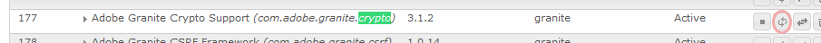

# Déploiement de Communities {#deploying-communities}

## Conditions préalables {#prerequisites}

* [Plateforme AEM 6.5](/help/sites-deploying/deploy.md)

* Licence AEM Communities

* Licences facultatives pour :

   * [Adobe Analytics pour les communautés, fonctionnalités](/help/communities/analytics.md)
   * [MongoDB pour MSRP](/help/communities/msrp.md)
   * [Adobe Cloud pour ASRP](/help/communities/asrp.md)

## Liste de contrôle d&#39;installation {#installation-checklist}

**Pour la plateforme  [AEM](/help/sites-deploying/deploy.md#what-is-aem)**

* Installer les dernières [mises à jour AEM 6.5](#aem64updates)

* Si vous n&#39;utilisez pas les ports par défaut (4502, 4503), [configurez les agents de réplication](#replication-agents-on-author)
* [Répliquer la clé de chiffrement](#replicate-the-crypto-key)
* En cas de prise en charge de la mondialisation, [configurer la traduction automatisée](/help/sites-administering/translation.md)
(l’exemple de configuration est fourni pour le développement)

**Pour la fonctionnalité  [Communautés](/help/communities/overview.md)**

* Si vous déployez une [ferme de publication](/help/sites-deploying/recommended-deploys.md#tarmk-farm), [identifiez l’éditeur Principal](#primary-publisher)

* [Activation du service de tunnel](#tunnel-service-on-author)
* [Activer la connexion sociale](/help/communities/social-login.md#adobe-granite-oauth-authentication-handler)
* [Configuration d’Adobe Analytics](/help/communities/analytics.md)
* Configurez un [service de messagerie par défaut](/help/communities/email.md)
* Identifiez le choix de [enregistrement UGC partagé](/help/communities/working-with-srp.md) (**SRP**).

   * Si MongoDB SRP [(MSRP)](/help/communities/msrp.md)

      * [Installation et configuration de MongoDB](/help/communities/msrp.md#mongodb-configuration)
      * [Configurer Solr](/help/communities/solr.md)
      * [Sélectionner MSRP](/help/communities/srp-config.md)
   * Si la base de données relationnelle SRP [(DSRP)](/help/communities/dsrp.md)

      * [Installation du pilote JDBC pour MySQL](#jdbc-driver-for-mysql)
      * [Installation et configuration de MySQL pour DSRP](/help/communities/dsrp-mysql.md)
      * [Configurer Solr](/help/communities/solr.md)
      * [Sélectionner DSRP](/help/communities/srp-config.md)
   * Si Adobe SRP [(ASRP)](/help/communities/asrp.md)

      * Travailler avec votre gestionnaire de compte pour la mise en service
      * [Sélectionner ASRP](/help/communities/srp-config.md)
   * Si JCR SRP [(JSRP)](/help/communities/jsrp.md)

      * Pas un magasin UGC partagé :

         * UGC n’est jamais répliqué
         * UGC uniquement visible sur l’instance AEM ou la grappe dans laquelle il a été entré

         * Par défaut, il s’agit de JSRP
   Pour la fonction d&#39;activation **[](/help/communities/overview.md#enablement-community)**

   * [Installation et configuration de FFmpeg](/help/communities/ffmpeg.md)
   * [Installation du pilote JDBC pour MySQL](#jdbc-driver-for-mysql)
   * [Installer AEM Communities SCORM-Engine](#scorm-package)
   * [Installation et configuration de MySQL pour activation](/help/communities/mysql.md)


## Dernières versions {#latest-releases}

AEM 6.5 Communities GA inclut le package Communities. Pour en savoir plus sur les mises à jour apportées à AEM 6.5 [Communautés](/help/release-notes/release-notes.md#experiencemanagercommunities), consultez [AEM Notes de mise à jour 6.5](/help/release-notes/release-notes.md#communities-release-notes.html).

### Mises à jour d’AEM 6.5 {#aem-updates}

À partir de AEM 6.4, les mises à jour apportées aux communautés sont fournies dans le cadre des Fix Packs et Service Packs cumulatifs AEM.

Pour obtenir les dernières mises à jour de AEM 6.5, voir [Adobe Experience Manager 6.4 Cumulative Fix Packs and Service Packs](https://helpx.adobe.com/fr/experience-manager/aem-releases-updates.html).

### Historique des versions {#version-history}

Comme pour AEM 6.4 et les versions ultérieures, les fonctionnalités et correctifs AEM Communities font partie des packs de correctifs et Service Packs AEM Communities cumulatifs. Il n&#39;y a donc pas de fonctionnalités distinctes.

### Pilote JDBC pour MySQL {#jdbc-driver-for-mysql}

Deux fonctionnalités Communities utilisent une base de données MySQL :

* Pour [activation](/help/communities/enablement.md) : enregistrement des activités et des apprenants SCORM
* Pour [DSRP](/help/communities/dsrp.md) : stockage du contenu généré par l’utilisateur (UGC)

Le connecteur MySQL doit être obtenu et installé séparément.

Les étapes nécessaires sont les suivantes :

1. Téléchargez l’archive ZIP à l’adresse [https://dev.mysql.com/downloads/connector/j/](https://dev.mysql.com/downloads/connector/j/).

   * La version doit être >= 5.1.38

1. Extraire mysql-connector-java-&lt;version>-bin.jar (bundle) de l&#39;archive
1. Utilisez la console Web pour installer et début le lot :

   * Par exemple, https://localhost:4502/system/console/bundles
   * Sélectionner **`Install/Update`**
   * Parcourir... pour sélectionner le lot extrait de l&#39;archive ZIP téléchargée
   * Vérifiez que *le pilote JDBC de Oracle Corporation pour MySQLcom.mysql.jdbc* est principal et début-le s&#39;il ne l&#39;est pas (ou vérifiez les journaux).

1. Si vous effectuez l’installation sur un déploiement existant après la configuration de JDBC, regroupez JDBC sur le nouveau connecteur en réenregistrant la configuration JDBC à partir de la console Web :
   * Par exemple, https://localhost:4502/system/console/configMgr
   * Localiser la configuration `Day Commons JDBC Connections Pool`
   * Sélectionner pour ouvrir
   * Sélectionner `Save`

1. Répétez les étapes 3 et 4 sur toutes les instances d’auteur et de publication.

Pour plus d&#39;informations sur l&#39;installation des lots, consultez la page [Console Web](/help/sites-deploying/web-console.md).

#### Exemple : Bundle MySQL Connector {#example-installed-mysql-connector-bundle} installé


### Package SCORM {#scorm-package}

SCORM (Shareable Content Object Reference Model) est un ensemble de normes et de spécifications pour l&#39;apprentissage en ligne. SCORM définit également comment le contenu peut être inclus dans un fichier ZIP transférable.

Le moteur AEM Communities SCORM est requis pour la fonction [activation](/help/communities/overview.md#enablement-community). Packages Scorm pris en charge sur AEM 6.5 Communautés :

* [cq-social-scorm-package, version 2.3.7](https://www.adobeaemcloud.com/content/marketplace/marketplaceProxy.html?packagePath=/content/companies/public/adobe/packages/cq650/social/scorm/cq-social-scorm-pkg) qui inclut le  [moteur SCORM 2017.1](https://rusticisoftware.com/blog/scorm-engine-2017-released/) .

**Pour installer un pack SCORM**

1. Installez le [package cq-social-scorm-package, version 2.3.7](https://www.adobeaemcloud.com/content/marketplace/marketplaceProxy.html?packagePath=/content/companies/public/adobe/packages/cq650/social/scorm/cq-social-scorm-pkg) à partir du partage de package.
1. Téléchargez `/libs/social/config/scorm/database_scormengine_data.sql` depuis l&#39;instance cq et exécutez-la dans mysql server pour créer un schéma scormEngineDB mis à niveau.
1. Ajoutez `/content/communities/scorm/RecordResults` dans la propriété Chemins exclus dans le filtre CSRF de `https://<hostname>:<port>/system/console/configMgr` sur les éditeurs.


#### Journalisation SCORM {#scorm-logging}

Au fur et à mesure de l&#39;installation, toute activité d&#39;activation est généreusement consignée dans la console système.

Si vous le souhaitez, le niveau de journal peut être défini sur WARN pour le package `RusticiSoftware.*`.

Pour utiliser les journaux, voir [Utilisation des enregistrements d&#39;audit et des fichiers journaux](/help/sites-deploying/monitoring-and-maintaining.md#working-with-audit-records-and-log-files).

### AEM MLS avancé {#aem-advanced-mls}

Pour que la collection SRP (MSRP ou DSRP) prenne en charge la recherche multilingue avancée (MLS), de nouveaux modules externes Solr sont requis en plus d&#39;un schéma personnalisé et d&#39;une configuration Solr. Tous les éléments requis sont compressés dans un fichier zip téléchargeable.

Le téléchargement MLS avancé (également appelé &quot;phasetwo&quot;) est disponible à partir du référentiel d&#39;Adobes :

* [AEM-SOLR-MLS-phasetwo](https://repo.adobe.com/nexus/content/repositories/releases/com/adobe/tat/AEM-SOLR-MLS-phasetwo/1.2.40/)

   * Version 1.2.40, 6 avril 2016
   * Télécharger AEM-SOLR-MLS-phasetwo-1.2.40.zip

Pour plus d&#39;informations sur l&#39;installation et les détails, consultez la section [Configuration du serveur](/help/communities/solr.md) pour SRP.

### A propos des liens vers le partage de package {#about-links-to-package-share}

**Packages visibles dans Adobe AEM Cloud**

Les liens vers les packages sur cette page ne nécessitent aucune instance d’AEM en cours d’exécution, car ils sont destinés au partage de packages sur `adobeaemcloud.com`. Bien que les packages puissent être consultés, le bouton `Install` permet d&#39;installer les packages sur un site hébergé par un Adobe. Si vous prévoyez d’installer sur une instance d’AEM locale, la sélection de `Install` provoquera une erreur.

**Installation sur une instance AEM locale**

Pour installer les packages visibles dans `adobeaemcloud.com` sur une instance d&#39;AEM locale, le package doit d&#39;abord être téléchargé sur un disque local :

* Sélectionnez l&#39;onglet **Ressources**
* Sélectionnez **télécharger sur le disque**

Sur l’instance d’AEM locale, utilisez le gestionnaire de packages (par exemple [https://localhost:4502/crx/packmgr/](https://localhost:4502/crx/packmgr/)) pour effectuer le téléchargement vers le référentiel de packages AEM local.

Vous pouvez également accéder au package à l’aide du partage de package à partir de l’instance AEM locale (par exemple, [https://localhost:4502/crx/packageshare/](https://localhost:4502/crx/packageshare/)). Le bouton `Download` sera téléchargé dans le référentiel de packages de l’instance AEM locale.

Une fois dans le référentiel de packages de l’instance AEM locale, utilisez Package Manager pour installer le package.

Pour plus d&#39;informations, consultez [Comment utiliser les packages](/help/sites-administering/package-manager.md#package-share).

## Déploiements recommandés {#recommended-deployments}

En AEM Communities, un magasin commun est utilisé pour stocker le contenu généré par l’utilisateur (UGC) et est souvent appelé le [fournisseur de ressources d’enregistrement (SRP)](/help/communities/working-with-srp.md). Le déploiement recommandé se concentre sur le choix d’une option SRP pour la boutique commune.

Le magasin commun prend en charge la modération et l’analyse de l’UGC dans l’environnement de publication tout en éliminant le besoin de [réplication](/help/communities/sync.md) de l’UGC.

* [Community Content Store](/help/communities/working-with-srp.md)  : présente les options d&#39;enregistrement du PSR pour les communautés AEM

* [Topologies](/help/communities/topologies.md)  recommandées : décrit la topologie à utiliser en fonction du cas d&#39;utilisation et du choix SRP

## Mise à niveau {#upgrading}

Lors de la mise à niveau vers la plate-forme AEM 6.5 à partir des versions précédentes d&#39;AEM, il est important de lire [Mise à niveau vers l&#39; 6.5](/help/sites-deploying/upgrade.md).

Outre la mise à niveau de la plateforme, consultez [Mise à niveau vers AEM Communities 6.5](/help/communities/upgrade.md) pour en savoir plus sur les modifications apportées aux communautés.

## Configurations {#configurations}

### Éditeur Principal {#primary-publisher}

Lorsque le déploiement choisi est une [batterie de publication](/help/communities/topologies.md#tarmk-publish-farm), une instance de publication AEM doit être identifiée comme **`primary publisher`** pour les activités qui ne doivent pas se produire sur toutes les instances, telles que les fonctionnalités qui reposent sur **notifications** ou **Adobe Analytics**.

Par défaut, la configuration `AEM Communities Publisher Configuration` OSGi est configurée avec la case à cocher **`Primary Publisher`** cochée, de sorte que toutes les instances de publication d’une batterie de publication s’identifient elles-mêmes comme Principales.

Par conséquent, il est nécessaire de **modifier la configuration sur toutes les instances de publication secondaires** pour décocher la case **`Primary Publisher`**.


Pour toutes les autres instances de publication (secondaires) d’une batterie de publication :

* Connexion avec droits d’administrateur
* Accédez à la [console Web](/help/sites-deploying/configuring-osgi.md)

   * Par exemple, [https://localhost:4503/system/console/configMgr](https://localhost:4503/system/console/configMgr)

* Localisez le `AEM Communities Publisher Configuration`
* Sélectionner l’icône de modification
* Décochez la case **Principal Publisher**.
* Sélectionnez **Enregistrer**

### Agents de réplication sur l&#39;auteur {#replication-agents-on-author}

La réplication est utilisée pour le contenu du site créé dans l’environnement de publication, tel que les groupes de la communauté, ainsi que pour la gestion des membres et des groupes de membres de l’environnement d’auteur à l’aide du [service tunnel](#tunnel-service-on-author).

Pour l’éditeur Principal, vérifiez que la [configuration de l’agent de réplication](/help/sites-deploying/replication.md) identifie correctement le serveur de publication et l’utilisateur autorisé. L&#39;utilisateur autorisé par défaut, `admin,`, dispose déjà des autorisations appropriées (est membre de `Communities Administrators`).

Pour qu’un autre utilisateur dispose des autorisations appropriées, il doit être ajouté en tant que membre du groupe d’utilisateurs `administrators` (également membre de `Communities Administrators`).

Deux agents de réplication de l&#39;environnement d&#39;auteur doivent être configurés correctement pour la configuration du transport.

* Accès à la console de réplication sur l’auteur

   * Dans la navigation globale, accédez à **[!UICONTROL Outils]** > **[!UICONTROL Déploiement]** > **[!UICONTROL Réplication]** > **[!UICONTROL Agents sur auteur]**

* Suivez la même procédure pour les deux agents :

   * **Agent par défaut (publication)**
   * **Agent de réplication inverse (inversion de publication)**

      1. Sélectionner l&#39;agent
      1. Sélectionner **modifier**
      1. Sélectionnez l&#39;onglet **Transport**
      1. Si le port n’est pas `4503`, modifiez l’**URI** pour spécifier le port correct.

      1. Si vous n’utilisez pas `admin`, modifiez les **Utilisateur** et **Mot de passe** pour spécifier un membre du groupe d’utilisateurs `administrators`.

Les images suivantes montrent les résultats du changement de port de 4503 à 6103 par :

#### Agent par défaut (publication) {#default-agent-publish}


#### Agent de réplication inverse (inversion de publication) {#reverse-replication-agent-publish-reverse}


### Service Tunnel sur l&#39;auteur {#tunnel-service-on-author}

Lorsque vous utilisez l&#39;environnement d&#39;auteur pour [créer des sites](/help/communities/sites-console.md), [modifier les propriétés du site](/help/communities/sites-console.md#modifying-site-properties) ou [gérer les membres de la communauté](/help/communities/members.md), il est nécessaire d&#39;accéder aux membres (utilisateurs) inscrits dans l&#39;environnement de publication, et non aux utilisateurs enregistrés dans l&#39;auteur.

Le service tunnel fournit cet accès à l&#39;aide de l&#39;agent de réplication sur l&#39;auteur.

Pour activer le service de tunnel :

* Connectez-vous avec des droits d’administrateur sur votre instance d’auteur.
* Si publisher n’est pas localhost:4503 ou que l’utilisateur de transport n’est pas `admin`,
ensuite [configurer l&#39;agent de réplication](#replication-agents-on-author)

* Accédez à la [console Web](/help/sites-deploying/configuring-osgi.md)

   * Par exemple, [https://localhost:4502/system/console/configMgr](https://localhost:4502/system/console/configMgr)

* Localisez le `AEM Communities Publish Tunnel Service`
* Sélectionner l’icône de modification
* Cochez la case **activer**.
* Sélectionnez **Enregistrer**

   

### Répliquer la clé Crypto {#replicate-the-crypto-key}

Il existe deux fonctionnalités d’AEM Communities qui nécessitent que toutes les instances AEM serveur utilisent les mêmes clés de chiffrement. Il s’agit de [Analytics](/help/communities/analytics.md) et [ASRP](/help/communities/asrp.md).

A partir de AEM 6.3, le matériel clé est stocké dans le système de fichiers et ne figure plus dans le référentiel.

Pour copier la documentation clé de l&#39;auteur vers toutes les autres instances, il est nécessaire de :

* Accédez à l’instance AEM, généralement une instance d’auteur, qui contient le matériel clé à copier.

   * Localisez le lot `com.adobe.granite.crypto.file` dans le système de fichiers local,
par exemple,

      * `<author-aem-install-dir>/crx-quickstart/launchpad/felix/bundle21`
      * Le fichier `bundle.info` identifie le lot
   * Accédez au dossier de données,
par exemple,

      * `<author-aem-install-dir>/crx-quickstart/launchpad/felix/bundle21/data`

      * Copie des fichiers hmac et des Principaux noeuds


* Pour chaque instance de cible AEM

   * Accédez au dossier de données,
par exemple,

      * `<publish-aem-install-dir>/crx-quickstart/launchpad/felix/bundle21/data`
   * Coller les 2 fichiers copiés précédemment
   * [actualiser le lot Granite Crypto](#refresh-the-granite-crypto-bundle) si l&#39;instance d&#39;AEM cible est en cours d&#39;exécution


>[!CAUTION]
>
>Si une autre fonction de sécurité a déjà été configurée basée sur les clés de cryptage, la réplication des clés de cryptage pourrait endommager la configuration. Pour obtenir de l&#39;aide, [contactez le service à la clientèle](https://helpx.adobe.com/fr/marketing-cloud/contact-support.html).

#### Réplication du référentiel {#repository-replication}

Le fait que la clé soit stockée dans le référentiel, comme c&#39;était le cas pour AEM 6.2 et les versions antérieures, peut être conservé en spécifiant la propriété système suivante au premier démarrage de chaque instance AEM (qui crée le référentiel initial) :

* `-Dcom.adobe.granite.crypto.file.disable=true`

>[!NOTE]
>
>Il est important de vérifier que l&#39;agent de réplication [sur author](#replication-agents-on-author) est correctement configuré.

Avec le matériel clé stocké dans le référentiel, la manière de répliquer la clé de chiffrement de l&#39;auteur à d&#39;autres instances est la suivante :

Utilisation de [CRXDE Lite](/help/sites-developing/developing-with-crxde-lite.md) :

* Accédez à [https://&lt;serveur>:&lt;port>/crx/de](https://localhost:4502/crx/de).
* Sélectionner `/etc/key`
* Ouvrir l&#39;onglet `Replication`
* Sélectionner `Replicate`

* [Actualiser le lot Granite Crypto](#refresh-the-granite-crypto-bundle)

   

#### Actualiser l&#39;offre groupée Granite Crypto {#refresh-the-granite-crypto-bundle}

* Sur chaque instance de publication, accédez à la [console Web](/help/sites-deploying/configuring-osgi.md)

   * Par exemple, [https://&lt;serveur>:&lt;port>/system/console/bundles](https://localhost:4503/system/console/bundles)

* Localisez le lot `Adobe Granite Crypto Support` (com.adobe.granite.crypto).
* Sélectionner **Actualiser**

   

* Au bout d’un instant, une boîte de dialogue **Succès** s’affiche :
   `Operation completed successfully.`

### Serveur HTTP Apache {#apache-http-server}

Si vous utilisez le serveur Apache HTTP, veillez à utiliser le nom de serveur correct pour toutes les entrées appropriées.

En particulier, veillez à utiliser le nom de serveur correct, et non `localhost`, dans le `RedirectMatch`.

#### exemple httpd.conf {#httpd-conf-sample}

```shell
<IfModule alias_module>
     # XAMPP does not have a favicon; this prevents any 404 errors which may arise.
     Redirect 404 /favicon.ico
     <Location /favicon.ico>
         ErrorDocument 404 "No favicon"
     </Location>

    # Return from "Sign Out" generates response header directing you to "/", generating a 404 error
    # The RedirectMatch resolves it correctly when modified for the target Community Site :
    RedirectMatch ^/$ https://[server name]/content/sites/engage/en.html
 ...
 </IfModule>
```

### Dispatcher {#dispatcher}

Si vous utilisez un répartiteur, voir :

* AEM [Documentation sur le répartiteur](https://helpx.adobe.com/experience-manager/dispatcher/using/dispatcher.html)
* [Installation de Dispatcher](https://helpx.adobe.com/experience-manager/dispatcher/using/dispatcher-install.html)
* [Configuration du répartiteur pour les communautés](/help/communities/dispatcher.md)
* [Problèmes connus](/help/communities/troubleshooting.md#dispatcher-refetch-fails)

## Documentation sur les communautés associée {#related-communities-documentation}

* Reportez-vous à la section [Administration des sites de communauté](/help/communities/administer-landing.md) pour en savoir plus sur la création d’un site de communauté, la configuration de modèles de sites de communauté, la modération du contenu de communauté, la gestion des membres et la configuration de la messagerie.

* Visitez [Communautés en développement](/help/communities/communities.md) pour en savoir plus sur le cadre des composants sociaux (SCF) et sur la personnalisation des composants et fonctionnalités des communautés.

* Visitez [Création de composants de communautés](/help/communities/author-communities.md) pour savoir comment créer et configurer des composants de communautés.

