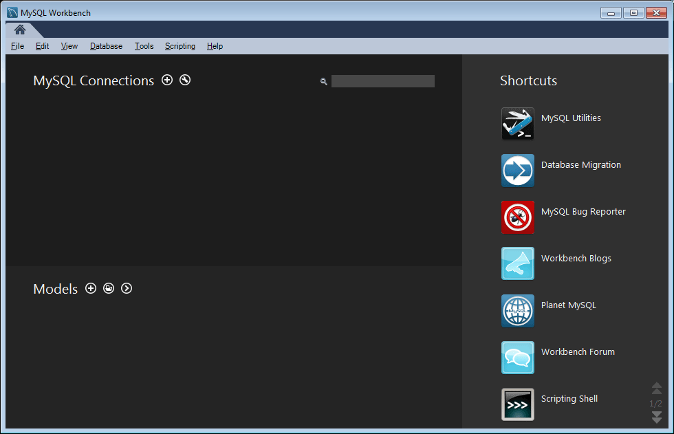
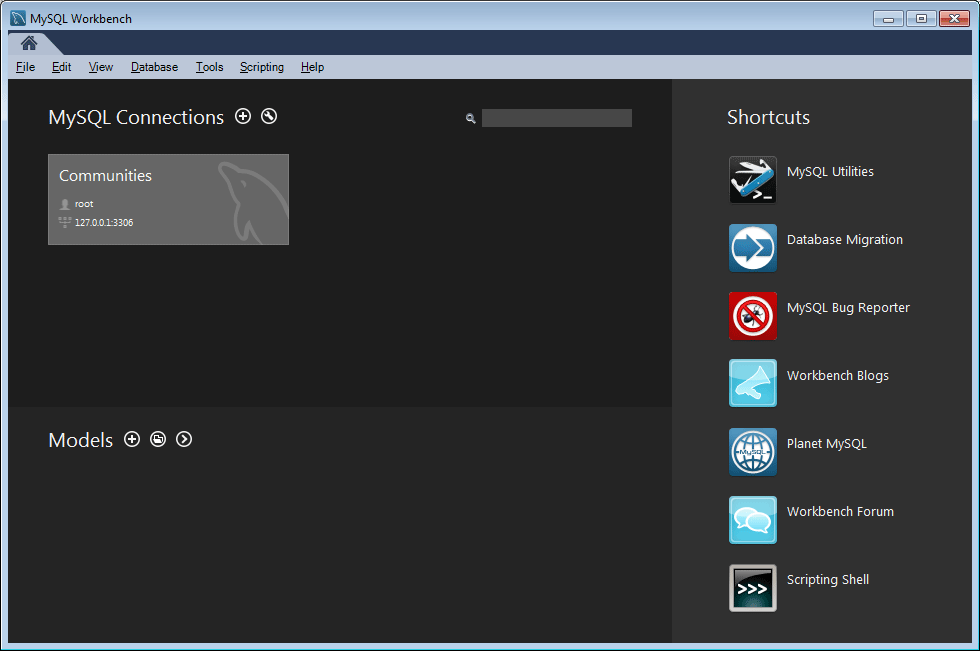
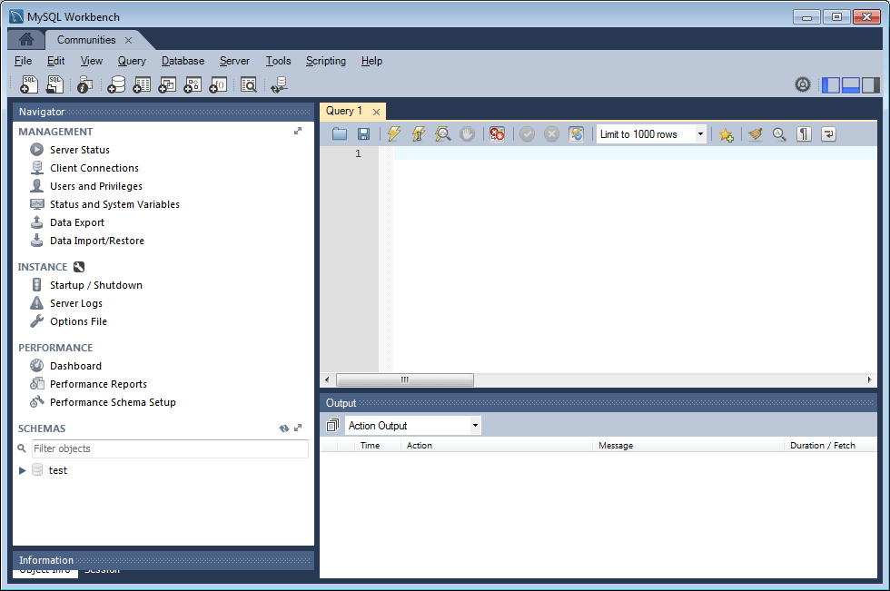
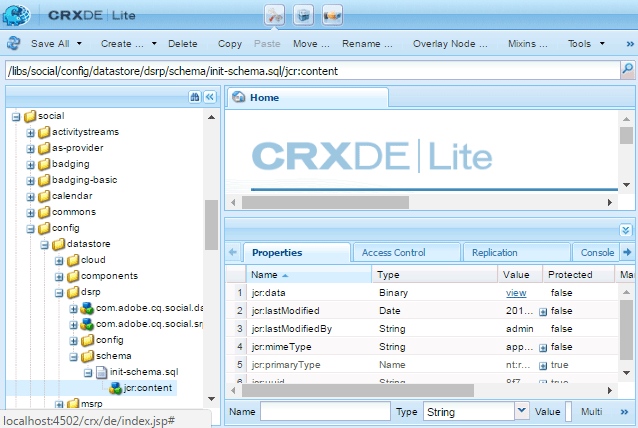
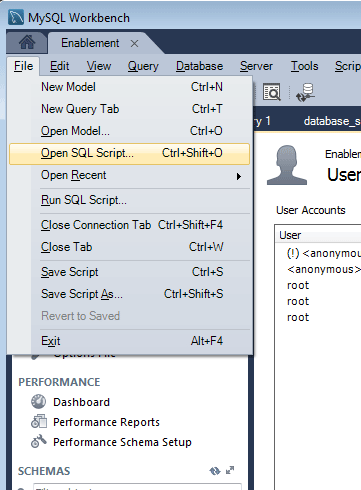
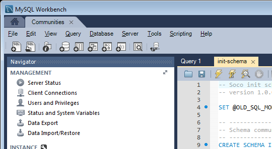
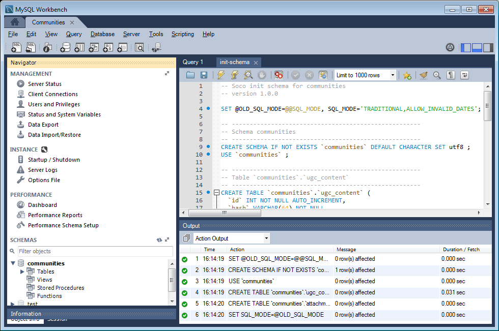
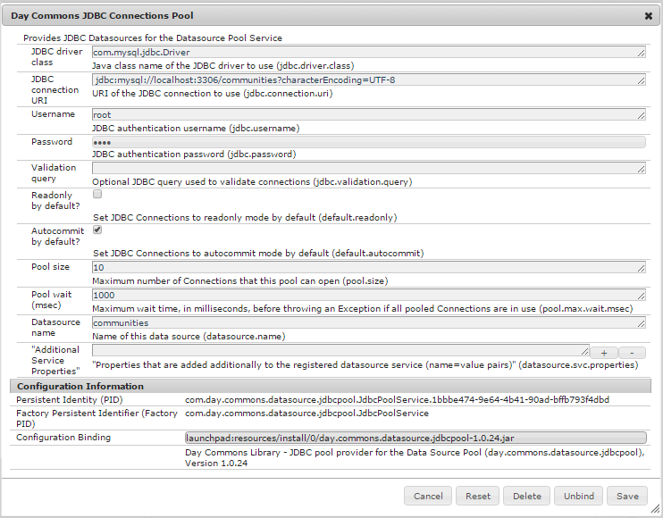

# Configuration de MySQL pour DSRP {#mysql-configuration-for-dsrp}

MySQL est une base de données relationnelle qui peut être utilisée pour stocker du contenu généré par l’utilisateur (UGC).

Ces instructions décrivent comment se connecter au serveur MySQL et établir la base de données UGC.

## Exigences {#requirements}

* [Dernier pack de fonctionnalités de Communities](deploy-communities.md#latestfeaturepack)
* [Pilote JDBC pour MySQL](deploy-communities.md#jdbc-driver-for-mysql)
* Une base de données relationnelle :

  * [MySQL server](https://dev.mysql.com/downloads/mysql/) Community Server version 5.6 ou ultérieure

    * Peut s’exécuter sur le même hôte qu’AEM ou à distance

  * [Workbench MySQL](https://dev.mysql.com/downloads/tools/workbench/)

## Installation de MySQL {#installing-mysql}

[MySQL](https://dev.mysql.com/downloads/mysql/) doit être téléchargé et installé en suivant les instructions du système d’exploitation cible.

### Noms de tables en minuscules {#lower-case-table-names}

Comme SQL ne respecte pas la casse, pour les systèmes d’exploitation qui respectent la casse, il est nécessaire d’inclure un paramètre pour mettre tous les noms de table en minuscules.

Par exemple, pour spécifier tous les noms de table en minuscules sur un système d&#39;exploitation Linux :

* Modifier le `/etc/my.cnf` de fichier
* Dans la section `[mysqld]` , ajoutez la ligne suivante :

  `lower_case_table_names = 1`

### Jeu de caractères UTF8 {#utf-character-set}

Pour une meilleure prise en charge multilingue, il est nécessaire d’utiliser le jeu de caractères UTF8.

Modifiez MySQL pour avoir UTF8 comme jeu de caractères :

* mysql > SET NAMES &#39;utf8&#39;;

Remplacez la base de données MySQL par défaut par UTF8 :

* Modifier le `/etc/my.cnf` de fichier
* Dans la section `[client]` , ajoutez la ligne suivante :

  `default-character-set=utf8`

* Dans la section `[mysqld]` , ajoutez la ligne suivante :

  `character-set-server=utf8`

## Installation de MySQL Workbench {#installing-mysql-workbench}

MySQL Workbench fournit une interface utilisateur pour l’exécution de scripts SQL qui installent le schéma et les données initiales.

MySQL Workbench doit être téléchargé et installé en suivant les instructions du système d’exploitation cible.

## Connexion aux communautés {#communities-connection}

Lorsque MySQL Workbench est lancé pour la première fois, à moins qu’il ne soit déjà utilisé à d’autres fins, il n’affiche pas encore de connexions :

### Nouveaux paramètres de connexion {#new-connection-settings}

1. Sélectionnez l’icône `+` située à droite de `MySQL Connections`.
1. Dans la `Setup New Connection` de dialogue, saisissez les valeurs appropriées à votre plateforme

   À des fins de démonstration, avec l’instance AEM de création et MySQL sur le même serveur :

   * Nom de la connexion : `Communities`
   * Méthode de connexion : `Standard (TCP/IP)`
   * Nom d’hôte : `127.0.0.1`
   * Nom d’utilisateur : `root`.
   * Mot de passe : `no password by default`.
   * Schéma Par Défaut : `leave blank`

1. Sélectionnez `Test Connection` pour vérifier la connexion au service MySQL en cours d’exécution

**Remarques** :

* Le port par défaut est `3306`
* Le Nom de connexion choisi est saisi comme nom de la source de données dans [configuration OSGi JDBC](#configurejdbcconnections)

#### Nouvelle connexion aux communautés {#new-communities-connection}

## Configuration de la base de données {#database-setup}

Ouvrez la connexion Communities pour installer la base de données.

### Obtenir le script SQL {#obtain-the-sql-script}

Le script SQL est obtenu à partir du référentiel AEM :

1. Accéder à CRXDE Lite

   * Par exemple, [&#128279;](http://localhost:4502/crx/de)

1. Sélectionnez le dossier /libs/social/config/datastore/dsrp/schema .
1. Télécharger `init-schema.sql`

   

Une méthode pour télécharger le schéma consiste à :

* Sélectionnez le nœud `jcr:content` pour le fichier sql
* Notez que la valeur de la propriété `jcr:data` est un lien d’affichage

* Sélectionnez le lien Afficher pour enregistrer les données dans un fichier local

### Créer la base de données DSRP {#create-the-dsrp-database}

Pour installer la base de données, procédez comme suit. Le nom par défaut de la base de données est `communities`.

Si le nom de la base de données est modifié dans le script, veillez également à le modifier dans la [configuration JDBC](#configurejdbcconnections).

#### Etape 1 : ouvrir le fichier SQL {#step-open-sql-file}

Dans MySQL Workbench

* Dans le menu déroulant Fichier , sélectionnez l’option **[!UICONTROL Ouvrir le script SQL]**
* Sélectionner le script de `init_schema.sql` téléchargé

#### Etape 2 : exécuter le script SQL {#step-execute-sql-script}

Dans la fenêtre Workbench du fichier ouvert à l’étape 1, sélectionnez le `lightening (flash) icon` d’exécution du script.

Dans l’image suivante, le fichier `init_schema.sql` est prêt à être exécuté :

#### Actualiser {#refresh}

Une fois le script exécuté, il faut actualiser la section `SCHEMAS` du `Navigator` pour voir la nouvelle base de données. Utilisez l’icône d’actualisation à droite de « SCHÉMAS » :

## Configurer la connexion JDBC {#configure-jdbc-connection}

La configuration OSGi du **Pool de connexions JDBC Day Commons** configure le pilote JDBC MySQL.

Toutes les instances AEM de publication et de création doivent pointer vers le même serveur MySQL.

Lorsque MySQL s’exécute sur un serveur différent d’AEM, le nom d’hôte du serveur doit être spécifié à la place de « localhost » dans le connecteur JDBC.

* Sur chaque instance AEM de création et de publication.
* Connecté avec des droits d&#39;administrateur.
* Accédez à la [&#x200B; console web &#x200B;](../../help/sites-deploying/configuring-osgi.md).

  * Par exemple, [&#128279;](http://localhost:4502/system/console/configMgr)

* Localiser le `Day Commons JDBC Connections Pool`
* Sélectionnez l’icône `+` pour créer une configuration de connexion.

  

* Saisissez les valeurs suivantes :

  * **[!UICONTROL Classe de pilote JDBC]** : `com.mysql.jdbc.Driver`
  * **[!UICONTROL URI de connexion JDBC]** : `jdbc:mysql://localhost:3306/communities?characterEncoding=UTF-8`

    Spécifiez server à la place de localhost si le serveur MySQL n’est pas identique à « this » AEM server *communities* est le nom de base de données (schéma) par défaut.

  * **[!UICONTROL Nom d’utilisateur]** : `root`

    Ou saisissez le Nom d’utilisateur configuré pour le serveur MySQL, s’il n’est pas « root ».

  * **[!UICONTROL Mot de passe]** :

    Effacez ce champ si aucun mot de passe n’est défini pour MySQL.

    Sinon, saisissez le mot de passe configuré pour le nom d’utilisateur MySQL.

  * **[!UICONTROL Nom de la source de données]** : nom renseigné pour la [connexion MySQL](#new-connection-settings), par exemple &#39;communities&#39;.

* Sélectionnez **[!UICONTROL Enregistrer]**.
