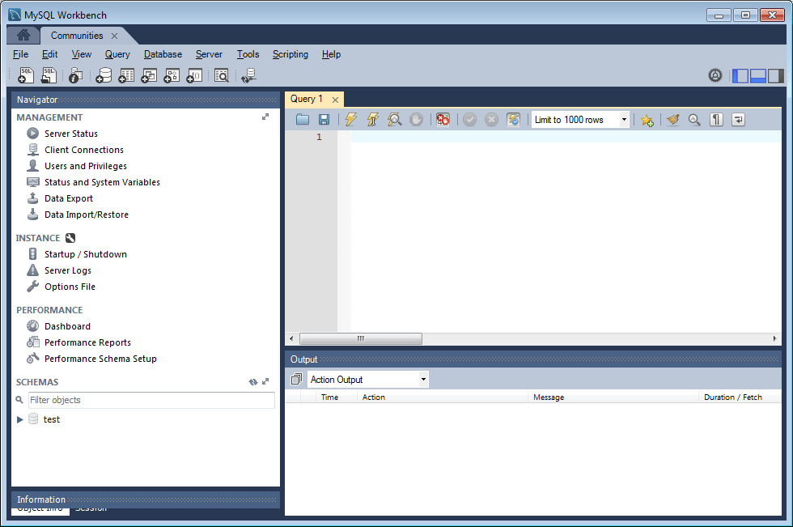
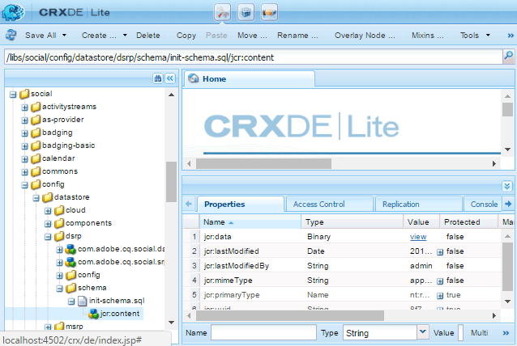

# Configuration MySQL pour DSRP {#mysql-configuration-for-dsrp}

MySQL est une base de données relationnelle qui peut être utilisée pour stocker le contenu généré par l’utilisateur.

Ces instructions décrivent comment se connecter au serveur MySQL et établir la base de données UGC.

## Conditions requises {#requirements}

* [Pack de fonctionnalités des dernières communautés](deploy-communities.md#latestfeaturepack)
* [Pilote JDBC pour MySQL](deploy-communities.md#jdbc-driver-for-mysql)
* Une base de données relationnelle :

   * [MySQL ](https://dev.mysql.com/downloads/mysql/) serverCommunity Server version 5.6 ou ultérieure

      * Peut s’exécuter sur le même hôte que AEM ou à distance
   * [MySQL Workbench](https://dev.mysql.com/downloads/tools/workbench/)

## Installation de MySQL {#installing-mysql}

 MySQL doit être téléchargé et installé selon les instructions du système d’exploitation cible.

### Noms de table en minuscules {#lower-case-table-names}

Comme SQL n’est pas sensible à la casse, pour les systèmes d’exploitation sensibles à la casse, il est nécessaire d’inclure un paramètre permettant de réduire la casse de tous les noms de table.

Par exemple, pour spécifier tous les noms de table en minuscules sur un système d’exploitation Linux :

* Modifier le fichier `/etc/my.cnf`
* Dans la section `[mysqld]`, ajoutez la ligne suivante :

   `lower_case_table_names = 1`

### Jeu de caractères UTF8 {#utf-character-set}

Pour offrir une meilleure prise en charge multilingue, il est nécessaire d&#39;utiliser le jeu de caractères UTF8.

Modifiez MySQL pour que UTF8 soit son jeu de caractères :

* mysql > SET NAMES &#39;utf8&#39;;

Remplacez la base de données MySQL par défaut par UTF8 :

* Modifier le fichier `/etc/my.cnf`
* Dans la section `[client]`, ajoutez la ligne suivante :

   `default-character-set=utf8`

* Dans la section `[mysqld]`, ajoutez la ligne suivante :

   `character-set-server=utf8`

## Installation de MySQL Workbench {#installing-mysql-workbench}

MySQL Workbench fournit une interface utilisateur pour exécuter des scripts SQL qui installent le schéma et les données initiales.

MySQL Workbench doit être téléchargé et installé selon les instructions du système d’exploitation cible.

## Connexion aux communautés {#communities-connection}

Lorsque MySQL Workbench est lancé pour la première fois, sauf s’il est déjà utilisé à d’autres fins, il n’affiche pas encore de connexions :

### Nouveaux paramètres de connexion {#new-connection-settings}

1. Sélectionnez l’icône `+` à droite de `MySQL Connections`.
1. Dans la boîte de dialogue `Setup New Connection`, saisissez les valeurs appropriées à votre plateforme.

   À des fins de démonstration, avec l’instance d’AEM de création et MySQL sur le même serveur :

   * Nom de la connexion: `Communities`
   * Méthode de connexion : `Standard (TCP/IP)`
   * Nom d’hôte: `127.0.0.1`
   * Nom d’utilisateur: `root`
   * Mot de passe: `no password by default`
   * Schéma par défaut : `leave blank`

1. Sélectionnez `Test Connection` pour vérifier la connexion au service MySQL en cours d’exécution.

**Remarques**:

* Le port par défaut est `3306`
* Le nom de connexion choisi est saisi en tant que nom de la source de données dans la [configuration OSGi JDBC](#configurejdbcconnections)

#### Nouvelle connexion aux communautés {#new-communities-connection}

## Configuration de la base de données {#database-setup}

Ouvrez la connexion Communities pour installer la base de données.

### Obtention du script SQL {#obtain-the-sql-script}

Le script SQL est obtenu à partir du référentiel AEM :

1. Accéder à CRXDE Lite

   * Par exemple, [http://localhost:4502/crx/de](http://localhost:4502/crx/de)

1. Sélectionnez le dossier /libs/social/config/datastore/dsrp/schema .
1. Télécharger `init-schema.sql`

   

Une méthode de téléchargement du schéma consiste à :

* Sélectionnez le noeud `jcr:content` pour le fichier sql.
* Notez que la valeur de la propriété `jcr:data` est un lien d’affichage.

* Sélectionnez le lien d&#39;affichage pour enregistrer les données dans un fichier local.

### Création de la base de données DSRP {#create-the-dsrp-database}

Suivez les étapes ci-dessous pour installer la base de données. Le nom par défaut de la base de données est `communities`.

Si le nom de la base de données est modifié dans le script, veillez également à le modifier dans la [configuration JDBC](#configurejdbcconnections).

#### Étape 1 : ouvrir le fichier SQL {#step-open-sql-file}

Dans MySQL Workbench

* Dans le menu déroulant Fichier , sélectionnez l’option **[!UICONTROL Ouvrir le script SQL]** .
* Sélectionnez le script `init_schema.sql` téléchargé

#### Étape 2 : exécuter le script SQL {#step-execute-sql-script}

Dans la fenêtre Workbench du fichier ouvert à l’étape 1, sélectionnez `lightening (flash) icon` pour exécuter le script.

Dans l’image suivante, le fichier `init_schema.sql` est prêt à être exécuté :

#### Actualiser {#refresh}

Une fois le script exécuté, il est nécessaire d&#39;actualiser la section `SCHEMAS` de la `Navigator` afin de voir la nouvelle base de données. Utilisez l’icône d’actualisation à droite de &quot;SCHEMAS&quot; :

## Configuration de la connexion JDBC {#configure-jdbc-connection}

La configuration OSGi pour le **pool de connexions JDBC Day Commons** configure le pilote JDBC MySQL.

Toutes les instances d’AEM de publication et de création doivent pointer vers le même serveur MySQL.

Lorsque MySQL s’exécute sur un serveur différent de l’AEM, le nom d’hôte du serveur doit être spécifié à la place de &quot;localhost&quot; dans le connecteur JDBC.

* Sur chaque instance d’AEM de création et de publication.
* Connecté avec les privilèges d’administrateur.
* Accédez à la [console web](../../help/sites-deploying/configuring-osgi.md).

   * Par exemple, [http://localhost:4502/system/console/configMgr](http://localhost:4502/system/console/configMgr)

* Recherchez le `Day Commons JDBC Connections Pool`
* Sélectionnez l&#39;icône `+` pour créer une configuration de connexion.

   

* Saisissez les valeurs suivantes :

   * **[!UICONTROL Classe]** de pilote JDBC :  `com.mysql.jdbc.Driver`
   * **[!UICONTROL URI de connexion JDBC]**: `jdbc:mysql://localhost:3306/communities?characterEncoding=UTF-8`

      Spécifiez le serveur à la place de localhost si le serveur MySQL n’est pas identique à &quot;this&quot; AEM serveur *communities* est le nom de la base de données par défaut (schéma).

   * **[!UICONTROL Nom d’utilisateur]** :  `root`

      Ou saisissez le nom d’utilisateur configuré pour le serveur MySQL, si ce n’est &quot;root&quot;.

   * **[!UICONTROL Mot de passe]**:

      Effacez ce champ si aucun mot de passe n’est défini pour MySQL,

      sinon, saisissez le mot de passe configuré pour le nom d’utilisateur MySQL.

   * **[!UICONTROL Nom]** de la source de données : nom saisi pour la connexion  [MySQL](#new-connection-settings), par exemple &quot;communities&quot;.

* Sélectionnez **[!UICONTROL Enregistrer]**
