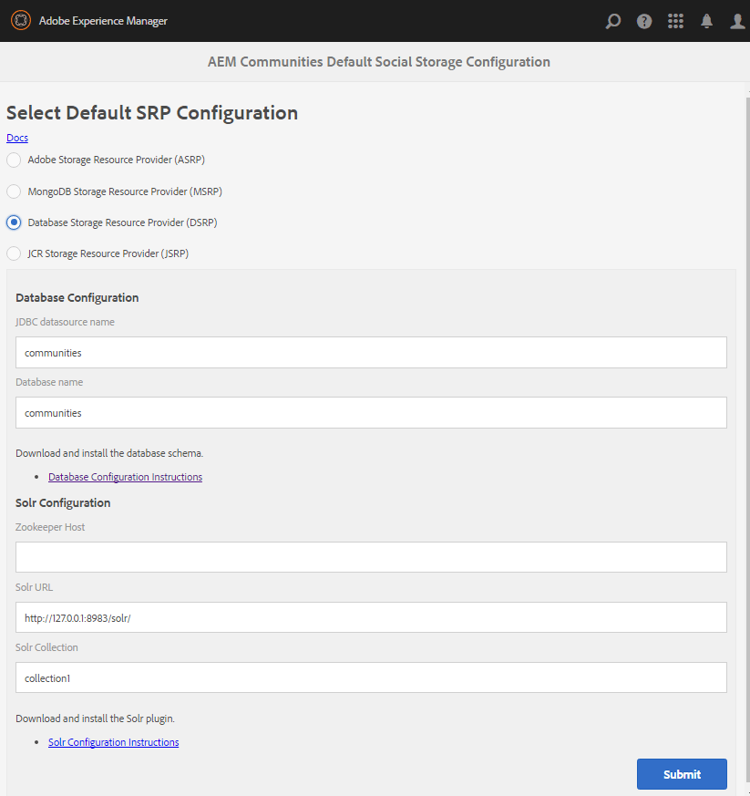

# DSRP - Fournisseur de ressources de stockage de base de données relationnelle {#dsrp-relational-database-storage-resource-provider}

## À propos de DSRP {#about-dsrp}

Lorsqu’AEM Communities est configuré pour utiliser une base de données relationnelle en tant que magasin commun, le contenu créé par l’utilisateur est accessible à partir de toutes les instances de création et de publication, sans avoir à effectuer de synchronisation ni de réplication.

Consultez également les sections [Caractéristiques des options SRP](working-with-srp.md#characteristics-of-srp-options) et [Topologies recommandées](topologies.md).

## Exigences {#requirements}

* [MySQL](#mysql-configuration), une base de données relationnelle.
* [Apache Solr](#solr-configuration), une plateforme de recherche.

>[!NOTE]
>
>La configuration de stockage par défaut est désormais stockée dans le chemin de configuration (`/conf/global/settings/community/srpc/defaultconfiguration`) au lieu du chemin de `etc` (`/etc/socialconfig/srpc/defaultconfiguration`). Il est conseillé de suivre les [étapes de migration](#zerodt-migration-steps) pour que defaultsrp fonctionne comme prévu.

## Configuration de la base de données relationnelle {#relational-database-configuration}

### Configuration de MySQL {#mysql-configuration}

Une installation MySQL peut être partagée entre les fonctions d’activation et le magasin commun (DSRP) au sein du même pool de connexions à l’aide de différents noms de base de données (schéma) et de différentes connexions (serveur:port).

Pour les détails d’installation et de configuration, voir [Configuration de MySQL pour DSRP](dsrp-mysql.md).

### Configuration de Solr {#solr-configuration}

Une installation Solr peut être partagée entre le magasin de nœuds (Oak) et le magasin commun (SRP) à l’aide de différentes collections.

Si les collections Oak et SRP sont utilisées de manière intensive, un second Solr peut être installé pour des raisons de performances.

Pour les environnements de production, le mode SolrCloud offre de meilleures performances que le mode autonome (une configuration Solr unique et locale).

Pour les détails d’installation et de configuration, voir [Configuration de Solr pour SRP](solr.md).

### Sélectionner DSRP {#select-dsrp}

La [console de configuration du stockage](srp-config.md) permet de sélectionner la configuration de stockage par défaut, qui identifie l’implémentation de SRP à utiliser.

En mode de création, pour accéder à la console de configuration du stockage

* Se connecter avec des droits d’administrateur
* À partir du **menu principal**

   * Sélectionnez **[!UICONTROL Outils]** (dans le volet de gauche)
   * Sélectionnez **[!UICONTROL Communities]**
   * Sélectionnez **[!UICONTROL Configuration de stockage]**

      * Par exemple, l’emplacement obtenu est : [:4502/communities/admin/defaultsrp](http://localhost:4502/communities/admin/defaultsrp)

     >[!NOTE]
     >
     >La configuration de stockage par défaut est désormais stockée dans le chemin de configuration (`/conf/global/settings/community/srpc/defaultconfiguration`) au lieu du chemin de `etc` (`/etc/socialconfig/srpc/defaultconfiguration`). Il est conseillé de suivre les [étapes de migration](#zerodt-migration-steps) pour que defaultsrp fonctionne comme prévu.

  

* Sélectionnez **[!UICONTROL Fournisseur de ressources de stockage de base de données (DSRP)]**
* **Configuration de la base de données**

   * **[!UICONTROL Nom de la source de données JDBC]**

     Le nom donné à la connexion MySQL doit être identique à celui saisi dans [configuration OSGi JDBC](dsrp-mysql.md#configurejdbcconnections)

     *default* : communities

   * **[!UICONTROL Nom de la base]**

     Nom donné au schéma dans le script [init_schema.sql](dsrp-mysql.md#obtain-the-sql-script)

     *default* : communities

* **SolrConfiguration**

   * **[Zookeeper](https://solr.apache.org/guide/6_6/using-zookeeper-to-manage-configuration-files.html) Host**

     Ne renseignez pas cette valeur si vous exécutez Solr à l’aide du ZooKeeper interne. Sinon, lors de l’exécution en mode [SolrCloud](solr.md#solrcloud-mode) avec un ZooKeeper externe, définissez cette valeur sur l’URI du ZooKeeper, par exemple *my.server.com:80*

     *default* : *&lt;blank>*

   * **[!UICONTROL URL Solr]**

     *default* : https://127.0.0.1:8983/solr/

   * **[!UICONTROL Collection Solr]**

     *default* : collection1

* Sélectionnez **[!UICONTROL Envoyer]**.

### Pas d’étapes de migration sans temps d’arrêt pour defaultsrp {#zerodt-migration-steps}

Pour vous assurer que la page defaultsrp [:4502/communities/admin/defaultsrp](http://localhost:4502/communities/admin/defaultsrp) fonctionne comme prévu, procédez comme suit :

1. Renommez le chemin d’accès à `/etc/socialconfig` en `/etc/socialconfig_old`, de sorte que la configuration système retourne à jsrp (par défaut).
1. Accédez à la page defaultsrp [:4502/communities/admin/defaultsrp](http://localhost:4502/communities/admin/defaultsrp), où jsrp est configuré. Cliquez sur le bouton **[!UICONTROL Envoyer]** pour créer un nœud de configuration par défaut au `/conf/global/settings/community/srpc`.
1. Supprimez le `/conf/global/settings/community/srpc/defaultconfiguration` de configuration par défaut créé.
1. Copiez l’ancienne `/etc/socialconfig_old/srpc/defaultconfiguration` de configuration à la place du nœud supprimé (`/conf/global/settings/community/srpc/defaultconfiguration`) à l’étape précédente.
1. Supprimez l’ancien nœud de `etc` `/etc/socialconfig_old`.

## Publication de la configuration {#publishing-the-configuration}

DSRP doit être identifié comme le magasin commun sur toutes les instances de création et de publication.

Pour rendre la configuration identique disponible dans l’environnement de publication :

* En mode de création :

   * Accédez au menu principal **[!UICONTROL Outils]** > **[!UICONTROL Opérations]** > **[!UICONTROL Réplication]**
   * Double-cliquez sur **[!UICONTROL Activer l’arborescence]**
   * **Chemin de début** :

      * Accéder à `/etc/socialconfig/srpc/`

   * Assurez-vous que `Only Modified` n’est pas sélectionné.
   * Sélectionnez **[!UICONTROL Activer]**.

## Gestion des données utilisateur {#managing-user-data}

Pour plus d’informations sur les *utilisateurs*, *profils utilisateur* et *groupes d’utilisateurs*, souvent saisis dans l’environnement de publication, consultez :

* [Synchronisation des utilisateurs](sync.md)
* [Gestion des utilisateurs et des groupes d’utilisateurs](users.md)

## Réindexation de Solr pour DSRP {#reindexing-solr-for-dsrp}

Pour réindexer DSRP Solr, suivez la documentation relative à la [réindexation de MSRP](msrp.md#msrp-reindex-tool). Toutefois, lors de la réindexation pour DSRP, utilisez plutôt cette URL : **/services/social/datastore/rdb/reindex**

Par exemple, une commande curl pour réindexer le DSRP ressemblerait à ceci :

```shell
curl -u admin:password -X POST -F path=/ https://host:port/services/social/datastore/rdb/reindex
```
