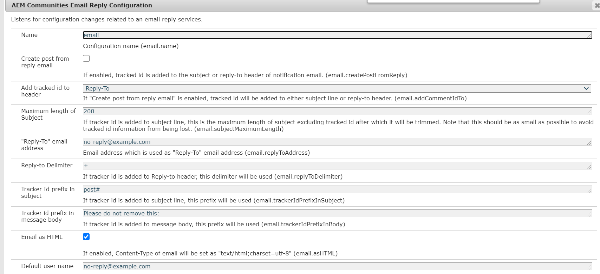

# Configuration du courrier électronique {#configuring-email}

AEM Communities utilise le courrier électronique pour :

* [Notifications des communautés](notifications.md)
* [Abonnements des communautés](subscriptions.md)

Par défaut, la fonction de messagerie n’est pas fonctionnelle, car elle requiert la spécification d’un serveur SMTP et d’un utilisateur SMTP.

>[!CAUTION]
>
>Le courrier électronique pour les notifications et les abonnements doit être configuré uniquement sur l’éditeur Principal.

## Configuration par défaut du service de messagerie {#default-mail-service-configuration}

Le service de messagerie par défaut est requis pour les notifications et les abonnements.

* Connectez-vous à l’éditeur Principal avec les droits d’administrateur et accédez à la console Web :

   * For example, [http://localhost:4503/system/console/configMgr](http://localhost:4503/system/console/configMgr)

* Localisez le `Day CQ Mail Service`.
* Sélectionnez l’icône Modifier.

Il est basé sur la documentation relative à la [configuration de la notification](../../help/sites-administering/notification.md)par courrier électronique, mais avec une différence dans le fait que le champ `"From" address` n’est ** pas obligatoire et doit rester vide.

Par exemple (renseigné avec des valeurs à des fins d’illustration uniquement) :

* **[!UICONTROL Nom d’hôte du serveur SMTP]**

   *(Obligatoire)* Serveur SMTP à utiliser.

* **[!UICONTROL Port du serveur SMTP]**

   *(Obligatoire)* Le port du serveur SMTP doit être de 25 ou plus.

* **[!UICONTROL Utilisateur SMTP]**

   *(Obligatoire)* Utilisateur SMTP.

* **[!UICONTROL Mot de passe SMTP]**

   *(Obligatoire)* Mot de passe de l’utilisateur SMTP.

* **[!UICONTROL Adresse &quot;De&quot;]**

   Laisser vide
* **[!UICONTROL SMTP utilise SSL]**

   Si cette case est cochée, envoie un courrier électronique sécurisé. Assurez-vous que le port est défini sur 465 ou comme requis pour le serveur SMTP.
* **[!UICONTROL Courriel de débogage]**

   Si cette case est cochée, active la journalisation des interactions du serveur SMTP.

## Configuration du courrier électronique AEM Communities {#aem-communities-email-configuration}

Une fois le service [de messagerie](#default-mail-service-configuration) par défaut configuré, les deux instances existantes de la configuration `AEM Communities Email Reply Configuration` OSGi, incluses dans la version, deviennent fonctionnelles.

Seule l’instance pour les abonnements doit être configurée plus avant lors de l’autorisation de la réponse par courrier électronique.

1. [Instance de courriel](#configuration-for-notifications) :

   Pour les notifications, qui ne prennent pas en charge le courrier électronique de réponse, et ne doivent pas être modifiées.

1. [Instance Abonnements-e-mail](#configuration-for-subscriptions) :

   Configuration requise pour activer entièrement la création de publication à partir d’un courrier électronique de réponse.

Pour atteindre les instances de configuration du courrier électronique des Communautés :

* Connectez-vous à l&#39;éditeur Principal avec les droits d&#39;administrateur et accédez à la console [Web.](../../help/sites-deploying/configuring-osgi.md)

   * For example, [http://localhost:4503/system/console/configMgr](http://localhost:4503/system/console/configMgr)

* Localisez `AEM Communities Email Reply Configuration`.

### Configuration des notifications {#configuration-for-notifications}

L&#39;instance de configuration `AEM Communities Email Reply Configuration` OSGi avec le message de nom est la fonctionnalité de notifications instantanées. Cette fonctionnalité n’inclut pas les réponses par courrier électronique.

Cette configuration ne doit pas être modifiée.

* Localisez le `AEM Communities Email Reply Configuration`.
* Sélectionnez l’icône Modifier.
* Vérifiez que le **nom** est `email`.

* Vérifiez que la fonction **Créer une publication à partir du courrier électronique** de réponse est `unchecked`activée.

### Configuration des Abonnements {#configuration-for-subscriptions}

Pour les abonnements des communautés, il est possible d’activer ou de désactiver la possibilité pour un membre de publier du contenu en répondant à un courriel.

* Localisez le `AEM Communities Email Reply Configuration`.
* Sélectionnez l’icône Modifier.
* Vérifiez que le **nom** est `subscriptions-email`.

   

* **[!UICONTROL Nom]**

   *(Obligatoire)* `subscriptions-email`. Ne pas modifier.

* **[!UICONTROL Créer une publication à partir d’un courrier électronique de réponse]**

   Si cette case est cochée, le destinataire de l’abonnement de messagerie peut publier du contenu en envoyant une réponse. Cette option est cochée par défaut.
* **[!UICONTROL Ajouter l’identifiant suivi à l’en-tête]**

   La valeur par défaut est `Reply-To`.

* **[!UICONTROL Longueur maximale de l’objet]**

   Si l’ID d’outil de suivi est ajouté à la ligne d’objet, il s’agit de la longueur maximale de l’objet, à l’exclusion de l’ID suivi, après quoi il sera coupé. Notez que cette valeur doit être aussi petite que possible pour éviter la perte des informations d’ID de suivi. La valeur par défaut est 200.

* **[!UICONTROL Adresse électronique de réponse]**

   Adresse électronique utilisée comme adresse électronique de réponse. La valeur par défaut est `no-reply@example.com`.

* **[!UICONTROL Répondre au délimiteur]**

   Si l’ID d’outil de suivi est ajouté à l’en-tête de réponse, ce délimiteur est utilisé. La valeur par défaut est `+` (signe plus).

* **[!UICONTROL Préfixe d&#39;ID de suivi dans l&#39;objet]**

   Si l’ID d’outil de suivi est ajouté à l’objet, ce préfixe est utilisé. La valeur par défaut est `post#`.

* **[!UICONTROL Préfixe d&#39;ID de suivi dans le corps du message]**

   Si l&#39;ID d&#39;outil de suivi est ajouté au corps du message, ce préfixe est utilisé. La valeur par défaut est `Please do not remove this:`.

* **[!UICONTROL Courriel au format HTML]**: Si cette case est cochée, le type de contenu du courrier électronique est défini comme `"text/html;charset=utf-8"`. Cette option est cochée par défaut.

* **[!UICONTROL Nom d’utilisateur par défaut]**

   Ce nom ne sera utilisé pour aucun utilisateur. La valeur par défaut est `no-reply@example.com`.

* **[!UICONTROL Chemin racine des modèles]**

   Le message électronique est créé en utilisant un modèle stocké à cet emplacement racine. La valeur par défaut est `/etc/community/templates/subscriptions-email`.

## Configuration de l’importateur d’interrogations {#configure-polling-importer}

Pour que le courrier électronique soit introduit dans le référentiel, il est nécessaire de configurer un importateur d’interrogation et de configurer ses propriétés manuellement dans le référentiel.

### Ajouter un nouvel importateur d&#39;interrogation {#add-new-polling-importer}

* Connectez-vous à l’éditeur Principal avec les droits d’administrateur et accédez à la console d’interrogation de l’importateur :

   Par exemple, [http://localhost:4503/etc/importers/polling.html](http://localhost:4503/etc/importers/polling.html)

* Sélectionner l&#39; **[!UICONTROL Ajoute]**

   

* **[!UICONTROL Type]**

   *(Obligatoire)* Appuyez sur la touche pour sélectionner `POP3 (over SSL)`.

* **[!UICONTROL URL]**

   *(Obligatoire)* Serveur de messagerie sortant. Par exemple, `pop.gmail.com:995/INBOX?username=community-emailgmail.com&password=****`.

* **[!UICONTROL Importer dans Path]**&amp;amp ; ast;

   *(Obligatoire)* Définissez ce paramètre sur `/content/usergenerated/mailFolder/postEmails`en accédant au `postEmails`dossier et en sélectionnant **OK**.

* **[!UICONTROL Intervalle de mise à jour en secondes]**

   *(Facultatif)* Le serveur de messagerie configuré pour le service de messagerie par défaut peut avoir des exigences concernant la valeur de l’intervalle de mise à jour. Par exemple, Gmail peut nécessiter un intervalle de `300`temps.

* **[!UICONTROL Connexion]**

   *(Facultatif)*

* **[!UICONTROL Mot de passe]**

   *(Facultatif)*

* **[!UICONTROL Cliquez sur OK]**.

### Modifier le protocole pour le nouvel importateur d&#39;interrogation {#adjust-protocol-for-new-polling-importer}

Une fois la nouvelle configuration d&#39;interrogation enregistrée, il est nécessaire de modifier davantage les propriétés de l&#39;importateur de messages électroniques d&#39;abonnement afin de modifier le protocole de `POP3` à `emailreply`.

Using [CRXDE Lite](../../help/sites-developing/developing-with-crxde-lite.md):

* Connectez-vous à l’éditeur Principal avec les droits d’administrateur et accédez à [https://&lt;serveur>:&lt;port>/crx/de/index.jsp#/etc/importateurs/polling](http://localhost:4503/crx/de/index.jsp#/etc/importers/polling).
* Sélectionnez la nouvelle configuration et modifiez les propriétés suivantes :

   * **feedType**: Remplacer `pop3s` par **`emailreply`**
   * **source**: Remplacez le protocole de la source `pop3s://` par **`emailreply://`**

Les triangles rouges indiquent les propriétés modifiées. Veillez à enregistrer les modifications :

* Select **[!UICONTROL Save All]**.

