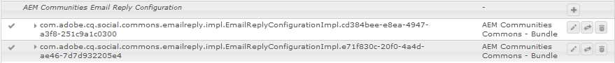
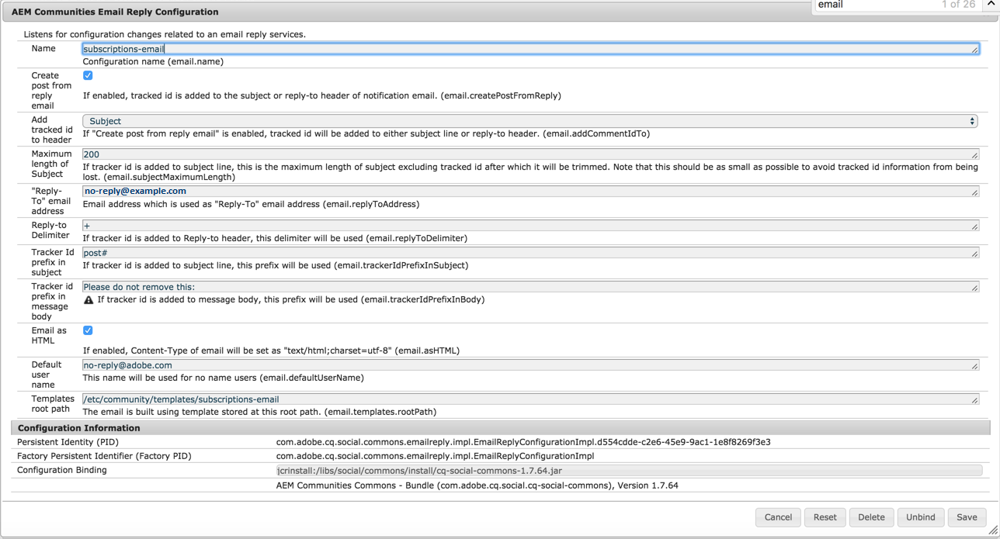
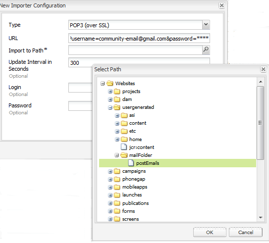
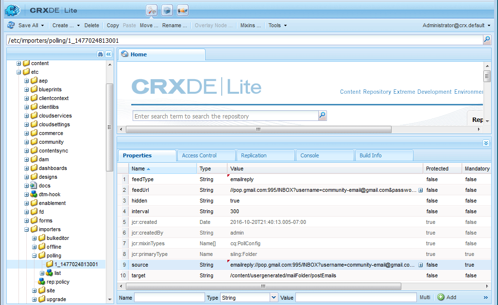

# Configuration des e-mails {#configuring-email}

AEM Communities utilise l’e-mail pour :

* [Notifications Communities](notifications.md)
* [Abonnements des communautés](subscriptions.md)

Par défaut, la fonction e-mail n’est pas fonctionnelle, car elle nécessite la spécification d’un serveur SMTP et d’un utilisateur SMTP.

>[!CAUTION]
>
>Les e-mails pour les notifications et les abonnements doivent être configurés uniquement sur l’[éditeur principal](deploy-communities.md#primary-publisher).

## Configuration par défaut du service de messagerie {#default-mail-service-configuration}

Le service de messagerie par défaut est requis pour les notifications et les abonnements.

* Connectez-vous à l’éditeur principal avec les droits d’administrateur et accédez à la [console web](../../help/sites-deploying/configuring-osgi.md) :

   * Par exemple, [:4503/system/console/configMgr](http://localhost:4503/system/console/configMgr)

* Recherchez le `Day CQ Mail Service` .
* Sélectionnez l’icône Modifier .

Cette requête est basée sur la documentation de [Configuration des notifications par e-mail](../../help/sites-administering/notification.md), mais avec une différence dans le fait que le `"From" address` de champ n’est *pas* obligatoire et doit être laissé vide.

Par exemple (renseigné avec des valeurs à titre d’illustration uniquement) :

* **[!UICONTROL Nom d’hôte du serveur SMTP]**

  *(Obligatoire)* Serveur SMTP à utiliser.

* **[!UICONTROL Port du serveur SMTP]**

  *(Obligatoire)* Le port du serveur SMTP doit être 25 ou supérieur.

* **[!UICONTROL Utilisateur SMTP]**

  *(Obligatoire)* Utilisateur SMTP.

* **[!UICONTROL Mot de passe SMTP]**

  *(Obligatoire)* Mot de passe de l’utilisateur SMTP.

* **[!UICONTROL adresse « De »]**

  Laisser vide
* **[!UICONTROL SMTP utilise SSL]**

  Si cette case est cochée, un e-mail sécurisé est envoyé. Assurez-vous que le port est défini sur 465 ou comme requis pour un serveur SMTP.
* **[!UICONTROL E-mail de débogage]**

  Si cette option est cochée, les interactions du serveur SMTP sont consignées.

## Configuration des e-mails AEM Communities {#aem-communities-email-configuration}

Une fois le [service de messagerie par défaut](#default-mail-service-configuration) configuré, les deux instances existantes de la configuration OSGi `AEM Communities Email Reply Configuration`, incluses dans la version, deviennent fonctionnelles.

Seule l’instance pour les abonnements doit être davantage configurée lors de l’autorisation de la réponse par e-mail.

1. Instance [Email](#configuration-for-notifications) :

   Pour les notifications , qui ne prennent pas en charge les réponses par e-mail et ne doivent pas être modifiées.

1. [Subscriptions-email](#configuration-for-subscriptions) instance :

   Nécessite une configuration pour activer complètement la création de publication à partir de l’e-mail de réponse.

Pour accéder aux instances de configuration d’e-mail de Communities :

* Connectez-vous à l’éditeur principal avec les droits d’administrateur et accédez à la [console web](../../help/sites-deploying/configuring-osgi.md)

   * Par exemple, [:4503/system/console/configMgr](http://localhost:4503/system/console/configMgr)

* Localisez `AEM Communities Email Reply Configuration`.

### Configuration pour les notifications {#configuration-for-notifications}

L’instance de `AEM Communities Email Reply Configuration` configuration OSGi avec l’e-mail Nom est la fonctionnalité de notifications. Cette fonctionnalité n’inclut pas la réponse par e-mail.

Ne modifiez pas cette configuration.

* Recherchez le `AEM Communities Email Reply Configuration` .
* Sélectionnez l’icône Modifier .
* Vérifiez que le **Nom** est `email`.

* Vérifiez que l’option **Créer une publication à partir de l’e-mail de réponse** est `unchecked`.

### Configuration des abonnements {#configuration-for-subscriptions}

Pour les abonnements Communities, il est possible d’activer ou de désactiver la possibilité pour un membre de publier du contenu en répondant à un e-mail.

* Recherchez le `AEM Communities Email Reply Configuration` .
* Sélectionnez l’icône Modifier .
* Vérifiez que le **Nom** est `subscriptions-email`.

  

* **[!UICONTROL Nom]**

  *(Obligatoire)* `subscriptions-email`. Ne Pas Modifier.

* **[!UICONTROL Créer une publication à partir de l’e-mail de réponse]**

  Si cette case est cochée, le destinataire d’un e-mail d’abonnement peut publier du contenu en envoyant une réponse. La valeur par défaut est cochée.
* **[!UICONTROL Ajouter l’ID suivi à l’en-tête]**

  La valeur par défaut est `Reply-To`.

* **[!UICONTROL Longueur maximale du sujet]**

  Si l’ID de suivi est ajouté à la ligne d’objet, il s’agit de la longueur maximale de l’objet, à l’exclusion de l’ID de suivi, après quoi il est supprimé. Elle doit être aussi petite que possible pour éviter la perte des informations d’identification suivies. La valeur par défaut est 200.

* **[!UICONTROL adresse e-mail « Répondre à »]**

  Adresse utilisée comme adresse e-mail de « réponse ». La valeur par défaut est `no-reply@example.com`.

* **[!UICONTROL Réponse au délimiteur]**

  Si l’ID de suivi est ajouté à l’en-tête « Répondre à », ce délimiteur est utilisé. La valeur par défaut est `+` (signe plus).

* **[!UICONTROL Préfixe de l’ID de suivi dans l’objet]**

  Si l’ID de suivi est ajouté à la ligne d’objet, ce préfixe est utilisé. La valeur par défaut est `post#`.

* **[!UICONTROL Préfixe de l’ID de suivi dans le corps du message]**

  Si l’ID de suivi est ajouté au corps du message, ce préfixe est utilisé. La valeur par défaut est `Please do not remove this:`.

* **[!UICONTROL Envoyer par e-mail sous HTML]** : si cette case est cochée, le type de contenu de l’e-mail est défini sur `"text/html;charset=utf-8"`. La valeur par défaut est cochée.

* **[!UICONTROL Nom d’utilisateur par défaut]**

  Ce nom est utilisé pour les utilisateurs sans nom. La valeur par défaut est `no-reply@example.com`.

* **[!UICONTROL Chemin racine des modèles]**

  L’e-mail est créé à l’aide d’un modèle stocké dans ce chemin racine. La valeur par défaut est `/etc/community/templates/subscriptions-email`.

## Configurer l’importateur d’interrogations {#configure-polling-importer}

Pour que l’e-mail soit importé dans le référentiel, il est nécessaire de configurer un importateur d’interrogations et de configurer manuellement ses propriétés dans le référentiel.

### Ajouter un nouvel importateur d’interrogations {#add-new-polling-importer}

* Connectez-vous à l’éditeur principal avec les droits d’administrateur et accédez à la console d’importation d’interrogations :

  Par exemple, [http://localhost:4503/etc/importers/polling.html](http://localhost:4503/etc/importers/polling.html)

* Sélectionnez **[!UICONTROL Ajouter]**

  

* **[!UICONTROL Type]**

  *(Obligatoire)* Faites défiler l’écran vers le bas pour sélectionner `POP3 (over SSL)`.

* **[!UICONTROL URL]**

  *(Obligatoire)* Serveur de courrier sortant. Par exemple, `pop.gmail.com:995/INBOX?username=community-emailgmail.com&password=****`.

* **[!UICONTROL Importer dans le chemin d’accès]**&ast;

  *(Obligatoire)* Définir sur `/content/usergenerated/mailFolder/postEmails`
en accédant au dossier `postEmails` et en sélectionnant **OK**.

* **[!UICONTROL Intervalle de mise à jour en secondes]**

  *(Facultatif)* Le serveur de messagerie configuré pour le service de messagerie par défaut peut avoir des exigences concernant la valeur de l’intervalle de mise à jour. Par exemple, Gmail peut nécessiter un intervalle de `300`.

* **[!UICONTROL Connexion]**

  *(Facultatif)*

* **[!UICONTROL Password]**

  *(Facultatif)*

* Sélectionnez **[!UICONTROL OK]**.

### Modifier le protocole pour le nouvel importateur d’interrogations {#adjust-protocol-for-new-polling-importer}

Une fois la nouvelle configuration d’interrogation enregistrée, il est nécessaire de modifier davantage les propriétés de l’importateur d’e-mails d’abonnement pour remplacer le protocole `POP3` par `emailreply`.

Utilisation de [&#128279;](../../help/sites-developing/developing-with-crxde-lite.md) :

* Connectez-vous à l’éditeur principal avec le privilège administrateur et accédez à [https://&lt;server>:&lt;port>/crx/de/index.jsp#/etc/attributes/polling](http://localhost:4503/crx/de/index.jsp#/etc/importers/polling).
* Sélectionnez la configuration que vous venez de créer et modifiez les propriétés suivantes :

   * **feedType** : remplacez `pop3s` par **`emailreply`**
   * **source** : remplacez le `pop3s://` de protocole de la source par **`emailreply://`**

Les triangles rouges indiquent les propriétés modifiées. Veillez à enregistrer les modifications :

* Sélectionnez **[!UICONTROL Enregistrer tout]**.
