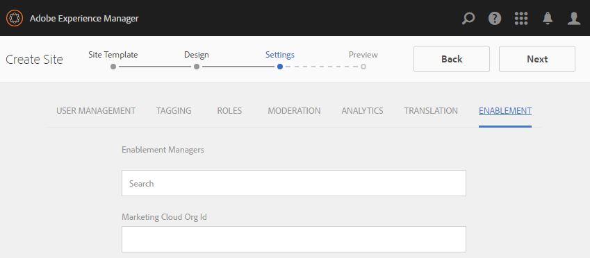

# Création d’un nouveau site communautaire pour l’activation {#author-a-new-community-site-for-enablement}

## Créer un site de communauté {#create-community-site}

[La création](/help/communities/sites-console.md) d&#39;un site communautaire utilise un assistant qui vous guide tout au long des étapes de création d&#39;un site communautaire. Il est possible de passer à l&#39; `Next` étape ou `Back` à l&#39;étape précédente avant de valider le site dans l&#39;étape finale.

Pour commencer à créer un site communautaire :

Utilisation de l’instance [d’auteur](https://localhost:4502/)

* Connectez-vous avec les droits d’administrateur et accédez à **[!UICONTROL Communautés]** > **[!UICONTROL Sites]**.

* Sélectionnez **Créer**.

### Étape 1 : Modèle de site {#step-site-template}

A l’étape Modèle **de** site, saisissez un titre, une description, le nom de l’URL, puis sélectionnez un modèle de site communautaire, par exemple :

* **Titre du site de la communauté**: `Enablement Tutorial`.

* **Description du site de la communauté**: `A site for enabling the community to learn.`

* **Racine** du site de la communauté : (laisser vide pour la racine par défaut `/content/sites`)

* **Configurations** du cloud : (laissez vide si aucune configuration de cloud n’est spécifiée) fournissez le chemin d’accès aux configurations de cloud spécifiées.
* **Langue** de base du site de la communauté : (ne pas toucher à la langue unique : anglais) utilisez la liste déroulante pour choisir une *ou plusieurs* langues de base parmi les langues disponibles : allemand, italien, français, japonais, espagnol, portugais (Brésil), chinois (traditionnel) et chinois (simplifié). Un site communautaire sera créé pour chaque langue ajoutée et existera dans le même dossier de site selon les meilleures pratiques décrites dans la section [Traduction de contenu pour les sites](/help/sites-administering/translation.md)multilingues. La page racine de chaque site contient une page enfant nommée par le code de langue de l&#39;une des langues sélectionnées, comme &quot;en&quot; pour l&#39;anglais ou &quot;fr&quot; pour le français.

* **Nom du site de la communauté**: `enable`

   * L&#39;URL initiale s&#39;affiche sous le nom du site de la communauté.
   * Pour une URL valide, ajoutez un code de langue de base + &quot;.html&quot;
      *Par exemple*, https://localhost:4502/content/sites/ `enable/en.html`

* **Modèle** de site de référence : descendre pour choisir `Reference Structured Learning Site Template`

Sélectionnez **Suivant**.

### Étape 2 : Conception {#step-design}

L’étape de conception est présentée en deux sections pour la sélection du thème et de la bannière de marque :

#### COMMUNITY SITE THEME {#community-site-theme}

Sélectionnez le style à appliquer au modèle. Une fois sélectionné, le thème sera superposé avec une coche.

#### COMMUNITY SITE BRANDING {#community-site-branding}

(Facultatif) Téléchargez une image de bannière pour l’afficher sur les pages du site. La bannière est épinglée sur le bord gauche du navigateur, entre l’en-tête du site de la communauté et le menu (liens de navigation). La hauteur de la bannière est rognée à 120 pixels. Il n’existe aucun redimensionnement de la bannière pour s’adapter à la largeur du navigateur et à la hauteur de 120 pixels.

Sélectionnez **Suivant**.

### Étape 3 : Paramètres {#step-settings}

A l’étape Paramètres, avant de sélectionner `Next`, vous pouvez remarquer que sept sections donnent accès à des configurations impliquant la gestion des utilisateurs, le balisage, les rôles, la modération, les analyses, la traduction et l’activation.

#### USER MANAGEMENT {#user-management}

Il est recommandé que les communautés [d&#39;](/help/communities/overview.md#enablement-community) activation soient privées.

Un site communautaire est privé lorsque des visiteurs anonymes du site se voient refuser l’accès, peuvent ne pas s’enregistrer eux-mêmes et ne pas utiliser de connexion sociale.

Assurez-vous que la plupart des cases à cocher sont désélectionnées pour [User Management](/help/communities/sites-console.md#user-management) :

* N&#39;autorisez PAS les visiteurs du site à s&#39;inscrire eux-mêmes.
* N&#39;autorisez PAS les visiteurs anonymes du site à vue au site.
* Facultatif : autoriser ou non la messagerie parmi les membres de la communauté.
* N’autorisez PAS la connexion avec Facebook.
* N’autorisez PAS la connexion avec Twitter.

#### TAGGING {#tagging}

Les balises qui peuvent être appliquées au contenu de la communauté sont contrôlées en sélectionnant les espaces de nommage AEM précédemment définis dans la console [de](/help/sites-administering/tags.md#tagging-console) balisage (tel que l’espace de nommage [de](/help/communities/enablement-setup.md#create-tutorial-tags)didacticiel).

En outre, la sélection des Espaces de nommage de balises pour le site communautaire limite la sélection présentée lors de la définition de catalogues et de ressources d’activation. Voir Ressources [d’activation du](/help/communities/tag-resources.md) balisage pour obtenir des informations importantes.

La recherche d&#39;espaces de nommage est facile avec la recherche par type. Par exemple :

* Type `tut`
* Sélectionner `Tutorial`

### ROLES {#roles}

[Les rôles](/help/communities/users.md) des membres de la communauté sont attribués via les paramètres de la section Rôles.

Pour permettre à un membre de la communauté (ou à un groupe de membres) de découvrir le site en tant que responsable de la communauté, utilisez la recherche par type et sélectionnez le nom du membre ou du groupe dans les options de la liste déroulante.

Par exemple :

* Type `q`
* Sélectionner [Quinn Harper](/help/communities/enablement-setup.md#publishcreateenablementmembers)

>[!NOTE]
>
>[Le service](/help/communities/deploy-communities.md#tunnel-service-on-author) Tunnel permet de sélectionner les membres et les groupes existants uniquement dans l’environnement de publication.

#### MODERATION {#moderation}

Acceptez les paramètres globaux par défaut pour la [modération](/help/communities/sites-console.md#moderation) du contenu généré par l’utilisateur (UGC).

#### ANALYTICS {#analytics}

Dans la liste déroulante, sélectionnez la structure de service cloud Analytics configurée pour ce site communautaire.

La sélection affichée dans la capture d’écran `Communities`, est l’exemple de structure de la documentation de [configuration.](/help/communities/analytics.md#aem-analytics-framework-configuration)

#### TRANSLATION {#translation}

Les paramètres [de](/help/communities/sites-console.md#translation) traduction indiquent si l’UGC peut être traduit ou non et dans quelle langue, le cas échéant.

* Vérifier **autoriser la traduction automatique**
* Utiliser les paramètres par défaut

#### ENABLEMENT {#enablement}

Pour une communauté d’activation, il est nécessaire d’identifier un ou plusieurs gestionnaires d’activation de la communauté.

* **Gestionnaires** d&#39;activation (requis) Membres de 
`Community Enablement Managers` sont disponibles pour être sélectionnés pour gérer ce site communautaire.

   * Type `s`
   * Sélectionner `Sirius Nilson`

* **Identifiant** d’organisation Marketing Cloud (facultatif) Identifiant d’un compte Adobe Analytics nécessaire lors de l’inclusion de la version de test [de pulsation](/help/communities/analytics.md#video-heartbeat-analytics) vidéo dans le rapports d’activation.

Sélectionnez **Suivant**.

### Étape 4 : Créer un site communautaire {#step-create-community-site}

Sélectionnez **Créer.**

Une fois le processus terminé, le dossier du nouveau site s’affiche dans la console Communautés > Sites.

### Publication du nouveau site de la communauté {#publish-the-new-community-site}

Le site créé doit être géré à partir de la console Communautés - Sites, la même console que celle où de nouveaux sites peuvent être créés.

Après avoir sélectionné le dossier du site de la communauté, passez la souris sur l’icône du site pour afficher quatre icônes d’action :

Lorsque vous sélectionnez l’icône représentant des points de suspension (icône Autres actions), les options Exporter le site et Supprimer le site s’affichent.

De gauche à droite, ils sont :

* **Ouvrir le site**

   Sélectionnez l’icône représentant un crayon pour ouvrir le site de la communauté en mode d’édition de l’auteur, pour ajouter et/ou configurer des composants de page.

* **Modifier le site**

   Sélectionnez l’icône Propriétés pour ouvrir le site de la communauté en vue de modifier les propriétés, par exemple le titre ou pour modifier le thème.

* **Publier le site**

   Sélectionnez l’icône du monde pour publier le site de la communauté (sur localhost:4503 par défaut).

* **Exporter le site**

   Sélectionnez l’icône d’exportation pour créer un package du site de la communauté qui est à la fois stocké dans le gestionnaire de [packages](/help/sites-administering/package-manager.md) et téléchargé.
Notez que UGC n&#39;est pas inclus dans le package du site.

* **Supprimer le site**

   Pour supprimer le site de la communauté, sélectionnez l&#39;icône Supprimer le site qui s&#39;affiche lorsque vous placez le pointeur de la souris sur le site dans la console du site des communautés. Cette action supprime tous les éléments associés au site, tels que l’UGC, les groupes d’utilisateurs, les ressources et les enregistrements de base de données.

   

#### Sélectionnez Publier {#select-publish}

Sélectionnez l’icône du monde pour publier le site de la communauté.

Il y aura une indication que le site a été publié.

## Utilisateurs et groupes d’utilisateurs de la communauté {#community-users-user-groups}

### Avis des nouveaux groupes d’utilisateurs de la communauté {#notice-new-community-user-groups}

En plus du nouveau site communautaire, de nouveaux groupes d’utilisateurs sont créés et disposent des autorisations appropriées définies pour diverses fonctions administratives. Pour plus d’informations, consultez Groupes d’ [utilisateurs pour les sites](/help/communities/users.md#usergroupsforcommunitysites)de la communauté.

Pour ce nouveau site de la communauté, étant donné le nom du site &quot;activer&quot; à l’étape 1, les nouveaux groupes d’utilisateurs qui existent dans l’environnement de publication peuvent être vus à partir de la console [Membres et groupes](/help/communities/members.md#groups-console)des communautés :

### Affecter des membres au groupe d&#39;activation de la communauté {#assign-members-to-community-enable-members-group}

Sur l’auteur, le service de tunnel étant activé, il est possible d’affecter les [utilisateurs créés lors de la configuration](/help/communities/enablement-setup.md#publishcreateenablementmembers) initiale au groupe Membres de la communauté pour le site communautaire nouvellement créé.

A l’aide de la console Groupes de la communauté, les membres peuvent être ajoutés individuellement ou par le biais d’une adhésion à un groupe.

Dans cet exemple, le groupe `Community Ski Class` est ajouté en tant que membre du groupe `Community Enable Members` ainsi qu’en tant que membre `Quinn Harper`.

* Accédez à la console **Communautés, Groupes** .
* Sélectionner le groupe de membres *Activer la* communauté
* Saisissez &quot;ski&quot; dans la zone de recherche **Ajouter les membres au groupe** .
* Sélectionner la classe *de ski* communautaire (groupe d&#39;apprenants)
* Saisissez &quot;quinn&quot; dans la zone de recherche.
* Sélectionnez *Quinn Harper* (contact de ressources d&#39;activation)

* Sélectionnez **Enregistrer**

## Configurations sur la publication {#configurations-on-publish}

`https://localhost:4503/content/sites/enable/en.html {#http-localhost-content-sites-enable-en-html}`

### Erreur de configuration pour l’authentification {#configure-for-authentication-error}

Une fois qu’un site a été configuré et envoyé pour publication, [configurez le mappage](/help/communities/sites-console.md#configure-for-authentication-error) de connexion ( `Adobe Granite Login Selector Authentication Handler`) sur l’instance de publication. L’avantage est que lorsque les informations d’identification de connexion ne sont pas saisies correctement, l’erreur d’authentification affiche à nouveau la page de connexion du site de la communauté avec un message d’erreur.

Ajoutez une `Login Page Mapping` comme :

* `/content/sites/enable/en/signin:/content/sites/enable/en`

### (Facultatif) Modification de la Page d&#39;accueil par défaut {#optional-change-the-default-home-page}

Lorsque vous travaillez avec le site de publication à des fins de démonstration, il peut s’avérer utile de modifier la page d&#39;accueil par défaut du nouveau site.

Pour ce faire, vous devez utiliser [CRX|DE](https://localhost:4503/crx/de) Lite pour modifier la table de mappage [des](/help/sites-deploying/resource-mapping.md) ressources lors de la publication.

Pour commencer :

1. Lors de la publication, accédez à CRXDE et connectez-vous avec des droits d’administrateur.

   * Par exemple, accédez à [https://localhost:4503/crx/de](https://localhost:4503/crx/de) et connectez-vous avec `admin/admin`

1. Dans le navigateur du projet, développez `/etc/map`
1. Sélectionner le `http` noeud

   * Sélectionner **Créer un noeud**

      * **Nommer** localhost.4503

         (do *not* use &#39;:&#39;)

      * **Type** [sling:Mappage](https://sling.apache.org/documentation/the-sling-engine/mappings-for-resource-resolution.html)

1. Avec le nouveau `localhost.4503` noeud sélectionné

   * Ajouter, propriété

      * **Nom** sling:match
      * **Chaîne de type**
      * **Valeur** localhost.4503/$

   (doit se terminer par &#39;$&#39; char)

   * Ajouter, propriété

      * **Nom** sling:internalRedirect
      * **Chaîne de type**
      * **Valeur** /content/sites/enable/en.html

1. Select **Save All**
1. (Facultatif) Supprimer l’historique de navigation
1. Accédez à https://localhost:4503/

   * Arrivez à https://localhost:4503/content/sites/enable/en.html

>[!NOTE]
>
>Pour désactiver cette fonction, il vous suffit de pré-ajouter la valeur de la `sling:match` propriété à l’aide de &quot;x&quot; - `xlocalhost.4503/$` - et **d’enregistrer tout**.

#### Dépannage : Erreur lors de l&#39;enregistrement de la carte {#troubleshooting-error-saving-map}

Si vous ne parvenez pas à enregistrer les modifications, assurez-vous que le nom du noeud est `localhost.4503`, avec un séparateur de point, et non `localhost:4503` avec un séparateur de point, car `localhost` il ne s’agit pas d’un préfixe d’espace de nommage valide.

#### Dépannage : Echec de la redirection {#troubleshooting-fail-to-redirect}

La valeur &quot;**$**&quot; à la fin de la chaîne d’expression `sling:match` normale est cruciale, de sorte que seul le mappage exact `https://localhost:4503/` est effectué, sinon la valeur de redirection est précédée de tout chemin d’accès qui peut exister après le serveur:port dans l’URL. Par conséquent, lorsqu’AEM tente de rediriger vers la page de connexion, elle échoue.

## Modification du site communautaire {#modifying-the-community-site}

Une fois le site créé, les auteurs peuvent utiliser l’icône  Ouvrir le site pour effectuer des activités de création AEM standard.

En outre, les administrateurs peuvent utiliser l&#39;icône  Modifier le site pour modifier les propriétés du site, comme le titre.

Après toute modification, n’oubliez pas d’ **enregistrer** et de publier à nouveau **** le site.

>[!NOTE]
>
>If not familiar with AEM, view the documentation on [basic handling](/help/sites-authoring/basic-handling.md) and a [quick guide to authoring pages](/help/sites-authoring/qg-page-authoring.md).

### Ajouter un catalogue {#add-a-catalog}

Le modèle de site communautaire choisi pour ce site communautaire doit contenir la fonctionnalité de catalogue.

Dans le cas contraire, la fonction de catalogue peut être facilement ajoutée. Cela permettrait aux autres membres de la communauté, non affectés à des ressources d’activation ou à un chemin d’apprentissage, de sélectionner des ressources d’activation dans un catalogue.

Si la structure du site contient déjà la fonctionnalité de catalogue, son titre peut être modifié.

Pour modifier la structure du site, accédez à la console **Communautés, Sites** , ouvrez le `enable` dossier et sélectionnez l&#39;icône **Modifier le site** pour accéder aux propriétés de `Enablement Tutorial`.

Sélectionnez le panneau STRUCTURE pour ajouter un catalogue ou modifier un catalogue existant :

* **Titre**: `Ski Catalog`

* **URL**: `catalog`

* **Sélectionner tous les Espaces de nommage**: laissez comme valeur par défaut.

* Sélectionnez **Enregistrer**.

Utilisez l’icône Position pour déplacer la fonction Catalogue vers la deuxième position, après les affectations.

Sélectionnez **Enregistrer** dans le coin supérieur droit pour enregistrer les modifications sur le site de la communauté.

Ensuite,**publiez** de nouveau le site.

