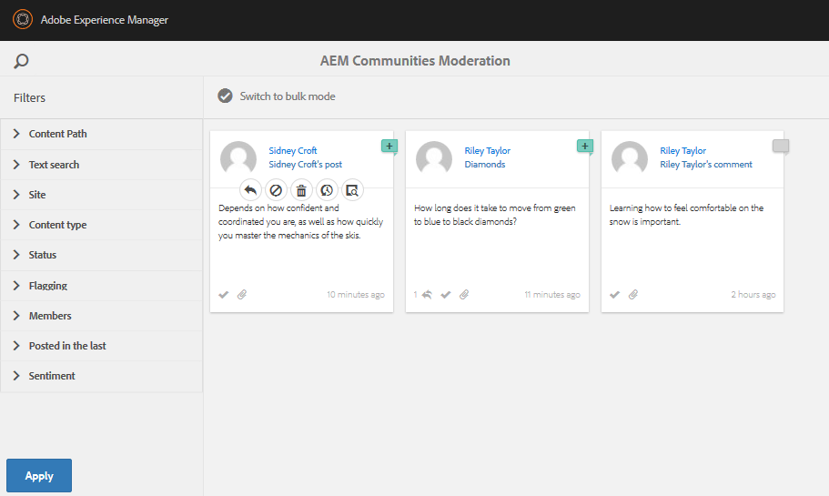

# Expérience du site publié {#experience-the-published-site}

**[⇐ Créer et affecter des ressources d’activation](resource.md)**

## Accéder au nouveau site sur Publier {#browse-to-new-site-on-publish}

Maintenant que le nouveau site communautaire ainsi que ses ressources d’activation et son parcours d’apprentissage ont été publiés, il est possible de découvrir le site du didacticiel d’activation.

Commencez par naviguer jusqu’à l’URL affichée lors de la création du site, mais sur le serveur de publication, par exemple.

* URL de l’auteur = [http://localhost:4502/content/sites/enable/en.html](http://localhost:4502/content/sites/enable/en.html)
* URL de publication = [http://localhost:4503/content/sites/enable/en.html](http://localhost:4503/content/sites/enable/en.html)

Si la page d&#39;accueil [par défaut a été définie](enablement-create-site.md#changethedefaulthomepage), il vous suffit de naviguer jusqu&#39;à [http://localhost:4503/](http://localhost:4503/) pour lancer le site.

En arrivant sur le site publié, le visiteur du site n’était généralement pas déjà connecté et était anonyme.

**http://localhost:4503/content/sites/enable/en.html**

## Visiteur de site anonyme {#anonymous-site-visitor}

Un visiteur de site anonyme est immédiatement présenté avec la page de connexion de ce site de la communauté d&#39;activation privée. Notez qu’il n’existe aucune option d’auto-inscription ni de connexion avec Facebook ou Twitter.

Notez que cette page d&#39;accueil affiche quatre options de menu : `Assignments, Ski Catalog, What's New` et `Discussions`, mais aucun ne peut être atteint sans se connecter.

>[!NOTE]
>
>Il est possible d&#39;accorder un accès anonyme à un site d&#39;activation sans permettre aux visiteurs du site de s&#39;enregistrer eux-mêmes.
>
>Si une ressource d&#39;activation est définie sur `show in catalog` et `allow anonymous access`, les visiteurs anonymes du site pourront vue des ressources du catalogue.

### Empêcher l’accès anonyme au JCR {#prevent-anonymous-access-on-jcr}

Une limitation connue expose le contenu du site de la communauté aux visiteurs anonymes par le biais du contenu jcr et json, bien que **[!UICONTROL autoriser l’accès anonyme]** soit désactivé pour le contenu du site. Cependant, ce comportement peut être contrôlé à l’aide des restrictions Sling comme solution.

Pour protéger le contenu de votre site communautaire contre l’accès d’utilisateurs anonymes par le biais de contenu jcr et json, procédez comme suit :

1. Sur AEM instance d’auteur, accédez à https://&lt;hôte>:&lt;port>/editor.html/content/site/&lt;nom du site>.html.

   >[!NOTE]
   >
   >N’accédez pas au site localisé.

1. Accédez à **[!UICONTROL Propriétés de la page]**.

   

1. Accédez à l’onglet **[!UICONTROL Avancé]**.
1. Activez **[!UICONTROL Authentification requise]**.

   

1. Ajoutez le chemin de la page de connexion. Par exemple, `/content/......./GetStarted`.
1. Publiez la page.

## Membre inscrit {#enrolled-member}

Cette expérience repose sur le fait que les utilisateurs `Riley Taylor` et `Sidney Croft` sont [créés](enablement-setup.md#publishcreateenablementmembers) et [affectés](resource.md#settings) aux *leçons de ski* parcours d&#39;apprentissage grâce à leur adhésion au groupe *Classe de ski communautaire*.

Connexion avec

* `Username: riley`
* `Password: password`

Si le profil d’utilisateur n’a pas été créé par l’auto-inscription, la première fois qu’un membre se connecte, sa page de Profil s’affiche afin qu’il puisse le vérifier et le modifier si nécessaire.

La prochaine fois que le membre se connecte, la page d&#39;accueil, identifiée par le premier élément de menu, s&#39;affiche.

### Affectations {#assignments}

La page Affectations affiche tous les chemins d’apprentissage et les ressources d’activation qui leur sont affectés.

Chaque affectation fournit des informations de base sur :

* Type d&#39;affectation
* S&#39;il s&#39;agit d&#39;une nouvelle affectation
* Le nom
* Détails relatifs au type d&#39;affectation
* Contact d&#39;affectation, expert et auteur (le cas échéant)

Le type d&#39;affectation est indiqué par une icône dans le coin supérieur gauche de la carte. L&#39;image d&#39;une route est celle d&#39;un parcours d&#39;apprentissage avec le nombre de ressources d&#39;activation incluses.

La sélection de *Leçons de ski* affichera les deux ressources d&#39;activation référencées par le chemin d&#39;apprentissage.

Si vous sélectionnez *Ski Lesson 1*, la page de détails de la ressource d&#39;activation s&#39;ouvre.

A partir de la page des détails, le membre peut apprendre [rate](rating.md) la leçon et ajouter [commentaires](comments.md). Toute activité membre sera reflétée dans la section Nouveautés du site.

Les interactions avec la ressource d&#39;activation sont indiquées dans la section Rapport accessible dans l&#39;environnement d&#39;auteur.

### Catalogue Ski {#ski-catalog}

La page Catalogue des skis est le catalogue des ressources d’activation balisées avec des balises de l’espace de nommage `Tutorial`. Les deux ressources *Ski Lesson* sont balisées avec la balise `Skiing`, de sorte que si des balises autres que `All` ou `Tutorial: Sports / Skiing` sont sélectionnées, rien ne s’affiche.

Lorsqu’un membre n’a pas reçu de ressources d’activation, directement ou par le biais d’un parcours d’apprentissage, il est possible d’interagir avec les ressources d’activation situées dans un catalogue et de fournir des commentaires et des évaluations.

### Discussions {#discussions}

Outre l’évaluation et les commentaires sur les ressources d’activation ([lorsqu’elle est activée](enablement-create-site.md#step33asettings)), le modèle de site communautaire à partir duquel `Enablement Tutorial` a été créé inclut la fonction [forum](functions.md#forum-function) (le titre est `Discussions)`).

Sélectionnez le lien `Discussions`et publiez une rubrique.

Déconnectez-vous et connectez-vous en tant que Sidney Croft (sidney / password) et répondez à la question, ainsi que Suivez le sujet.

Notez qu’en plus de la modération en ligne, il existe des options pour partager la rubrique sur les réseaux sociaux ou pour envoyer la rubrique par courriel.

### Nouveautés {#what-s-new}

L&#39;élément de menu `What's New` est le titre donné à la fonction [activité stream function](functions.md#activity-stream-function) dans la structure de ce site communautaire.

Toujours connecté en tant que Sidney, sélectionnez le lien `What's New` pour afficher l’activité.

## Membre de la communauté approuvée {#trusted-community-member}

Cette expérience suppose que ` [Quinn Harper](enablement-setup.md#publishcreateenablementmembers)` a été affecté aux rôles [modérateur](enablement-create-site.md#moderation) et [contact ressource](resource.md#settings).

Connexion avec

* `Username: quinn`
* `Password: password`

Une fois connecté, notez qu&#39;il existe un nouvel élément de menu, `Administration`, qui s&#39;affiche car le membre a reçu le rôle de modérateur.

La page d&#39;accueil est identifiée par le premier élément de menu, Affectations. Quinn est le modérateur et le contact de ressources d&#39;activation et n&#39;était inscrit à aucune ressource d&#39;activation ou de chemins d&#39;apprentissage, il n&#39;y a donc rien à afficher.

### Administration {#administration}

Ce qu&#39;il y a, c&#39;est l&#39;activité des deux apprenants, `Riley Taylor` et `Sidney Croft`. En sélectionnant le lien `Administration` pour accéder à la console de modération, Quinn peut utiliser la [console de modération en bloc](moderation.md) pour modérer leurs publications.

La sélection de l’icône du panneau latéral permet d’ouvrir les filtres utilisés pour effectuer des recherches dans le contenu de la communauté.

Le survol d’une carte de commentaires affiche les actions de modération.

## Rapports sur l&#39;auteur {#reports-on-author}

Il existe deux façons d’accéder au rapports sur les apprenants et les ressources d’activation.

Sur l’auteur, accédez à **Communautés, [Console Ressources](resources.md)**, où les ressources d’activation sont gérées, et après avoir sélectionné un site communautaire, il est possible de générer des rapports pour

* Toutes les ressources d’activation et tous les chemins d’apprentissage
* Une ressource d&#39;activation ou un chemin d&#39;apprentissage spécifique

Accédez à la console **Communautés [Rapports](reports.md)** et générez des rapports selon :

* Affectations aux ressources d’activation et aux chemins d’apprentissage
* Publications sur un site communautaire au cours d’une période spécifique
* Vues (visites sur le site) d’un site communautaire sur une période spécifique

* Les publications et vues peuvent concerner tout le contenu ou un contenu spécifique :

   * Forum
   * Sujet du forum
   * Q&amp;R
   * Question Q&amp;R
   * Blog
   * Article de blog
   * Calendrier
   * Événement de calendrier

### Console Ressources {#resources-console}

Avec un peu d&#39;activité et d&#39;interaction avec les ressources sur la publication, l&#39;affichage des rapports sur l&#39;auteur vaut la peine d&#39;être regardé.

* Sur l’auteur, connectez-vous avec des privilèges d’administration.
* Accédez au menu principal **[!UICONTROL Communautés]** > **[!UICONTROL Ressources]**.
* Sélectionnez le site `Enablement Tutorial`.
* Sélectionnez l&#39;icône `Report` pour obtenir un résumé de toutes les ressources.
* Sélectionnez une ressource, puis l&#39;icône `Report` pour un rapport sur cette ressource.

Notez qu’il est probablement trop tôt pour afficher les données en provenance d’Adobe Analytics, qui peuvent prendre de 1 à 12 heures pour apparaître. Toutefois, le rapports SCORM de base est déjà disponible.

#### Rapport de ressources sur les leçons de ski {#ski-lessons-resource-report}

#### Rapport utilisateur des leçons de ski {#ski-lessons-user-report}

* Sélectionnez **[!UICONTROL Communautés > Ressources]**

* Ouvrir la carte `Enablement Tutorial`
* Ouvrir la carte `Ski Lessons`
* Sélectionner `Report > User Report`

### Console Rapports{#reports-console} 

La console Rapports permet la génération de rapports sur

* **Affectations** pour tout site de communauté d&#39;activation
* **** Visualisations d’un site communautaire
* **Publications** pour tout site communautaire

Pour les rapports sur les affectations :

* Sur l’auteur, connectez-vous avec des privilèges d’administration.
* Accédez à **[!UICONTROL Communautés]** > **[!UICONTROL Rapports]** > **[!UICONTROL Rapport Affectations]**.
* Sélectionnez un **[!UICONTROL site]** dans le menu déroulant (sélectionnez `Enablement Tutorial`).

* Sélectionnez **[!UICONTROL Groupe]** (sélectionnez `Community Ski Class`).

* Sélectionnez une **[!UICONTROL affectation]** (sélectionnez `Ski Lessons`).

* Sélectionnez **[!UICONTROL Générer]**

Pour les rapports sur les vues :

* Sur l’auteur, connectez-vous avec des privilèges d’administration.
* Accédez à **[!UICONTROL Communautés]** > **[!UICONTROL Rapports]** > **[!UICONTROL Rapport de Vues]**.
* Sélectionnez un **site** dans le menu déroulant (sélectionnez `Enablement Tutorial`).

* Sélectionnez **[!UICONTROL Type de contenu]** (sélectionnez `all`).

* Sélectionnez une **[!UICONTROL plage de dates]** (sélectionnez `Last 7 days`).

* Sélectionnez **[!UICONTROL Générer]**.

**[⇐ Créer et affecter des ressources d’activation](resource.md)**
