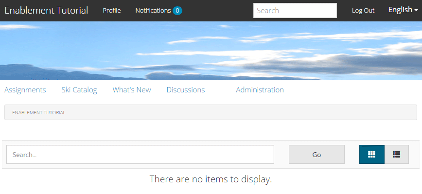

# Expérience du site publié {#experience-the-published-site}

**[⇐ Créer et attribuer des ressources d’activation](resource.md)**

## Accédez au nouveau site sur la publication {#browse-to-new-site-on-publish}

Maintenant que le site de la communauté nouvellement créé, ses ressources d’activation et son parcours de formation ont été publiés, il est possible de tester le site du tutoriel d’activation.

Accédez tout d’abord à l’URL affichée lors de la création du site, mais sur le serveur de publication, par exemple :

* URL de création = [http://localhost:4502/content/sites/enable/en.html](http://localhost:4502/content/sites/enable/en.html)
* URL de publication = [http://localhost:4503/content/sites/enable/en.html](http://localhost:4503/content/sites/enable/en.html)

Si la [page d’accueil par défaut a été définie](enablement-create-site.md#changethedefaulthomepage), il suffit de naviguer jusqu’à [http://localhost:4503/](http://localhost:4503/) pour lancer le site.

En arrivant sur le site publié pour la première fois, le visiteur du site n’était généralement pas déjà connecté et était anonyme.

**http://localhost:4503/content/sites/enable/en.html**

## Visiteur du site anonyme {#anonymous-site-visitor}

Un visiteur anonyme du site se voit immédiatement présenter la page de connexion de ce site de la communauté d’activation privée. Notez qu’il n’existe aucune option d’auto-inscription ni de connexion avec Facebook ou Twitter.

Notez que cette page d’accueil affiche quatre options de menu : `Assignments, Ski Catalog, What's New` et `Discussions`, mais aucun ne peut être atteint sans connexion.

>[!NOTE]
>
>Il est possible d’accorder un accès anonyme à un site d’activation sans permettre aux visiteurs du site de s’inscrire eux-mêmes.
>
>Si une ressource d’activation est définie sur `show in catalog` et `allow anonymous access`, les visiteurs anonymes du site pourront afficher les ressources dans le catalogue.

### Empêcher l’accès anonyme sur JCR {#prevent-anonymous-access-on-jcr}

Une limitation connue expose le contenu du site de la communauté aux visiteurs anonymes par le biais du contenu jcr et de json , bien que **[!UICONTROL autoriser l’accès anonyme]** soit désactivé pour le contenu du site. Cependant, ce comportement peut être contrôlé à l’aide de restrictions Sling comme solution de contournement.

Pour protéger le contenu de votre communauté contre l’accès des utilisateurs anonymes par le biais de jcr content et json , procédez comme suit :

1. Sur AEM instance d’auteur, accédez à https://&lt;hôte>:&lt;port>/editor.html/content/site/&lt;nom_site>.html.

   >[!NOTE]
   >
   >Ne pas accéder au site localisé.

1. Accédez à **[!UICONTROL Propriétés de page]**.

   

1. Accédez à l’onglet **[!UICONTROL Avancé]**.
1. Activez **[!UICONTROL Exigence d’authentification]**.

   

1. Ajoutez le chemin d’accès de la page de connexion. Par exemple, `/content/......./GetStarted`.
1. Publiez la page.

## Membre inscrit {#enrolled-member}

Cette expérience repose sur le fait que les utilisateurs `Riley Taylor` et `Sidney Croft` sont [créés](enablement-setup.md#publishcreateenablementmembers) et [affectés](resource.md#settings) au parcours d’apprentissage *Ski* par le biais de leur adhésion au groupe *Classe de ski communautaire*.

Se connecter avec

* `Username: riley`
* `Password: password`

Si le profil utilisateur n’a pas été créé par l’auto-inscription, la toute première fois qu’un membre se connecte, sa page Profil s’affiche afin qu’il puisse le vérifier et le modifier si nécessaire.

La prochaine fois que le membre se connecte, la page d’accueil, identifiée par le premier élément de menu, s’affiche.

### Affectations {#assignments}

Sur la page Affectations, le membre voit s’afficher tous les parcours d’apprentissage et les ressources d’activation qui lui sont spécifiquement affectés.

Chaque affectation fournit des informations de base sur :

* Type d’affectation
* S’il s’agit d’une nouvelle affectation
* Nom
* Détails pertinents pour le type d’affectation
* Contact d’affectation, expert et auteur (le cas échéant)

Le type d’affectation est indiqué par une icône dans le coin supérieur gauche de la carte. L’image d’une route est destinée à un parcours d’apprentissage avec le nombre de ressources d’activation incluses.

Sélectionnez *Leçons de ski* pour afficher les deux ressources d’activation référencées par le chemin d’apprentissage.

Si vous sélectionnez *Leçon de ski 1*, la page de détails de la ressource d’activation s’ouvre.

Sur la page des détails, le membre peut apprendre [rate](rating.md) la leçon et ajouter des [commentaires](comments.md). Toute activité de membre sera reflétée dans la section Nouveautés du site.

Les interactions avec la ressource d’activation seront notées dans la section Rapport accessible dans l’environnement de création.

### Catalogue Ski {#ski-catalog}

La page Catalogue Ski est le catalogue des ressources d’activation balisées avec des balises de l’espace de noms `Tutorial`. Les deux ressources *Leçon de ski* sont balisées avec la balise `Skiing`, de sorte que si des balises autres que `All` ou `Tutorial: Sports / Skiing` sont sélectionnées, rien ne s’affiche.

Lorsqu’un membre n’a pas reçu de ressources d’activation, directement ou par le biais d’un parcours d’apprentissage, il est possible d’interagir avec les ressources d’activation situées dans un catalogue et de fournir des commentaires et des évaluations.

### Discussions {#discussions}

Outre l’évaluation et les commentaires sur les ressources d’activation ([lorsqu’elle est activée](enablement-create-site.md#step33asettings)), le modèle de site de communauté à partir duquel `Enablement Tutorial` a été créé inclut la [fonction de forum](functions.md#forum-function) (le titre est `Discussions)`).

Sélectionnez le lien `Discussions`et publiez une rubrique.

Déconnectez-vous et connectez-vous en tant que Sidney Croft (sidney / password), répondez à la question, puis suivez le sujet.

Notez qu’en plus de la modération en ligne, il existe des options pour partager le sujet sur les médias sociaux ou envoyer le sujet par courrier électronique.

### Nouveautés {#what-s-new}

L’élément de menu `What's New` est le titre donné à la [fonction de flux d’activité](functions.md#activity-stream-function) dans la structure de ce site communautaire.

Toujours connecté en tant que Sidney, sélectionnez le lien `What's New` pour afficher l’activité.

## Membre de la communauté approuvée {#trusted-community-member}

Cette expérience suppose que ` [Quinn Harper](enablement-setup.md#publishcreateenablementmembers)` se voit attribuer les rôles [modérateur](enablement-create-site.md#moderation) et [contact de ressource](resource.md#settings).

Se connecter avec

* `Username: quinn`
* `Password: password`

Une fois connecté, notez qu’il existe un nouvel élément de menu, `Administration`, qui s’affiche car le membre a reçu le rôle de modérateur.

La page d’accueil est identifiée par le premier élément de menu, Affectations. Quinn est le modérateur et le contact de ressources d’activation. Il n’a pas été inscrit dans les ressources d’activation ou les parcours d’apprentissage. Il n’y a donc rien à afficher.

### Administration {#administration}

Ce qu’il y a, c’est l’activité des deux apprenants, `Riley Taylor` et `Sidney Croft`. En sélectionnant le lien `Administration` pour accéder à la console de modération, Quinn peut utiliser la [console de modération en bloc](moderation.md) pour modérer leurs publications.

La sélection de l’icône du panneau latéral permet d’ouvrir les filtres utilisés pour rechercher le contenu de la communauté.

Le survol d’une carte de commentaire affiche les actions de modération.

## Rapports sur l’auteur {#reports-on-author}

Il existe deux manières d’accéder aux rapports sur les apprenants et aux ressources d’activation.

Une fois l’auteur créé, accédez à la **console Ressources](resources.md)**, où sont gérées les ressources d’activation. Après avoir sélectionné un site de communauté, il est possible de générer des rapports pour[

* Toutes les ressources d’activation et tous les parcours de formation
* Une ressource d’activation ou un parcours d’apprentissage spécifique

Accédez à **Communautés [Console Rapports](reports.md)** et générez des rapports en fonction des éléments suivants :

* Affectations à des ressources d’activation et à des parcours d’apprentissage
* Publications sur un site de la communauté au cours d’une période spécifique
* Vues (visites de site) d’un site communautaire sur une période spécifique

* Les publications et les vues peuvent concerner tout le contenu ou un contenu spécifique :

   * Forum
   * Sujet du forum
   * Q&amp;R
   * Question Q&amp;R
   * Blog
   * Article de blog
   * Calendrier
   * Événement de calendrier

### Console Ressources {#resources-console}

Avec un peu d’activité et d’interaction avec les ressources sur la publication, l’affichage des rapports sur l’auteur vaut la peine d’être jeté un oeil.

* Sur l’instance de création, connectez-vous avec les privilèges d’administrateur.
* Dans le menu principal, accédez à **[!UICONTROL Communautés]** > **[!UICONTROL Ressources]**.
* Sélectionnez le site `Enablement Tutorial`.
* Sélectionnez l&#39;icône `Report` pour un résumé de toutes les ressources.
* Sélectionnez une ressource, puis l’icône `Report` d’un rapport sur cette ressource.

Notez qu’il est probablement trop tôt pour afficher les données d’Adobe Analytics, qui peuvent prendre entre 1 et 12 heures pour apparaître. Toutefois, les rapports SCORM de base sont déjà disponibles.

#### Rapport Ressource Des Leçons De Ski {#ski-lessons-resource-report}

#### Rapport Utilisateur Des Leçons De Ski {#ski-lessons-user-report}

* Sélectionnez **[!UICONTROL Communautés > Ressources]**

* Carte d’ouverture `Enablement Tutorial`
* Carte d’ouverture `Ski Lessons`
* Sélectionner `Report > User Report`

### Console Rapports{#reports-console} 

La console Rapports permet de générer des rapports sur les

* **** Affectations pour tout site de communauté d’activation
* **** Affichages pour n’importe quel site de communauté
* **** Publications d’un site de communauté

Pour les rapports sur les affectations :

* Sur l’instance de création, connectez-vous avec les privilèges d’administrateur.
* Accédez à **[!UICONTROL Communautés]** > **[!UICONTROL Rapports]** > **[!UICONTROL Rapport d’affectations]**.
* Sélectionnez un **[!UICONTROL Site]** dans le menu déroulant (sélectionnez `Enablement Tutorial`).

* Sélectionnez **[!UICONTROL Groupe]** (sélectionnez `Community Ski Class`).

* Sélectionnez une **[!UICONTROL affectation]** (sélectionnez `Ski Lessons`).

* Sélectionnez **[!UICONTROL Générer]**

Pour les rapports sur les vues :

* Sur l’instance de création, connectez-vous avec les privilèges d’administrateur.
* Accédez à **[!UICONTROL Communautés]** > **[!UICONTROL Rapports]** > **[!UICONTROL Rapports]**.
* Sélectionnez un **Site** dans le menu déroulant (sélectionnez `Enablement Tutorial`).

* Sélectionnez **[!UICONTROL Type de contenu]** (sélectionnez `all`).

* Sélectionnez une **[!UICONTROL période]** (sélectionnez `Last 7 days`).

* Sélectionnez **[!UICONTROL Générer]**.

**[⇐ Créer et attribuer des ressources d’activation](resource.md)**
