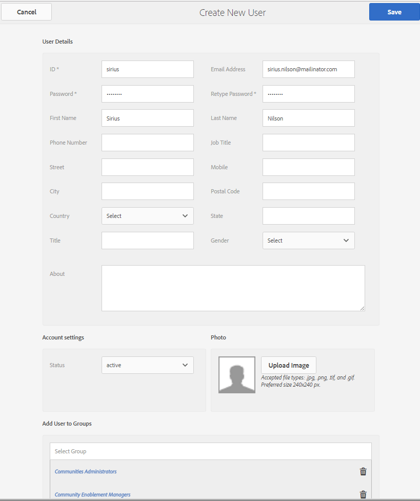

# Configuration initiale pour l’activation {#initial-setup-for-enablement}

## Démarrage des instances de création et de publication {#start-author-and-publish-instances}

À des fins de développement et de démonstration, il sera nécessaire d’exécuter une instance de création et une instance de publication.

Suivez les instructions de l’AEM de base [Prise en main](../../help/sites-deploying/deploy.md#getting-started) , qui se traduiront par

* Environnement de création sur [localhost:4502](http://localhost:4502/)
* Environnement de publication sur [localhost:4503](http://localhost:4503/)

Pour AEM Communities,

* L’environnement de création est destiné à :

   * Développement de sites, de modèles, de composants, de ressources d’activation et de parcours de formation.
   * Affectation de membres et de groupes de membres aux ressources d’activation et aux parcours de formation.
   * Génération de rapports sur les affectations, les vues et les publications.
   * Tâches administratives et de configuration.

* L’environnement de publication est destiné à :

   * Formation/formation basée sur des rubriques gérées par le Gestionnaire d’activation.
   * Commentaires et évaluation des ressources d’activation et des parcours d’apprentissage.
   * Contacter les contacts de la ressource.

>[!NOTE]
>
>Si vous ne connaissez pas l’AEM, consultez la documentation sur la [gestion de base](../../help/sites-authoring/basic-handling.md) et un [guide rapide pour créer des pages](../../help/sites-authoring/qg-page-authoring.md).

## Installer la dernière version de Communities {#install-latest-communities-release}

Ce tutoriel crée un [site de la communauté d’activation](overview.md#enablement-community). Pour vous assurer que le dernier Feature Pack est installé, rendez-vous sur :

* [Dernières versions](deploy-communities.md#latest-releases)

Pour consulter un tutoriel qui crée un [site de la communauté d’engagement](overview.md#engagement-community), rendez-vous sur [Prise en main d’AEM Communities](getting-started.md).

## Configurer les fonctionnalités d’activation {#configure-enablement-features}

Pour suivre ce tutoriel, il est nécessaire d’installer et de [configurer correctement l’activation](enablement.md), qui nécessite des produits tiers, tels que MySQL et FFmpeg.

## Configuration de Analytics {#configure-analytics}

Lorsque [Adobe Analytics est configuré pour le site de la communauté](analytics.md), des informations supplémentaires sont disponibles dans les [rapports](reports.md) générés sur les ressources d’activation et les parcours d’apprentissage attribués aux membres de la communauté (apprenants).

## Configurer le courrier électronique pour les notifications {#configure-email-for-notifications}

La fonctionnalité de notifications, disponible par défaut pour tous les sites créés à l’aide de la console `Communities Sites`, fournit un canal de courrier électronique pour les notifications.

Il est nécessaire de configurer correctement les emails pour le site.

Voir [Configuration d’Email](email.md).

## Activer le service Tunnel {#enable-the-tunnel-service}

Lors de la création d’un site communautaire dans l’environnement de création, le service tunnel permet de créer et de gérer des utilisateurs et des groupes d’utilisateurs enregistrés dans l’environnement de publication (membres), d’affecter des rôles aux membres de la communauté approuvés et d’affecter du contenu aux apprenants.

Pour plus d’informations, voir [Gestion des utilisateurs et des groupes d’utilisateurs](users.md).

Pour obtenir des instructions simples sur l’activation du service Tunnel, voir [Service Tunnel](deploy-communities.md#tunnel-service-on-author).

## Créer des balises de tutoriel {#create-tutorial-tags}

Créez des balises à utiliser pour les tutoriels d’engagement et d’activation, à l’aide de l’espace de noms de balise `Tutorial`.

Utilisez la [console Balisage](../../help/sites-administering/tags.md#tagging-console) pour créer les balises suivantes :

* `Tutorial: Sports / Baseball`
* `Tutorial: Sports / Gymnastics`
* `Tutorial: Sports / Skiing`
* `Tutorial: Arts / Visual`
* `Tutorial: Arts / Auditory`
* `Tutorial: Arts / History`

Suivez ensuite les instructions pour :

1. [Définition des autorisations de balise](../../help/sites-administering/tags.md#setting-tag-permissions)
1. [Publication des balises](../../help/sites-administering/tags.md#publishing-tags)

Exemple de package de balises créées pour les Tutorials de prise en main d’AEM Communities

[Obtenir le fichier](assets/communities_tutorialtags-10.zip)

## Créer des membres et des groupes d’activation {#create-enablement-members-and-groups}

Pour un site de la communauté d’activation, les visiteurs du site ne doivent pas pouvoir s’inscrire eux-mêmes ou utiliser la connexion sociale ](sites-console.md#user-management).[

À la place, avec le [service tunnel](#enable-the-tunnel-service) activé, la [console Membres](members.md) est utilisée pour enregistrer de nouveaux membres dans l’environnement de publication.

Dans ce tutoriel, trois membres sont créés dans l’environnement de publication. Deux membres deviennent membres d’un groupe d’utilisateurs affecté à un parcours d’apprentissage, tandis que le troisième membre devient un contact de ressources d’activation.

Un quatrième utilisateur est créé dans l’environnement de création et se voit attribuer les rôles Administrateur des communautés et Gestionnaire d’activation de la communauté.

>[!NOTE]
>
>Ces membres sont créés avant la création du *tutoriel d’activation* site de la communauté.
>
>S’ils ont été créés par la suite, ils peuvent être ajoutés en tant que membres du *groupe de membres du tutoriel d’activation* lors de la création du membre.
>
>Par la suite, ils seront [affectés au groupe de membres](enablement-create-site.md#assignuserstocommunityenablemembersgroup).

### Riley Taylor - Enrollee {#riley-taylor-enrollee}

[Créez un ](members.md#create-new-member) membre qui sera ajouté à un groupe d’apprenants : le groupe Classe de ski de communauté .

* **ID** : riley
* **Email** : riley.taylor@mailinator.com
* **Mot de passe** : password
* **Confirmer le mot de passe** : password
* **Prénom** : Riley
* **Nom** : Taylor

### Sidney Croft - Exécuter {#sidney-croft-enrollee}

[Créez un second ](members.md#create-new-member) membre qui sera ajouté au groupe Classe de ski de communauté.

* **ID** : sidney
* **Email** : sidney.croft@mailinator.com
* **Mot de passe** : password
* **Confirmer le mot de passe** : password
* **Prénom** : Sidney
* **Nom** : Crochage

### Quinn Harper - Contact de ressource d’activation et modérateur {#quinn-harper-enablement-resource-contact-and-moderator}

[Créez un ](members.md#create-new-member) membre qui sera ajouté au groupe de membres du site de la communauté une fois le site créé. Cette adhésion permet au membre d’être affecté en tant que [Contact de ressource](resources.md#settings) lors de la création d’une ressource d’activation pour le site.

* **ID** : quinn
* **Email** : quinn.harper@mailinator.com
* **Mot de passe** : password
* **Confirmer le mot de passe** : password
* **Prénom** : Quinn
* **Nom** : Harper

### Ajouter un groupe d’utilisateurs - Classe de ski de communauté {#add-a-user-group-community-ski-class}

[Ajoutez un nouveau ](members.md#create-new-group) groupe nommé Community Ski Class.

* **ID** : community-ski-class
* **Nom** : Classe de ski communautaire
* **Description** : un groupe d’exemple pour l’affectation de ressources d’activation ;
* **Ajouter des membres au groupe**  &quot;ajouter&quot; :

   * riley
   * sidney

* Sélectionnez **[!UICONTROL Enregistrer]**

### Propriétés de la classe de ski de communauté {#community-ski-class-properties}

>[!NOTE]
>
>Lors de la création du site de la communauté, les membres et groupes existants peuvent être ajoutés au groupe des membres du site de la communauté.

## Rôle d’administrateur de la communauté {#community-administrator-role}

Les membres du groupe Administrateurs de la communauté peuvent créer des sites de la communauté, gérer les sites, gérer les membres (ils peuvent interdire les membres de la communauté) et modérer le contenu.

### Créer un utilisateur {#create-user}

Créez un utilisateur sur *author*, auquel est affecté le rôle Administrateur de la communauté :

* Sur l’instance de création

   * Par exemple, [http://localhost:4502/](http://localhost:4503/)

* Connexion avec droits d’administrateur

   * Par exemple, nom d’utilisateur &quot;admin&quot; / mot de passe &quot;admin&quot;

* Dans la console principale, accédez à **[!UICONTROL Outils]** > **[!UICONTROL Opérations]** > **[!UICONTROL Sécurité]** > **[!UICONTROL Utilisateurs]**.
* Dans le menu **[!UICONTROL Modifier]**, sélectionnez **[!UICONTROL Ajouter un utilisateur]**.

* Dans la boîte de dialogue `Create New User`, saisissez :

   * **ID&amp;ast;** sirius
   * **Adresse électronique** : sirius.nilson@mailinator.com
   * **Password&amp;ast;** : password
   * **Confirmez Password&amp;ast;** : password
   * **Prénom** : Sirius
   * **Last Name&amp;ast;** : Nilson

### Affectez Sirius au groupe Administrateurs de la communauté {#assign-sirius-to-community-administrators-group}

Faites défiler l’écran jusqu’à `Add User to Groups` :

* Saisissez &quot;C&quot; pour effectuer la recherche.

   * Sélectionner `Community Administrators`
   * Sélectionner `Community Enablement Managers`

* Sélectionnez **[!UICONTROL Enregistrer]**

