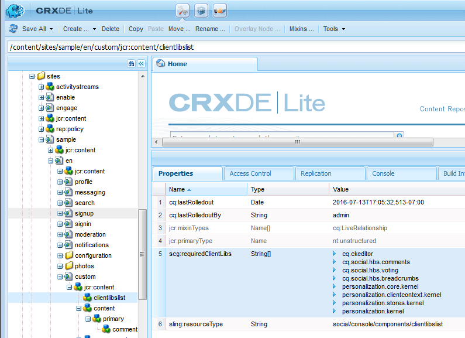

# Ajouter un commentaire à un exemple de page  {#add-comment-to-sample-page}

Maintenant que les composants du système de commentaires personnalisé sont en place dans le répertoire de l’application (/apps), il est possible d’utiliser le composant étendu. L’instance du système de commentaires d’un site web à affecter doit définir resourceType comme système de commentaires personnalisé et inclure toutes les bibliothèques clientes nécessaires.

## Identification des bibliothèques clientes requises {#identify-required-clientlibs}

Les bibliothèques clientes nécessaires au style et au fonctionnement des commentaires par défaut sont également nécessaires pour les commentaires étendus.

La variable [Guide des composants de communauté](/help/communities/components-guide.md) identifie les bibliothèques clientes requises. Accédez au Guide du composant et affichez le composant Commentaires , par exemple :

[https://localhost:4502/content/community-components/en/comments.html](https://localhost:4502/content/community-components/en/comments.html)

Notez les trois bibliothèques clientes requises pour que les commentaires s’affichent et fonctionnent correctement. Ils doivent être inclus lorsque les commentaires étendus sont référencés et que la variable [bibliothèque cliente étendue des commentaires](/help/communities/extend-create-components.md#create-a-client-library-folder) ( `apps.custom.comments`).

### Ajout de commentaires personnalisés à une page {#add-custom-comments-to-a-page}

Comme il ne peut y avoir qu’un seul système de commentaires par page, il est plus simple de créer un exemple de page comme décrit dans le résumé [création d’un exemple de page](/help/communities/create-sample-page.md) tutoriel .

Une fois créé, accédez au mode Conception et rendez disponible le groupe de composants personnalisés pour permettre au `Alt Comments` à ajouter à la page.

Pour que le commentaire s’affiche et fonctionne correctement, les bibliothèques clientes de Comments doivent être ajoutées à la liste clientlibslist de la page (voir [Clientlibs des composants Communities](/help/communities/clientlibs.md)).

#### Comments Clientlibs sur l’exemple de page {#comments-clientlibs-on-sample-page}

#### Auteur : commentaire Alt sur un exemple de page {#author-alt-comment-on-sample-page}

#### Auteur : exemple de noeud de commentaires de page {#author-sample-page-comments-node}

Vous pouvez vérifier le type de ressource dans CRXDE en affichant les propriétés du noeud de commentaires pour la page d’exemple à l’adresse `/content/sites/sample/en/jcr:content/content/primary/comments`.

#### Publier l’exemple de page {#publish-sample-page}

Une fois le composant personnalisé ajouté à la page, il est également nécessaire de (re) [publier la page ;](/help/communities/sites-console.md#publishing-the-site).

#### Publier : commentaire alternatif sur un exemple de page {#publish-alt-comment-on-sample-page}

Après la publication de l’application personnalisée et de l’exemple de page, il est possible de saisir un commentaire. Lorsque vous vous connectez, soit avec un [utilisateur de démonstration](/help/communities/tutorials.md#demo-users) ou admin, il est possible de publier un commentaire.

Voici aaron.mcdonald@mailinator.com en publiant un commentaire :

Maintenant qu’il apparaît que le composant étendu fonctionne correctement avec l’apparence par défaut, il est temps de modifier l’apparence.
