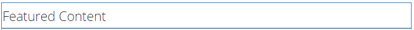
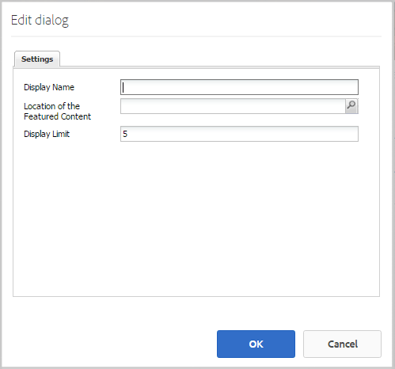
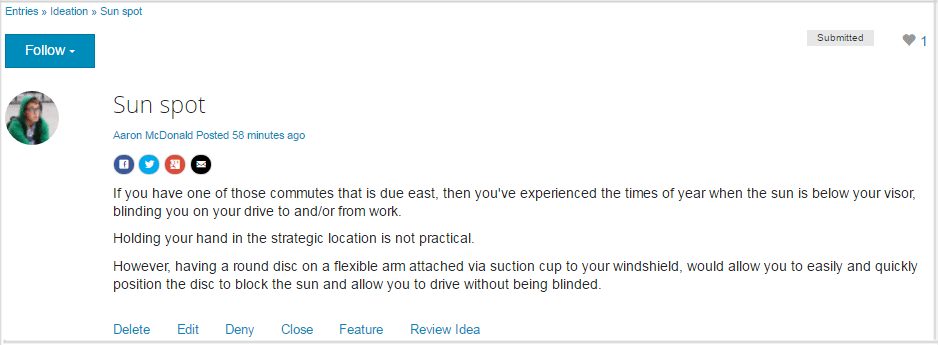
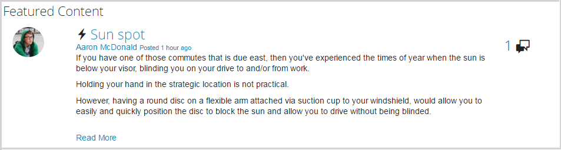

# Fonctionnalité de contenu en vedette {#featured-content-feature}

## Présentation {#introduction}

La fonctionnalité de contenu en vedette fournit une zone pour les visiteurs du site connectés (membres de la communauté) dans l’environnement de publication afin de mettre en évidence le contenu pour :

* [Blogs](blog-feature.md)
* [Calendriers](calendar.md)
* [Forums](forum.md)
* [Idées](ideation-feature.md)
* [Q&amp;R](working-with-qna.md)

Une fois que le contenu est marqué comme en vedette, il est répertorié dans ce composant, qui peut être placé dans des pages de destination ou des zones spécifiques qui attirent facilement l’attention des membres de la communauté.

La possibilité de présenter du contenu peut être autorisée ou non par composant.

Cette section de la documentation décrit les éléments suivants :

* Ajout de contenu présenté à un site communautaire.
* Paramètres de configuration du composant `Featured Content`.

## Ajout de contenu en vedette à une page {#adding-featured-content-to-a-page}

Pour ajouter un composant `Featured Content` à une page en mode création, utilisez l’explorateur de composants pour localiser .

* `Communities / Featured Content`

Et faites-le glisser sur une page où le contenu en vedette doit apparaître.

Pour plus d’informations, consultez [Principes de base des composants de communautés](basics.md).

Lorsque les [bibliothèques côté client requises](essentials-featured.md#essentials-for-client-side) sont incluses, le composant `Featured Content` s’affiche de la manière suivante :

## Configuration du contenu en vedette {#configuring-featured-content}

Sélectionnez le composant de `Featured Content` placé afin de pouvoir accéder à l’icône de `Configure` qui ouvre la boîte de dialogue de modification et de la sélectionner.

### Onglet Paramètres {#settings-tab}

Sous l’onglet **[!UICONTROL Paramètres]**, identifiez le contenu à présenter :

* **[!UICONTROL Nom d’affichage]**

  Titre de la liste de contenu en vedette. Par exemple, `Featured Questions` ou `Featured Ideas`. La valeur par défaut est `Featured Content` si elle n’est pas renseignée.

* **[!UICONTROL Emplacement du contenu en vedette]**

  *(Obligatoire)* Accédez à la page contenant le contenu pouvant être proposé (les composants de cette page doivent être configurés pour Autoriser le contenu proposé). Par exemple, `/content/sites/engage/en/forum`.

* **[!UICONTROL Limite d’affichage]**

  Nombre maximal de contenu en vedette à afficher. La valeur par défaut est 5.

## Expérience du visiteur du site {#site-visitor-experience}

La possibilité de marquer le contenu comme contenu en vedette nécessite des privilèges de modérateur.

Lorsqu’un modérateur consulte le contenu publié, il a accès aux indicateurs de modération contextuels, qui incluent le nouvel indicateur de `Feature`.

Une fois qu’il est marqué comme une fonctionnalité, l’indicateur de modération devient `Unfeature`.

La page contenant le composant `Featured Content` inclut désormais cette publication.

Le `Read More` renvoie vers la publication réelle.

## Informations supplémentaires {#additional-information}

Pour plus d’informations, consultez la page [Contenu en vedette](essentials-featured.md) destinée aux développeurs et développeuses.

Pour marquer le contenu comme présenté, voir [Modération du contenu créé par l’utilisateur](moderate-ugc.md).
