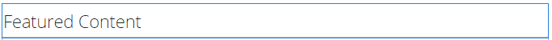

# Fonctionnalité de contenu en vedette {#featured-content-feature}

## Présentation {#introduction}

La fonctionnalité de contenu présenté fournit une zone pour les visiteurs connectés du site (membres de la communauté) dans l’environnement de publication afin de mettre en évidence le contenu pour :

* [Blogs](blog-feature.md)
* [Calendriers](calendar.md)
* [Forums](forum.md)
* [Idées](ideation-feature.md)
* [Q&amp;R](working-with-qna.md)

Une fois que le contenu est marqué comme présenté, il est répertorié dans ce composant, qui peut être placé dans des pages d’entrée spécifiques ou des zones qui attirent facilement l’attention des membres de la communauté.

La possibilité d’afficher du contenu peut être autorisée ou non par composant.

Cette section de la documentation décrit:

* Ajout de contenu présenté à un site de la communauté.
* Paramètres de configuration du composant `Featured Content`.

## Ajout de contenu proposé à une page {#adding-featured-content-to-a-page}

Pour ajouter un composant `Featured Content` à une page en mode création, utilisez l’explorateur de composants pour accéder à :

* `Communities / Featured Content`

et faites-le glisser sur la page où le contenu présenté doit apparaître.

Pour plus d’informations, voir [Principes de base des composants des communautés](basics.md).

Lorsque les [bibliothèques côté client requises](essentials-featured.md#essentials-for-client-side) sont incluses, voici comment le composant `Featured Content` apparaîtra :

## Configuration du contenu présenté {#configuring-featured-content}

Sélectionnez le composant `Featured Content` inséré pour y accéder et sélectionnez l’icône `Configure` qui ouvre la boîte de dialogue de modification.

### Onglet Settings {#settings-tab}

Sous l’onglet **[!UICONTROL Paramètres]** , identifiez le contenu à afficher :

* **[!UICONTROL Nom d’affichage]**

   Titre de la liste du contenu présenté. Par exemple, `Featured Questions` ou `Featured Ideas`. La valeur par défaut est `Featured Content` si elle est vide.

* **[!UICONTROL Emplacement du contenu proposé]**

   *(Obligatoire)* Accédez à la page contenant le contenu pouvant être une fonctionnalité (les composants de cette page doivent être configurés sur Autoriser le contenu proposé). Par exemple, `/content/sites/engage/en/forum`.

* **[!UICONTROL Limite d’affichage]**

   Nombre maximal de contenus présentés à afficher. La valeur par défaut est 5.

## Expérience des visiteurs {#site-visitor-experience}

La capacité à marquer le contenu comme contenu présenté nécessite des privilèges de modérateur.

Lorsqu’un modérateur affiche du contenu publié, il a accès aux indicateurs de modération contextuels, qui incluent le nouvel indicateur `Feature`.

Une fois marquée comme fonctionnalité, l’indicateur de modération devient `Unfeature`.

La page contenant le composant `Featured Content` inclura désormais cette publication.

`Read More` est un lien vers la publication active.

## Informations supplémentaires {#additional-information}

Vous trouverez plus d’informations sur la page [Contenu proposé](essentials-featured.md) pour les développeurs.

Pour marquer le contenu comme présenté, voir [Modération de contenu généré par l’utilisateur](moderate-ugc.md).
