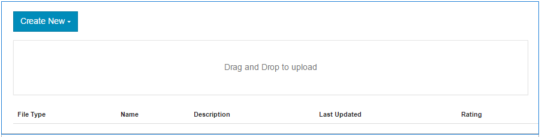
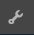
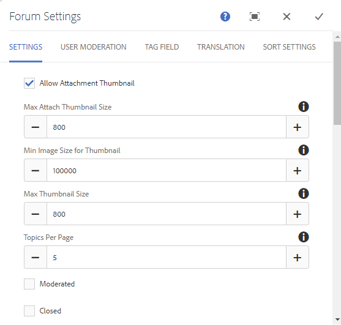

# Fonction de bibliothèque de fichiers{#file-library-feature}

## Présentation {#introduction}

La fonction de bibliothèque de fichiers permet aux visiteurs du site connectés (membres de la communauté) de charger, gérer et télécharger des fichiers sur le site de la communauté.

Cette section de la documentation décrit les éléments suivants :

* Ajout de la fonction de bibliothèque de fichiers à un site AEM.
* Paramètres de configuration du composant `File Library`.

### Ajout d’une bibliothèque de fichiers à une page {#adding-a-file-library-to-a-page}

Pour ajouter un composant `File Library` à une page en mode création, localisez-le :

* `Communities / File Library`

Et faites-le glisser sur une page.

Pour plus d’informations, consultez [Principes de base des composants de communautés](/help/communities/basics.md).

Lorsque les [bibliothèques côté client requises](/help/communities/essentials-file-library.md#essentials-for-client-side) sont incluses, le composant `File Library` s’affiche comme suit :

### Configuration de la bibliothèque de fichiers {#configuring-file-library}

Sélectionnez le composant de `File Library` placé afin de pouvoir accéder à l’icône de `Configure` qui ouvre la boîte de dialogue de modification et de la sélectionner.

#### Onglet Commentaires {#comments-tab}

Sous l’onglet **Commentaires**, indiquez si et comment les commentaires des fichiers chargés s’affichent :

* **Autoriser les commentaires sur les fichiers**

  Si cette case est cochée, autoriser les commentaires sur les fichiers chargés. La valeur par défaut n’est pas cochée.

* **Commentaires par page**

  Limite le nombre de commentaires affichés par page et le nombre de réponses affichées. La valeur par défaut est de **10**.

* **Taille de fichier max**

  Cette valeur limite la taille du fichier chargé. La limite par défaut est de 104857600 (10 Mo).

* **Longueur max. du message**

  Nombre maximal de caractères pouvant être saisis dans la zone de texte. La valeur par défaut est de 4 096 caractères.

* **Types de fichiers autorisés**

  Liste d’extensions de fichier séparées par des virgules avec le séparateur « point ». Par exemple, .jpg, .jpeg, .png, .doc, .docx, .pdf. Si des types de fichiers sont spécifiés, ceux qui ne le sont pas ne sont pas autorisés. La valeur par défaut n’est pas spécifiée pour que tous les types de fichiers soient autorisés.

* **Éditeur de texte enrichi**

  Si cette case est cochée, les commentaires peuvent être saisis avec des balises. La valeur par défaut n’est pas cochée.

* **Supprimer les commentaires**

  Si cette case est cochée, les utilisateurs sont autorisés à supprimer leurs propres commentaires. La valeur par défaut est cochée.

* **Autoriser le balisage**

  Si cette case est cochée, la possibilité d’ajouter une balise au fichier est activée. La valeur par défaut n’est pas cochée.

* **Espaces de noms autorisés**

  Si l’option Autoriser le balisage est cochée, les balises disponibles sont limitées aux espaces de noms cochés. Si aucun espace de noms n’est coché, tous sont autorisés. La valeur par défaut est tous les espaces de noms.

* **Limite de suggestions**

  Si l’option Autoriser le balisage est cochée, ce paramètre limite le nombre de balises suggérées à afficher. S&#39;il est défini sur -1, il n&#39;y a pas de limite. La valeur par défaut est -1.

* **Autoriser le vote**

  Si cette case est cochée, la possibilité de voter pour un fichier est activée. La valeur par défaut n’est pas cochée.

* **Autoriser les éléments suivants**

  Si cette case est cochée, incluez la fonctionnalité suivante pour les articles de blog, qui permet aux membres d’être [avertis](/help/communities/notifications.md) de nouvelles publications. La valeur par défaut n’est pas cochée.

* **Activer la mention**

  Si cette option est activée, elle permet aux utilisateurs de la communauté enregistrés d’identifier d’autres membres enregistrés (à l’aide de leur prénom, de leur nom et de leur nom d’utilisateur) et de les baliser en utilisant la syntaxe de @user-name commune. Les utilisateurs identifiés reçoivent des notifications sur leurs mentions.

* **Mentions max**

  Limitez le nombre maximal de mentions autorisées dans une publication. La valeur par défaut est 10.

* **Modèle de mention de l’interface utilisateur**

  Spécifiez la chaîne de modèle autorisée afin de baliser (@mention) l’utilisateur enregistré dans une publication. Par exemple, `~{{familyName}}{{givenName}}`.

* **Autoriser les réponses avec thread**

  Si cette case est cochée, autoriser les réponses aux commentaires publiés. La valeur par défaut n’est pas cochée.

#### Onglet Modération des utilisateurs {#user-moderation-tab}

Sous l’onglet **Modération utilisateur**, configurez la modération des commentaires, si les commentaires sont autorisés :

* **Pré-Modération**

  Si cette option est cochée, les commentaires doivent être approuvés avant d’apparaître sur un site de publication. La valeur par défaut n’est pas cochée.

* **Supprimer les commentaires**

  Si cette case est cochée, le visiteur qui a publié le commentaire peut le supprimer, si nécessaire. La valeur par défaut est cochée.

* **Refuser les commentaires**

  Si cette case est cochée, autorisez les modérateurs de membres approuvés à refuser les commentaires. La valeur par défaut n’est pas cochée.

* **Fermer/Rouvrir les commentaires**

  Si cette case est cochée, autorisez les modérateurs de membres de confiance à fermer et rouvrir les commentaires. La valeur par défaut n’est pas cochée.

* **Signaler les commentaires**

  Si cette case est cochée, autorisez les visiteurs à signaler les commentaires comme inappropriés. La valeur par défaut n’est pas cochée.

* **Liste des motifs de l&#39;indicateur**

  Si cette case est cochée, permet aux visiteurs de choisir, dans une liste déroulante, la raison pour laquelle ils signalent un commentaire comme inapproprié. La valeur par défaut n’est pas cochée.

* **Motif de l’indicateur personnalisé**

  Si cette case est cochée, autorisez les visiteurs à saisir leur propre raison pour laquelle un commentaire n’est pas approprié. La valeur par défaut n’est pas cochée.

* **Seuil de modération**

  Saisissez le nombre de fois où un commentaire doit être marqué par des visiteurs avant que les modérateurs ne soient avertis. La valeur par défaut est une fois (**1**).

* **Limite de marquage**

  Permet d&#39;entrer le nombre de fois où un commentaire doit être marqué avant d&#39;être masqué de la vue publique. Ce nombre doit être supérieur ou égal au **seuil de modération**. La valeur par défaut est 5.

### Onglet Paramètres de tri {#sort-settings-tab}

Trier par

Définir comme valeur par défaut

### Informations supplémentaires {#additional-information}

Pour plus d’informations, consultez la page [Principes de base de la bibliothèque de fichiers](/help/communities/essentials-file-library.md) destinée aux développeurs et développeuses.

Pour la modération des rubriques et commentaires publiés, voir [Modération du contenu créé par l’utilisateur](/help/communities/moderate-ugc.md).

Pour baliser les rubriques publiées et les commentaires, consultez [Balisage du contenu créé par l’utilisateur](/help/communities/tag-ugc.md).
