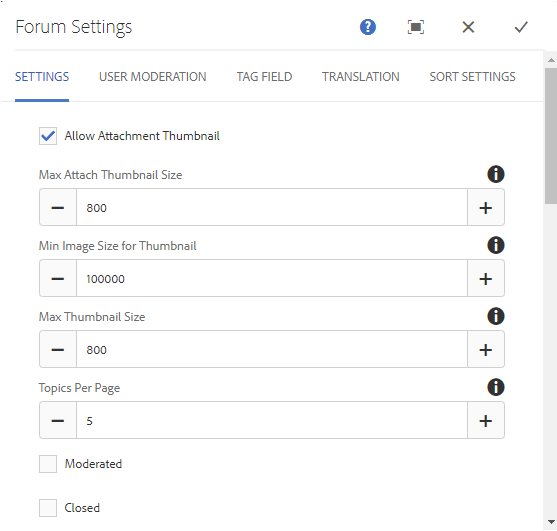

# Fonctionnalité Bibliothèque de fichiers{#file-library-feature}

## Présentation {#introduction}

La fonctionnalité Bibliothèque de fichiers fournit un espace où les visiteurs du site connectés (membres de la communauté) peuvent transférer, gérer et télécharger des fichiers sur le site de la communauté.

Cette section de la documentation décrit : :

* Ajout de la fonction Bibliothèque de fichiers à un site AEM.
* Paramètres de configuration du composant `File Library`.

### Ajout d’une bibliothèque de fichiers à une page {#adding-a-file-library-to-a-page}

Pour ajouter un composant `File Library` à une page en mode création, localisez le composant :

* `Communities / File Library`

et faites-le glisser sur la page.

Pour plus d’informations, voir [Principes de base des composants des communautés](/help/communities/basics.md).

Lorsque les [bibliothèques côté client requises](/help/communities/essentials-file-library.md#essentials-for-client-side) sont incluses, voici comment le composant `File Library` apparaîtra :

### Configuration de la bibliothèque de fichiers {#configuring-file-library}

Sélectionnez le composant `File Library` inséré pour y accéder et sélectionnez l’icône `Configure` qui ouvre la boîte de dialogue de modification.

#### Onglet Commentaires {#comments-tab}

Dans l’onglet **Commentaires**, indiquez si et comment les commentaires pour les fichiers transférés apparaissent :

* **Autoriser les commentaires sur les fichiers**

   Si cette option est cochée, les commentaires sur les fichiers chargés sont autorisés. Cette option n’est pas cochée par défaut.

* **Commentaires par page**

   Limite le nombre de commentaires affichés par page ainsi que le nombre de réponses affichées. La valeur par défaut est **10**.

* **Taille maximale du fichier**

   Cette valeur limite la taille du fichier chargé. La limite par défaut est 104857600 (10 Mo).

* **Longueur de message max.**

   Nombre maximal de caractères pouvant être saisis dans la zone de texte. La valeur par défaut est de 4 096 caractères.

* **Types de fichier autorisés**

   Liste d’extensions de fichier séparées par des virgules avec le séparateur &quot;point&quot;. Par exemple : .jpg, .jpeg, .png, .doc, .docx, .pdf. Si des types de fichiers sont spécifiés, ceux qui ne sont pas spécifiés ne seront pas autorisés. La valeur par défaut n’est pas spécifiée de sorte que tous les types de fichiers soient autorisés.

* **Éditeur de texte enrichi**

   Si cette case est cochée, les commentaires peuvent être saisis avec une annotation. Cette option n’est pas cochée par défaut.

* **Supprimer les commentaires**

   Si cette case est cochée, les utilisateurs sont autorisés à supprimer leurs propres commentaires. Cette option est cochée par défaut.

* **Autoriser le balisage**

   Si cette case est cochée, la possibilité d’ajouter une balise au fichier est activée. Cette option n’est pas cochée par défaut.

* **Espaces de noms autorisés**

   Si l’option Autoriser le balisage est cochée, les balises disponibles sont limitées aux espaces de noms cochés. Si aucun n’est coché, tous sont autorisés. Par défaut, tous les espaces de noms sont autorisés.

* **Limite de suggestions**

   Si l’option Autoriser le balisage est cochée, ce paramètre limite le nombre de balises suggérées à afficher. Si la valeur est -1, il n’existe aucune limite. La valeur par défaut est -1.

* **Autoriser le vote**

   Si cette case est cochée, la possibilité de voter pour un fichier est activée. Cette option n’est pas cochée par défaut.

* **Autoriser abonnement**

   Si cette case est cochée, incluez la fonction suivante pour les articles de blog, ce qui permet aux membres d’être [informés](/help/communities/notifications.md) des nouvelles publications. Cette option n’est pas cochée par défaut.

* **Activer la mention**

   S’il est activé, permet aux utilisateurs enregistrés de la communauté d’identifier d’autres membres enregistrés (à l’aide du prénom, du nom, du nom d’utilisateur) et de les baliser à l’aide de la syntaxe @user-name courante. Les utilisateurs balisés reçoivent des notifications concernant leurs mentions.

* **Nombre max. de mentions**

   Limitez le nombre maximal de mentions autorisées dans une publication. La valeur par défaut est 10.

* **Modèle des mentions de l’IU**

   Spécifiez la chaîne de modèle autorisée à baliser (@mention) l’utilisateur enregistré dans une publication. Par exemple : ~{{familyName}{{givenName}}.

* **Autoriser les réponses à thème**

   Si cette case est cochée, les réponses aux commentaires publiés sont autorisées. Cette option n’est pas cochée par défaut.

#### Onglet Modération d’utilisateur {#user-moderation-tab}

Dans l’onglet **Modération d’utilisateur**, configurez la modération des commentaires, si les commentaires sont autorisés :

* **Prémodération**

   Si cette case est cochée, les commentaires doivent être approuvés avant d’apparaître sur un site de publication. Cette option n’est pas cochée par défaut.

* **Supprimer les commentaires**

   Si cette case est cochée, le visiteur qui a publié le commentaire peut le supprimer. Cette option est cochée par défaut.

* **Refuser les commentaires**

   Si cette case est cochée, autorisez les modérateurs de membres approuvés à refuser des commentaires. Cette option n’est pas cochée par défaut.

* **Fermer/rouvrir les commentaires**

   Si cette case est cochée, autorisez les modérateurs de membres approuvés à fermer et rouvrir les commentaires. Cette option n’est pas cochée par défaut.

* **Marquer les commentaires**

   Si cette case est cochée, autorisez les visiteurs à signaler les commentaires comme inappropriés. Cette option n’est pas cochée par défaut.

* **Marquer la liste de motifs**

   Si cette case est cochée, les visiteurs ont le droit de sélectionner dans une liste déroulante la ou les raisons pour lesquelles ils ont marqué un commentaire comme étant inapproprié. Cette option n’est pas cochée par défaut.

* **Motif de la marque personnalisée**

   Si cette case est cochée, autorisez les visiteurs à indiquer leur propre raison de signaler un commentaire comme inapproprié. Cette option n’est pas cochée par défaut.

* **Seuil de modération**

   Saisissez le nombre de fois qu’un commentaire doit être marqué par les visiteurs avant que les modérateurs ne soient informés. La valeur par défaut est une fois (**1**).

* **Limite de marquage**

   Saisissez le nombre de fois qu’un commentaire doit être marqué avant qu’il ne soit plus visible pour le public. Dans le cas contraire, cette valeur doit être supérieure ou égale au **seuil de modération**. La valeur par défaut est 5.

### Onglet Paramètres de tri {#sort-settings-tab}

Trier par

Définir par défaut

### Informations supplémentaires {#additional-information}

Pour plus d’informations, reportez-vous à la page [Notions fondamentales sur la bibliothèque de fichiers](/help/communities/essentials-file-library.md) pour les développeurs.

Pour des informations sur la modération des sujets et des commentaires publiés, reportez-vous à la section [Modération du contenu généré par l’utilisateur](/help/communities/moderate-ugc.md).

Pour baliser les sujets et les commentaires publiés, voir [Balisage de contenu généré par l’utilisateur](/help/communities/tag-ugc.md).
