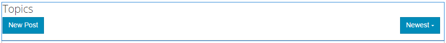
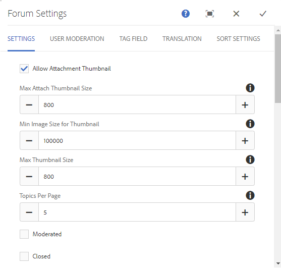

# Fonction de forum{#forum-feature}

## Présentation {#introduction}

La fonction de forum fournit une zone pour les visiteurs du site connectés (membres de la communauté) dans l’environnement de publication afin de :

* Créer des rubriques
* Afficher et répondre aux rubriques
* Suivre une rubrique
* Rechercher un forum
* Aider à modérer le contenu du forum
* Déplacer des sujets de forum d’une page à une autre

Cette section de la documentation décrit les éléments suivants :

* Ajout de la fonction de forum à un site AEM.
* Paramètres de configuration du composant `Forum`.

### Ajout d’un forum à une page {#adding-a-forum-to-a-page}

Pour ajouter un composant `Forum` à une page en mode création, utilisez l’explorateur de composants pour localiser .

* `Communities / Forum`

Et faites-le glisser sur une page où le forum doit apparaître.

Pour plus d’informations, consultez [Principes de base des composants de communautés](/help/communities/basics.md).

Lorsque les [bibliothèques côté client requises](/help/communities/essentials-forum.md#essentials-for-client-side) sont incluses, le composant `Forum` s’affiche de la manière suivante :

### Configuration d’un forum {#configuring-a-forum}

Sélectionnez le composant de `Forum` placé afin de pouvoir accéder à l’icône de `Configure` qui ouvre la boîte de dialogue de modification et de la sélectionner.

#### Onglet Paramètres {#settings-tab}

Sous l’onglet **Paramètres**, spécifiez les paramètres des rubriques et des réponses :

* **Autoriser la miniature de la pièce jointe**

  Si cette case est cochée, une miniature de l’image jointe est créée.

* **Taille max. de la miniature jointe**

  Taille maximale (en pixels) de l’image miniature de la pièce jointe. La valeur par défaut est 800 x 800.

* **Taille minimale de l’image de la miniature**
* **Taille max. de la miniature**

  Taille maximale (en pixels) de l’image miniature de l’image intégrée. La valeur par défaut est 800 x 800.

* **Rubriques Par Page**

  Définit le nombre de rubriques/publications affichées par page. La valeur par défaut est 10.

* **Modéré**

  Si cette case est cochée, la publication des rubriques et des commentaires doit être approuvée avant de pouvoir apparaître sur un site de publication. La valeur par défaut n’est pas cochée.

* **Fermé**

  Si cette case est cochée, le forum est fermé aux nouveaux sujets et commentaires. La valeur par défaut n’est pas cochée.

* **Éditeur de texte enrichi**

  Si cette case est cochée, les rubriques et commentaires peuvent être saisis avec des balises. La valeur par défaut n’est pas cochée.

* **Autoriser le balisage**

  Si cette case est cochée, permet aux membres d’ajouter des libellés de balise à leurs publications (voir **Champ de balise** onglet). La valeur par défaut n’est pas cochée.

* **Autoriser les chargements de fichiers**

  Si cette case est cochée, autorisez l&#39;ajout de pièces jointes à la rubrique ou au commentaire. La valeur par défaut n’est pas cochée.

* **Autoriser les éléments suivants**

  Si cette case est cochée, incluez la fonctionnalité suivante pour les publications de forum, qui permet aux membres d’être [avertis](/help/communities/notifications.md) des nouvelles publications. La valeur par défaut n’est pas cochée.

* **Autoriser l’épinglage**

  Si cette case est cochée, les rubriques du forum peuvent être épinglées en haut de la liste des rubriques. La valeur par défaut n’est pas cochée.

* **Autoriser le contenu en vedette**

  Si cette case est cochée, l’idée est identifiable comme [contenu présenté](/help/communities/featured.md). La valeur par défaut n’est pas cochée.

* **Autoriser les abonnements par e-mail**

  Si cette case est cochée, autoriser les membres à être avertis des nouvelles publications par e-mail ([abonnement](/help/communities/subscriptions.md)). Exige que les `Allow Following` soient vérifiées et que les [e-mails soient configurés](/help/communities/email.md). La valeur par défaut n’est pas cochée.

* **Taille de fichier max**

  Pertinent uniquement si `Allow File Uploads` est coché. Ce champ limite la taille (en octets) d’un fichier chargé. La valeur par défaut est 104857600 (10 Mo).

* **Types de fichiers autorisés**

  Pertinent uniquement si `Allow File Uploads` est coché. Liste d’extensions de fichier séparées par des virgules avec le séparateur « point ». Par exemple, .jpg, .jpeg, .png, .doc, .docx, .pdf. Si des types de fichiers sont spécifiés, ceux qui ne le sont pas ne peuvent pas être chargés. Par défaut, aucun fichier n’est spécifié, de sorte que tous les types de fichiers soient autorisés.

* **Taille max. du fichier image joint**
Pertinent uniquement si Autoriser le chargement de fichiers est coché. Nombre maximal d’octets qu’un fichier image chargé peut avoir. La valeur par défaut est 2097152 (2 Mo).

* **Autoriser les réponses avec thread**

  Si cette case est cochée, autoriser les réponses aux commentaires publiés sur le sujet. La valeur par défaut n’est pas cochée.

* **Autoriser le vote**

  Si cette case est cochée, incluez la fonction Vote avec un sujet. La valeur par défaut n’est pas cochée.

* **Autoriser les utilisateurs à supprimer des commentaires et des rubriques**

  Si cette case est cochée, permet aux membres de supprimer les commentaires et les sujets qu&#39;ils ont publiés. La valeur par défaut n’est pas cochée.

* **Afficher le chemin de navigation**

  Si cette case est cochée, afficher les chemins de navigation dans les pages de rubrique. La valeur par défaut est cochée.

* **Afficher les badges**

  Si cette case est cochée, afficher les [badges](/help/communities/implementing-scoring.md) gagnés et attribués avec l’entrée de blog d’un membre. La valeur par défaut n’est pas cochée.

* **Autoriser les membres privilégiés**

  Si cette case est cochée, seuls les membres privilégiés sont autorisés à créer du contenu.

* **Membres autorisés**

  Ajoutez les membres privilégiés autorisés à créer du contenu.

* **Bloquez le contenu créé par l’utilisateur en mode d’édition Auteur**

  Si cette option est activée, bloque le contenu créé par l’utilisateur lors de la modification en mode création.

* **Activer la mention**

  Si cette option est activée, elle permet aux utilisateurs de la communauté enregistrés d’identifier d’autres membres enregistrés (à l’aide de leur prénom, de leur nom et de leur nom d’utilisateur) et de les baliser en utilisant la syntaxe de @user-name commune. Les utilisateurs identifiés reçoivent des notifications sur leurs mentions.

* **Mentions max**

  Limitez le nombre maximal de mentions autorisées dans une publication. La valeur par défaut est 10.

* **Modèle de mention de l’interface utilisateur**

  Spécifiez la chaîne de modèle autorisée pour baliser (@mention) l’utilisateur enregistré dans une publication. Par exemple, `~{{familyName}}{{givenName}}`.

>[!NOTE]
>
>Il peut s’avérer nécessaire de vérifier les `AllowThreaded Replies` et les `Allow users to Delete Comments and Topics` pour activer les commentaires sur un sujet.

#### Onglet Modération des utilisateurs {#user-moderation-tab}

Sous l’onglet **Modération utilisateur**, spécifiez la manière dont les rubriques publiées et les réponses (contenu généré par l’utilisateur) sont gérées. Pour plus d’informations, voir [Modération du contenu créé par l’utilisateur](/help/communities/moderate-ugc.md).

* **Refuser les publications**

  Si cette case est cochée, les modérateurs membres de confiance sont autorisés à refuser les publications et à empêcher la publication d&#39;apparaître sur le forum public. La valeur par défaut n’est pas cochée.

* **Fermer/Rouvrir les rubriques**

  Si cette case est cochée, les modérateurs membres de confiance peuvent fermer une rubrique pour apporter d’autres modifications et commentaires, et peuvent également rouvrir une rubrique. La valeur par défaut n’est pas cochée.

* **Déplacer rubriques**

  Si cette case est cochée, autorisez les modérateurs du côté publication à déplacer les sujets. La valeur par défaut est cochée.

* **Publications de drapeaux**

  Si cette case est cochée, autorisez les membres à signaler les sujets ou commentaires des autres comme inappropriés. La valeur par défaut n’est pas cochée.

* **Liste des motifs de l&#39;indicateur**

  Si cette case est cochée, permet aux membres de choisir, dans une liste déroulante, la raison pour laquelle ils signalent un sujet ou un commentaire comme inapproprié. La valeur par défaut n’est pas cochée.

* **Motif de l’indicateur personnalisé**

  Si cette case est cochée, autorisez les membres à saisir leur propre raison pour signaler un sujet ou un commentaire comme inapproprié. La valeur par défaut n’est pas cochée.

* **Seuil de modération**

  Permet d&#39;entrer le nombre de fois où un sujet ou un commentaire doit être marqué par les membres avant que les modérateurs ne soient avertis. La valeur par défaut est 1 (une seule fois).

* **Limite de marquage**

  Entrez le nombre de fois où un sujet ou un commentaire doit être marqué avant d&#39;être masqué de la vue publique. Si la valeur est définie sur -1, la rubrique ou le commentaire marqué n&#39;est jamais masqué de la vue publique. Sinon, ce nombre doit être supérieur ou égal au seuil de modération. La valeur par défaut est 5.

#### Onglet Champ de balise {#tag-field-tab}

Sous l’onglet **Champ de balise**, les balises qui peuvent être appliquées, si elles sont autorisées sous l’onglet **Paramètres** sont limitées en fonction des espaces de noms choisis.

* **Espaces de noms autorisés**

  Pertinent si `Allow Tagging` est coché sous l’onglet **Paramètres**. Les balises qui peuvent être appliquées sont limitées à celles qui se trouvent dans les catégories d’espaces de noms cochées. La liste des espaces de noms inclut « Balises standard » (l’espace de noms par défaut) et « Inclure toutes les balises ». La valeur par défaut n’est pas cochée, ce qui signifie que tous les espaces de noms sont autorisés.

* **Limite de suggestions**

  Saisissez le nombre de balises à afficher en tant que suggestion au membre qui publie sur le forum. La valeur par défaut est **-**1 (aucune limite).

#### Onglet Traduction {#translation-tab}

Sous l’onglet **Traduction**, si la traduction est activée pour le site de la communauté, vous pouvez définir la traduction pour traduire l’intégralité de la rubrique ou les publications sélectionnées.

* **Tout traduire**

  Si cette case est cochée, le thread de forum est traduit dans la langue préférée de l’utilisateur. La valeur par défaut n’est pas cochée.

#### Onglet Paramètres de tri {#sort-settings-tab}

Sous l’onglet **Paramètres de tri**, indiquez comment les commentaires publiés sont triés lorsqu’ils sont affichés.

* **Trier par**

  Vérifiez toutes les sélections de tri autorisées : `Newest, Oldest, Last Updated, Most Viewed, Most Active, Most Followed and Most Liked`. La valeur par défaut est `Newest, Oldest, Last Updated`.

* **Défini par défaut**

  Faites défiler l’écran vers le bas pour sélectionner l’une des options de tri cochées à afficher par défaut. La valeur par défaut est `Newest`.

* **Sélectionner les options de temps pour le tri Analytics**

  Faites défiler l’écran vers le bas pour sélectionner l’une des options suivantes : `All, Last 24 Hours, Last 7 Days, Last 30 Days`.

  La valeur par défaut est `All`.

### Informations supplémentaires {#additional-information}

Pour plus d’informations, consultez la page [Forum Essentials](/help/communities/essentials-forum.md) destinée aux développeurs et développeuses.

Pour la modération des rubriques et commentaires publiés, voir [Modération du contenu créé par l’utilisateur](/help/communities/moderate-ugc.md).

Pour baliser les rubriques publiées et les commentaires, consultez [Balisage du contenu créé par l’utilisateur](/help/communities/tag-ugc.md).

Pour la traduction des rubriques et commentaires publiés, voir [Traduction de contenu créé par l’utilisateur](/help/communities/translate-ugc.md).
