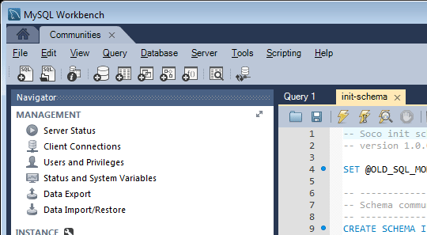
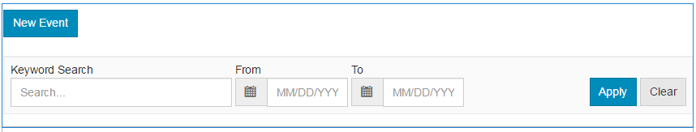
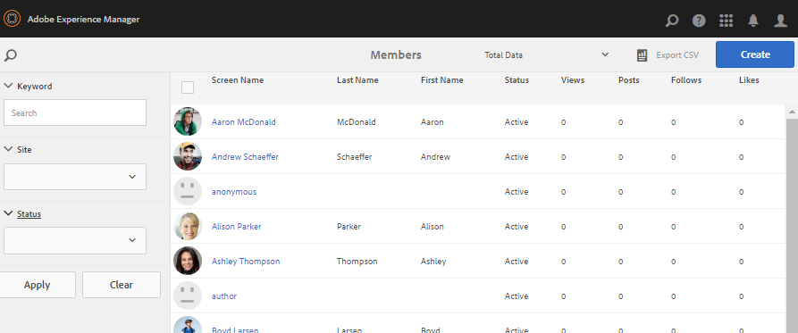

# Fonctions de la communauté{#community-functions}

Le type de caractéristiques attendues d’une expérience communautaire est bien connu. Les fonctionnalités de la communauté sont disponibles en tant que fonctions de la communauté. Essentiellement, il s’agit d’une ou de plusieurs pages pré-programmées pour mettre en oeuvre une fonctionnalité de communauté qui nécessite plus qu’un simple ajout d’un composant à une page en mode création. Il s’agit des éléments de base utilisés pour définir la structure d’un modèle [de site](/help/communities/sites.md) communautaire à partir duquel des sites communautaires sont [créés](/help/communities/sites-console.md).

Une fois un site de la communauté créé, le contenu peut être ajouté aux pages résultantes à l’aide du mode [de création standard d’](/help/sites-authoring/editing-content.md)AEM. Diverses fonctions de la communauté sont disponibles, comme le montre la console des fonctions de la communauté.

>[!NOTE]
>
>Les consoles pour la création de sites communautaires, de modèles [de sites](/help/communities/sites.md)communautaires, de modèles [de groupes de](/help/communities/tools-groups.md)communautés et de fonctions de [communauté ne sont utilisées que dans le  de l’auteur.](/help/communities/functions.md)

## Console des fonctions de la communauté {#community-functions-console}

Dans l&#39;auteur  , pour accéder à la console des fonctions de la communauté :

* A partir de la navigation globale : **[!UICONTROL Outils]** > **[!UICONTROL Communautés]** > Fonctions **[!UICONTROL de]** la communauté.

## Fonctions prédéfinies {#pre-built-functions}

Vous trouverez ci-dessous une brève description des fonctions fournies avec les communautés AEM. Chaque fonction comprend une ou plusieurs pages AEM contenant des composants Communities connectés en une fonction qui est facilement intégrée dans un modèle [de site](/help/communities/sites.md)communautaire.

Un modèle de site de la communauté fournit la structure d’un site de la communauté, y compris les fonctions de connexion, de utilisateur, de notification, de messagerie, de menu du site, de recherche, de thème et de marque.

### Paramètres de titre et d’URL {#title-and-url-settings}

**Titre **et **URL **sont des propriétés communes à toutes les fonctions de la communauté.

Lorsqu’une fonction de communauté est ajoutée à un modèle de site de communauté ou ajoutée lors de la [modification](/help/communities/sites-console.md#modifying-site-properties) de la structure d’un site de communauté, la boîte de dialogue de la fonction s’ouvre afin que le titre et l’URL puissent être configurés.

#### Détails de la fonction de configuration {#configuration-function-details}

* **Titre**

   (*Obligatoire*) Texte qui apparaît dans le menu des fonctionnalités du site

* **URL**

   (*Obligatoire*) Nom utilisé pour générer l’URI. Le nom doit être conforme aux conventions [de](/help/sites-developing/naming-conventions.md) dénomination imposées par AEM et JCR.

Par exemple, en utilisant le site créé à partir du didacticiel [Prise en main](/help/communities/getting-started.md) , si

* Titre = Page Web
* URL = page

Ensuite, l’URL de la page est https://localhost:4503/content/sites/engage/en/page.html.

et le lien de menu de la page s’affiche comme suit :

### Fonction Flux d&#39;activités {#activity-stream-function}

La fonction de flux de   est une page avec un composant [Flux de](/help/communities/activities.md) avec tous lessélectionnés (tous les, les d’utilisateurs, etc.). Voir aussi [ Essentials](/help/communities/essentials-activities.md) de diffusion en continu pour les développeurs.

Lorsqu’il est ajouté à un modèle, la boîte de dialogue suivante s’ouvre :

#### Détails de la fonction de configuration {#configuration-function-details-1}

* [Paramètres de titre et d’URL](#title-and-url-settings)

* **Afficher la vue Mes activités**

   Si cette option est sélectionnée, la page  du  comprend un onglet qui lesen fonction de ceux générés au sein de la communauté par le membre actuel. La valeur par défaut est sélectionnée.

* **Afficher la vue Toutes les activités**

   Si cette option est sélectionnée, la page  du  comprend un onglet qui inclut tous les  de générés au sein de la communauté à laquelle le membre actuel a accès. La valeur par défaut est sélectionnée.

* **Afficher la vue Fil d’actualité**

   Si cette option est sélectionnée, les pages  du  incluent un onglet qui lesen fonction de ceux que le membre actuel suit. La valeur par défaut est sélectionnée.

### Fonction Affectations {#assignments-function}

La fonction d’affectation est la fonction de base qui définit un site [communautaire pour l’activation](/help/communities/overview.md#enablement-community). Il permet d&#39;affecter des ressources d&#39;activation aux membres de la communauté. Voir aussi [Assignments Essentials](/help/communities/essentials-assignments.md) pour les développeurs.

Cette fonction est disponible en tant que fonction du module complémentaire [d’activation](/help/communities/enablement.md). Le module complémentaire d’activation nécessite une licence supplémentaire pour une utilisation dans un  de  de production.

Lorsqu’il est ajouté à un modèle, la seule configuration concerne les paramètres [de](#title-and-url-settings)titre et d’URL.

### Fonction Blog {#blog-function}

La fonction de blog est une page dont le composant [de](/help/communities/blog-feature.md) blog est configuré pour le balisage, les téléchargements de fichiers, les éléments suivants, les membres à modifier eux-mêmes, le vote et la modération. Voir aussi [Blog Essentials](/help/communities/blog-developer-basics.md) pour les développeurs.

Lorsqu’il est ajouté à un modèle, la boîte de dialogue suivante s’ouvre :

* [Paramètres de titre et d’URL](#title-and-url-settings)

* **Autoriser les membres privilégiés**

   S&#39;il est sélectionné, le blog permet uniquement aux membres privilégiés de créer des articles en permettant la sélection d&#39;un groupe [de membres](/help/communities/users.md#privileged-members-group)privilégiés. Si cette option n’est pas sélectionnée, tous les membres de la communauté sont autorisés à créer. La valeur par défaut est désélectionnée.

* **Autoriser les transferts de fichiers**

   S&#39;il est sélectionné, le blog permet aux membres de télécharger des fichiers. La valeur par défaut est sélectionnée.

* **Autoriser les réponses à thème**

   S&#39;il n&#39;est pas sélectionné, le blog autorise les réponses (commentaires) à un article, mais les réponses aux commentaires ne sont pas autorisées. La valeur par défaut est sélectionnée.

* **Autoriser le contenu proposé**

   S&#39;il est sélectionné, le blog est identifié comme contenu incitatif. La valeur par défaut est sélectionnée.

### Fonction Calendrier {#calendar-function}

La fonction de calendrier est une page dont le composant  Calendrier est configuré pour autoriser le balisage. Voir aussi [Calendrier Essentials](/help/communities/calendar-basics-for-developers.md) pour les développeurs.

Lorsqu’il est ajouté à un modèle, la boîte de dialogue suivante s’ouvre :

* [Paramètres de titre et d’URL](#title-and-url-settings)

* **Autoriser l’épinglage**

   S’il est sélectionné, le forum permet d’épingler les réponses au sujet jusqu’au début du de commentaires. La valeur par défaut est sélectionnée.

* **Autoriser les membres privilégiés**

   S&#39;il est sélectionné, le blog permet uniquement aux membres privilégiés de créer des articles en permettant la sélection d&#39;un groupe [de membres](/help/communities/users.md#privileged-members-group)privilégiés. Si cette option n’est pas sélectionnée, tous les membres de la communauté sont autorisés à créer. La valeur par défaut est désélectionnée.

* **Autoriser les transferts de fichiers**

   S&#39;il est sélectionné, le blog permet aux membres de télécharger des fichiers. La valeur par défaut est sélectionnée.

* **Autoriser les réponses à thème**

   S&#39;il n&#39;est pas sélectionné, le blog autorise les réponses (commentaires) à un article, mais les réponses aux commentaires ne sont pas autorisées. La valeur par défaut est sélectionnée.

* **Autoriser le contenu proposé**

   Si cette option est sélectionnée, son contenu est identifié comme contenu phare. La valeur par défaut est sélectionnée.

### Fonction Catalogue {#catalog-function}

La fonction de catalogue permet aux membres de la communauté [d&#39;](/help/communities/overview.md#enablement-community) activation de parcourir les ressources d&#39;activation qui ne leur sont pas affectées. Voir [Balisage des ressources](/help/communities/tag-resources.md) d’activation et [Catalogue essentiel](/help/communities/catalog-developer-essentials.md) pour les développeurs.

Toutes les ressources d’activation et tous les chemins d’apprentissage du site de la communauté s’affichent dans tous les catalogues si leur propriété ` [Show in Catalog](/help/communities/resources.md)`, est définie sur true. Pour inclure explicitement des ressources et des chemins d’apprentissage, il est nécessaire d’appliquer un [pré-filtre](/help/communities/catalog-developer-essentials.md#pre-filters) au catalogue.

Lorsqu’elle est ajoutée à un modèle, la configuration permet de spécifier la balise  les (s) utilisés(s) pour configurer le filtre de balise présenté aux du site :

* [Paramètres de titre et d’URL](#title-and-url-settings)

* **Sélectionner tous les espaces de noms**

   La balise sélectionnée  le  définit les balises que les peuvent sélectionner pour filtrer la  des ressources d&#39;activation répertoriées dans le catalogue.
Si cette option est sélectionnée, toutes les balises   autorisées pour le site de la communauté sont disponibles.
Si cette option est désélectionnée, il est possible de sélectionner un ou plusieurs   autorisés pour le site de la communauté.
La valeur par défaut est sélectionnée.

### Fonction de contenu proposé {#featured-content-function}

La fonction de contenu incitatif est une page dont le composant  Contenu incitatif est configuré pour permettre l’ajout et la suppression de commentaires.

La fonctionnalité de contenu peut être autorisée ou refusée par composant (voir Fonction de blog, Fonction [de](#calendar-function)calendrier, Fonction [de](#forum-function)forum, Fonction d’ [idéation et FonctionQnA).](#ideation-function)

Lorsqu’il est ajouté à un modèle, la seule configuration concerne les paramètres [de](#title-and-url-settings)titre et d’URL.

### Fonction Bibliothèque de fichiers {#file-library-function}

La fonction de bibliothèque de fichiers est une page dont le composant [Bibliothèque de](/help/communities/file-library.md) fichiers est configuré pour permettre l’ajout et la suppression de commentaires.

Lorsqu’il est ajouté à un modèle, la seule configuration concerne les paramètres [de](#title-and-url-settings)titre et d’URL.

### Fonction Forum {#forum-function}

La fonction de forum est une page dont le composant  Forum est configuré pour le balisage, les téléchargements de fichiers, les éléments suivants, les membres à modifier eux-mêmes, le vote et la modération.

Lorsqu’il est ajouté à un modèle, la boîte de dialogue suivante s’ouvre :

#### Détails de la fonction de configuration {#configuration-function-details-2}

* [Paramètres de titre et d’URL](#title-and-url-settings)

* **Autoriser l’épinglage**

   S’il est sélectionné, le forum permet d’épingler les réponses au sujet jusqu’au début du de commentaires. La valeur par défaut est sélectionnée.

* **Autoriser les membres privilégiés**

   S’il est sélectionné, le forum permet uniquement aux membres privilégiés de publier des sujets en autorisant la sélection d’un groupe [de membres](/help/communities/users.md#privileged-members-group)privilégiés. Si cette option n’est pas sélectionnée, tous les membres de la communauté sont autorisés à publier du contenu. La valeur par défaut est désélectionnée.

* **Autoriser les transferts de fichiers**

   S’il est sélectionné, le forum permet aux membres de télécharger des fichiers. La valeur par défaut est sélectionnée.

* **Autoriser les réponses à thème**

   S’il n’est pas sélectionné, le forum autorise les commentaires sur un sujet, mais les réponses à ces commentaires ne sont pas autorisées. La valeur par défaut est sélectionnée.

* **Autoriser le contenu proposé**

   Si cette option est sélectionnée, le contenu du composant est identifié comme contenu incitatif. La valeur par défaut est sélectionnée.

### Fonction Groupes {#groups-function}

>[!CAUTION]
>
>La fonction de groupes ne doit *pas * être la *première ou la seule* fonction dans la structure d&#39;un site ou dans un modèle de site communautaire.
>
>Toute autre fonction, telle que la fonction [de](#page-function)page, doit être incluse et répertoriée en premier.

La fonction de groupes permet aux membres de la communauté de créer des sous-communautés dans le site de la communauté dans le  de publication .

Selon les [paramètres](/help/communities/sites-console.md#groupmanagement) lorsque la fonction Groupes est incluse dans un modèle [de site](/help/communities/sites.md)communautaire, les groupes peuvent être publics ou privés et un ou plusieurs modèles de groupes de communautés peuvent être configurés pour fournir un choix de modèles lorsque le groupe de communautés est réellement créé (à partir du  de publication  par exemple). Un modèle [de groupe de](/help/communities/tools-groups.md) communautés spécifie les fonctions de communautés qui sont créées pour les pages du groupe, telles que les forums et les calendriers.

Lorsqu’un groupe de communauté est créé, un groupe de membres est créé dynamiquement pour le nouveau groupe, auquel les membres peuvent être affectés ou associés. For more information, see [Managing Users and User Groups](/help/communities/users.md).

Depuis le Pack de [fonctionnalités des communautés 1](/help/communities/deploy-communities.md#latestfeaturepack), les groupes de communautés sont créés dans l’auteur  le à l’aide de la console [Groupes de sites des](/help/communities/groups.md)communautés et peuvent être créés dans le de publication  une fois activé.

Lorsqu’il est ajouté à un modèle, la boîte de dialogue suivante s’ouvre :

* [Paramètres de titre et d’URL](#title-and-url-settings)

* **Sélectionner les modèles de groupe**

   Une liste déroulante qui permet de sélectionner un ou plusieurs modèles de groupe activés à partir desquels le futur créateur d’un nouveau groupe de communauté (dans le  de publication ) peut choisir.

* **Autoriser les membres privilégiés**

   S’il est sélectionné, le forum permet uniquement aux membres privilégiés de publier des sujets en autorisant la sélection d’un groupe [de sécurité de membres](/help/communities/users.md#privileged-members-group)privilégiés. Si cette option n’est pas sélectionnée, tous les membres de la communauté sont autorisés à publier du contenu. La valeur par défaut est désélectionnée.

* **Autoriser la publication de la création**

   Si cette option est sélectionnée, les membres autorisés de la communauté peuvent créer un groupe dans le  de publication . Si cette option est désélectionnée, les nouveaux groupes (sous-communautés) ne peuvent être créés que dans l&#39;auteur  le  à partir de la console Groupes de sites des communautés.
La valeur par défaut est sélectionnée.

### Fonction de conceptualisation {#ideation-function}

La fonction d’idéation est une page avec un composant [d’](/help/communities/ideation-feature.md)idéation.

Lorsqu’il est ajouté à un modèle, la boîte de dialogue suivante s’ouvre, qui spécifie les noms de titre et d’URL par défaut, ainsi que les paramètres d’affichage par défaut du modèle :

* [Paramètres de titre et d’URL](#title-and-url-settings)

* **Autoriser les membres privilégiés**

   S’il est sélectionné, le forum permet uniquement aux membres privilégiés de publier des sujets en autorisant la sélection d’un groupe [de sécurité de membres](/help/communities/users.md#privileged-members-group)privilégiés. Si cette option n’est pas sélectionnée, tous les membres de la communauté sont autorisés à publier du contenu. La valeur par défaut est désélectionnée.

* **Autoriser les transferts de fichiers**

   Si cette option est sélectionnée, les membres peuvent télécharger des fichiers. La valeur par défaut est sélectionnée.

* **Autoriser les réponses à thème**

   Si elle n’est pas sélectionnée, l’idée autorise les réponses (commentaires) à un sujet, mais les réponses aux commentaires ne sont pas autorisées. La valeur par défaut est sélectionnée.

* **Autoriser le contenu proposé**

   Si cette option est sélectionnée, son contenu est identifié comme contenu phare. La valeur par défaut est sélectionnée.

### Fonction de classement {#leaderboard-function}

La fonction de classement est une page avec un composant [de](/help/communities/enabling-leaderboard.md)classement.

**REMARQUE**: Le composant Leaderboard a besoin d’une configuration plus poussée *après* la création d’un site communautaire à partir d’un modèle communautaire qui inclut la fonction Leaderboard. Spécifiez les [règles](/help/communities/enabling-leaderboard.md#rules-tab)du composant Leaderboard, qui dépendent de la configuration des [scores et des badges](/help/communities/implementing-scoring.md) pour le site de la communauté.

Lorsqu’il est ajouté à un modèle, la boîte de dialogue suivante s’ouvre, qui spécifie les noms de titre et d’URL par défaut, ainsi que les paramètres d’affichage par défaut du modèle :

* [Paramètres de titre et d’URL](#title-and-url-settings)

* **Afficher le badge**

   Si cette option est sélectionnée, une colonne pour les icônes de badge est incluse dans le tableau de bord.
La valeur par défaut est désélectionnée.

* **Afficher le nom de badge**

   Si cette option est sélectionnée, une colonne correspondant au nom du badge est incluse dans le tableau de bord.
La valeur par défaut est désélectionnée.

* **Afficher l’avatar**

   Si cette option est sélectionnée, l’avatar du membre est inclus dans le tableau de bord, en regard du lien du nom vers son  membre.
La valeur par défaut est désélectionnée.

### Fonction Page {#page-function}

La fonction de page ajoute une page vierge au site de la communauté pour qu’elle soit intégrée aux fonctionnalités du site de la communauté : connexion, menu, notifications, messagerie, thème et marque. Le contenu est ajouté à la page à l’aide du mode [de création AEM](/help/sites-authoring/editing-content.md)standard.

Lorsqu’il est ajouté à un modèle, la seule configuration concerne les paramètres [de](#title-and-url-settings)titre et d’URL.

### Fonction Q&amp;R {#qna-function}

La fonction QnA est une page dont le composant  QnA est configuré pour le balisage, les téléchargements de fichiers, les éléments suivants, les membres à modifier eux-mêmes, le vote et la modération.

Lorsqu’elle est ajoutée à un modèle, la configuration autorise la restriction aux membres privilégiés :

* [Paramètres de titre et d’URL](#title-and-url-settings)

* **Autoriser l’épinglage**

   S’il est sélectionné, le forum permet d’épingler les réponses au sujet jusqu’au début du de commentaires. La valeur par défaut est sélectionnée.

* **Autoriser les membres privilégiés**

   S’il est sélectionné, le forum QnA permet aux membres privilégiés de poser des questions en autorisant la sélection d’un groupe [de membres](/help/communities/users.md#privileged-members-group)privilégiés. Si cette option n’est pas sélectionnée, tous les membres de la communauté sont autorisés à publier du contenu. La valeur par défaut est désélectionnée.

* **Autoriser les transferts de fichiers**

   S’il est sélectionné, le forum QnA permet aux membres de télécharger des fichiers. La valeur par défaut est sélectionnée.

* **Autoriser les réponses à thème**

   S’il n’est pas sélectionné, le forum QnA permet d’envoyer des commentaires (réponses) à une question publiée, mais les réponses aux réponses ne sont pas autorisées. La valeur par défaut est sélectionnée.

* **Autoriser le contenu proposé**

   Si cette option est sélectionnée, son contenu est identifié comme contenu phare. La valeur par défaut est sélectionnée.

## Créer une fonction de communauté {#create-community-function}

Pour créer une fonction de communauté, sélectionnez l’ `Create Community Function` icône située en haut de la console Fonctions de la communauté. Plusieurs fonctions basées sur le même plan directeur AEM peuvent être créées, puis personnalisées de manière unique en ouvrant le mode d’édition Auteur.

### Nom de fonction de la communauté {#community-function-name}

Dans le panneau Nom de la fonction communautaire, un nom, une description et si la fonction est activée ou désactivée sont configurés :

* **Nom de fonction de la communauté**

   Nom de fonction utilisé pour l’affichage et   de.

* **Description des fonctions de la communauté**

   Description de la fonction pour l’affichage.

* **Désactivé/Activé**

   Bascule contrôlant si la fonction peut être référencée.

### Plan directeur AEM {#aem-blueprint}

Sur le `AEM Blueprint` panneau, il est possible de sélectionner le plan directeur qui est la mise en oeuvre sous-jacente de la fonction communautaire.

La fonction de communauté est un mini site qui comprend une ou plusieurs pages, pré-programmées pour l’inclusion dans un site communautaire, y compris les identifiants de connexion, les  d’utilisateurs, les notifications, les messages, le menu du site, la recherche, le thème et les fonctionnalités de marque. Une fois la fonction créée, il est possible d’ [ouvrir la fonction](#open-community-function) en mode d’édition Auteur et de personnaliser les paramètres de page ou de composant.

Comme la fonction communautaire est mise en oeuvre comme copie  en direct d&#39;un [plan directeur](/help/sites-administering/msm-livecopy.md#creatingablueprint), il est possible de déployer les modifications apportées à une fonction qui affectent toutes les pages du site de la communauté créées à partir du modèle [de site de la](/help/communities/sites.md) communauté ou du modèle de groupe de [la communauté qui incluait la fonction. ](/help/communities/tools-groups.md) Il est également possible de dissocier une page de son plan parent pour effectuer des modifications au niveau de la page.

Voir aussi Gestionnaire [de sites](/help/sites-administering/msm.md)multiples.

### Miniature   {#thumbnail}

Dans le panneau Miniature, une image peut être chargée pour s’afficher dans la console [Fonctions de la](#community-functions-console)communauté.

## Ouvrir la fonction de communauté {#open-community-function}

Sélectionnez l’ `Open Community Function` icône pour passer en mode d’édition Auteur pour la création du contenu de la page et la modification de la configuration des composants de fonction.

### Configuration des composants {#configuring-components}

Une fonction de communauté est implémentée sous la forme d’une Live Copy d’un plan directeur AEM, dont les détails sont documentés sous Gestionnaire de [sites](/help/sites-administering/msm.md)multiples.

Il est possible non seulement de créer du contenu de page, mais aussi de configurer des composants.

Si vous configurez un composant sur une page d’un site communautaire créé, il peut être nécessaire d’annuler l’ [héritage](/help/sites-administering/msm-livecopy.md#changing-live-copy-content) pour configurer le composant. L’héritage doit être rétabli une fois la configuration terminée.

Pour plus d’informations sur la configuration, reportez-vous à la page Composants [de](/help/communities/author-communities.md) communautés pour les auteurs.

## Modifier la fonction de communauté {#edit-community-function}

Sélectionnez l’ `Edit Community Function` icône pour modifier les propriétés de la fonction à l’aide des mêmes panneaux que [la création d’une fonction](#create-community-function)communautaire, y compris l’activation ou la désactivation de la fonction.
