# Console des groupes communautaires {#community-groups-console}

La console Groupes permet d’accéder à la création de groupes de communautés lorsque la [structure de modèle](/help/communities/sites-console.md#step1) d’un site de communauté inclut la fonction [groupes](/help/communities/functions.md#groups-function).

* AEM Communities prend en charge l’imbrication de groupes dans d’autres groupes. L’imbrication de groupes est possible lorsque la [structure du nouveau groupe](/help/communities/tools-groups.md) contient la fonction de groupes.
* Pour l’environnement de création uniquement, il existe un assistant de création de groupe similaire à l’assistant de création de site.
* Que les membres puissent (ou non) créer des groupes dans l’environnement de publication, il est configurable lors de l’ajout d’une fonction Groupes à une structure de site de la communauté ou de groupe de la communauté.

Des trois modèles de groupe inclus, seul le modèle de `Reference Group` inclut une fonction de groupes dans sa structure.

Les différents aspects des groupes communautaires sont les suivants :

* **Création** : un nouveau groupe peut être créé sur l’instance de création et éventuellement sur l’instance de publication.
* **Contrôle** : le groupe peut être ouvert ou secret.
* **Imbrication** : le groupe peut contenir zéro ou plusieurs groupes.

<!--
This is a 404 on helpx. Update or remove.
>[!NOTE]
>
>Community groups, created in the publish environment before the [existence of the Community Groups console](/help/communities/version-history.md#featurepack1fp1), is not listed in the Community Groups console, and thus, are not modifiable using the console.
-->

>[!NOTE]
>
>Cette console Groupes, accessible uniquement à partir de la console Sites de communautés, ne doit pas être confondue avec la console [Groupes](/help/communities/members.md) pour la gestion des groupes de membres.
>
>Les groupes de membres sont des groupes d’utilisateurs enregistrés dans l’environnement de publication et accessibles à partir de l’environnement de création à l’aide du [service tunnel](/help/communities/deploy-communities.md#tunnel-service-on-author).

## Création de groupe {#group-creation}

Pour accéder à la console Groupes :

* Dans l’Auteur, connectez-vous avec les privilèges d’administrateur.
* À partir de la navigation globale : **[!UICONTROL Communities]** > **[!UICONTROL Sites]**.
* Sélectionnez un dossier de site communautaire existant afin de pouvoir l’ouvrir.
* Sélectionnez une instance d’un site communautaire dans le dossier .

   * La structure du site de la communauté doit inclure une fonction de groupes.
   * Ces captures d’écran sont issues du tutoriel de prise en main après la [création de groupes sur l’instance de publication](/help/communities/published-site.md).

  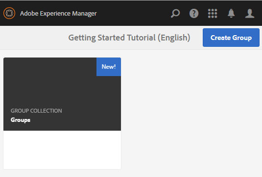

* Sélectionnez le dossier **Groupes** pour pouvoir l’ouvrir.

  Une fois ouvert, tous les groupes existants, qu’ils aient été créés sur l’instance de création ou de publication, s’affichent.

  À partir de cette console Groupes , il est possible de créer de nouveaux groupes.

  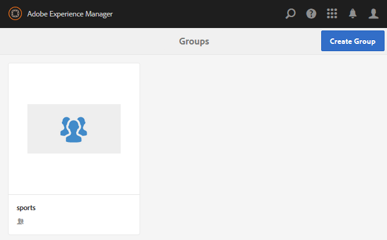

* Sélectionnez le bouton **Créer un groupe**.

### Étape 1 : modèle de groupe de la communauté {#step-community-group-template}

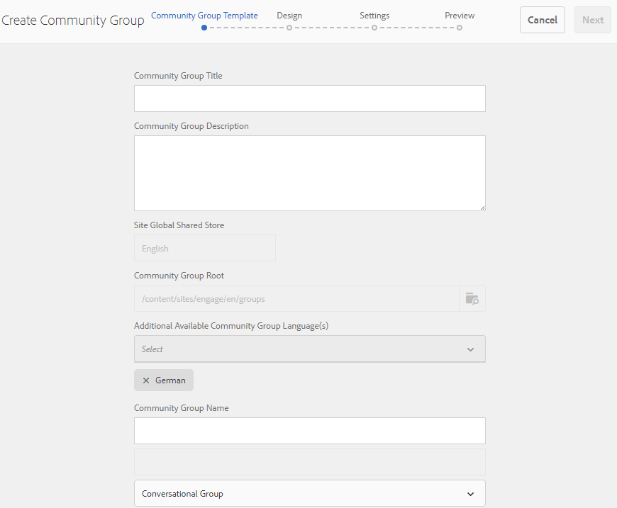

* **Titre du groupe communautaire**

  Titre affiché pour le groupe.
Le titre s’affiche sur le site publié pour le groupe.

* **Description du groupe communautaire**

  Description du groupe.

* **Racine du groupe communautaire**

  Chemin d’accès racine au groupe.
La racine par défaut est le site parent, mais la racine peut être déplacée vers n’importe quel emplacement du site web. Il n’est pas recommandé de le modifier.

* **Autres langues de groupe de la communauté disponibles** menu

  Utilisez le menu déroulant pour sélectionner les langues de groupe de la communauté disponibles. Le menu affiche toutes les langues dans lesquelles le site communautaire parent est créé. Les utilisateurs peuvent sélectionner l’une de ces langues pour créer des groupes dans plusieurs paramètres régionaux au cours de cette seule étape. Le même groupe est créé dans plusieurs langues spécifiées dans la console Groupes des sites communautaires respectifs.

* **Nom du groupe communautaire**

  Nom de la page racine du groupe qui apparaît dans l’URL. Évitez d’utiliser les caractères de soulignement (_) et les mots-clés tels que les ressources et la configuration dans le nom du groupe.

   * Vérifiez à nouveau le nom, car il ne peut pas être facilement modifié une fois le groupe créé.
   * L’URL de base s’affiche sous le `Community Group Name` .
   * Pour obtenir une URL valide, ajoutez « .html »
     *par exemple*, `https://localhost:4502/content/sites/mysight/en/mygroup.html`.

* Menu **Modèle de groupe de la communauté**

  Utilisez la liste déroulante pour choisir un modèle de [groupe de la communauté](/help/communities/tools.md) disponible.

### Étape 2 : conception {#step-design}

### THÈME DU GROUPE COMMUNAUTAIRE {#community-group-theme}

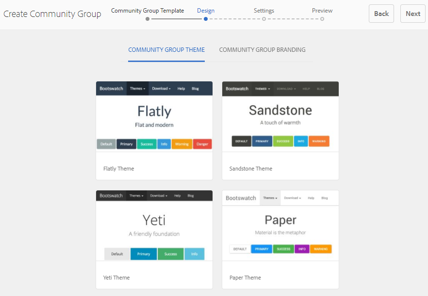

Le framework utilise `Twitter Bootstrap` pour apporter une conception réactive et flexible au site. L’un des nombreux thèmes Bootstrap préchargés peut être sélectionné pour appliquer un style au modèle de groupe de la communauté sélectionné. Un thème Bootstrap peut également être chargé.

Lorsqu’il est sélectionné, le thème est recouvert d’une coche opaque bleue.

Il est possible de sélectionner un thème différent du thème du site parent.

Une fois le site de la communauté publié, il est possible de [modifier les propriétés](#modifyinggroupproperties) et sélectionner un autre thème.

### IDENTITÉ GRAPHIQUE DU GROUPE COMMUNAUTAIRE {#community-group-branding}

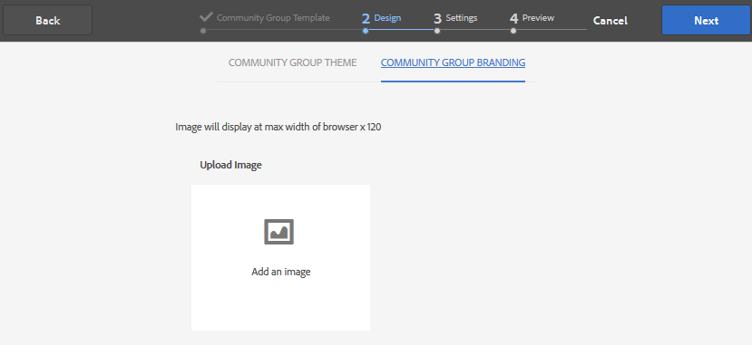

Le branding de site de la communauté est une image affichée sous la forme d’un en-tête en haut de chaque page. Il est possible d’afficher une bannière pour le groupe qui diffère des autres pages du site.

L’image doit être dimensionnée pour être aussi large que l’affichage attendu de la page dans le navigateur et pour une hauteur de 120 pixels.

Lors de la création ou de la sélection d’une image, gardez à l’esprit les points suivants :

* La hauteur de l’image est réduite à 120 pixels mesurés à partir du bord supérieur de l’image
* L’image est épinglée sur le bord gauche de la fenêtre du navigateur
* Il n’y a pas de redimensionnement de l’image, de sorte que lorsque la largeur de l’image est :

   * Inférieure à la largeur du navigateur, l’image est répétée horizontalement.
   * L’image apparaît recadrée si elle est supérieure à la largeur du navigateur.

### Étape 3 : Paramètres {#step-settings}

**MODÉRATION**

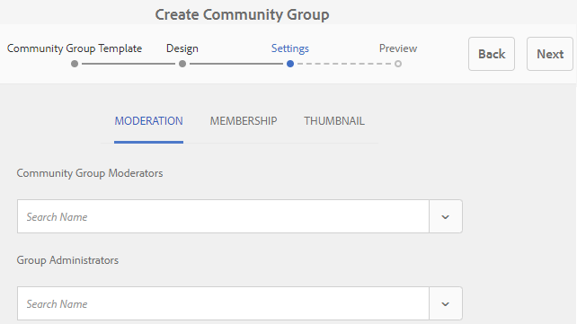

**Modérateurs de groupes communautaires**

Par défaut, la liste des modérateurs du site de la communauté parent est héritée.

Il est possible d’ajouter des modérateurs spécifiquement au groupe. Recherchez des membres (dans l’environnement de publication) pour les ajouter en tant que modérateurs

**Administrateurs de groupe**

Par défaut, l’administrateur du site de la communauté parent est également l’administrateur des groupes.

Cependant, il est possible d’affecter des administrateurs de groupe indépendants. Les administrateurs et administratrices de groupe peuvent gérer leur groupe (par exemple, G1) et créer un sous-groupe imbriqué sous G1. Ils peuvent également affecter différents administrateurs au sous-groupe.

Un utilisateur U1 peut donc être un administrateur dans un groupe G1 et un utilisateur régulier dans son groupe imbriqué G2.

**APPARTENANCE**

Le paramètre d’appartenance permet de sélectionner l’une des trois façons de sécuriser un groupe communautaire.

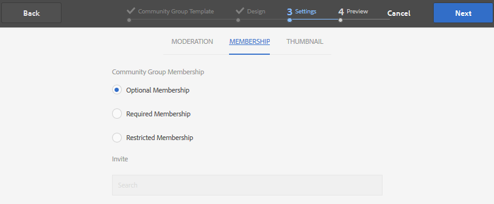

* **Abonnement facultatif**

  Si cette option est sélectionnée, le groupe communautaire est un groupe public. Les membres du site peuvent participer au groupe et publier sans rejoindre explicitement le groupe. La valeur par défaut est sélectionnée.

* **Abonnement requis**

  Si cette option est sélectionnée, le groupe communautaire est un groupe ouvert. Les membres de la communauté peuvent afficher le contenu du groupe, mais doivent le rejoindre pour publier du contenu. Les membres rejoignent l’équipe en cliquant sur le bouton `Join` dans l’environnement de publication. La valeur par défaut n’est pas sélectionnée.

* **Abonnement limité**

  Si cette option est sélectionnée, le groupe de la communauté est un groupe secret. Les membres de la communauté doivent être explicitement invités. Les membres invités sont saisis dans la zone de recherche. Les membres peuvent être ajoutés ultérieurement à l’aide des consoles [Membres et groupes](/help/communities/members.md) de l’environnement de création. La valeur par défaut n’est pas sélectionnée.

**MINIATURE**

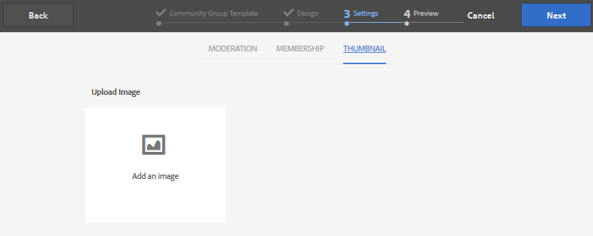

La miniature est une image à afficher pour le groupe lors de la création et de la publication.

La taille optimale d’une image de groupe est de 170 x 90 pixels dans un format d’image pris en charge (JPG ou PNG, par exemple).

Si aucune image n’est ajoutée, une image par défaut s’affiche.

### Étape 4 : Créer Un Groupe {#step-create-group}

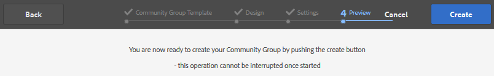

Si des ajustements sont nécessaires, utilisez le bouton **Précédent** pour les effectuer.

Une fois que **Créer** est sélectionné et démarré, le processus de création du groupe ne peut pas être interrompu.

Une fois le processus terminé, la vignette du nouveau site (groupe) de sous-communauté s’affiche dans la console Groupes de Sites de communautés, à partir de laquelle les auteurs et autrices peuvent ajouter du contenu de page ou les administrateurs et administratrices peuvent modifier les propriétés du site.

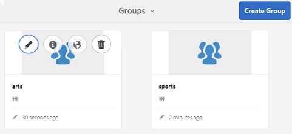

>[!NOTE]
>
>Le groupe est créé dans toutes les langues, comme spécifié dans [Étape 1 : modèle de groupe de la communauté](/help/communities/groups.md#step-community-group-template) dans Langues de groupe de la communauté supplémentaires disponibles, dans la console Groupes de la communauté des sites communautaires respectifs.

## Créer du contenu de groupe {#author-group-content}

Le contenu de page d’un groupe peut être créé avec les mêmes outils que n’importe quelle autre page AEM. Pour ouvrir le groupe en vue de sa création, sélectionnez l’icône Ouvrir le site qui s’affiche lorsque vous pointez sur la carte du groupe.

## Modifier les propriétés du groupe {#modify-group-properties}

Les propriétés d’un site de sous-communauté existant, spécifiées pendant le processus de création du groupe de la communauté, peuvent être modifiées en sélectionnant l’icône Modifier le site qui s’affiche lorsque vous passez la souris sur la carte du groupe :

Les détails des propriétés suivantes correspondent aux descriptions fournies dans la section [Création de groupe](#group-creation). Tout groupe imbriqué peut être modifié, qu’il soit créé dans l’environnement de publication ou de création.

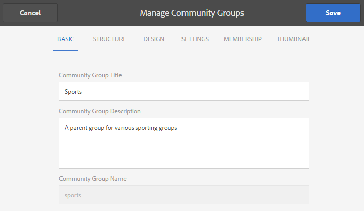

### Modifier les paramètres de base {#modify-basic}

Le panneau DE BASE permet de modifier les éléments suivants :

* Titre de groupe de communautés
* Description du groupe de communautés

Le nom du groupe communautaire ne peut pas être modifié.

Le choix d’un modèle de groupe communautaire différent n’aurait aucun effet sur un site de groupe communautaire existant, car il ne reste aucune connexion entre les modèles et les sites.

Au lieu de cela, la [STRUCTURE](#modify-structure) de la sous-communauté peut être modifiée.

### Modifier la structure {#modify-structure}

Le panneau STRUCTURE permet de modifier la structure initialement créée à partir du modèle de groupe de la communauté sélectionné lors de la création du site de sous-communauté à partir de l’environnement de création ou de publication. À partir du panneau, il est possible de :

* Glissez-déposez des [fonctions de communauté](/help/communities/functions.md) supplémentaires dans la structure du site.
* Sur une instance d’une fonction de communauté dans la structure du site :

   * **`Gear icon`**
Modifiez les paramètres, notamment le titre d’affichage, l’URL et les [groupes de membres privilégiés](/help/communities/users.md#privilegedmembersgroups).

   * **`Trashcan icon`**
Supprimez (supprimez) des fonctions de la structure du site.

   * **`Grid icon`**
Modifiez l’ordre des fonctions tel qu’affiché dans la barre de navigation de niveau supérieur du site.

>[!CAUTION]
>
>Bien que le titre d’affichage puisse être modifié sans effets secondaires, il n’est pas recommandé de modifier le nom de l’URL d’une fonction de communauté appartenant à un site de communauté.
>
>Par exemple, renommer l’URL ne déplace pas le contenu créé par l’utilisateur existant, ce qui a pour effet de « perdre » ce dernier.

>[!CAUTION]
>
>La fonction de groupes ne doit *pas* être la *première ni la seule* fonction de la structure du site.
>
>Toute autre fonction, telle que la fonction [page](/help/communities/functions.md#page-function), doit être incluse et répertoriée en premier.

**Exemple : ajout d’une fonction de calendrier à une structure de sous-communauté (groupe)**

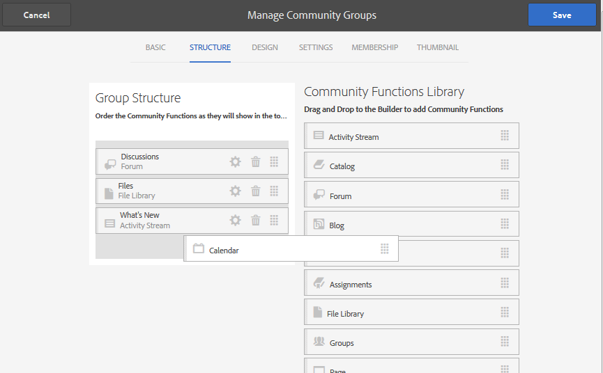

### Modifier la conception {#modify-design}

Le panneau CONCEPTION permet de modifier le thème :

* [Thème de groupe de communautés](#community-group-theme)
* [Valorisation marque groupe communautés](#community-group-branding)

   * Faites défiler jusqu’au bas du panneau pour modifier l’image de marque.

### Modifier les paramètres {#modify-settings}

Le panneau PARAMÈTRES permet d’ajouter une communauté [modérateurs](#moderation).

### Modifier l’appartenance {#modify-membership}

Le panneau [APPARTENANCE](#membership) est fourni uniquement à titre d’information. Il n’est pas possible de modifier le type d’appartenance à un groupe établi, qu’il soit facultatif, obligatoire ou restreint.

### Modifier la miniature {#modify-thumbnail}

Le panneau [MINIATURE](#thumbnail) permet de charger une image pour représenter le groupe de la communauté aux visiteurs du site dans l’environnement de publication et dans la console Groupes du site des communautés dans l’environnement de création.

## Publier le groupe {#publish-the-group}

Une fois qu’un groupe de la communauté a été nouvellement créé ou modifié, il est possible de le publier (activer) en sélectionnant l’icône `Publish Site`.

Une fois le groupe publié, le message suivant s’affiche :

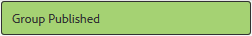

>[!CAUTION]
>
>Le site de la communauté parente et les groupes parents doivent déjà avoir été publiés.
>
>Le site de la communauté et les groupes imbriqués doivent être publiés de haut en bas.

## Supprimer le groupe {#delete-the-group}

Supprimez un groupe de la console Groupes de la communauté en sélectionnant l’icône Supprimer le groupe qui s’affiche lorsque vous pointez dessus avec la souris.

Cela supprime tous les éléments associés au groupe, par exemple, tout le contenu du groupe est définitivement supprimé et les appartenances des utilisateurs sont supprimées du système.
