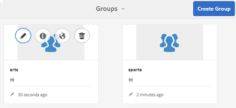

# Console Groupes communautaires {#community-groups-console}

La console Groupes permet d&#39;accéder à la création de groupes communautaires lorsqu&#39;une structure [de](/help/communities/sites-console.md#step1) modèle de site communautaire inclut la fonction Groupes.

* AEM Communities prend en charge l’imbrication de groupes dans d’autres groupes. L&#39;imbrication de groupe est possible lorsque la [structure du nouveau groupe](/help/communities/tools-groups.md) contient la fonction groups.
* Pour l&#39;environnement auteur uniquement, il existe un assistant de création de groupe similaire à l&#39;assistant de création de site.
* Si (ou non) les membres peuvent créer des groupes dans l’environnement de publication, il est configurable lors de l’ajout d’une fonction Groupes à une structure de site de communauté ou de groupe de communauté.

Sur les trois modèles de groupe inclus, seul le `Reference Group` modèle inclut une fonction de groupe dans sa structure.

Les différentes facettes des groupes communautaires sont les suivantes :

* **Création**: un nouveau groupe peut être créé sur l’instance d’auteur et, éventuellement, sur l’instance de publication.
* **Contrôle**: peut être ouvert ou secret.
* **Imbrication**: peut contenir zéro ou plusieurs groupes.

<!-- This is a 404 on helpx. Please update or remove.
>[!NOTE]
>
>Community groups, created in the publish environment before the [existence of the Community Groups console](/help/communities/version-history.md#featurepack1fp1), will not be listed in the Community Groups console, and thus, are not modifiable using the console.
-->

>[!NOTE]
>
>Cette console Groupes, accessible uniquement à partir de la console Sites des communautés, ne doit pas être confondue avec la console  Groupes de membres pour la gestion des groupes de membres.
>
>Les groupes membres sont des groupes d&#39;utilisateurs enregistrés dans l&#39;environnement de publication et accessibles depuis l&#39;environnement auteur à l&#39;aide du service tunnel.

## Création de groupe {#group-creation}

Pour accéder à la console Groupes :

* Sur l’auteur, connectez-vous avec des droits d’administrateur.
* A partir de la navigation globale : **[!UICONTROL Communautés]** > **[!UICONTROL Sites]**.
* Sélectionnez un dossier de site communautaire existant pour l’ouvrir.
* Sélectionnez une instance d’un site communautaire dans le dossier.

   * La structure du site communautaire doit inclure une fonction de groupe.
   * Ces captures d’écran proviennent du didacticiel Prise en main après [la création de groupes lors de la publication](/help/communities/published-site.md).

   

* Sélectionnez le dossier **** Groupes pour l’ouvrir.

   Lorsqu’ils sont ouverts, tous les groupes existants, qu’ils soient créés sur l’auteur ou sur la publication, s’affichent.

   A partir de cette console Groupes, il est possible de créer de nouveaux groupes.

   

* Sélectionnez le bouton **Créer un groupe** .

### Étape 1 : Modèle de groupe de communautés {#step-community-group-template}

* **Titre de groupe de communautés**

   Titre d’affichage du groupe.
Le titre s’affiche sur le site publié pour le groupe.

* **Description du groupe de communautés**

   Description du groupe.

* **Racine du groupe de communautés**

   Chemin d’accès racine au groupe.
La racine par défaut est le site parent, mais elle peut être déplacée à n’importe quel emplacement du site Web. Il n’est pas recommandé de le modifier.

* **Autres groupes communautaires disponibles Langues(s)** menu

   Utilisez la liste déroulante pour sélectionner la ou les langues des groupes communautaires disponibles. Le menu affiche toutes les langues dans lesquelles le site de la communauté parent est créé. Les utilisateurs peuvent sélectionner l’une de ces langues pour créer des groupes dans plusieurs paramètres régionaux au cours de cette seule étape. Un même groupe est créé dans plusieurs langues spécifiées dans la console Groupes des sites communautaires respectifs.

* **Nom du groupe de communautés**

   Nom de la page racine du groupe qui s’affiche dans l’URL.

   * Vérifiez par doublon le nom, car il n’est pas facilement modifié une fois le groupe créé.
   * L’URL de base s’affichera sous le `Community Group Name`.
   * Pour une URL valide, ajoutez &quot;.html&quot;
      *par exemple*, `https://localhost:4502/content/sites/mysight/en/mygroup.html`.

* **Menu Modèle** de groupe de communautés

   Utilisez la liste déroulante pour choisir un modèle [de groupe](/help/communities/tools.md)communautaire disponible.

### Étape 2 : Conception {#step-design}

### COMMUNITY GROUP THEME {#community-group-theme}

La structure utilise le Bootstrap  Twitter pour apporter une conception souple et adaptée au site. Un des nombreux thèmes de Bootstrap préchargés peut être sélectionné pour mettre en forme le modèle de groupe de communautés sélectionné ou un thème de Bootstrap peut être téléchargé.

Une fois sélectionné, le thème sera superposé avec une coche bleue opaque.

Il est possible de sélectionner un thème différent du thème du site parent.

Une fois le site de la communauté publié, il est possible de [modifier les propriétés](#modifyinggroupproperties) et de sélectionner un autre thème.

### COMMUNITY GROUP BRANDING {#community-group-branding}

L’image de marque du site de la communauté est une image affichée en-tête en haut de chaque page. Il est possible d&#39;afficher une bannière pour le groupe qui diffère des autres pages du site.

L’image doit être dimensionnée de manière à être aussi large que l’affichage prévu de la page dans le navigateur et à 120 pixels de hauteur.

Lors de la création ou de la sélection d’une image, gardez à l’esprit :

* La hauteur de l’image sera rognée à 120 pixels, mesurée à partir du bord supérieur de l’image.
* L’image est épinglée sur le bord gauche de la fenêtre du navigateur.
* L’image n’est pas redimensionnée, de telle sorte que lorsque la largeur de l’image est :

   * Moins que la largeur du navigateur, l’image se répète horizontalement.
   * Plus grande que la largeur du navigateur, l’image semble recadrée.

### Étape 3 : Paramètres {#step-settings}

**MODÉRATION**

**Modérateurs de groupe de communautés**

Par défaut, la liste des modérateurs du site de la communauté parent est héritée.

Il est possible d&#39;ajouter des modérateurs spécifiques au groupe. Rechercher des membres (à partir de l’environnement de publication) pour les ajouter en tant que modérateurs

**Administrateurs du groupe**

Par défaut, l’administrateur du site de la communauté parent est également l’administrateur des groupes.

Cependant, il est possible de désigner des administrateurs de groupes indépendants. Les administrateurs de groupe peuvent gérer leur groupe (par exemple G1) et créer un sous-groupe imbriqué sous G1. Ils peuvent également affecter différents administrateurs au sous-groupe.

Par conséquent, un utilisateur U1 peut être administrateur dans un groupe G1 et un utilisateur régulier dans son groupe imbriqué G2.

**ADHÉSION**

Le paramètre d&#39;adhésion permet de choisir l&#39;une des trois façons d&#39;assurer la sécurité d&#39;un groupe communautaire.

* **Abonnement facultatif**

   Si cette option est sélectionnée, le groupe communautaire est un groupe public. Les membres du site peuvent participer au groupe et publier sans rejoindre explicitement le groupe. La valeur par défaut est sélectionnée.

* **Abonnement requis**

   Si cette option est sélectionnée, le groupe de la communauté est un groupe ouvert. Les membres du site de la communauté peuvent vue le contenu du groupe, mais doivent rejoindre le groupe pour publier du contenu. Les membres se joignent en sélectionnant le `Join` bouton dans l’environnement de publication. La valeur par défaut n’est pas sélectionnée.

* **Abonnement restreint**

   Si cette option est sélectionnée, le groupe de la communauté est un groupe secret. Les membres de la communauté doivent être invités explicitement. Les membres invités sont saisis dans la zone de recherche. Les membres peuvent être ajoutés ultérieurement à l&#39;aide des consoles  Membres et Groupes de l&#39;environnement auteur. La valeur par défaut n’est pas sélectionnée.

**Miniature**

La miniature est une image à afficher pour le groupe sur l’auteur et la publication.

La taille optimale d’une image de groupe est de 170 x 90 pixels dans un format d’image pris en charge (tel que JPG ou PNG).

Si aucune image n’est ajoutée, une image par défaut s’affiche.

### Étape 4 : Créer un groupe {#step-create-group}

Si des ajustements sont nécessaires, utilisez le bouton **Précédent** pour les effectuer.

Une fois **Créer** sélectionné et démarré, le processus de création du groupe ne peut plus être interrompu.

Une fois le processus terminé, la carte du nouveau site (groupe) de sous-communauté s’affiche dans la console Groupes de sites des communautés, d’où les auteurs peuvent ajouter du contenu de page ou les administrateurs peuvent modifier les propriétés du site.

>[!NOTE]
>
>Le groupe est créé dans toutes les langues, comme indiqué à l’ [étape 1 : Modèle](/help/communities/groups.md#step-community-group-template) de groupe communautaire dans d&#39;autres langues de groupe communautaire disponibles, dans la console Groupes communautaires des sites communautaires respectifs.

## Contenu du groupe d’auteurs {#author-group-content}

Le contenu de la page d’un groupe peut être créé avec les mêmes outils que toute autre page AEM. Pour ouvrir le groupe à des fins de création, sélectionnez l’icône Ouvrir le site qui s’affiche lorsque vous passez la souris sur la carte du groupe.

## Modifier les propriétés du groupe {#modify-group-properties}

Les propriétés d’un site de sous-communauté existant, spécifiées au cours du processus de création de groupe de la communauté, peuvent être modifiées en sélectionnant l’icône Modifier le site qui s’affiche lorsque vous passez la souris sur la carte du groupe :

Les détails des propriétés suivantes correspondent aux descriptions fournies dans la section Création [de](#group-creation) groupe. Tout groupe imbriqué peut être modifié, qu’il soit créé dans l’environnement de publication ou dans l’environnement d’auteur.

### Modification de base {#modify-basic}

Le panneau BASIC permet de modifier les

* Titre de groupe de communautés
* Description du groupe de communautés

Le nom du groupe de la communauté ne peut pas être modifié.

Le choix d’un modèle de groupe de communautés différent n’aurait aucun impact sur un site de groupes de communautés existant, car il n’y a plus de connexion entre les modèles et les sites.

Au lieu de cela, la [STRUCTURE](#modify-structure) de la sous-communauté peut être modifiée.

### Modifier la structure {#modify-structure}

Le panneau STRUCTURE permet de modifier la structure initialement créée à partir du modèle de groupe de communautés sélectionné lors de la création du site de sous-communauté à partir de l’environnement d’auteur ou de publication. Depuis le panneau, il est possible de :

* Faites glisser d’autres fonctions [de](/help/communities/functions.md) communauté dans la structure du site.
* Sur une instance d’une fonction de communauté dans la structure du site :

   * **`Gear icon`**
Modifiez les paramètres, notamment le titre d’affichage, l’URL et les groupes [de membres](/help/communities/users.md#privilegedmembersgroups)privilégiés.

   * **`Trashcan icon`**
Supprimez (supprimez) des fonctions de la structure du site.

   * **`Grid icon`**
Modifiez l&#39;ordre des fonctions tel qu&#39;il s&#39;affiche dans la barre de navigation de niveau supérieur du site.

>[!CAUTION]
>
>Bien que le titre d’affichage puisse être modifié sans effets secondaires, il n’est pas recommandé de modifier le nom d’URL d’une fonction de communauté appartenant à un site communautaire.
>
>Par exemple, renommer l’URL ne déplace pas l’UGC existant, avec pour effet de &quot;perdre&quot; l’UGC.

>[!CAUTION]
>
>La fonction de groupes *ne doit pas* être la *première ou la seule* fonction de la structure du site.
>
>Toute autre fonction, telle que la fonction [de](/help/communities/functions.md#page-function)page, doit être incluse et répertoriée en premier.

**Exemple : Ajouter une fonction de calendrier à une structure de sous-communauté (groupe)**

### Modifier la conception {#modify-design}

Le panneau DESIGN permet de modifier le thème :

* [Thème de groupe de communautés](#community-group-theme)
* [Valorisation marque groupe communautés](#community-group-branding)

   * Faites défiler l’écran jusqu’au bas du panneau pour modifier l’image de marque.

### Modifier les paramètres {#modify-settings}

Le panneau PARAMÈTRES permet d’ajouter des [modérateurs](#moderation)de communauté.

### Modifier l&#39;adhésion {#modify-membership}

Le groupe [ADHÉSION](#membership) n&#39;est fourni qu&#39;à titre d&#39;information. Il n&#39;est pas possible de modifier le type d&#39;appartenance au groupe établi, qu&#39;il soit facultatif, obligatoire ou restreint.

### Modifier la miniature {#modify-thumbnail}

Le panneau [MINIATURE](#thumbnail) permet de télécharger une image pour représenter le groupe de la communauté sur les visiteurs du site dans l&#39;environnement de publication ainsi que dans la console Groupes du site des communautés dans l&#39;environnement de l&#39;auteur.

## Publication du groupe {#publish-the-group}

Après la création ou la modification d’un groupe de la communauté, il est possible de le publier (d’activer) en sélectionnant l’ `Publish Site` icône.

Une fois le groupe publié, un message s’affiche :

>[!CAUTION]
>
>Le site de la communauté parent et les groupes parents auraient déjà dû être publiés.
>
>Le site communautaire et les groupes imbriqués devraient être publiés de manière descendante.

## Supprimer le groupe {#delete-the-group}

Supprimez un groupe dans la console Groupes de la communauté en sélectionnant l&#39;icône Supprimer le groupe qui s&#39;affiche lorsque vous placez le pointeur de la souris sur le groupe.

Cela supprime tous les éléments associés au groupe, par exemple tout le contenu du groupe est définitivement supprimé et les abonnements des utilisateurs sont supprimés du système.
