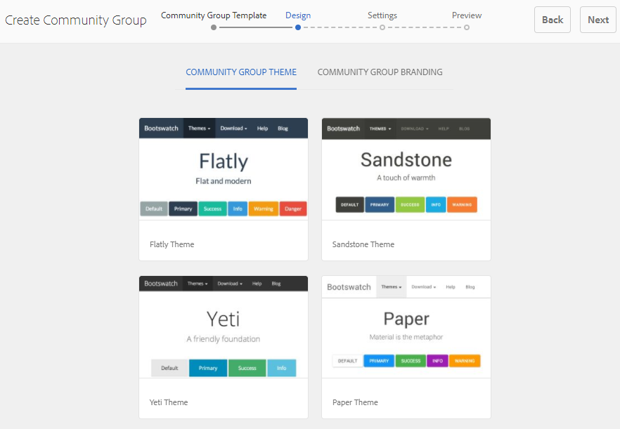
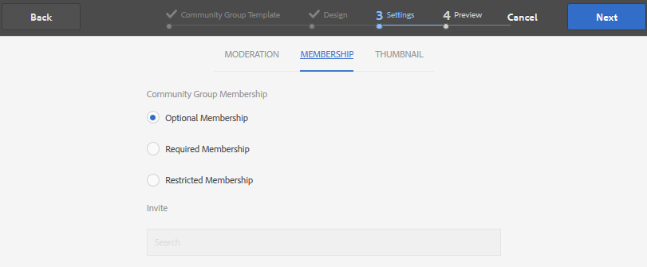

# Console des groupes communautaires {#community-groups-console}

La console Groupes permet d’accéder à la création de groupes de communautés lorsqu’une [structure de modèle](/help/communities/sites-console.md#step1) d’un site de communauté inclut la [fonction de groupes](/help/communities/functions.md#groups-function).

* AEM Communities prend en charge l’imbrication de groupes dans d’autres groupes. L’imbrication de groupe est possible lorsque la [structure du nouveau groupe](/help/communities/tools-groups.md) contient la fonction de groupes.
* Pour l’environnement de création uniquement, il existe un assistant de création de groupe similaire à l’assistant de création de site.
* Que les membres puissent créer des groupes dans l’environnement de publication (ou non), il est configurable lors de l’ajout d’une fonction Groupes à une structure de site de communauté ou de groupe de communauté.

Sur les trois modèles de groupe inclus, seul le modèle `Reference Group` inclut une fonction de groupe dans sa structure.

Les différentes facettes des groupes communautaires sont les suivantes :

* **Création** : un nouveau groupe peut être créé sur l’instance de création et éventuellement sur l’instance de publication.
* **Contrôle** : Le groupe peut être ouvert ou secret.
* **Imbrication** : ne peut contenir aucun ou plusieurs groupes.

<!-- This is a 404 on helpx. Please update or remove.
>[!NOTE]
>
>Community groups, created in the publish environment before the [existence of the Community Groups console](/help/communities/version-history.md#featurepack1fp1), will not be listed in the Community Groups console, and thus, are not modifiable using the console.
-->

>[!NOTE]
>
>Cette console Groupes, accessible uniquement à partir de la console Sites de Communities, ne doit pas être confondue avec la [console Groupes](/help/communities/members.md) membre pour la gestion des groupes de membres.
>
>Les groupes membres sont des groupes d’utilisateurs enregistrés dans l’environnement de publication et accessibles à partir de l’environnement de création à l’aide du [service tunnel](/help/communities/deploy-communities.md#tunnel-service-on-author).

## Création de groupe {#group-creation}

Pour accéder à la console Groupes , procédez comme suit :

* Sur l’instance de création, connectez-vous avec les privilèges d’administrateur.
* À partir de la navigation globale : **[!UICONTROL Communautés]** > **[!UICONTROL Sites]**.
* Sélectionnez un dossier de site de communauté existant pour l’ouvrir.
* Sélectionnez une instance d’un site communautaire dans le dossier .

   * La structure du site de la communauté doit inclure une fonction de groupe.
   * Ces captures d’écran proviennent du tutoriel Prise en main après la [création de groupes sur publish](/help/communities/published-site.md).

   

* Sélectionnez le dossier **Groupes** pour l’ouvrir.

   Une fois ouverts, tous les groupes existants, qu’ils soient créés dans l’instance de création ou de publication, s’affichent.

   Dans cette console Groupes , il est possible de créer des groupes.

   

* Sélectionnez le bouton **Créer un groupe** .

### Étape 1 : Modèle de groupe de communautés {#step-community-group-template}

* **Titre de groupe de communautés**

   Titre affiché pour le groupe.
Le titre apparaît sur le site publié pour le groupe.

* **Description du groupe de communautés**

   Description du groupe.

* **Racine du groupe de communautés**

   Chemin d’accès racine au groupe.
La racine par défaut est le site parent, mais elle peut être déplacée à n’importe quel emplacement du site web. Il n’est pas recommandé de le modifier.

* **Menu Autres langues(s) du groupe de communautés disponibles** 

   Utilisez le menu déroulant pour sélectionner la ou les langues des groupes de communautés disponibles. Le menu affiche toutes les langues dans lesquelles le site de la communauté parent est créé. Les utilisateurs peuvent sélectionner l’une de ces langues pour créer des groupes dans plusieurs paramètres régionaux au cours de cette seule étape. Un même groupe est créé dans plusieurs langues spécifiées dans la console Groupes des sites de communauté respectifs.

* **Nom du groupe de communautés**

   Nom de la page racine du groupe qui apparaît dans l’URL.

   * Vérifiez deux fois le nom, car il n’est pas facilement modifié une fois le groupe créé.
   * L’URL de base s’affiche sous `Community Group Name`.
   * Pour une URL valide, ajoutez &quot;.html&quot;
      *par exemple*, `https://localhost:4502/content/sites/mysight/en/mygroup.html`.

* **Modèle de groupe** de communautés

   Utilisez la liste déroulante pour sélectionner un [modèle de groupe de communautés ](/help/communities/tools.md) disponible.

### Étape 2 : Conception {#step-design}

### THÈME DU GROUPE COMMUNAUTAIRE {#community-group-theme}

La structure utilise [Twitter Bootstrap](https://twitterbootstrap.org/) pour apporter une conception réactive et flexible au site. Un des nombreux thèmes de Bootstrap préchargés peut être sélectionné pour mettre en forme le modèle de groupe de communautés sélectionné ou un thème de Bootstrap peut être chargé.

Lorsqu’il est sélectionné, le thème est recouvert d’une coche bleue opaque.

Il est possible de sélectionner un thème qui diffère du thème du site parent.

Une fois le site de la communauté publié, il est possible de [modifier les propriétés](#modifyinggroupproperties) et sélectionner un autre thème.

### MARQUE DU GROUPE COMMUNAUTAIRE {#community-group-branding}

La valorisation de marque du site de la communauté est une image affichée en tant qu’en-tête dans la partie supérieure de chaque page. Il est possible d’afficher une bannière pour le groupe qui diffère des autres pages du site.

L’image doit être dimensionnée de manière à être aussi large que l’affichage prévu de la page dans le navigateur et de 120 pixels de hauteur.

Lors de la création ou de la sélection d’une image, gardez à l’esprit les points suivants :

* La hauteur de l’image sera recadrée à 120 pixels mesurés à partir du bord supérieur de l’image.
* L’image est épinglée sur le bord gauche de la fenêtre du navigateur.
* L’image n’est pas redimensionnée, de sorte que lorsque la largeur de l’image est :

   * Moins que la largeur du navigateur, l’image se répète horizontalement.
   * Plus grande que la largeur du navigateur, l’image semble recadrée.

### Étape 3 : Paramètres {#step-settings}

**MODÉRATION**

**Modérateurs de groupe de communautés**

Par défaut, la liste des modérateurs du site de la communauté parente est héritée.

Il est possible d’ajouter des modérateurs spécifiques au groupe. Recherchez des membres (de l’environnement de publication) à ajouter en tant que modérateurs.

**Administrateurs du groupe**

Par défaut, l’administrateur de site de la communauté parente est également l’administrateur des groupes.

Cependant, il est possible d’affecter des administrateurs de groupe indépendants. Les administrateurs de groupe peuvent gérer leur groupe (par exemple G1) et créer un sous-groupe imbriqué sous G1. Ils peuvent également affecter différents administrateurs au sous-groupe.

Par conséquent, un utilisateur U1 peut être administrateur d’un groupe G1 et un utilisateur régulier de son groupe G2 imbriqué.

**ABONNEMENT**

Le paramètre d’appartenance permet de sélectionner l’une des trois méthodes pour sécuriser un groupe de communautés.

* **Abonnement facultatif**

   Si cette option est sélectionnée, le groupe de communautés est un groupe public. Les membres du site peuvent participer au groupe et publier sans rejoindre explicitement le groupe. La valeur par défaut est sélectionnée.

* **Abonnement requis**

   Si cette option est sélectionnée, le groupe de communautés est un groupe ouvert. Les membres de la communauté peuvent afficher le contenu du groupe, mais doivent rejoindre le groupe pour publier du contenu. Les membres se joignent en sélectionnant le bouton `Join` dans l’environnement de publication. La valeur par défaut n’est pas sélectionnée.

* **Abonnement restreint**

   Si cette option est sélectionnée, le groupe de communautés est un groupe secret. Les membres de la communauté doivent être invités explicitement. Les membres invités sont saisis dans la zone de recherche. Vous pouvez ajouter des membres ultérieurement à l’aide des [consoles Membres et Groupes](/help/communities/members.md) de l’environnement de création. La valeur par défaut n’est pas sélectionnée.

**Miniature**

La miniature est une image à afficher pour le groupe lors de l’auteur et de la publication.

La taille optimale d’une image de groupe est de 170 x 90 pixels dans un format d’image pris en charge (tel que JPG ou PNG).

Si aucune image n’est ajoutée, une image par défaut s’affiche.

### Étape 4 : Créer un groupe {#step-create-group}

Si des ajustements sont nécessaires, utilisez le bouton **Précédent** pour les effectuer.

Une fois **Create** sélectionné et démarré, le processus de création du groupe ne peut pas être interrompu.

Une fois le processus terminé, la carte du nouveau site (groupe) de sous-communautés s’affiche dans la console Groupes de sites de communautés , à partir de laquelle les auteurs peuvent ajouter du contenu de page ou les administrateurs peuvent modifier les propriétés du site.

>[!NOTE]
>
>Le groupe est créé dans toutes les langues, comme indiqué à l’ [étape 1 : Modèle de groupe de communautés](/help/communities/groups.md#step-community-group-template) dans Langues de groupe de communautés disponibles supplémentaires, dans la console Groupes de communautés des sites de communautés respectifs.

## Contenu du groupe d’auteurs {#author-group-content}

Le contenu de la page d’un groupe peut être créé avec les mêmes outils que toute autre page AEM. Pour ouvrir le groupe à des fins de création, sélectionnez l’icône Ouvrir le site qui s’affiche lorsque vous pointez sur la carte du groupe.

## Modifier les propriétés du groupe {#modify-group-properties}

Les propriétés d’un site de sous-communauté existant, spécifiées pendant le processus de création d’un groupe de communautés, peuvent être modifiées en sélectionnant l’icône Modifier le site qui s’affiche lorsque vous pointez sur la carte du groupe :

Les détails des propriétés suivantes correspondent aux descriptions fournies dans la section [Création de groupe](#group-creation) . Tout groupe imbriqué peut être modifié, qu’il soit créé dans l’environnement de publication ou dans l’environnement de création.

### Modifier de base {#modify-basic}

Le panneau BASIC permet de modifier les

* Titre de groupe de communautés
* Description du groupe de communautés

Le nom du groupe de la communauté ne peut pas être modifié.

Le choix d’un modèle de groupe de communautés différent n’aurait aucun impact sur un site de groupe de communautés existant, car il n’existe aucune connexion entre les modèles et les sites.

Au lieu de cela, la [STRUCTURE](#modify-structure) de la sous-communauté peut être modifiée.

### Modifier la structure {#modify-structure}

Le panneau STRUCTURE permet de modifier la structure initialement créée à partir du modèle de groupe de communautés sélectionné lors de la création du site de sous-communauté à partir de l’environnement de création ou de publication. Dans le panneau , vous pouvez effectuer les opérations suivantes :

* Glissez-déposez des [fonctions de communauté](/help/communities/functions.md) supplémentaires dans la structure du site.
* Sur une instance d’une fonction de communauté dans la structure du site :

   * **`Gear icon`**
Modifiez les paramètres, y compris le titre d’affichage, l’URL et les groupes de membres  [privilégiés](/help/communities/users.md#privilegedmembersgroups).

   * **`Trashcan icon`**
Supprimer (supprimer) des fonctions de la structure du site.

   * **`Grid icon`**
Modifiez l’ordre des fonctions tel qu’affiché dans la barre de navigation de niveau supérieur du site.

>[!CAUTION]
>
>Bien que le titre d’affichage puisse être modifié sans effets secondaires, il n’est pas recommandé de modifier le nom d’URL d’une fonction de communauté appartenant à un site de communauté.
>
>Par exemple, renommer l’URL ne déplace pas le contenu créé par l’utilisateur existant, ce qui a pour effet de &quot;perdre&quot; le contenu créé par l’utilisateur.

>[!CAUTION]
>
>La fonction groups doit *ne pas* être la *première ou la seule fonction* dans la structure du site.
>
>Toute autre fonction, telle que la [fonction de page](/help/communities/functions.md#page-function), doit être incluse et répertoriée en premier.

**Exemple : Ajout d’une fonction Calendrier à une structure de sous-communauté (groupe)**

### Modifier la conception {#modify-design}

Le panneau CONCEPTION permet de modifier le thème :

* [Thème de groupe de communautés](#community-group-theme)
* [Valorisation marque groupe communautés](#community-group-branding)

   * Faites défiler l’écran jusqu’au bas du panneau pour modifier l’image de marque.

### Modifier les paramètres {#modify-settings}

Le panneau PARAMÈTRES permet d’ajouter des modérateurs [de communauté](#moderation).

### Modifier l’appartenance {#modify-membership}

Le panneau [MEMBERSHIP](#membership) est fourni uniquement à titre d’information. Il n’est pas possible de modifier le type d’appartenance au groupe établi, qu’il soit facultatif, obligatoire ou restreint.

### Modifier la miniature {#modify-thumbnail}

Le panneau [MINIATURE](#thumbnail) permet de charger une image afin de représenter le groupe de la communauté aux visiteurs du site dans l’environnement de publication, ainsi que dans la console Groupes du site Communities dans l’environnement de création.

## Publier le groupe {#publish-the-group}

Une fois qu’un groupe de communautés a été créé ou modifié, il est possible de le publier (activer) en sélectionnant l’icône `Publish Site` .

Une fois la publication du groupe terminée, un message s’affiche :

>[!CAUTION]
>
>Le site de la communauté parente et les groupes parents doivent déjà avoir été publiés.
>
>Le site communautaire et les groupes imbriqués doivent être publiés de manière descendante.

## Supprimer le groupe {#delete-the-group}

Supprimez un groupe dans la console Groupes de la communauté en sélectionnant l’icône Supprimer le groupe qui s’affiche lorsque vous placez le pointeur de la souris sur le groupe.

Cela supprime tous les éléments associés au groupe. Par exemple, tout le contenu du groupe est définitivement supprimé et les appartenances des utilisateurs sont supprimées du système.
