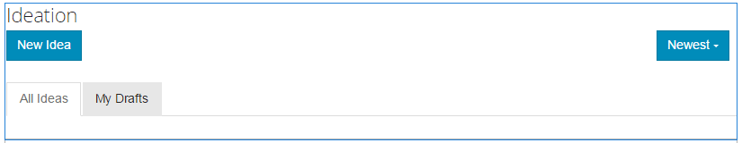
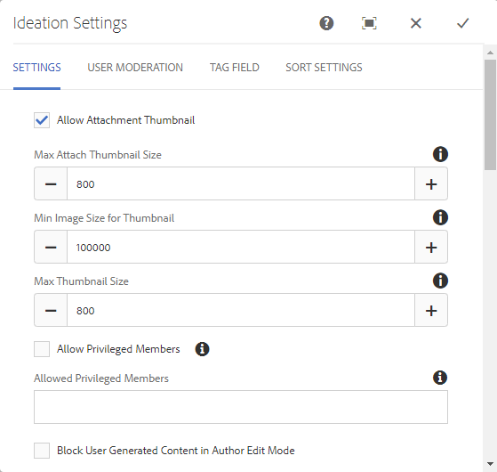
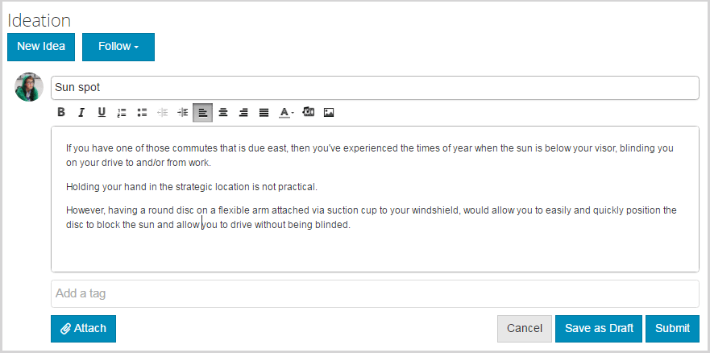
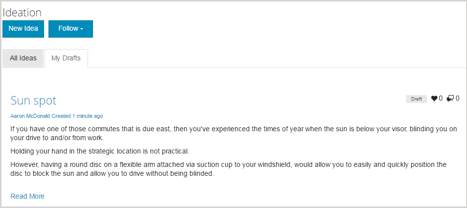
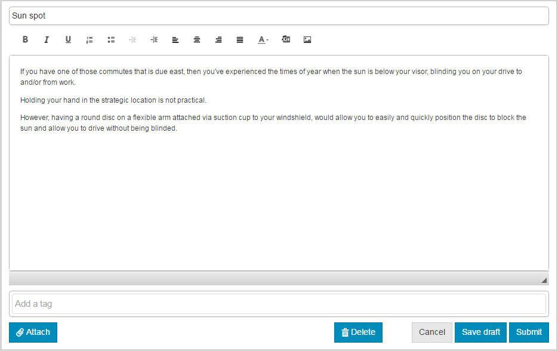
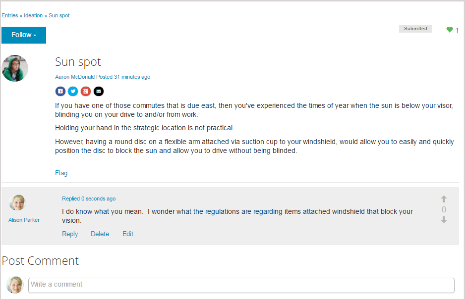

# Fonction d’idéation {#ideation-feature}

## Présentation {#introduction}

La fonction d’identification fournit une zone pour les visiteurs du site connectés (membres de la communauté) dans l’environnement de publication afin de :

* Créez des idées à partager avec la communauté.
* Affichez et commentez les idées.
* Suivez une idée.
* Vote sur une idée.

Cette section de la documentation décrit les éléments suivants :

* Ajout de la fonction de création à un site AEM.
* Paramètres de configuration du composant Idéation.

### Ajout d’une idée à une page {#adding-a-ideation-to-a-page}

Pour ajouter un composant `Ideation` à une page en mode création, utilisez l’explorateur de composants pour localiser .

* `Communities / Ideation`

Et faites-le glisser sur une page où l&#39;idée devrait apparaître.

Pour plus d’informations, consultez [Principes de base des composants de communautés](/help/communities/basics.md).

Lorsque les [bibliothèques côté client requises](/help/communities/ideation.md#essentials-for-client-side) sont incluses, le composant `Ideation` s’affiche de la manière suivante :

### Configuration d’une idéation {#configuring-an-ideation}

Sélectionnez le composant de `Ideation` placé afin de pouvoir accéder à l’icône de `Configure` qui ouvre la boîte de dialogue de modification et de la sélectionner.

#### Onglet Paramètres {#settings-tab}

Sous l’onglet **[!UICONTROL Paramètres]**, spécifiez les paramètres des idées et commentaires :

* **Autoriser la miniature de la pièce jointe**
* **Taille max. de la miniature jointe**
* **Taille minimale de l’image de la miniature**
* **Taille max. de la miniature**
* **Autoriser les membres privilégiés**
* **Membres autorisés**
* **Bloquer le contenu généré par l’utilisateur en mode d’édition Auteur**
* **Titre de l’idéation**

* Titre affiché pour l’idée. La valeur par défaut est `Ideation`.
* **Description de l’idéation**

  Description à afficher sous forme de sous-titre pour l’idée. Par défaut, aucune description.

* **Rubriques Par Page**

  Définit le nombre d’idées/publications affichées par page. La valeur par défaut est 10.

* **Modéré**

  Si cette case est cochée, la publication d’idées et de commentaires doit être approuvée avant de pouvoir apparaître sur un site de publication. La valeur par défaut n’est pas cochée.

* **Fermé**

  Si cette case est cochée, le forum des idées est fermé aux nouvelles idées et commentaires. La valeur par défaut n’est pas cochée.

* **Éditeur de texte enrichi**

  Si cette case est cochée, les idées et les commentaires peuvent être saisis avec des balises. La valeur par défaut n’est pas cochée.

* **Autoriser le balisage**

  Si cette case est cochée, permet aux membres d’ajouter des libellés de balise à leurs publications (voir **[!UICONTROL Champ de balise]** onglet). La valeur par défaut n’est pas cochée.

* **Autoriser les chargements de fichiers**

  Si cette case est cochée, autorisez l’ajout de pièces jointes à l’idée ou au commentaire. La valeur par défaut n’est pas cochée.

* **Taille de fichier max**

  Pertinent uniquement si `Allow File Uploads` est coché. Ce champ limite la taille (en octets) d’un fichier chargé. La valeur par défaut est 104857600 (10 Mo).

* **Types de fichiers autorisés**

  Pertinent uniquement si `Allow File Uploads` est coché. Liste d’extensions de fichier séparées par des virgules avec le séparateur « point ». Par exemple, .jpg, .jpeg, .png, .doc, .docx, .pdf. Si des types de fichiers sont spécifiés, ceux qui ne le sont pas ne peuvent pas être chargés. Par défaut, aucun fichier n’est spécifié, de sorte que tous les types de fichiers soient autorisés.

* **Taille max. du fichier image joint**

  Pertinent uniquement si Autoriser le chargement de fichiers est coché. Nombre maximal d’octets qu’un fichier image chargé peut avoir. La valeur par défaut est 2097152 (2 Mo).

* **Autoriser les réponses**

  Si cette case est cochée, autoriser les réponses aux commentaires postés sur l’idée. La valeur par défaut n’est pas cochée.

* **Autoriser le vote**

  Si cette case est cochée, autoriser le vote sur les commentaires d’une idée. La valeur par défaut n’est pas cochée.

* **Autoriser les utilisateurs à supprimer des commentaires et des rubriques**

  Si cette case est cochée, autoriser les membres à supprimer les commentaires et idées qu&#39;ils ont publiés. La valeur par défaut n’est pas cochée.

* **Autoriser les éléments suivants**

  Si cette option est cochée, incluez la fonctionnalité suivante pour les publications d’idées, qui permet aux membres d’être [avertis](/help/communities/notifications.md) des nouvelles publications. La valeur par défaut n’est pas cochée.

* **Autoriser les abonnements par e-mail**

  Si cette case est cochée, autoriser les membres à être avertis des nouvelles publications par e-mail ([abonnement](/help/communities/subscriptions.md)). Exige que les `Allow Following` soient vérifiées et que les [e-mails soient configurés](/help/communities/email.md). La valeur par défaut n’est pas cochée.

* **Autoriser le vote**

  Si cette case est cochée, autoriser le vote sur les commentaires d’une idée. La valeur par défaut n’est pas cochée.

* **Afficher les badges**

  Si cette case est cochée, affichez les [badges](/help/communities/implementing-scoring.md) gagnés et attribués avec l’idée d’un membre. La valeur par défaut n’est pas cochée.

* **Ne pas obtenir de réponses sur la page de liste**

* **Autoriser le contenu en vedette**

  Si cette case est cochée, l’idée est identifiable comme [contenu présenté](/help/communities/featured.md). La valeur par défaut n’est pas cochée.

* **Activer la mention**
* **Mentions max**
* **Modèle de mention de l’interface utilisateur**

#### Onglet Modération des utilisateurs {#user-moderation-tab}

Sous l’onglet **[!UICONTROL Modération des utilisateurs]**, spécifiez la manière dont les idées et commentaires publiés (contenu généré par l’utilisateur) sont gérés. Pour plus d’informations, voir [Modération du contenu créé par l’utilisateur](/help/communities/moderate-ugc.md).

* **Refuser les publications**

  Si cette case est cochée, les modérateurs membres de confiance peuvent refuser les publications et empêcher la publication d&#39;apparaître sur le forum public. La valeur par défaut n’est pas cochée.

* **Fermer/Rouvrir les rubriques**

  Si cette case est cochée, les modérateurs membres de confiance peuvent fermer une rubrique pour apporter d’autres modifications et commentaires, et peuvent également rouvrir une rubrique. La valeur par défaut n’est pas cochée.

* **Publications de drapeaux**

  Si cette case est cochée, autorisez les membres à signaler les sujets ou commentaires des autres comme inappropriés. La valeur par défaut n’est pas cochée.

* **Liste des motifs de l&#39;indicateur**

  Si cette case est cochée, permet aux membres de choisir, dans une liste déroulante, la raison pour laquelle ils signalent un sujet ou un commentaire comme inapproprié. La valeur par défaut n’est pas cochée.

* **Motif de l’indicateur personnalisé**

  Si cette case est cochée, autorisez les membres à saisir leur propre raison pour signaler un sujet ou un commentaire comme inapproprié. La valeur par défaut n’est pas cochée.

* **Seuil de modération**

  Permet d&#39;entrer le nombre de fois où un sujet ou un commentaire doit être marqué par les membres avant que les modérateurs ne soient avertis. La valeur par défaut est 1 (une seule fois).

* **Limite de marquage**

  Entrez le nombre de fois où un sujet ou un commentaire doit être marqué avant d&#39;être masqué de la vue publique. Si la valeur est définie sur -1, la rubrique ou le commentaire marqué n&#39;est jamais masqué de la vue publique. Sinon, ce nombre doit être supérieur ou égal au seuil de modération. La valeur par défaut est 5.

#### Onglet Champ de balise {#tag-field-tab}

Sous l’onglet **[!UICONTROL Champ de balise]**, les balises qui peuvent être appliquées, si elles sont autorisées sous l’onglet **[!UICONTROL Paramètres]** sont limitées en fonction des espaces de noms choisis.

* **Espaces de noms autorisés**

  Pertinent si `Allow Tagging` est coché sous l’onglet **[!UICONTROL Paramètres]**. Les balises qui peuvent être appliquées sont limitées à celles qui se trouvent dans les catégories d’espaces de noms cochées. La liste des espaces de noms inclut « Balises standard » (l’espace de noms par défaut) et « Inclure toutes les balises ». La valeur par défaut n’est pas cochée, ce qui signifie que tous les espaces de noms sont autorisés.

* **Limite de suggestions**

  Saisissez le nombre de balises à afficher en tant que suggestion au membre qui publie sur le forum. Une valeur comprise entre **et 1** signifie qu’aucune limite n’est définie. La valeur par défaut est 0.

#### Onglet Paramètres de tri {#sort-settings-tab}

Sous l’onglet **[!UICONTROL Paramètres de tri]**, indiquez comment les commentaires publiés sont triés lorsqu’ils sont affichés.

* **Trier par**

  Vérifiez toutes les sélections de tri autorisées : `Newest, Oldest, Last Updated, Most Viewed, Most Active, Most Followed and Most Liked`. La valeur par défaut est `Newest, Oldest, Last Updated`.

* **Défini par défaut**

  Faites défiler l’écran vers le bas pour sélectionner l’une des options de tri cochées à afficher par défaut. La valeur par défaut est `Newest`.

* **Sélectionner les options de temps pour le tri Analytics**

  Faites glisser vers le bas pour sélectionner l’un des `All, Last 24 Hours, Last 7 Days, Last 30 Days`. La valeur par défaut est `All`.

## Expérience du visiteur du site {#site-visitor-experience}

### Création d’une idée {#creating-idea}

Comme pour toutes les fonctionnalités de Communities, s’il n’est pas connecté, un visiteur du site ne peut que lire des idées et consulter les opinions d’autres personnes (par le biais de commentaires et de votes/mentions de bienvenue).

Une fois connecté, un membre peut créer une idée.

Avant de soumettre l’idée, il est possible pour le membre d’enregistrer un brouillon.

En sélectionnant le bouton `Save as Draft` , un brouillon est enregistré.

Lors de l’affichage de brouillons enregistrés dans l’onglet `My Drafts` , sélectionnez `Read More` pour passer à nouveau en mode d’édition :

#### Envoi de commentaires {#providing-feedback}

Une fois l’idée publiée, d’autres membres peuvent se connecter, ouvrir l’idée ( `Read More`) et l’aimer, contribuant ainsi au nombre de votes, puis faire des commentaires.

### Informations supplémentaires {#additional-information}

Pour plus d’informations, consultez la page [Ideation Essentials](/help/communities/ideation.md) destinée aux développeurs et développeuses.

Pour la modération des rubriques et commentaires publiés, voir [Modération du contenu créé par l’utilisateur](/help/communities/moderate-ugc.md).

Pour baliser les rubriques publiées et les commentaires, consultez [Balisage du contenu créé par l’utilisateur](/help/communities/tag-ugc.md).
